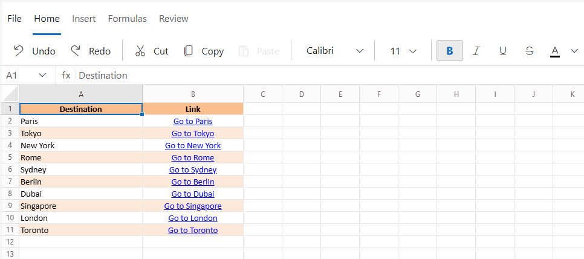
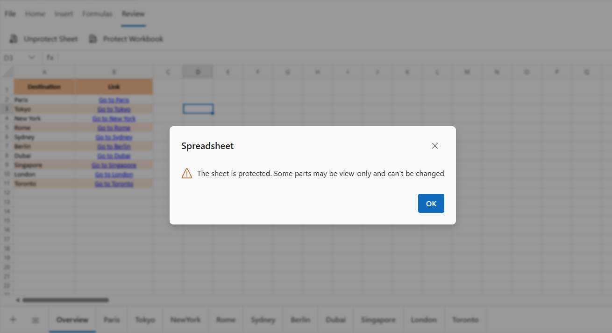

# Editing in Blazor Spreadsheet component

The contents of a cell can be edited directly within the cell or by typing in the formula bar. By default, the editing feature is enabled in the Spreadsheet. Use the [AllowEditing](https://help.syncfusion.com/cr/blazor/Syncfusion.Blazor.Spreadsheet.SfSpreadsheet.html#Syncfusion_Blazor_Spreadsheet_SfSpreadsheet_AllowEditing) property to enable or disable the editing feature.

## Edit cell via UI

Editing can be started in one of the following ways,

* Double-click a cell to start edit mode.
* Press the `F2` key to edit the active cell.
* Use the formula bar to perform editing.
* Press `BACKSPACE` or `SPACE` key to clear the cell content and start edit mode.

N> For more details on keyboard shortcuts for editing, refer [here](./accessibility#keyboard-shortcuts). 

### Save cell

If the cell is in an editable state, the edited cell can be saved in one of the following ways,

* Click any other cell except the one currently being edited.

* Press the `Enter` or `Tab` key to save the edited cell.

### Cancel editing

To cancel editing without saving changes, press the `ESCAPE` key. This exits the editable state and restores the original cell content.

The following animation illustrates basic cell editing operations in the Spreadsheet component, including double-clicking a cell to enter edit mode, editing values directly, saving changes by pressing `ENTER` key, and canceling edits with the `ESCAPE` key.

## Edit cell programmatically

Cells can be updated programmatically using the `UpdateCellAsync` and `UpdateCellsAsync` methods. These methods support updating cells with values like strings, numbers, booleans, or formulas.

### Update a single cell

The `UpdateCellAsync` method updates the value of a specific cell. It is ideal for scenarios requiring precise updates to individual cells, such as updating a status or value in a specific cell. The cell address must include the sheet name (e.g., Sheet1!A1). Invalid addresses are skipped, and ranges (e.g., A1:B5) are handled automatically.

| Parameter | Type | Description |
| -- | -- | -- |
| cellAddress | string | The address of the cell to update, including the sheet name in the format SheetName!CellAddress (e.g., Sheet1!A1). This parameter is required and must follow the correct format. Invalid addresses are skipped. |
| cellValue | object | The new value for the cell. This can be a string, number, boolean, or formula (e.g., =SUM(A1:B1)). |




@using Syncfusion.Blazor.Spreadsheet

<button @onclick="UpdateCellHandler">Update Cell</button>

<SfSpreadsheet @ref=SpreadsheetRef DataSource="DataSourceBytes">
    <SpreadsheetRibbon></SpreadsheetRibbon>
</SfSpreadsheet>

@code {

    public byte[] DataSourceBytes { get; set; }
    public SfSpreadsheet SpreadsheetRef;

    protected override void OnInitialized()
    {
        string filePath = "wwwroot/Sample.xlsx";
        DataSourceBytes = File.ReadAllBytes(filePath);
    }

    private async Task UpdateCellHandler()
    {
        // Update cell A3 with a product name.
        await SpreadsheetRef.UpdateCellAsync("Sheet1!A3", "Tablet");
        // Update cell B3 with a numeric value.
        await SpreadsheetRef.UpdateCellAsync("Sheet1!B3", 799);
        // Update cell C3 with a formula.
        await SpreadsheetRef.UpdateCellAsync("Sheet1!C3", "=SUM(A3:B3)");
    }
}




### Update multiple cells

The `UpdateCellsAsync` method updates multiple cells in a single operation, improving performance for bulk updates. It is suitable for scenarios requiring updates to multiple cells, such as populating a table or applying batch calculations. The method accepts a dictionary where keys are cell addresses and values are the new content. Invalid addresses are skipped.

| Parameter | Type | Description |
| -- | -- | -- |
| cellValuesCollection | Dictionary<string, object> | A dictionary where the key is the cell address (e.g., Sheet1!A1) and the value is the new cell content (string, number, boolean, or formula). Invalid addresses are skipped. If the dictionary is null or empty, no action occurs. |




@using Syncfusion.Blazor.Spreadsheet

<button @onclick="UpdateCellHandler">Update Cell</button>

<SfSpreadsheet @ref=SpreadsheetRef DataSource="DataSourceBytes">
    <SpreadsheetRibbon></SpreadsheetRibbon>
</SfSpreadsheet>

@code {

    public byte[] DataSourceBytes { get; set; }
    public SfSpreadsheet SpreadsheetRef;

    protected override void OnInitialized()
    {
        string filePath = "wwwroot/Sample.xlsx";
        DataSourceBytes = File.ReadAllBytes(filePath);
    }

    private async Task UpdateCellHandler()
    {
        // Define a dictionary with cell addresses and values.
        var updates = new Dictionary<string, object>
        {
            { "Sheet1!A1", "Item" },
            { "Sheet1!B1", 200 },
            { "Sheet1!C1", "=SUM(A1:B1)" }
        };
        // Update multiple cells efficiently.
        await SpreadsheetRef.UpdateCellsAsync(updates);
    }
}




## Editing in a protected sheet

In a protected sheet, only unlocked ranges can be edited, based on the sheet’s protection settings. Attempting to edit a locked range results in an error message, as shown below.

N> To know more about worksheet protection, refer [here](./protection#protect-sheet).
