# Filtering in Blazor Spreadsheet Component

Filtering in the Blazor Spreadsheet component enables focused data analysis by displaying only the rows that meet specific criteria. This functionality helps create interactive views by hiding rows that do not match the filtering conditions. Filtering behavior is controlled using the [`AllowFiltering`](https://help.syncfusion.com/cr/blazor/Syncfusion.Blazor.Spreadsheet.SfSpreadsheet.html#Syncfusion_Blazor_Spreadsheet_SfSpreadsheet_AllowFiltering) property, which is set to **true** by default.

N> When `AllowFiltering` is set to **false**, filtering options are disabled in the ribbon and removed from the context menu. API methods related to filtering will also be inactive. Additionally, if the worksheet is protected, the filtering feature is disabled. For more information on worksheet protection, refer [here](https://blazor.syncfusion.com/documentation/spreadsheet/protection#protect-sheet).

Filtering can be accessed through the user interface using the following method:

- Select the **Home** tab in the **Ribbon**.
- Click the **Sort & Filter** icon.
- Choose the **Filter** option.

This action enables filter buttons in the header cells of each column, allowing direct interaction with filtering options.

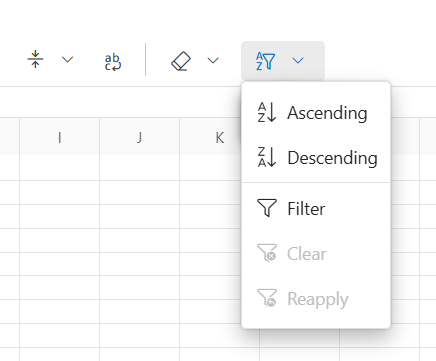

## Excel-like filter dialog

The Blazor Spreadsheet includes a comprehensive Excel-like filter dialog that adapts dynamically to the data type in the selected column. The filter dialog provides intuitive filtering mechanisms designed for different data types and analysis needs.

The filter dialog appears when clicking on a column's filter icon and provides the following features:

* **Sort options** - Provides commands for sorting data in **Ascending** or **Descending** order.
* **Clear filter** - Removes any filtering applied to the selected column.
* **Data type-specific filters** - Displays submenus tailored to the column's content type, such as **Text Filters**, **Number Filters**, or **Date Filters**.
* **Search box** - Enables quick lookup of values within the filter list.
* **Select All** checkbox - Toggles the selection of all available values in the column.
* **Value** checkboxes - Lists individual checkboxes for each unique value found in the column.

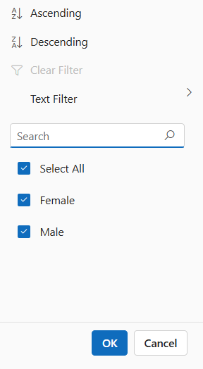

### Data type-specific filters

When applying filters in the Blazor Spreadsheet component, the filter menu dynamically adapts based on the data type of the column. This ensures that only relevant filtering options are presented, improving usability and accuracy.

**Text filters**

Text filters enable filtering based on specific string conditions. When applied to text-based columns, the **Text Filters** submenu provides the following operators:

| Operator | Description |
| -- | -- |
| Equal | Displays rows with cell values that exactly match the specified text. |
| Not Equal | Displays rows with cell values that do not match the specified text. |
| Starts With | Displays rows with cell values that begin with the specified text. |
| Does Not Start With | Displays rows with cell values that do not begin with the specified text. |
| Ends With | Displays rows with cell values that end with the specified text. |
| Does Not End With | Displays rows with cell values that do not end with the specified text. |
| Contains | Displays rows with cell values that include the specified text. |
| Does Not Contain | Displays rows with cell values that do not include the specified text. |
| Custom Filter | Opens a dialog for defining advanced filter conditions. Multiple criteria can be combined using logical operators such as **AND** and **OR**. Each condition supports standard text operators and custom input values, enabling precise and flexible filtering.  For text-based filtering, the dialog also includes a **Match Case** option. When enabled, this option applies case-sensitive filtering to the specified conditions. The **Match Case** checkbox is displayed only when filtering text data, ensuring relevance to the data type being processed. |

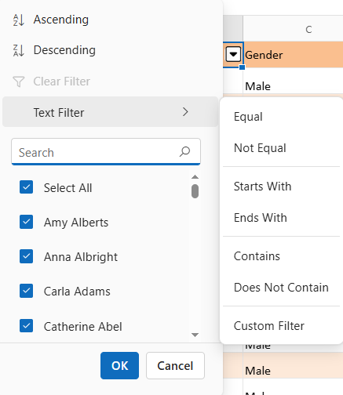

**Number filters**

Number filters provide specialized filtering options for columns containing numeric data. The **Number Filters** menu includes a range of comparison operators that support precise value-based filtering:

| Operator | Description |
| -- | -- |
| Equal | Displays rows where the cell value exactly match the specified number. |
| Not Equal | Displays rows where the cell value does not match the specified number. |
| Less Than | Displays rows where the cell value is less than the specified number. |
| Less Than Or Equal | Displays rows where the cell value is less than or equal to the specified number. |
| Greater Than | Displays rows where the cell value is greater than the specified number. |
| Greater Than Or Equal | Displays rows where the cell value falls within a specified numeric range. |
| Between | Displays rows with cell values that include the specified text. |
| Custom Filter | Opens a dialog for defining advanced numeric filter conditions. This dialog allows the combination of multiple criteria using logical operators such as **AND** and **OR**. Each condition can be configured using numeric comparison operators and custom values, enabling flexible and targeted filtering of numerical data. |

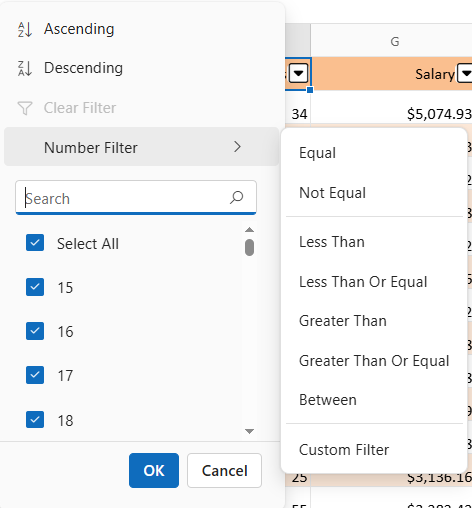

**Date filters**

The date filters provide specialized filtering options for columns containing date values. The component automatically detects date columns and offers both standard filtering options and date-specific filtering:

| Operator | Description |
| -- | -- |
| Equal | Displays rows where the cell value exactly match the specified value. |
| Not Equal | Displays rows where the cell value does not match the specified value. |
| Less Than | Displays rows where the date is earlier than the specified value. |
| Greater Than | Displays rows where the date is later than the specified value. |
| Between | Displays rows where the date falls within a defined date range. |
| This Month | Filters rows where the date falls within the current calendar month. |
| Last Month | Filters rows where the date falls within the previous calendar month. |
| Next Month | Filters rows where the date falls within the next calendar month. |
| This Quarter | Filters rows where the date falls within the current quarter. |
| Last Quarter | Filters rows where the date falls within the previous quarter. |
| Next Quarter | Filters rows where the date falls within the next quarter. |
| This Year | Filters rows where the date falls within the current year. |
| Last Year | Filters rows where the date falls within the previous year. |
| Next Year | Filters rows where the date falls within the next year. |
| Custom Filter | Opens a dialog to define complex date-based conditions using logical operators such as **AND** and **OR**. This dialog allows combining multiple criteria to perform precise filtering based on date values.  |

**Date hierarchy and grouping**

The component organizes date values into a structured, expandable hierarchy to simplify filtering and navigation. This is especially helpful when working with large datasets that span multiple months or years.

Hierarchical Structure:

* **Year Level** - Dates are first grouped by year. For example, all dates from 2023 are grouped under **2023**.
* **Month Level** - Within each year, dates are further grouped by month. For instance, under **2023**, months like **January**, **February**, etc., are listed.
* **Day Level** - Expanding a month reveals individual day entries. For example, under **2023 → January**, dates like **10**, **15**, and **28** are shown.
* **Expand/collapse controls** - Each year and month group includes a toggle control to expand or collapse its contents. This helps reduce clutter and allows for focused viewing of specific time periods.
* **Group selection** - Entire groups—such as a full year or a specific month—can be selected or deselected with a single click. This enables quick filtering without manually selecting each date.

This hierarchical approach makes it easier to browse, locate, and filter date-based data efficiently.

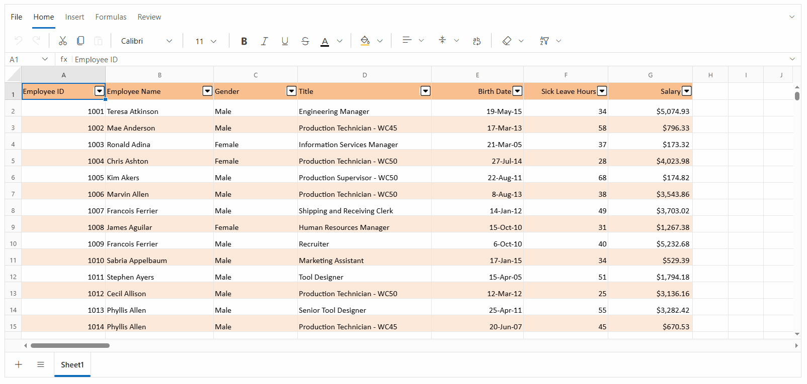

**Custom filter**

The **Custom Filter** dialog enables advanced filtering by allowing the definition of multiple conditions using logical operators. This dialog adapts dynamically based on the data type of the column being filtered.

* **First condition**
  * **Operator dropdown** - Select a filter type such as Equals, Contains, Greater Than, or Before. The available options vary based on the data type of the column being filtered.
  * **Value field** - Enter the value to compare against the selected operator. This can be a word, number, or date, depending on the column's data type.
* **Logical operator**
    * Choose how two conditions should be combined:
        * **AND** – Both conditions must be true.
        * **OR** – At least one condition must be true.
* **Match case (Text only)**
    * Available only for text columns.
    * Enable this option to make the filter case-sensitive (e.g., **"Apple" ≠ "apple"**)
* **Second condition**:
  * **Operator dropdown** - Select a filter type for the second condition. Available options are the same as those provided for the first condition and vary based on the data type.
  * **Value field** - Enter a value to compare against the selected operator. This field supports text, numeric, and date inputs, depending on the data type of the column being filtered.

The operators available in the custom filter dialog change dynamically based on the data type:

| Data Type  | Supported Operators |
| -- | -- |
| Text | Starts With, Does Not Start With, Ends With, Does Not End With, Contains, Does Not Contain, Equals, Not Equal. |
| Number | Equals, Not Equal, Greater Than, Greater Than Or Equal, Less Than, Less Than Or Equal. |
| Date | Equals, Not Equal, Greater Than, Greater Than Or Equal, Less Than, Less Than Or Equal. |

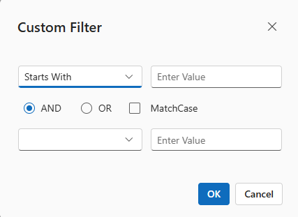

### Add current selection to filter

The **Add current selection to filter** option appears below the search box in the filter dialog. It allows multiple filter selections to be combined without clearing previous ones. By default, applying a new filter to a column replaces any existing selections. Enabling this option ensures that new selections are added to the existing filter criteria instead of replacing them.

**How it works**
- Open the filter dialog for a column.
- The search box enables quick identification of specific values within the filter list.
- Check the **Add current selection to filter** box.
- Select additional values to include in the filter.
- Apply the filter. 

The new values are added to the existing filter set, making this feature especially useful for building complex filters incrementally without losing earlier selections.

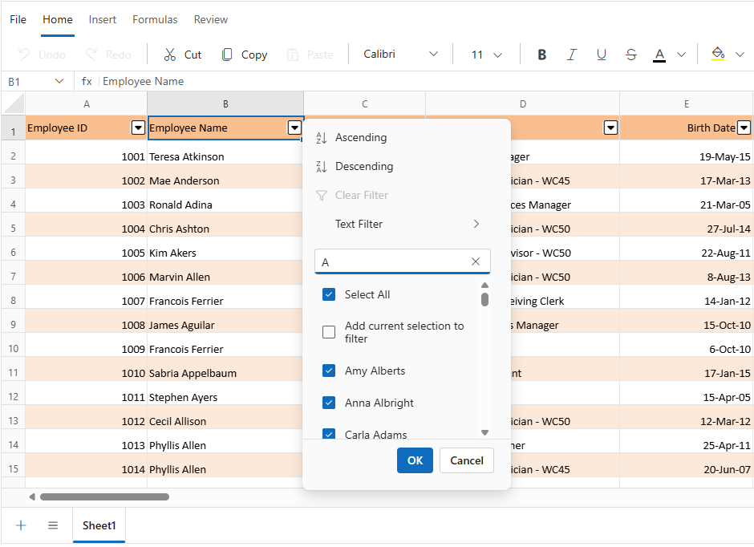

### Mixed data handling

The filter dialog intelligently handles columns containing mixed data types:

* **Automatic type detection** 
    - The system analyzes the column's content to identify the most common data type and adjusts the filter behavior accordingly.
    - **Example:** If most values in a column are numbers but a few are text, the filter treats the column as numeric and shows number-based filter options.

* **Type-based grouping** 
    - When filtering a column that contains mixed data types, the filter checkbox list organizes values into groups based on their type. This grouping helps improve readability and ensures consistent filtering behavior.
    
    - **Example:** A column with values **100, "Done", TRUE, blank and 12/07/2025** cell will display them grouped in the filter list in the following order:
    **Boolean → Number → Date → Text → Blank**
    **TRUE, 100, 12/07/2025, "Done", and (Blank)**

* **Special handling for empty values** 
    - Empty cells are shown as **(Blank)** in the filter list, making them easy to identify and select.
    - **Example:** If a column has some missing values, these cells appear as **(Blank)** in the filter, allowing users to include or exclude them.

* **Search across types** 
    - The search box works across all data types in the column.
    - **Example:** Typing 100 in the search box will return both the number 100 and the text "100" if both exist in the column.

* **Format preservation** 
    - The filter dialog keeps the original formatting of values (e.g., **Currency**, **Date** format) when displaying them.
    - **Example:** A value formatted as **$1,000.00** in the spreadsheet will appear the same way in the filter list.

The advanced filtering mechanism ensures effective data handling even in spreadsheets containing inconsistent or mixed data types.

## Filter by cell value

The filter by cell value enables filtering worksheet data based on a selected cell's content. This functionality streamlines data analysis by instantly displaying only rows that match the selected value.

### Filter by cell value via UI

Filtering based on a specific cell value can be performed directly through the user interface. This method allows quick filtering without manually configuring conditions.

- Select the cell containing the desired value.
- Right-click to open the context menu.
- Choose the **Filter** option.
- Click **Filter by Value of Selected Cell**.

This action filters the column to display only the rows that match the selected cell's value.

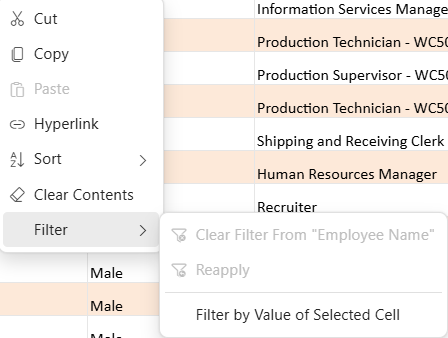

### Filter by cell value programmatically

The [FilterByCellValueAsync](https://help.syncfusion.com/cr/blazor/Syncfusion.Blazor.Spreadsheet.SfSpreadsheet.html#Syncfusion_Blazor_Spreadsheet_SfSpreadsheet_FilterByCellValueAsync_System_Object_System_String_) method allows filtering based on a specified value and cell address without using the UI. The available parameters in the `FilterByCellValueAsync` method are:

| Parameter     | Type   | Description |
|---------------|--------|-------------|
| cellAddress | string | Specifies the address of the cell that contains the filter criteria. This determines the column to which the filter is applied. For example, "A1" applies the filter to Column A. Using this parameter also updates the used range of the Spreadsheet. |
| cellValue | object | Defines the value to filter by. This can be a string, number, date, or boolean. The filter displays only the rows where the cell in the specified column matches this value. For example, "New York" displays rows where Column A contains "New York". Providing an incorrect value results in inaccurate filtered output. |




@using Syncfusion.Blazor.Spreadsheet
@using Syncfusion.Blazor.Buttons

<SfButton OnClick="ApplyFilter" Content="Filter by cell value"></SfButton>

<SfSpreadsheet @ref="SpreadsheetInstance" DataSource="DataSourceBytes">
    <SpreadsheetRibbon></SpreadsheetRibbon>
</SfSpreadsheet>

@code {
    public byte[] DataSourceBytes { get; set; }
    public SfSpreadsheet SpreadsheetInstance;

    protected override void OnInitialized()
    {
        string filePath = "wwwroot/Sample.xlsx";
        DataSourceBytes = File.ReadAllBytes(filePath);
    }

    public async Task ApplyFilter()
    {
        // This method applies a filter to Column A showing only rows containing "New York".
        await SpreadsheetInstance.FilterByCellValueAsync("A1", "New York"); 
    }
}




## Clear filter
                 
The clear filter restores visibility to all rows by removing any filters currently applied to columns. It offers flexibility by allowing filters to be cleared from a specific column or from all columns at once.

### Clear filter via UI

Filters can be cleared through the user interface using the following methods:

**Using the Ribbon**

* Click the **Home** tab in the Ribbon.
* In the **Sort & Filter** section, click **Clear**.
* All active filters will be removed from the worksheet.

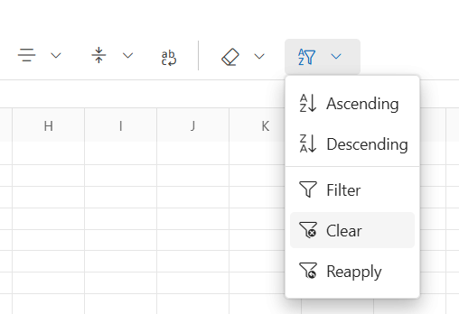

**Using the Filter Icon**

* Click the filter icon in the header of a filtered column.
* In the filter dialog, click **Clear Filter**.
* The filter applied to that column will be removed.

**Using the Context Menu**

* Right-click any cell in a filtered column.
* Choose **Filter** from the context menu.
* Select **Clear Filter From "Column Name"**.
* The filter applied to that column will be removed.

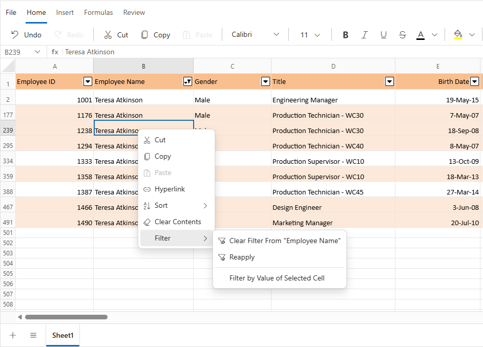

### Clear filter programmatically

The [ClearFilterAsync](https://help.syncfusion.com/cr/blazor/Syncfusion.Blazor.Spreadsheet.SfSpreadsheet.html#Syncfusion_Blazor_Spreadsheet_SfSpreadsheet_ClearFilterAsync_System_Int32_) method removes filtering from a specific column in the active sheet. The available parameters in the `ClearFilterAsync` method are:

| Parameter     | Type | Description |
|---------------|------|-------------|
| columnIndex | int  | The zero-based index of the column whose filter is to be cleared. For example, "0" refers to the first column (Column A). |




@using Syncfusion.Blazor.Spreadsheet
@using Syncfusion.Blazor.Buttons

<SfButton OnClick="ClearColumnFilter" Content="Clear Column Filter"></SfButton>

<SfSpreadsheet @ref="@SpreadsheetInstance" DataSource="DataSourceBytes">
    <SpreadsheetRibbon></SpreadsheetRibbon>
</SfSpreadsheet>

@code {
    public byte[] DataSourceBytes { get; set; }
    public SfSpreadsheet SpreadsheetInstance;

    protected override void OnInitialized()
    {
        string filePath = "wwwroot/Sample.xlsx";
        DataSourceBytes = File.ReadAllBytes(filePath);
    }

    public async Task ClearColumnFilter()
    {
        // This command removes all filtering from Column A (represented by index 0).
        await SpreadsheetInstance.ClearFilterAsync(0);
    }
}




The [ClearAllFiltersAsync](https://help.syncfusion.com/cr/blazor/Syncfusion.Blazor.Spreadsheet.SfSpreadsheet.html#Syncfusion_Blazor_Spreadsheet_SfSpreadsheet_ClearAllFiltersAsync) method removes all active filters from the currently active sheet, restoring visibility to the entire dataset. This is especially useful when multiple columns are filtered and a complete reset is needed.




@using Syncfusion.Blazor.Spreadsheet
@using Syncfusion.Blazor.Buttons

<SfButton OnClick="ClearAllFilters" Content="Clear All Filters"></SfButton>
<SfSpreadsheet @ref="@SpreadsheetInstance" DataSource="DataSourceBytes">
    <SpreadsheetRibbon></SpreadsheetRibbon>
</SfSpreadsheet>

@code {
    public byte[] DataSourceBytes { get; set; }
    public SfSpreadsheet SpreadsheetInstance;

    protected override void OnInitialized()
    {
        string filePath = "wwwroot/Sample.xlsx";
        DataSourceBytes = File.ReadAllBytes(filePath);
    }

    public async Task ClearAllFilters()
    {
        // Removes all active filters from the spreadsheet, restoring visibility to every row.
        await SpreadsheetInstance.ClearAllFiltersAsync();
    }
}




## Reapply filter

The reapply filter updates filtered results after changes are made to the data. It preserves the existing filter conditions and refreshes the view to reflect the most current data accurately.

For instance, if a filter is applied to display only rows where the **Status** column is set to **Approved**, and a new row is added with **Approved** as its value, the new row will not immediately appear. Using **Reapply Filter** recalculates the filter and ensures the new row is included in the filtered results.

### Reapply filter via UI

Filters can be reapplied using the interface through the following methods:

**Using the Ribbon**

* Click the **Home** tab in the Ribbon.
* In the **Sort & Filter** section, select **Reapply**.
* Active filters are refreshed based on the updated data.

**Using the Context Menu**

* Right-click any cell in a filtered column.
* Choose **Filter** from the context menu.
* Select **Reapply**.
* Active filters are refreshed based on the updated data.

### Reapply filter programmatically

The [ReapplyFilterAsync](https://help.syncfusion.com/cr/blazor/Syncfusion.Blazor.Spreadsheet.SfSpreadsheet.html#Syncfusion_Blazor_Spreadsheet_SfSpreadsheet_ReapplyFilterAsync) method refreshes all active filters to match updated worksheet data. This method is especially beneficial when rows are modified, inserted, or imported.




@using Syncfusion.Blazor.Spreadsheet
@using Syncfusion.Blazor.Buttons

<SfButton OnClick="UpdateAndReapply" Content="Update Data and Reapply Filters"></SfButton>
<SfSpreadsheet @ref="@SpreadsheetInstance" DataSource="DataSourceBytes">
    <SpreadsheetRibbon></SpreadsheetRibbon>
</SfSpreadsheet>

@code {
    public byte[] DataSourceBytes { get; set; }
    public SfSpreadsheet SpreadsheetInstance;

    protected override void OnInitialized()
    {
        string filePath = "wwwroot/Sample.xlsx";
        DataSourceBytes = File.ReadAllBytes(filePath);
    }

    public async Task UpdateAndReapply()
    {
        // Updates cell A1 on Sheet1 with a new value.
        await SpreadsheetInstance.UpdateCellAsync("Sheet1!A1", "New Value");
        
        // Reapplies all active filters to include the updated data.
        await SpreadsheetInstance.ReapplyFiltersAsync();
    }
}




## Filtering range validation messages

When applying filters in the Blazor Spreadsheet, validation messages are displayed in specific scenarios to inform about filtering constraints:

- **Invalid selection range validation** - If a selected cell or range is outside the used range of the active worksheet, the selection is considered invalid. An **Invalid selection range** alert message is displayed, and an exception is thrown to indicate this limitation.

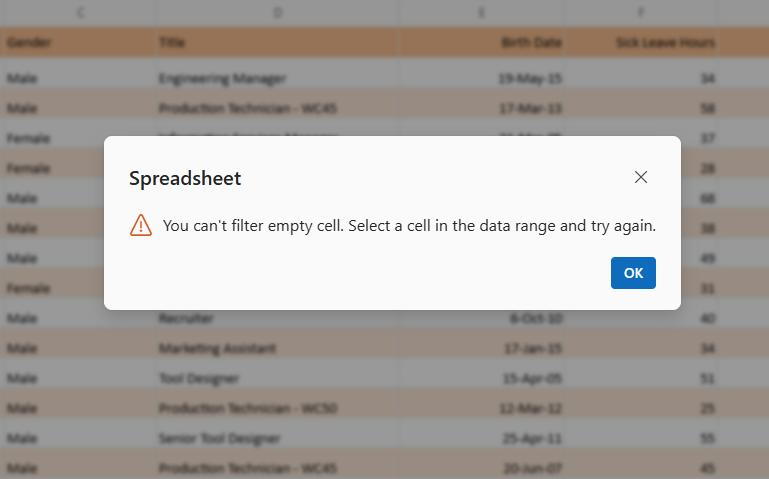

- **Multiple selection range validation** - If multiple ranges are selected for filtering, the selection is considered invalid. A **Multiple selection range** alert message is shown to highlight this limitation.

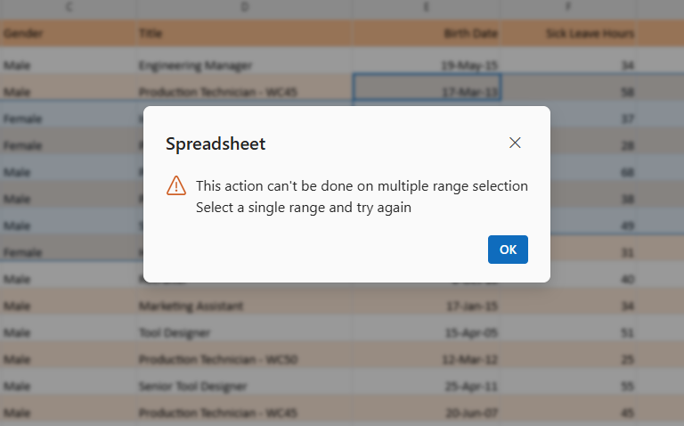