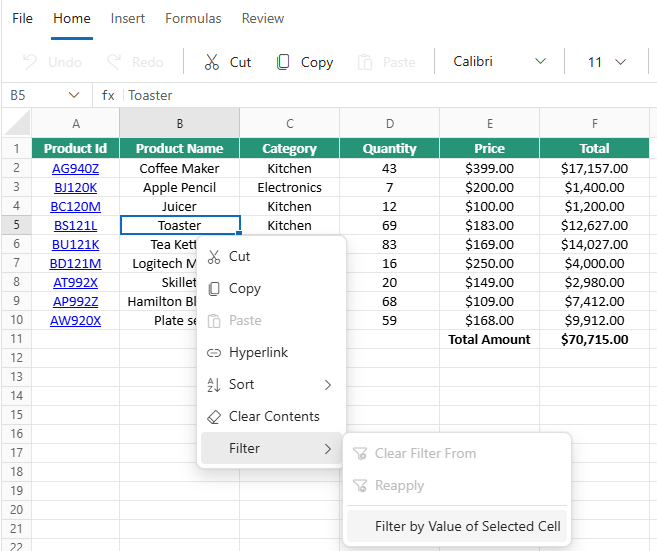

# Filtering in Blazor Spreadsheet component

Filtering in the Spreadsheet component enables displaying only relevant rows based on specified criteria, facilitating focused data analysis. To control this functionality, the [AllowFiltering](https://help.syncfusion.com/cr/blazor/Syncfusion.Blazor.Spreadsheet.SfSpreadsheet.html#Syncfusion_Blazor_Spreadsheet_SfSpreadsheet_AllowFiltering) property can be used to enable or disable filtering operations in the Spreadsheet.

> * The default value for the `AllowFiltering` property is **true**.

## Filter operations

The Blazor Spreadsheet provides multiple filtering options to manage and analyze data effectively:

* **Filter by Cell Value** - Shows only rows containing values that match a specific cell's content
* **Clear Filter** - Removes active filters from columns
* **Reapply Filter** - Refreshes filtering results after data modifications

### Accessing filter options via the UI

In the active sheet, filtering can be accessed using any of the following methods:

* **Using Ribbon Toolbar**:
   * Select the **Sort & Filter** icon from the **Home** tab
   * Click the filtering option required

   

* **Using Context Menu**:
   * Right-click the selected cell
   * Choose the **Filter** options from the context menu

   

## Filter by cell value

The Blazor Spreadsheet component allows filtering data to display only rows that contain values matching a specific cell's content. This provides a quick way to focus on particular data subsets without creating complex filter conditions.

### Applying cell value filter via the UI

To filter rows by a specific cell's value:

* Right-click the target cell
* Select **Filter By Value of Selected Cell** from the context menu
* The Spreadsheet automatically applies filtering to show only rows containing the selected value

## Filter types

The Blazor Spreadsheet component offers several types of filtering mechanisms for different data analysis needs:

### Checkbox filter

The checkbox filter provides a simple way to filter data by selecting or deselecting values in a column. When a filter is applied to a column, a dropdown button appears in the column header. Clicking this button displays a menu with the following options:

* **Sort options** - Ascending and Descending sort commands
* **Clear Filter** - Option to remove all filtering applied to the column
* **Data Filter** - Submenu containing data-specific filter conditions(Text, Numeric and Date)
* **Search box** - For quickly finding values in the list
* **Select All checkbox** - Toggles selection of all values
* **Value checkboxes** - Individual checkboxes for each unique value in the column

This interface allows for quickly filtering data by simply checking or unchecking values to include or exclude them from the view.

### Text filters

Text filters enable filtering based on specific text conditions. Clicking the **Text Filter** option in the filter dropdown reveals additional filtering criteria:

* **Equal** - Shows rows where the cell value exactly matches the specified text
* **Not Equal** - Shows rows where the cell value does not match the specified text
* **Starts With** - Shows rows where the cell value begins with the specified text
* **Ends With** - Shows rows where the cell value ends with the specified text
* **Contains** - Shows rows where the cell value includes the specified text
* **Does Not Contain** - Shows rows where the cell value does not include the specified text
* **Custom Filter** - Opens a dialog for creating more complex filter conditions

### Date filters

Date filters provide specialized filtering options for columns containing date values. When working with date columns, clicking the filter button displays a dropdown with both standard filtering options and date-specific filtering:

* **Equal** - Shows rows where the date exactly matches a specified date
* **Not Equal** - Shows rows where the date does not match a specified date
* **Today** - Shows only entries with today's date
* **Yesterday** - Shows only entries with yesterday's date
* **Tomorrow** - Shows only entries with tomorrow's date
* **This Week** - Shows entries within the current week
* **Last Week** - Shows entries from the previous week
* **Next Week** - Shows entries for the upcoming week
* **This Month/Last Month/Next Month** - Filters by monthly periods
* **This Quarter/Last Quarter/Next Quarter** - Filters by quarterly periods
* **This Year/Last Year/Next Year** - Filters by annual periods
* **Custom Filter** - Opens a dialog for creating more complex filter conditions

* **Year/Month grouping** - Date values are automatically grouped by year and month for easier filtering of large date ranges
  * Expand/collapse year groups using the arrow indicators
  * Select/deselect entire years or specific months with checkboxes

### Number filters

Number filters offer specialized filtering options for columns containing numeric data. The **Number Filter** menu provides both value-based filtering and comprehensive comparison operators:

* **Equal** - Shows rows where values exactly match a specified number
* **Not Equal** - Shows rows where values do not match a specified number
* **Less Than** - Shows rows where values are smaller than a specified number
* **Less Than Or Equal** - Shows rows where values are smaller than or equal to a specified number
* **Greater Than** - Shows rows where values exceed a specified number
* **Greater Than Or Equal** - Shows rows where values are greater than or equal to a specified number
* **Between** - Shows rows where values fall within a specified numeric range
* **Custom Filter** - Opens a dialog for creating more complex numeric conditions with AND/OR logical operators.

### Custom filter

The custom filter option provides advanced filtering capabilities with logical operators. Selecting **Custom Filter** from the filters submenu opens a dialog with the following components:

* **Condition dropdowns** - Select filter conditions (Equals, Contains, Starts With, etc.)
* **Value fields** - Enter the text or values to match against
* **Logical operator** - Choose between AND/OR to combine multiple conditions
* **MatchCase option** - Enable case-sensitive filtering when checked

## Clear filter

Clear filter functionality in the Spreadsheet component removes active filters from columns, restoring the complete dataset view. This operation ensures seamless transitions between filtered and unfiltered data views without losing information.

### Clear filter via the UI

To clear existing filters:

* Click the **Sort & Filter** icon from the **Home** tab in the ribbon toolbar
* Select the **Clear** option to remove all active filters

## Clear filters programmatically

The Blazor Spreadsheet component provides methods to programmatically clear filters that have been applied to the worksheet data.

### Clear filter from specific column

The [ClearFilterAsync()](https://help.syncfusion.com/cr/blazor/Syncfusion.Blazor.Spreadsheet.SfSpreadsheet.html#Syncfusion_Blazor_Spreadsheet_SfSpreadsheet_ClearFilterAsync_System_Int32_) method removes filtering from a specific column in the Spreadsheet. The method takes a column index parameter to identify which column's filter should be cleared.




@using Syncfusion.Blazor.Spreadsheet
@using Syncfusion.Blazor.Buttons

<SfButton OnClick="ClearColumnFilter" Content="Clear Filter"></SfButton>

<SfSpreadsheet @ref="@sfSpreadsheet">
    <SpreadsheetRibbon></SpreadsheetRibbon>
</SfSpreadsheet>

@code {

    public SfSpreadsheet sfSpreadsheet { get; set; }

    public async Task ClearColumnFilter()
    {
        await sfSpreadsheet.ClearFilterAsync(1); // Clear filter from column A (index 1)
    }
}




### Clear all filters

The [ClearAllFiltersAsync()](https://help.syncfusion.com/cr/blazor/Syncfusion.Blazor.Spreadsheet.SfSpreadsheet.html#Syncfusion_Blazor_Spreadsheet_SfSpreadsheet_ClearAllFiltersAsync) method removes all active filters from the Spreadsheet, restoring the complete dataset view. This method is particularly useful when multiple columns have filtering applied and all need to be cleared simultaneously.




@using Syncfusion.Blazor.Spreadsheet
@using Syncfusion.Blazor.Buttons

<SfButton OnClick="ClearAllFilters" Content="Clear All Filters"></SfButton>
<SfSpreadsheet @ref="@sfSpreadsheet">
    <SpreadsheetRibbon></SpreadsheetRibbon>
</SfSpreadsheet>

@code {
    public SfSpreadsheet sfSpreadsheet { get; set; }

    public async Task ClearAllFilters()
    {
        await sfSpreadsheet.ClearAllFiltersAsync();
    }
}




## Reapply filter

Reapply filter functionality updates filtered results to match current data values while preserving existing filter criteria. This feature is particularly useful when working with dynamic data that changes frequently.

### Reapplying filter via the UI

To refresh a filter after data modifications:

* Click **Reapply** button under the **Sort & Filter** icon from the **Home** tab
* Alternatively, right-click a filtered cell and select the **Reapply** option from the context menu

## Implementing filtering programmatically

The Spreadsheet component supports programmatic filtering using the [FilterByCellValueAsync()](https://help.syncfusion.com/cr/blazor/Syncfusion.Blazor.Spreadsheet.SfSpreadsheet.html#Syncfusion_Blazor_Spreadsheet_SfSpreadsheet_FilterByCellValueAsync_System_Object_System_String_) method. This method applies filtering based on the specified value and cell range.




@using Syncfusion.Blazor.Spreadsheet

<button @onclick="ApplyFilter">Filter by Value</button>

<SfSpreadsheet @ref="SpreadsheetRef" DataSource="DataSourceBytes">
    <SpreadsheetRibbon></SpreadsheetRibbon>
</SfSpreadsheet>

@code {

    public byte[] DataSourceBytes { get; set; }
    public SfSpreadsheet SpreadsheetRef;

    protected override void OnInitialized()
    {
        string filePath = "wwwroot/Sample.xlsx";
        DataSourceBytes = File.ReadAllBytes(filePath);
    }

    public async Task ApplyFilter()
    {
        await SpreadsheetRef.FilterByCellValueAsync("New York", "A1"); // Filter column A for "New York"
    }
}


