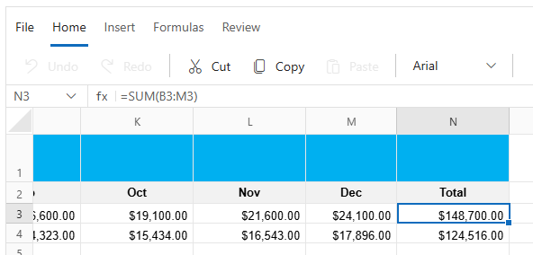

# Formulas in Blazor Spreadsheet component

The Syncfusion Blazor Spreadsheet component offers robust formula support, enabling to perform complex calculations and data analysis with ease. These formulas operate on cell values by referencing data from the current sheet or across multiple sheets within the workbook.

## Formula bar

The formula bar is a key interface element in the Syncfusion Blazor Spreadsheet, designed to make it easier to view, edit, and enter cell data and formulas. Formula bar is positioned above the sheet grid, it provides a centralized space for working with formulas. Formula bar can also be expanded or collapsed to suit your needs. When expanded, it offers more vertical space, making it easier to read and edit long or complex formulas with greater accuracy.

Formula Bar can be enable/disable by using the [ShowFormulaBar](https://help.syncfusion.com/cr/blazor/Syncfusion.Blazor.Spreadsheet.SfSpreadsheet.html#Syncfusion_Blazor_Spreadsheet_SfSpreadsheet_ShowFormulaBar) property, which is set to true by default.

## Working with formulas via UI

The Syncfusion Blazor Spreadsheet component provides multiple methods for inserting and editing formulas, accommodating different workflow preferences. Each method serves specific use cases and offers unique advantages for formula creation and manipulation.

### Insert function dialog

* Select **Insert Function** from the **Formulas** tab in the **Ribbon** toolbar. In the **Insert Function** dialog, choose a category, then select the desired formula to insert it into the selected cell and click **Ok** button.

* Click the **Insert Function** button next to the **Formula Bar** to open the **Insert Function** dialog, which provides the same categorized formula list and insertion options as the **Ribbon** toolbar.

### Direct Cell Entry

Formulas can be entered directly into cells or the **Formula Bar** by typing an equals sign **(=)** followed by the formula expression. This method initiates the formula intellisense feature, which displays a dropdown list of relevant formulas. The intellisense feature accelerates formula creation by reducing typing and helping avoid syntax errors.

## Calculation Mode

The Syncfusion Blazor Spreadsheet implements **Calculation Option**  that control when and how formulas are recalculated, allowing optimization for different performance scenarios. The available calculation modes mirror Microsoft Excel's functionality, providing familiar behavior. The available modes are:

* **Automatic**: Formulas recalculate instantly when any dependent cell changes.

* **Manual**: Formulas recalculate only when explicitly triggered using the **Calculate Sheet** or **Calculate Workbook** options.

### Automatic

In **Automatic** calculation mode, formulas are recalculated immediately upon any modification to dependent cell values. This functionality ensures that all computed results remain accurate and up to date without requiring manual recalculation. The automatic propagation of changes throughout the formula dependency chain preserves data consistency and enhances computational reliability. By default, **Automatic** calculation is enabled in spreadsheet.

**Example:**

If cell **C1** contains the formula **=A1+B1**, any changes to values in cells **A1** or **B1** will automatically update the result displayed in **C1**. This real-time calculation is ideal for scenarios requiring immediate feedback and continuous result validation.

### Manual

In **Manual** calculation mode, formulas remain static until explicitly recalculated by triggered manually. This mode prevents automatic recalculation, which can significantly improve performance when working with large datasets or complex formulas. Manual calculation mode is particularly useful when performing multiple changes that would otherwise trigger numerous intermediate recalculations.

**Example:**

If cell **C1** containing the formula **=A1+B1** in manual mode, changes to cells **A1** or **B1** will not update the result in **C1** until recalculation is manually triggered. The Spreadsheet provides two recalculation options:

**Calculate Sheet:** Recalculates only the formulas within the active sheet.

**Calculate Workbook:** Recalculates all formulas across all sheets in the workbook.

## Named Ranges

The **Named Range** feature in the Syncfusion Blazor Spreadsheet component allows you to assign a meaningful name to a specific cell or range of cells. This enhances the clarity and usability of spreadsheets, making them easier to navigate, maintain, and understand—especially when creating formulas or analyzing data.

**Named range usage in formulas**

Using named ranges in formulas enhances readability and maintainability. Instead of referencing a range like **A1:A12**, you can use a descriptive name such as "MonthlyTotals" directly in your formula. For instance, writing **=SUM(MonthlyTotals)** makes the formula more intuitive for anyone reviewing the spreadsheet. Named ranges are fully supported across all standard formula entry methods, including the formula bar and direct cell input.

**Accessing the Name Manager in dialog box and toolbar**

The Name Manager serves as a central interface for managing all name ranges across the workbook. The Name Manager dialog box can be accessed via two methods:

* The **Name Manager** button located in the **Formulas** tab on the Spreadsheet **Ribbon** toolbar.
* The **Name Manager** option can also be launched when creating or managing ranges from the **Name Box**.

N> Named Ranges can be defined only for cells or ranges that contain values.

### Creating named ranges via UI

**Creating using the name box**

Named ranges can be created using the following methods:

The Name box is positioned to the left of the formula bar, above the sheet grid. To create a Named Range using the name box:

* Select the desired cell or range of cells in the sheet.
* Click inside the name box, this will highlight the current cell reference.
* Enter a unique and descriptive name according to the naming rules (begin with a letter or underscore, no spaces, and avoid using cell reference format).
* Press the **Enter** key to finalize creation. The new Named Range will be immediately active and available for use in formulas.

**Creating using the dialog box**

To establish a Named Range through the Name Manager dialog:

* Navigate to the **Formulas** tab in the ribbon toolbar and select the **Name Manager** button to open the dialog.
* In the input field labeled "Range Name", enter a unique and descriptive name for the range.
* Specify the desired range in the "Range Value" field. This can be done by entering a cell/range reference manually, by default it shows currently select cell/range reference in the field.
* Set the appropriate scope (workbook or worksheet, as supported).
* Confirm by clicking the **Add Range** button. The created Named Range will now appear in the Name Manager list and click **OK** button.

### Editing named ranges via UI

To modify an existing Named Range:

* Open the Name Manager dialog box from the **Formulas** tab by clicking the **Name Manager** button.
* In the Name Manager dialog, select the Named Range required for editing from the list.
* Click the **Edit** icon provided for the selected Named Range. An editing panel will appear.
* Update the "Range Name," "Range Value" or the scope as necessary, following the standard naming and reference rules.
* Confirm changes by clicking the **Update Range** button, then click the **OK** button to commit the edit. The modifications will become immediately effective throughout all associated formulas.

### Deleting Named Range via UI

To remove a Named Range using the UI:

* Open the Name Manager dialog box from the **Formulas** tab by selecting the **Name Manager** option.
* Select the Named Range targeted for deletion from the list.
* Click the **Delete** icon associated with the selected Named Range.
* Confirm the action by clicking the **OK** button in the Name Manager. The Named Range will be deleted from the workbook, and all formulas referencing the deleted name will return a `#NAME?` error until updated.

N> Deleting a Named Range used in formulas may cause formula errors. Ensure the Named Range is not referenced before deleting it. Deleting a worksheet also removes any Name Ranges that were created specifically within that worksheet.

## Supported Formulas

The Spreadsheet component supports a wide range of built-in formulas, enabling powerful data analysis and manipulation. Below is the list of formulas supported in the Spreadsheet component:

<table>
<tr>
<th>
Functions  </th><th>
Description  </th></tr>
<tbody>
<tr>
<td>
ABS  </td><td>
Returns the absolute value of a number  </td></tr>
<tr>
<td>
ACOS  </td><td>
Returns the arccosine of a number  </td></tr>
<tr>
<td>
ACOSH  </td><td>
Returns the inverse hyperbolic cosine of a number  </td></tr>
<tr>
<td>
ADDRESS  </td><td>
Returns a reference as text to a single cell in a worksheet  </td></tr>
<tr>
<td>
AND  </td><td>
Returns TRUE if all of its arguments are TRUE  </td></tr>
<tr>
<td>
AREAS  </td><td>
Returns the number of areas in a reference  </td></tr>
<tr>
<td>
ARRAYTOTEXT  </td><td>
Returns the text representation of an array, though calculation of this formula result is not supported in XlsIO  </td></tr>
<tr>
<td>
ASC  </td><td>
Changes full-width (double-byte) English letters or katakana within a character string to half-width (single-byte) characters  </td></tr>
<tr>
<td>
ASIN  </td><td>
Returns the arcsine of a number  </td></tr>
<tr>
<td>
ASINH  </td><td>
Returns the inverse hyperbolic sine of a number  </td></tr>
<tr>
<td>
ATAN  </td><td>
Returns the arctangent of a number  </td></tr>
<tr>
<td>
ATAN2  </td><td>
Returns the arctangent from x- and y-coordinates  </td></tr>
<tr>
<td>
ATANH  </td><td>
Returns the inverse hyperbolic tangent of a number  </td></tr>
<tr>
<td>
AVEDEV  </td><td>
Returns the average of the absolute deviations of data points from their mean  </td></tr>
<tr>
<td>
AVERAGE  </td><td>
Returns the average of its arguments  </td></tr>
<tr>
<td>
AVERAGEA  </td><td>
Returns the average of its arguments, including numbers, text, and logical values  </td></tr>
<tr>
<td>
AVERAGEIF  </td><td>
Returns the average (arithmetic mean) of all the cells in a range that meet a given criterion  </td></tr>
<tr>
<td>
AVERAGEIFS  </td><td>
Returns the average (arithmetic mean) of all cells that meet multiple criteria  </td></tr>
<tr>
<td>
BESSELI  </td><td>
Returns the modified Bessel function In(x)  </td></tr>
<tr>
<td>
BESSELJ  </td><td>
Returns the Bessel function Jn(x)  </td></tr>
<tr>
<td>
BESSELK  </td><td>
Returns the modified Bessel function Kn(x)  </td></tr>
<tr>
<td>
BESSELY  </td><td>
Returns the Bessel function Yn(x)  </td></tr>
<tr>
<td>
BIN2DEC  </td><td>
Converts a binary number to decimal  </td></tr>
<tr>
<td>
BIN2HEX  </td><td>
Converts a binary number to hexadecimal  </td></tr>
<tr>
<td>
BIN2OCT  </td><td>
Converts a binary number to octal  </td></tr>
<tr>
<td>
BINOMDIST  </td><td>
Returns the individual term binomial distribution probability  </td></tr>
<tr>
<td>
BYCOL  </td><td>
Applies a LAMBDA to each column and returns an array of the results  </td></tr>
<tr>
<td>
BYROW  </td><td>
Applies a LAMBDA to each row and returns an array of the results  </td></tr>
<tr>
<td>
CEILING  </td><td>
Rounds a number to the nearest integer or to the nearest multiple of significance  </td></tr>
<tr>
<td>
CELL  </td><td>
Returns information about the formatting, location, or contents of a cell  </td></tr>
<tr>
<td>
CHAR  </td><td>
Returns the character specified by the code number  </td></tr>
<tr>
<td>
CHIDIST  </td><td>
Returns the one-tailed probability of the chi-squared distribution  </td></tr>
<tr>
<td>
CHIINV  </td><td>
Returns the inverse of the one-tailed probability of the chi-squared distribution  </td></tr>
<tr>
<td>
CHITEST  </td><td>
Returns the test for independence  </td></tr>
<tr>
<td>
CHOOSE  </td><td>
Chooses a value from a list of values  </td></tr>
<tr>
<td>
CHOOSECOLS  </td><td>
Returns specified columns from an array  </td></tr>
<tr>
<td>
CHOOSEROWS  </td><td>
Returns specified rows from an array  </td></tr>
<tr>
<td>
CLEAN  </td><td>
Removes all non-printable characters from text  </td></tr>
<tr>
<td>
CODE  </td><td>
Returns a numeric code for the first character in a text string  </td></tr>
<tr>
<td>
COLUMN  </td><td>
Returns the column number of a reference  </td></tr>
<tr>
<td>
COLUMNS  </td><td>
Returns the number of columns in a reference  </td></tr>
<tr>
<td>
COMBIN  </td><td>
Returns the number of combinations for a given number of objects  </td></tr>
<tr>
<td>
COMPLEX  </td><td>
Converts real and imaginary coefficients into a complex number  </td></tr>
<tr>
<td>
CONCAT  </td><td>
Combines the text from multiple ranges and/or strings  </td></tr>
<tr>
<td>
CONCATENATE  </td><td>
Joins several text items into one text item  </td></tr>
<tr>
<td>
CONFIDENCE  </td><td>
Returns the confidence interval for a population mean  </td></tr>
<tr>
<td>
CONVERT  </td><td>
Converts a number from one measurement system to another  </td></tr>
<tr>
<td>
CORREL  </td><td>
Returns the correlation coefficient between two data sets  </td></tr>
<tr>
<td>
COS  </td><td>
Returns the cosine of a number  </td></tr>
<tr>
<td>
COSH  </td><td>
Returns the hyperbolic cosine of a number  </td></tr>
<tr>
<td>
COUNT  </td><td>
Counts how many numbers are in the list of arguments  </td></tr>
<tr>
<td>
COUNTA  </td><td>
Counts how many values are in the list of arguments  </td></tr>
<tr>
<td>
COUNTBLANK  </td><td>
Counts the number of blank cells within a range  </td></tr>
<tr>
<td>
COUNTIF  </td><td>
Counts the number of non-blank cells within a range that meet the given criteria  </td></tr>
<tr>
<td>
COVAR  </td><td>
Returns covariance, the average of the products of paired deviations  </td></tr>
<tr>
<td>
CRITBINOM  </td><td>
Returns the smallest value for which the cumulative binomial distribution is less than or equal to a criterion value  </td></tr>
<tr>
<td>
CUMIPMT  </td><td>
Returns the cumulative interest paid between two periods  </td></tr>
<tr>
<td>
CUMPRINC  </td><td>
Returns the cumulative principal paid on a loan between two periods  </td></tr>
<tr>
<td>
DATE  </td><td>
Returns the serial number of a particular date  </td></tr>
<tr>
<td>
DATEVALUE  </td><td>
Converts a date in the form of text to a serial number  </td></tr>
<tr>
<td>
DAY  </td><td>
Converts a serial number to a day of the month  </td></tr>
<tr>
<td>
DAYS360  </td><td>
Calculates the number of days between two dates based on a 360-day year  </td></tr>
<tr>
<td>
DB  </td><td>
Returns the depreciation of an asset for a specified period by using the fixed-declining balance method  </td></tr>
<tr>
<td>
DDB  </td><td>
Returns the depreciation of an asset for a specified period by using the double-declining balance method or some other method that you specify  </td></tr>
<tr>
<td>
DEC2BIN  </td><td>
Converts a decimal number to binary  </td></tr>
<tr>
<td>
DECHEX  </td><td>
Converts a decimal number to hexadecimal  </td></tr>
<tr>
<td>
DEC2OCT  </td><td>
Converts a decimal number to octal  </td></tr>
<tr>
<td>
DEGREES  </td><td>
Converts radians to degrees  </td></tr>
<tr>
<td>
DELTA  </td><td>
Tests whether two values are equal  </td></tr>
<tr>
<td>
DEVSQ  </td><td>
Returns the sum of squares of deviations  </td></tr>
<tr>
<td>
DISC  </td><td>
Returns the discount rate for a security  </td></tr>
<tr>
<td>
DOLLAR  </td><td>
Converts a number to text, using the $ (dollar) currency format  </td></tr>
<tr>
<td>
DOLLARDE  </td><td>
Converts a dollar price, expressed as a fraction, into a dollar price, expressed as a decimal number  </td></tr>
<tr>
<td>
DOLLARFR  </td><td>
Converts a dollar price, expressed as a decimal number, into a dollar price, expressed as a fraction  </td></tr>
<tr>
<td>
DURATION  </td><td>
Returns the annual duration of a security with periodic interest payments  </td></tr>
<tr>
<td>
EDATE  </td><td>
Returns the serial number of the date that is the indicated number of months before or after the start date  </td></tr>
<tr>
<td>
EFFECT  </td><td>
Returns the effective annual interest rate  </td></tr>
<tr>
<td>
EOMONTH  </td><td>
Returns the serial number of the last day of the month before or after a specified number of months  </td></tr>
<tr>
<td>
ERF  </td><td>
Returns the error function  </td></tr>
<tr>
<td>
ERFC  </td><td>
Returns the complementary error function  </td></tr>
<tr>
<td>
ERROR.TYPE  </td><td>
Returns a number corresponding to an error type  </td></tr>
<tr>
<td>
EVEN  </td><td>
Rounds a number up to the nearest even integer  </td></tr>
<tr>
<td>
EXACT  </td><td>
Checks to see if two text values are identical  </td></tr>
<tr>
<td>
EXP  </td><td>
Returns {{'__e__ '| markdownify }}raised to the power of a given number  </td></tr>
<tr>
<td>
EXPONDIST  </td><td>
Returns the exponential distribution  </td></tr>
<tr>
<td>
FACT  </td><td>
Returns the factorial of a number  </td></tr>
<tr>
<td>
FACTDOUBLE  </td><td>
Returns the double factorial of a number  </td></tr>
<tr>
<td>
FDIST  </td><td>
Returns the F probability distribution  </td></tr>
<tr>
<td>
FIND, FINDB  </td><td>
Finds one text value within another (case-sensitive)  </td></tr>
<tr>
<td>
FINV  </td><td>
Returns the inverse of the F probability distribution  </td></tr>
<tr>
<td>
FISHER  </td><td>
Returns the Fisher transformation  </td></tr>
<tr>
<td>
FISHER  </td><td>
Returns the inverse of the Fisher transformation  </td></tr>
<tr>
<td>
FIXED  </td><td>
Formats a number as text with a fixed number of decimals  </td></tr>
<tr>
<td>
FLOOR  </td><td>
Rounds a number down, toward zero  </td></tr>
<tr>
<td>
FORECAST  </td><td>
Returns a value along a linear trend  </td></tr>
<tr>
<td>
FV  </td><td>
Returns the future value of an investment  </td></tr>
<tr>
<td>
FVSCHEDULE  </td><td>
Returns the future value of an initial principal after applying a series of compound interest rates  </td></tr>
<tr>
<td>
GAMMADIST  </td><td>
Returns the gamma distribution  </td></tr>
<tr>
<td>
GAMMAINV  </td><td>
Returns the inverse of the gamma cumulative distribution  </td></tr>
<tr>
<td>
GAMMALIN  </td><td>
Returns the natural logarithm of the gamma function, Γ(x)  </td></tr>
<tr>
<td>
GCD  </td><td>
Returns the greatest common divisor  </td></tr>
<tr>
<td>
GEOMEAN  </td><td>
Returns the geometric mean  </td></tr>
<tr>
<td>
GESTEP  </td><td>
Tests whether a number is greater than a threshold value  </td></tr>
<tr>
<td>
GROWTH  </td><td>
Returns values along an exponential trend  </td></tr>
<tr>
<td>
HARMEAN  </td><td>
Returns the harmonic mean  </td></tr>
<tr>
<td>
HEX2BIN  </td><td>
Converts a hexadecimal number to binary  </td></tr>
<tr>
<td>
HEX2DEC  </td><td>
Converts a hexadecimal number to decimal  </td></tr>
<tr>
<td>
HEX2OCT  </td><td>
Converts a hexadecimal number to octal  </td></tr>
<tr>
<td>
HLOOKUP  </td><td>
Looks in the top row of an array and returns the value of the indicated cell  </td></tr>
<tr>
<td>
HOUR  </td><td>
Converts a serial number to an hour  </td></tr>
<tr>
<td>
HYPERLINK  </td><td>
Creates a shortcut or jump that opens a document stored on a network server, an intranet, or the Internet  </td></tr>
<tr>
<td>
HYPGEOMDIST  </td><td>
Returns the hypergeometric distribution  </td></tr>
<tr>
<td>
IF  </td><td>
Specifies a logical test to perform  </td></tr>
<tr>
<td>
IFERROR  </td><td>
Returns a specified value if a formula evaluates to an error.  </td></tr>
<tr>
<td>
IFS  </td><td>
Checks whether one or more conditions are met and returns a value that corresponds to the first TRUE condition  </td></tr>
<tr>
<td>
IMABS  </td><td>
Returns the absolute value (modulus) of a complex number  </td></tr>
<tr>
<td>
IMAGINARY  </td><td>
Returns the imaginary coefficient of a complex number  </td></tr>
<tr>
<td>
IMARGUMENT  </td><td>
Returns the argument theta, an angle expressed in radians  </td></tr>
<tr>
<td>
IMCONJUGATE  </td><td>
Returns the complex conjugate of a complex number  </td></tr>
<tr>
<td>
IMCOS  </td><td>
Returns the cosine of a complex number  </td></tr>
<tr>
<td>
IMDIV  </td><td>
Returns the quotient of two complex numbers  </td></tr>
<tr>
<td>
IMEXP  </td><td>
Returns the exponential of a complex number  </td></tr>
<tr>
<td>
IMLN  </td><td>
Returns the natural logarithm of a complex number  </td></tr>
<tr>
<td>
IMLOG10  </td><td>
Returns the base-10 logarithm of a complex number  </td></tr>
<tr>
<td>
IMLOG2  </td><td>
Returns the base-2 logarithm of a complex number  </td></tr>
<tr>
<td>
IMPOWER  </td><td>
Returns a complex number raised to an integer power  </td></tr>
<tr>
<td>
IMPRODUCT  </td><td>
Returns the product of from 2 to 29 complex numbers  </td></tr>
<tr>
<td>
IMREAL  </td><td>
Returns the real coefficient of a complex number  </td></tr>
<tr>
<td>
IMSIN  </td><td>
Returns the sine of a complex number  </td></tr>
<tr>
<td>
IMSQRT  </td><td>
Returns the square root of a complex number  </td></tr>
<tr>
<td>
IMSUB  </td><td>
Returns the difference between two complex numbers  </td></tr>
<tr>
<td>
IMSUM  </td><td>
Returns the sum of complex numbers  </td></tr>
<tr>
<td>
INDEX  </td><td>
Uses an index to choose a value from a reference or array  </td></tr>
<tr>
<td>
INDIRECT  </td><td>
Returns a reference indicated by a text value  </td></tr>
<tr>
<td>
INFO  </td><td>
Returns information about the current operating environment  </td></tr>
<tr>
<td>
INT  </td><td>
Rounds a number down to the nearest integer  </td></tr>
<tr>
<td>
INTERCEPT  </td><td>
Returns the intercept of the linear regression line  </td></tr>
<tr>
<td>
INTRATE  </td><td>
Returns the interest rate for a fully invested security  </td></tr>
<tr>
<td>
IPMT  </td><td>
Returns the interest payment for an investment for a given period  </td></tr>
<tr>
<td>
IRR  </td><td>
Returns the internal rate of return for a series of cash flows  </td></tr>
<tr>
<td>
ISBLANK  </td><td>
Returns TRUE if the value is blank  </td></tr>
<tr>
<td>
ISERR  </td><td>
Returns TRUE if the value is any error value except #N/A  </td></tr>
<tr>
<td>
ISERROR  </td><td>
Returns TRUE if the value is any error value  </td></tr>
<tr>
<td>
ISEVEN  </td><td>
Returns TRUE if the number is even  </td></tr>
<tr>
<td>
ISLOGICAL  </td><td>
Returns TRUE if the value is a logical value  </td></tr>
<tr>
<td>
ISAN  </td><td>
Returns TRUE if the value is the #N/A error value  </td></tr>
<tr>
<td>
ISNONTEXT  </td><td>
Returns TRUE if the value is not text  </td></tr>
<tr>
<td>
ISNUMBER  </td><td>
Returns TRUE if the value is a number  </td></tr>
<tr>
<td>
ISODD  </td><td>
Returns TRUE if the number is odd  </td></tr>
<tr>
<td>
ISMPT  </td><td>
Calculates the interest paid during a specific period of an investment  </td></tr>
<tr>
<td>
ISREF  </td><td>
Returns TRUE if the value is a reference  </td></tr>
<tr>
<td>
ISTEXT  </td><td>
Returns TRUE if the value is text  </td></tr>
<tr>
<td>
KURT  </td><td>
Returns the kurtosis of a data set  </td></tr>
<tr>
<td>
LAMBDA   </td><td>
Allows to use own formula parameters and logic  </td></tr>
<tr>
<td>
LARGE  </td><td>
Returns the k-th largest value in a data set  </td></tr>
<tr>
<td>
LCM  </td><td>
Returns the least common multiple  </td></tr>
<tr>
<td>
LEFT, LEFTB  </td><td>
Returns the leftmost characters from a text value  </td></tr>
<tr>
<td>
LEN, LENB  </td><td>
Returns the number of characters in a text string  </td></tr>
<tr>
<td>
LET  </td><td>
Returns the result of a formula that can use variables. Calculating this formula result is not supported in XlsIO  </td></tr>
<tr>
<td>
LN  </td><td>
Returns the natural logarithm of a number  </td></tr>
<tr>
<td>
LOG  </td><td>
Returns the logarithm of a number to a specified base  </td></tr>
<tr>
<td>
LOG10  </td><td>
Returns the base-10 logarithm of a number  </td></tr>
<tr>
<td>
LOGEST  </td><td>
Returns the parameters of an exponential trend  </td></tr>
<tr>
<td>
LOGINV  </td><td>
Returns the inverse of the log-normal distribution  </td></tr>
<tr>
<td>
LOGNORMDIST  </td><td>
Returns the cumulative log-normal distribution  </td></tr>
<tr>
<td>
LOOKUP  </td><td>
Looks up values in a vector or array  </td></tr>
<tr>
<td>
LOWER  </td><td>
Converts text to lowercase  </td></tr>
<tr>
<td>
MATCH  </td><td>
Looks up values in a reference or array  </td></tr>
<tr>
<td>
MAX  </td><td>
Returns the maximum value in a list of arguments  </td></tr>
<tr>
<td>
MAXA  </td><td>
Returns the maximum value in a list of arguments, including numbers, text, and logical values  </td></tr>
<tr>
<td>
MAXIFS  </td><td>
Returns the maximum value among cells specified by a given set of conditions or criteria  </td></tr>
<tr>
<td>
MDETERM  </td><td>
Returns the matrix determinant of an array  </td></tr>
<tr>
<td>
MEDIAN  </td><td>
Returns the median of the given numbers  </td></tr>
<tr>
<td>
MID, MIDB  </td><td>
Returns a specific number of characters from a text string starting at the position you specify  </td></tr>
<tr>
<td>
MIN  </td><td>
Returns the minimum value in a list of arguments  </td></tr>
<tr>
<td>
MINA  </td><td>
Returns the smallest value in a list of arguments, including numbers, text, and logical values  </td></tr>
<tr>
<td>
MINIFS  </td><td>
Returns the minimum value among cells specified by a given set of conditions or criteria  </td></tr>
<tr>
<td>
MINUTE  </td><td>
Converts a serial number to a minute  </td></tr>
<tr>
<td>
MINVERSE  </td><td>
Returns the matrix inverse of an array  </td></tr>
<tr>
<td>
MIRR  </td><td>
Returns the internal rate of return where positive and negative cash flows are financed at different rates  </td></tr>
<tr>
<td>
MMULT  </td><td>
Returns the matrix product of two arrays  </td></tr>
<tr>
<td>
MOD  </td><td>
Returns the remainder from division  </td></tr>
<tr>
<td>
MODE  </td><td>
Returns the most common value in a data set  </td></tr>
<tr>
<td>
MMONTH  </td><td>
Converts a serial number to a month  </td></tr>
<tr>
<td>
MROUND  </td><td>
Returns a number rounded to the desired multiple  </td></tr>
<tr>
<td>
MULTINOMINAL  </td><td>
Returns the multinomial of a set of numbers  </td></tr>
<tr>
<td>
N  </td><td>
Returns a value converted to a number  </td></tr>
<tr>
<td>
NA  </td><td>
Returns the error value #N/A  </td></tr>
<tr>
<td>
NEGBINOMDIST  </td><td>
Returns the negative binomial distribution  </td></tr>
<tr>
<td>
NETWORKDAYS  </td><td>
Returns the number of whole workdays between two dates  </td></tr>
<tr>
<td>
NORMDIST  </td><td>
Returns the normal cumulative distribution  </td></tr>
<tr>
<td>
NORMINV  </td><td>
Returns the inverse of the normal cumulative distribution  </td></tr>
<tr>
<td>
NORMSDIST  </td><td>
Returns the standard normal cumulative distribution  </td></tr>
<tr>
<td>
NORMSINV  </td><td>
Returns the inverse of the standard normal cumulative distribution  </td></tr>
<tr>
<td>
NOT  </td><td>
Reverses the logic of its argument  </td></tr>
<tr>
<td>
NOW  </td><td>
Returns the serial number of the current date and time  </td></tr>
<tr>
<td>
NPER  </td><td>
Returns the number of periods for an investment  </td></tr>
<tr>
<td>
NPV  </td><td>
Returns the net present value of an investment based on a series of periodic cash flows and a discount rate  </td></tr>
<tr>
<td>
OCT2BIN  </td><td>
Converts an octal number to binary  </td></tr>
<tr>
<td>
OCT2DEC  </td><td>
Converts an octal number to decimal  </td></tr>
<tr>
<td>
OCT2HEX  </td><td>
Converts an octal number to hexadecimal  </td></tr>
<tr>
<td>
ODD  </td><td>
Rounds a number up to the nearest odd integer  </td></tr>
<tr>
<td>
OFFSET  </td><td>
Returns a reference offset from a given reference  </td></tr>
<tr>
<td>
OR  </td><td>
Returns TRUE if any argument is TRUE  </td></tr>
<tr>
<td>
PEARSON  </td><td>
Returns the Pearson product moment correlation coefficient  </td></tr>
<tr>
<td>
PERCENTILE  </td><td>
Returns the k-th percentile of values in a range  </td></tr>
<tr>
<td>
PERCENTRANK  </td><td>
Returns the percentage rank of a value in a data set  </td></tr>
<tr>
<td>
PERMUT  </td><td>
Returns the number of permutations for a given number of objects  </td></tr>
<tr>
<td>
PI  </td><td>
Returns the value of pi  </td></tr>
<tr>
<td>
PMT  </td><td>
Returns the periodic payment for an annuity  </td></tr>
<tr>
<td>
POISSON  </td><td>
Returns the Poisson distribution  </td></tr>
<tr>
<td>
POWER  </td><td>
Returns the result of a number raised to a power  </td></tr>
<tr>
<td>
PPMT  </td><td>
Returns the payment on the principal for an investment for a given period  </td></tr>
<tr>
<td>
PROB  </td><td>
Returns the probability that values in a range are between two limits  </td></tr>
<tr>
<td>
PRODUCT  </td><td>
Multiplies its arguments  </td></tr>
<tr>
<td>
PROPER  </td><td>
Capitalizes the first letter in each word of a text value  </td></tr>
<tr>
<td>
PV  </td><td>
Returns the present value of an investment  </td></tr>
<tr>
<td>
QUARTILE  </td><td>
Returns the quartile of a data set  </td></tr>
<tr>
<td>
QUOTIENT  </td><td>
Returns the integer portion of a division  </td></tr>
<tr>
<td>
RADIANS  </td><td>
Converts degrees to radians  </td></tr>
<tr>
<td>
RAND  </td><td>
Returns a random number between 0 and 1  </td></tr>
<tr>
<td>
RANDBETWEEN  </td><td>
Returns a random number between the numbers you specify  </td></tr>
<tr>
<td>
RANK  </td><td>
Returns the rank of a number in a list of numbers  </td></tr>
<tr>
<td>
RATE  </td><td>
Returns the interest rate per period of an annuity  </td></tr>
<tr>
<td>
RECEIVED  </td><td>
Returns the amount received at maturity for a fully invested security  </td></tr>
<tr>
<td>
REPLACE, REPLACEB  </td><td>
Replaces characters within text  </td></tr>
<tr>
<td>
REPT  </td><td>
Repeats text a given number of times  </td></tr>
<tr>
<td>
RIGHT, RIGHTB  </td><td>
Returns the rightmost characters from a text value  </td></tr>
<tr>
<td>
ROMAN  </td><td>
Converts an Arabic numeral to roman, as text  </td></tr>
<tr>
<td>
ROUND  </td><td>
Rounds a number to a specified number of digits  </td></tr>
<tr>
<td>
ROUNDDOWN  </td><td>
Rounds a number down, toward zero  </td></tr>
<tr>
<td>
ROUNDUP  </td><td>
Rounds a number up, away from zero  </td></tr>
<tr>
<td>
ROW  </td><td>
Returns the row number of a reference  </td></tr>
<tr>
<td>
ROWS  </td><td>
Returns the number of rows in a reference  </td></tr>
<tr>
<td>
RSQ  </td><td>
Returns the square of the Pearson product moment correlation coefficient  </td></tr>
<tr>
<td>
SEARCH, SEARCHB  </td><td>
Finds one text value within another (not case-sensitive)  </td></tr>
<tr>
<td>
SECOND  </td><td>
Converts a serial number to a second  </td></tr>
<tr>
<td>
SERIESSUM  </td><td>
Returns the sum of a power series based on the formula  </td></tr>
<tr>
<td>
SIGN  </td><td>
Returns the sign of a number  </td></tr>
<tr>
<td>
SIN  </td><td>
Returns the sine of the given angle  </td></tr>
<tr>
<td>
SINH  </td><td>
Returns the hyperbolic sine of a number  </td></tr>
<tr>
<td>
SKEW  </td><td>
Returns the skewness of a distribution  </td></tr>
<tr>
<td>
SLN  </td><td>
Returns the straight-line depreciation of an asset for one period  </td></tr>
<tr>
<td>
SLOPE  </td><td>
Returns the slope of the linear regression line  </td></tr>
<tr>
<td>
SORT  </td><td>
Returns the cell range values in ascending or descending order  </td></tr>
<tr>
<td>
SMALL  </td><td>
Returns the k-th smallest value in a data set  </td></tr>
<tr>
<td>
SQRT  </td><td>
Returns a positive square root  </td></tr>
<tr>
<td>
SQRTPI  </td><td>
Returns the square root of (number * pi)  </td></tr>
<tr>
<td>
STANDARDIZE  </td><td>
Returns a normalized value  </td></tr>
<tr>
<td>
STDEV  </td><td>
Estimates standard deviation based on a sample  </td></tr>
<tr>
<td>
STDEVA  </td><td>
Estimates standard deviation based on a sample, including numbers, text, and logical values  </td></tr>
<tr>
<td>
STDEVP  </td><td>
Calculates standard deviation based on the entire population  </td></tr>
<tr>
<td>
STDEVPA  </td><td>
Calculates standard deviation based on the entire population, including numbers, text, and logical values  </td></tr>
<tr>
<td>
STEYX  </td><td>
Returns the standard error of the predicted y-value for each x in the regression  </td></tr>
<tr>
<td>
SUBSTITUTE  </td><td>
Substitutes new text for old text in a text string  </td></tr>
<tr>
<td>
SUBTOTAL  </td><td>
Returns a subtotal in a list or database  </td></tr>
<tr>
<td>
SUM  </td><td>
Adds its arguments  </td></tr>
<tr>
<td>
SUMIF  </td><td>
Adds the cells specified by a given criteria  </td></tr>
<tr>
<td>
SUMPRODUCT  </td><td>
Returns the sum of the products of corresponding array components  </td></tr>
<tr>
<td>
SUMSQ  </td><td>
Returns the sum of the squares of the arguments  </td></tr>
<tr>
<td>
SUMX2MY2  </td><td>
Returns the sum of the difference of squares of corresponding values in two arrays  </td></tr>
<tr>
<td>
SUMX2PY2  </td><td>
Returns the sum of the sum of squares of corresponding values in two arrays  </td></tr>
<tr>
<td>
SUMXMY2  </td><td>
Returns the sum of squares of differences of corresponding values in two arrays  </td></tr>
<tr>
<td>
SWITCH  </td><td>
Evaluates an expression against a list of values and returns the result corresponding to the first matching value. If there is no match, an optional default value may be returned.  </td></tr>
<tr>
<td>
SYD  </td><td>
Returns the sum-of-years'digits depreciation of an asset for a specified period  </td></tr>
<tr>
<td>
T  </td><td>
Converts its arguments to text  </td></tr>
<tr>
<td>
TAN  </td><td>
Returns the tangent of a number  </td></tr>
<tr>
<td>
TANH  </td><td>
Returns the hyperbolic tangent of a number  </td></tr>
<tr>
<td>
TEXT  </td><td>
Formats a number and converts it to text  </td></tr>
<tr>
<td>
TEXTBEFORE  </td><td>
Returns text that occurs before a given character  </td></tr>
<tr>
<td>
TEXTJOIN  </td><td>
Combines the text from multiple ranges and/or strings with a delimiter you specify between each text value that will be combined  </td></tr>
<tr>
<td>
TEXTSPLIT  </td><td>
Splits the cell text across rows or columns  </td></tr>
<tr>
<td>
TIME  </td><td>
Returns the serial number of a particular time  </td></tr>
<tr>
<td>
TIMEVALUE  </td><td>
Converts a time in the form of text to a serial number  </td></tr>
<tr>
<td>
TOCOL  </td><td>
Transforms an array into a single column  </td></tr>
<tr>
<td>
TODAY  </td><td>
Returns the serial number of today's date  </td></tr>
<tr>
<td>
TOROW  </td><td>
Transforms an array into a single row  </td></tr>
<tr>
<td>
TRANSPORSE  </td><td>
Returns the transpose of an array  </td></tr>
<tr>
<td>
TRIM  </td><td>
Removes spaces from text  </td></tr>
<tr>
<td>
TRIMMEAN  </td><td>
Returns the mean of the interior of a data set  </td></tr>
<tr>
<td>
TRUNC  </td><td>
Truncates a number to an integer  </td></tr>
<tr>
<td>
TYPE  </td><td>
Returns a number indicating the data type of a value  </td></tr>
<tr>
<td>
UNIQUE  </td><td>
Returns the list of unique values present inside a list or range. Calculating the formula result in XlsIO is not supported.   </td></tr>
<tr>
<td>
UPPER  </td><td>
Converts text to uppercase  </td></tr>
<tr>
<td>
VALUE  </td><td>
Converts a text argument to a number  </td></tr>
<tr>
<td>
VALUETOTEXT  </td><td>
Returns the text from any specified value. Calculating this formula result is not supported in XlsIO.  </td></tr>
<tr>
<td>
VAR  </td><td>
Estimates variance based on a sample  </td></tr>
<tr>
<td>
VARA  </td><td>
Estimates variance based on a sample, including numbers, text, and logical values  </td></tr>
<tr>
<td>
VARP  </td><td>
Calculates variance based on the entire population  </td></tr>
<tr>
<td>
VARPA  </td><td>
Calculates variance based on the entire population, including numbers, text, and logical values  </td></tr>
<tr>
<td>
VDB  </td><td>
Returns the depreciation of an asset for a specified or partial period by using a declining balance method  </td></tr>
<tr>
<td>
VLOOKUP  </td><td>
Looks in the first column of an array and moves across the row to return the value of a cell  </td></tr>
<tr>
<td>
WEEKDAY  </td><td>
Converts a serial number to a day of the week  </td></tr>
<tr>
<td>
WEEKNUM  </td><td>
Converts a serial number to a number representing where the week falls numerically with a year  </td></tr>
<tr>
<td>
WEIBULL  </td><td>
Returns the Weibull distribution  </td></tr>
<tr>
<td>
WORKDAY  </td><td>
Returns the serial number of the date before or after a specified number of workdays  </td></tr>
<tr>
<td>
XIRR  </td><td>
Returns the internal rate of return for a schedule of cash flows that is not necessarily periodic  </td></tr>
<tr>
<td>
XLOOKUP  </td><td>
Returns the value corresponding to the first match it finds else returns the next approximate match. Calculating this formula result is not supported in XlsIO.  </td></tr>
<tr>
<td>
XMATCH  </td><td>
Returns the position of a value in a list, table or cell range. Calculating this formula result is not supported in XlsIO.  </td></tr>
<tr>
<td>
YEAR  </td><td>
Converts a serial number to a year  </td></tr>
<tr>
<td>
YEARFRAC  </td><td>
Returns the year fraction representing the number of whole days between start_date and end_date  </td></tr>
<tr>
<td>
ZTEST  </td><td>
Returns the one-tailed probability-value of a z-test  </td></tr>
<tr>
<td>
FALSE  </td><td>
Returns the logical value FALSE  </td></tr>
<tr>
<td>
TRUE  </td><td>
Returns the logical value TRUE  </td></tr>
</tbody>
</table>
