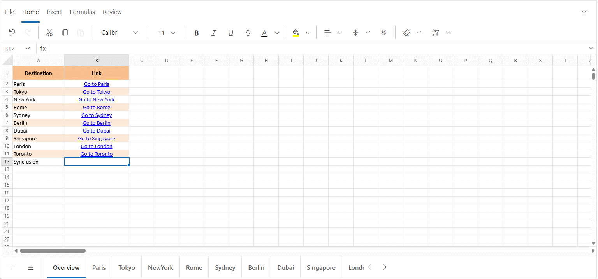
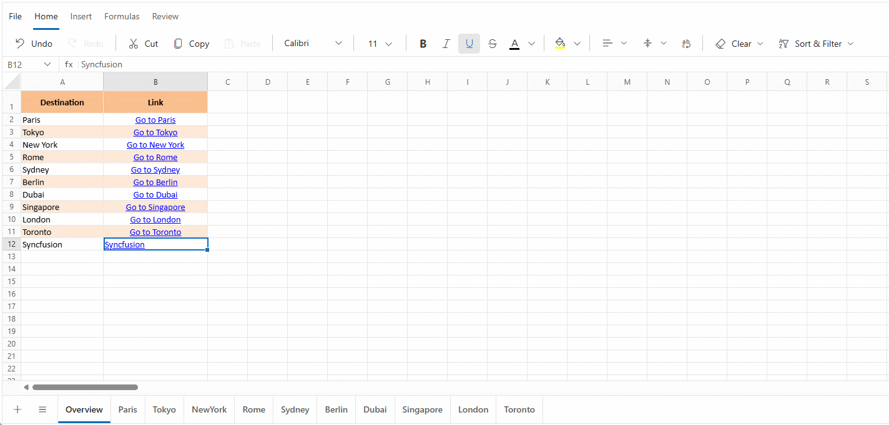
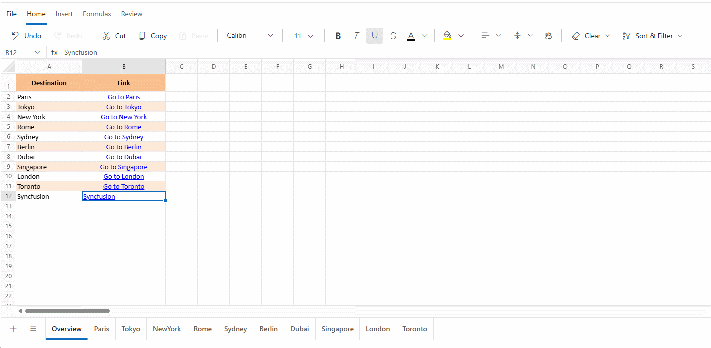
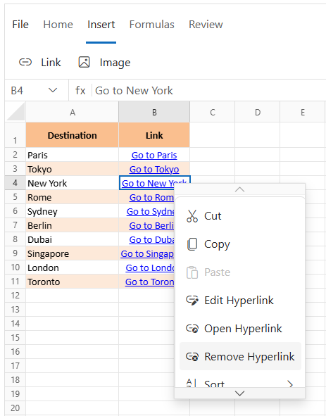

# Hyperlink in Blazor Spreadsheet component

Hyperlink in the Blazor Spreadsheet enable interactive navigation both within and outside of spreadsheets. This feature creates clickable link that connect to external web URLs, specific cells within the current worksheet, or cells in other worksheets. To control this functionality, use the [AllowHyperlink](https://help.syncfusion.com/cr/blazor/Syncfusion.Blazor.Spreadsheet.SfSpreadsheet.html#Syncfusion_Blazor_Spreadsheet_SfSpreadsheet_AllowHyperLink) property, which enables or disables hyperlink support in the Spreadsheet. The default value of the `AllowHyperlink` property is **true**.

The keyboard shortcut `Ctrl + K` can be used to quickly open the **Insert** or **Edit** hyperlink dialog for the active cell, without using the UI elements. This shortcut works regardless of whether the hyperlink functionality is accessed through the Ribbon or the Context Menu.

N> When `AllowHyperlink` is set to **false**, the hyperlink options are removed from the interface (Ribbon and Context Menu), although existing hyperlinks will still function. Additionally, shortcut keys (**Ctrl + K**) and API methods related to this feature will no longer work.

## Insert hyperlink

Hyperlink can be added to worksheet cells to create interactive elements that improve navigation and connect data to external sources. These links can point to:
* **Web URLs** - Direct access to websites, such as https://www.syncfusion.com
* **Cell References** - Quick jumps to specific cells within the same sheet, like **A1** or a range such as **B5:C10**
* **Sheet References** - Navigation to cells in other sheets, for example, **Sheet2!A1**

The linked cells are typically formatted with underlined and colored text to indicate they are clickable.

### Insert hyperlink via UI

Hyperlink can be inserted through the user interface (UI) using any of the following methods:

**Using the Ribbon**

- Select a cell or range of cells for adding a hyperlink.
- Click the **Insert** tab in the **Ribbon** toolbar.
- Click the **Link** option.
- Complete the hyperlink information in the dialog box.
- Click the **Insert** button to add the hyperlink to the selected cell or range.

**Using the Context Menu**

- Right-click the selected or active cell.
- Choose **Hyperlink** from the context menu.
- Complete the hyperlink information in the dialog box.
- Click the **Insert** button to add the hyperlink to the selected cell or range.

### Insert hyperlink programmatically

Hyperlink can be added programmatically using the [AddHyperlinkAsync](https://help.syncfusion.com/cr/blazor/Syncfusion.Blazor.Spreadsheet.SfSpreadsheet.html#Syncfusion_Blazor_Spreadsheet_SfSpreadsheet_AddHyperlinkAsync_System_String_System_String_System_String_) method. This method allows hyperlink to be added to cell or range of cells without using the UI. The available parameters in the `AddHyperlinkAsync` method are:

| Parameter | Type | Description |
| -- | -- | -- |
| cellAddress | string | Specifies the cell or range of cells where the hyperlink should be added. |
| hyperlink | string | Specifies the destination of the hyperlink. This can be a web URL (with or without a protocol), a cell reference, or a sheet reference. |
| displayText | string (optional) |  Specifies the text to display in the cell. If omitted, the hyperlink address is used as the display text. For cells with existing values, this parameter overrides the existing text. |




@using Syncfusion.Blazor.Spreadsheet

<button @onclick="AddHyperlink">Add Hyperlink</button>
<SfSpreadsheet @ref="SpreadsheetInstance" DataSource="DataSourceBytes">
    <SpreadsheetRibbon></SpreadsheetRibbon>
</SfSpreadsheet>

@code {
    public byte[] DataSourceBytes { get; set; }
    public SfSpreadsheet SpreadsheetInstance;

    protected override void OnInitialized()
    {
        string filePath = "wwwroot/Sample.xlsx";
        DataSourceBytes = File.ReadAllBytes(filePath);
    }

    public async Task AddHyperlink()
    {
        // Adds a hyperlink to the range "A2:A5".
        await SpreadsheetInstance.AddHyperlinkAsync("A2:A5", "https://www.syncfusion.com/blazor-components/blazor-spreadsheet");
    }
}




The `AddHyperlinkAsync` method is flexible and supports various scenarios beyond basic usage. The following are some special cases and behaviors to be aware of:




// Adds a web URL hyperlink to a single cell.
await spreadsheetInstance.AddHyperlinkAsync("A1", "https://www.syncfusion.com", "Syncfusion");

// Adds a cell reference hyperlink.
await spreadsheetInstance.AddHyperlinkAsync("B5", "D10", "Go to Summary");

// Adds a sheet reference hyperlink.
await spreadsheetInstance.AddHyperlinkAsync("A2", "Sheet2!B5", "View Details");

// Adds a hyperlink to multiple cells.
await spreadsheetInstance.AddHyperlinkAsync("A2:A5", "https://www.syncfusion.com", "Documentation");

// Adds a web URL without a protocol, which is automatically prefixed with "https://".
await spreadsheetInstance.AddHyperlinkAsync("A1", "syncfusion.com");

// Adds a hyperlink without display text, using the hyperlink address as display text.
await spreadsheetInstance.AddHyperlinkAsync("B1", "https://www.syncfusion.com");

// Adds a hyperlink to a non-existent sheet reference; no error is thrown, but the link may not function properly.
await spreadsheetInstance.AddHyperlinkAsync("C1", "NonExistentSheet!A1", "Invalid Sheet");

// Adds a hyperlink to a cell with an existing value; the display text will update if provided.
await spreadsheetInstance.AddHyperlinkAsync("D1", "https://www.syncfusion.com", "New Text");




## Edit hyperlink

Hyperlink in a spreadsheet can be edited to update the destination or the display text. This includes:

- **Changing the Web URL** - Update the hyperlink to point to a different website or online resource.
- **Editing the Display Text** - Modify the text in the cell without affecting the link destination.
- **Updating Cell References** - Modify the hyperlink to point to a different cell in the same sheet (e.g., from A1 to B5).
- **Linking to Another Sheet** - Redirect the hyperlink to a different sheet by modifying the sheet name in the reference (e.g., from Sheet1!A1 to Sheet2!C3).

### Edit hyperlink via UI

Hyperlink can be edited through the user interface (UI) using any of the following methods:

**Using the Ribbon**

- Select the cell containing the hyperlink.
- Click the **Insert** tab in the **Ribbon** toolbar.
- Click the **Link** option.
- Make changes to the hyperlink information in the dialog box.
- Click **Update** to apply the changes.

**Using the Context Menu**

- Right-click the cell containing the hyperlink.
- Choose **Edit Hyperlink** from the context menu.
- Make changes to the hyperlink information in the dialog box.
- Click **Update** to apply the changes.

> When editing hyperlink to other sheets, ensure that the target sheet exists in the workbook. Link to non-existent sheets result in errors when clicked.

## Remove hyperlink

Removing a hyperlink disconnects the cells from their associated destinations while retaining the display text. This operation eliminates only the hyperlink functionality without altering the actual content of the cells. Any cells that do not contain a hyperlink are ignored during the process, and no errors are generated.

### Remove hyperlink via UI

To remove a hyperlink using the interface, select the cell that contains the hyperlink, then right-click to open the context menu. From the available options, choose **Remove Hyperlink** to delete the link from the selected cell.

When dealing with multiple hyperlinks, selecting a range of cells - such as A1 to D5 - allows all hyperlinks within that range to be removed in a single operation. This method is efficient for cleaning up large sets of hyperlinks quickly.

### Remove hyperlink programmatically

Hyperlink can be removed programmatically by using the  [RemoveHyperlinkAsync](https://help.syncfusion.com/cr/blazor/Syncfusion.Blazor.Spreadsheet.SfSpreadsheet.html#Syncfusion_Blazor_Spreadsheet_SfSpreadsheet_RemoveHyperlinkAsync_System_String_) method. This method eliminates hyperlink functionality from the specified cell or range of cells within a spreadsheet, allowing for efficient bulk removal through code. The available parameters in the `RemoveHyperlinkAsync` method are:

| Parameter | Type | Description |
| -- | -- | -- |
| cellAddress | string | Specifies the cell or range of cells from which hyperlink should be removed. |




@using Syncfusion.Blazor.Spreadsheet

<button @onclick="RemoveHyperlink">Remove Hyperlink</button>
<SfSpreadsheet @ref="SpreadsheetInstance" DataSource="DataSourceBytes">
    <SpreadsheetRibbon></SpreadsheetRibbon>
</SfSpreadsheet>

@code {
    public byte[] DataSourceBytes { get; set; }
    public SfSpreadsheet SpreadsheetInstance;

    protected override void OnInitialized()
    {
        string filePath = "wwwroot/Sample.xlsx";
        DataSourceBytes = File.ReadAllBytes(filePath);
    }

    public async Task RemoveHyperlink()
    { 
        // Removes all hyperlinks from the specified cell range (A2 to A5) in the active sheet.
        await SpreadsheetInstance.RemoveHyperlinkAsync("A2:A5");
    }
}




The `RemoveHyperlinkAsync` method is flexible and supports various scenarios beyond basic usage. Below are some special cases and behaviors to be aware of:




// Remove hyperlink from a single cell.
await spreadsheetInstance.RemoveHyperlinkAsync("A1");

// Remove hyperlinks from a range of cells
await spreadsheetInstance.RemoveHyperlinkAsync("A1:C5");

// Remove hyperlink from a single cell in a specific sheet
await spreadsheetInstance.RemoveHyperlinkAsync("Sheet2!D10");

// Remove hyperlinks from a range of cells in a specific sheet
await spreadsheetInstance.RemoveHyperlinkAsync("Sheet3!A1:A20");




## Events

The Blazor Spreadsheet provides events that are triggered during hyperlink operations, such as [HyperlinkCreating](https://help.syncfusion.com/cr/blazor/Syncfusion.Blazor.Spreadsheet.HyperlinkCreatingEventArgs.html), [HyperlinkCreated](https://help.syncfusion.com/cr/blazor/Syncfusion.Blazor.Spreadsheet.HyperlinkCreatedEventArgs.html), and [HyperlinkClick](https://help.syncfusion.com/cr/blazor/Syncfusion.Blazor.Spreadsheet.HyperlinkClickEventArgs.html). These events enable the execution of custom actions before and after hyperlink is created or interacted with, allowing for validation, customization, and response handling.

* **HyperlinkCreating** - The `HyperlinkCreating` event is triggered prior to the creation of a hyperlink. It offers an opportunity to modify or validate the hyperlink details before the link is added to the sheet, enabling custom logic or restrictions to be applied during the hyperlink creation process.

* **HyperlinkCreated** - The `HyperlinkCreated` event is triggered after a hyperlink has been successfully added to the sheet. It provides detailed information about the newly created hyperlink, enabling further processing or logging if required.

* **HyperlinkClick** - The `HyperlinkClick` event is triggered when a hyperlink in the sheet is clicked.

### HyperlinkCreating

The `HyperlinkCreating` event is triggered before a hyperlink is added to cell. This event provides an opportunity to inspect, modify, or cancel the hyperlink creation process based on custom logic or validation requirements.

**Purpose**

This event is useful for scenarios where hyperlink behavior needs to be controlled dynamically - such as restricting certain URLs, customizing display text, or preventing hyperlinks in specific cells.

**Event Arguments**

The event uses the [HyperlinkCreatingEventArgs](https://help.syncfusion.com/cr/blazor/Syncfusion.Blazor.Spreadsheet.HyperlinkCreatingEventArgs.html) class, which includes the following properties:

| Event Arguments | Description |
|----------------|-------------|
| Uri | Represents the hyperlink destination, which can be a web URL or an internal sheet reference in the format **"SheetName!CellReference"**. This value can be modified to redirect the hyperlink to a different location. |
| CellAddress | Specifies the cell location where the hyperlink will be inserted. The address must be specified using A1 notation (e.g., "A1", "B5"). |
| DisplayText | Defines the visible text shown in the cell for the hyperlink. This can be customized to provide a user-friendly label, distinct from the actual hyperlink destination. |
| Cancel | Indicates whether the hyperlink creation should be aborted. Setting this property to **true** prevents the hyperlink from being added, allowing for conditional validation or restriction logic. |




@using Syncfusion.Blazor.Spreadsheet

<SfSpreadsheet DataSource="DataSourceBytes">
    <SpreadsheetRibbon></SpreadsheetRibbon>
    <SpreadsheetEvents HyperlinkCreating="OnHyperlinkCreating" ></SpreadsheetEvents>
</SfSpreadsheet>

@code {
    public byte[] DataSourceBytes { get; set; }
    
    protected override void OnInitialized()
    {
        string filePath = "wwwroot/Sample.xlsx";
        DataSourceBytes = File.ReadAllBytes(filePath);
    }

    public void OnHyperlinkCreating(HyperlinkCreatingEventArgs args)
    {
        // Prevent the creation of a hyperlink to a specific domain.
        if (args.Uri?.StartsWith("http://example.com") == true)
        {
            args.Cancel = true;
        }

        // Customize the display text if it is empty.
        if (string.IsNullOrEmpty(args.DisplayText))
        {
            args.DisplayText = "Click here";
        }

        // Convert simple domain names to full URLs.
        if (args.Uri?.StartsWith("www.") == true)
        {
            args.Uri = "https://" + args.Hyperlink;
        }
    }
}




### HyperlinkCreated

The `HyperlinkCreated` event is triggered after a hyperlink has been successfully added to a cell. This event provides read-only access to the details of the newly created hyperlink, allowing for post-processing actions such as logging, auditing, or UI updates.

**Purpose**

This event is useful for scenarios where actions need to be taken after a hyperlink is created - such as confirming the link, updating related metadata, or notifying users of the change.

**Event Arguments**

The [HyperlinkCreatedEventArgs](https://help.syncfusion.com/cr/blazor/Syncfusion.Blazor.Spreadsheet.HyperlinkCreatedEventArgs.html) includes the following properties:

| Event Arguments | Description |
|----------------|-------------|
| Uri | Represents the hyperlink destination, which can be either an external web URL (e.g., "https://example.com") or an internal sheet references. This value is read-only and reflects the final destination of the hyperlink. |
| CellAddress | Specifies the cell location where the hyperlink has been inserted. The address is provided in A1 notation (e.g., **"A1"**, **"B5"**), and indicates the exact position of the hyperlink in the worksheet. This value is read-only. |
| DisplayText | Defines the visible text shown in the cell for the hyperlink. This user-friendly label may differ from the actual hyperlink address and is useful for providing descriptive or meaningful link text. This value is read-only. |




@using Syncfusion.Blazor.Spreadsheet

<SfSpreadsheet DataSource="DataSourceBytes">
    <SpreadsheetRibbon></SpreadsheetRibbon>
    <SpreadsheetEvents HyperlinkCreated="OnHyperlinkCreated" ></SpreadsheetEvents>
</SfSpreadsheet>

@code {
    public byte[] DataSourceBytes { get; set; }
    
    protected override void OnInitialized()
    {
        string filePath = "wwwroot/Sample.xlsx";
        DataSourceBytes = File.ReadAllBytes(filePath);
    }

    public void OnHyperlinkCreated(HyperlinkCreatedEventArgs args)
    {
        // Log information about the newly created hyperlink.
        Console.WriteLine($"Hyperlink created at {args.CellAddress} pointing to {args.Uri}");
        Console.WriteLine($"Display text: {args.DisplayText}");
    }
}




### HyperlinkClick

The `HyperlinkClick` event is triggered when a hyperlink within the spreadsheet is clicked. This event provides contextual information about the clicked hyperlink, enabling custom responses such as logging, conditional navigation, or user notifications.

**Purpose**

This event is designed for observing hyperlink interactions and executing custom logic in response. Since all event arguments are read-only, it is not intended for modifying the hyperlink but rather for handling actions that follow a click - such as auditing, validation, or UI updates.

**Event Arguments**

The [HyperlinkClickEventArgs](https://help.syncfusion.com/cr/blazor/Syncfusion.Blazor.Spreadsheet.HyperlinkClickEventArgs.html) includes the following properties:

| Event Arguments | Description |
|----------------|-------------|
| Uri | Represents the hyperlink destination, which may be an external web URL (e.g., **"https://example.com"**) or an internal sheet references. This value reflects the actual navigation target of the hyperlink. This value is read only. |
| CellAddress | Specifies the cell location where the hyperlink resides. The address is provided in A1 notation (e.g., **"A1"**, **"B5"**), indicating the exact position of the hyperlink in the worksheet. This value is read only. |
| DisplayText | Defines the visible text shown in the cell for the hyperlink. This user-friendly label may differ from the actual hyperlink address and is useful for identifying the link's purpose or context. This value is read only.|




@using Syncfusion.Blazor.Spreadsheet

<SfSpreadsheet DataSource="DataSourceBytes">
    <SpreadsheetRibbon></SpreadsheetRibbon>
    <SpreadsheetEvents HyperlinkClick="OnHyperlinkClick" ></SpreadsheetEvents>
</SfSpreadsheet>

@code {
    public byte[] DataSourceBytes { get; set; }
    
    protected override void OnInitialized()
    {
        string filePath = "wwwroot/Sample.xlsx";
        DataSourceBytes = File.ReadAllBytes(filePath);
    }

    public void OnHyperlinkClick(HyperlinkClickEventArgs args)
    {
        // Track hyperlink usage.
        Console.WriteLine($"Hyperlink clicked at {args.CellAddress}: {args.Uri}");
        
        // Handle special URLs or sheet references differently.
        if (args.Hyperlink.StartsWith("https://restricted"))
        {
            // Implement custom handling for restricted sites.
            // For example, show a warning or redirect elsewhere.
        }
    }
}


