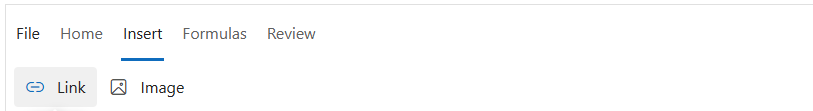
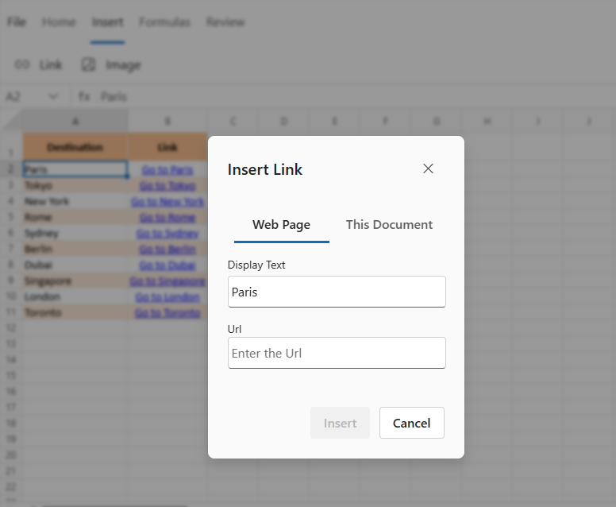
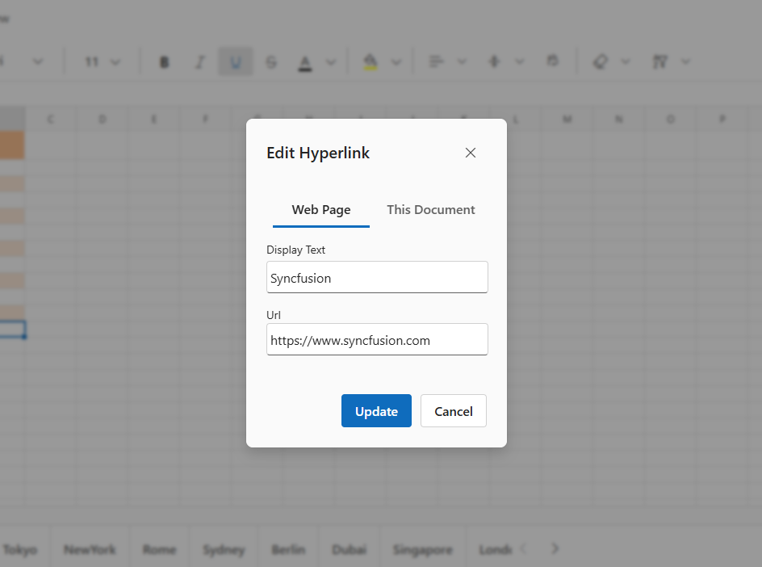

# Hyperlink in Blazor Spreadsheet component

Hyperlinks in the Spreadsheet component allow users to navigate to web URLs, specific cell references within the same sheet, or to other sheets. To control this functionality, use the [AllowHyperlink](https://help.syncfusion.com/cr/blazor/Syncfusion.Blazor.Spreadsheet.SfSpreadsheet.html#Syncfusion_Blazor_Spreadsheet_SfSpreadsheet_AllowHyperLink) property, which enables or disables hyperlink support in the Spreadsheet.

> * The default value for `AllowHyperlink` property is **true**.

## Insert Hyperlink

Hyperlinks can be inserted into worksheet cells to provide direct access to external web pages, specific cell references within the same worksheet, or cells in other worksheets. This functionality enhances navigation and improves the interactivity of the Spreadsheet.

### Insert Hyperlink via the UI

In the active sheet, select the cell where the hyperlink should be created. A hyperlink can be inserted using any of the following methods:

* Select the **Insert** tab in the Ribbon toolbar and choose the **Link** option.

* Right click the selected cell, then choose the **Hyperlink** option from the context menu.

* Hyperlinks can be inserted or edited using the `Ctrl + K` keyboard shortcut.

### Insert Hyperlink programmatically

To add hyperlinks programmatically in the Spreadsheet component, the [AddHyperLinkAsync()](https://help.syncfusion.com/cr/blazor/Syncfusion.Blazor.Spreadsheet.SfSpreadsheet.html#Syncfusion_Blazor_Spreadsheet_SfSpreadsheet_AddHyperlinkAsync_System_String_System_String_System_String_) method can be used.




@using Syncfusion.Blazor.Spreadsheet

<button @onclick="AddHyperlinkHandler">Add Hyperlink</button>
<SfSpreadsheet @ref="spreadsheetObj" DataSource="DataSourceBytes">
    <SpreadsheetRibbon></SpreadsheetRibbon>
</SfSpreadsheet>

@code {
    public byte[] DataSourceBytes { get; set; }
    SfSpreadsheet spreadsheetObj;

    protected override void OnInitialized()
    {
        string filePath = "wwwroot/Sample.xlsx";
        DataSourceBytes = File.ReadAllBytes(filePath);
    }

    public async Task AddHyperlinkHandler()
    {
	    await spreadsheetObj.AddHyperLinkAsync("https://www.syncfusion.com/blazor-components/blazor-spreadsheet","A2:A5");
    }
}




## Edit Hyperlink

Existing hyperlinks in the workbook can be modified to update the destination or the display text. This includes:

* **Changing the Web URL**: Update the hyperlink to point to a different website or online resource.

* **Modifying the Display Text**: Adjust the text shown in the cell without altering the hyperlink destination.

* **Editing Cell References**: Update the hyperlink to point to a different cell within the same sheet by changing the cell address (e.g., from A1 to B5).

* **Updating Sheet Information**: Redirect the hyperlink to a different sheet by modifying the sheet name in the reference (e.g., from Sheet1!A1 to Sheet2!C3).

## Editing Hyperlinks via the UI

In the active sheet, select the cell that contains the hyperlink to be modified. The hyperlink can be edited by opening the dialog using any of the following methods:

* Select the **Insert** tab in the Ribbon toolbar and click the **Link** option.

* Right click the cell and choose Edit Hyperlink from the context menu, or press `Ctrl + K`.

* In the dialog box, make the necessary changes and click **Update** to apply them.

## Remove Hyperlink

* Performing this operation removes a hyperlink without losing the display text.

### Remove Hyperlinks via the UI

In the active sheet, select the cell containing the hyperlink to be removed. Hyperlinks can be removed in the following way:

* Right click the cell and then click **Remove Hyperlink** option in the context menu.

### Remove Hyperlink programmatically

To remove hyperlinks programmatically in the Spreadsheet component, the [RemoveHyperLinkAsync()](https://help.syncfusion.com/cr/blazor/Syncfusion.Blazor.Spreadsheet.SfSpreadsheet.html#Syncfusion_Blazor_Spreadsheet_SfSpreadsheet_RemoveHyperlinkAsync_System_String_) method can be used.




@using Syncfusion.Blazor.Spreadsheet

<button @onclick="RemoveHyperlinkHandler">Remove Hyperlink</button>
<SfSpreadsheet @ref="spreadsheetObj" DataSource="DataSourceBytes">
    <SpreadsheetRibbon></SpreadsheetRibbon>
</SfSpreadsheet>

@code {
    public byte[] DataSourceBytes { get; set; }
    SfSpreadsheet spreadsheetObj;

    protected override void OnInitialized()
    {
        string filePath = "wwwroot/Sample.xlsx";
        DataSourceBytes = File.ReadAllBytes(filePath);
    }

    public async Task RemoveHyperlinkHandler()
    {
	    await spreadsheetObj.RemoveHyperLinkAsync("A2:A5");
    }
}




