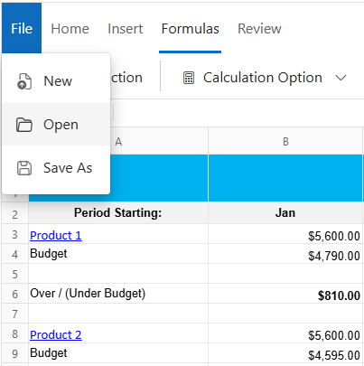
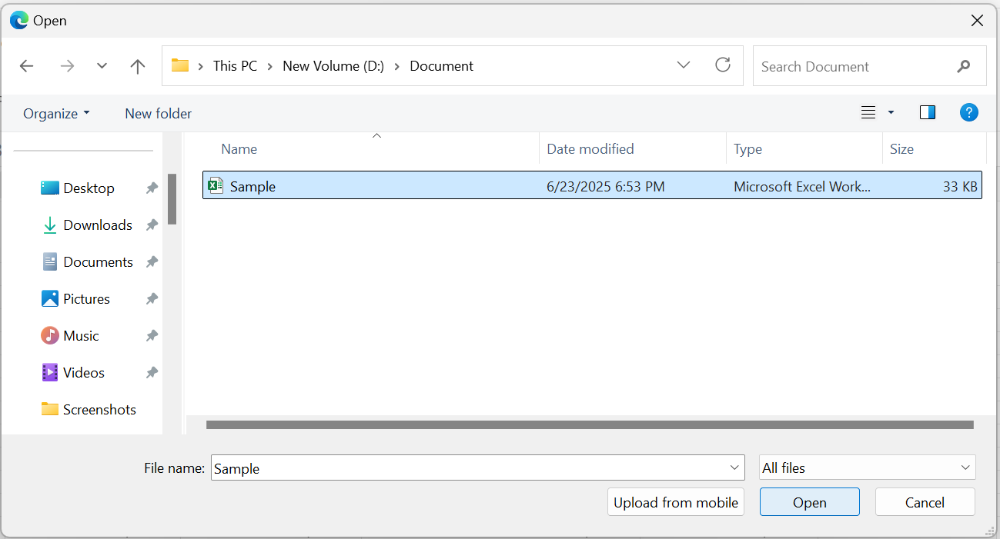
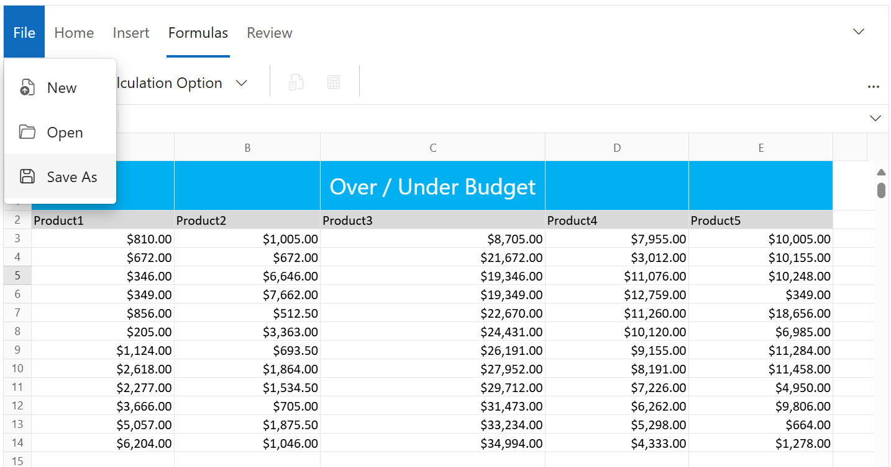
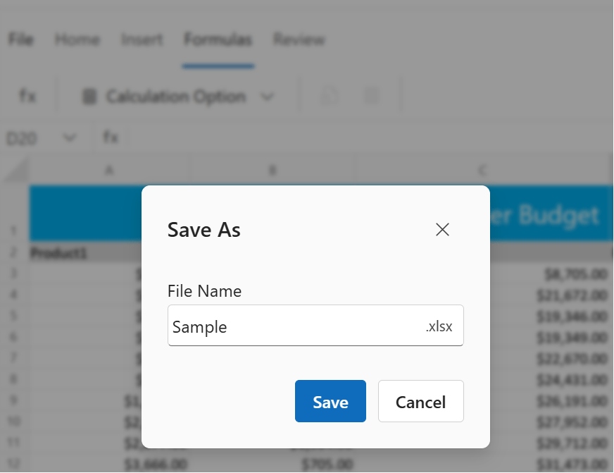
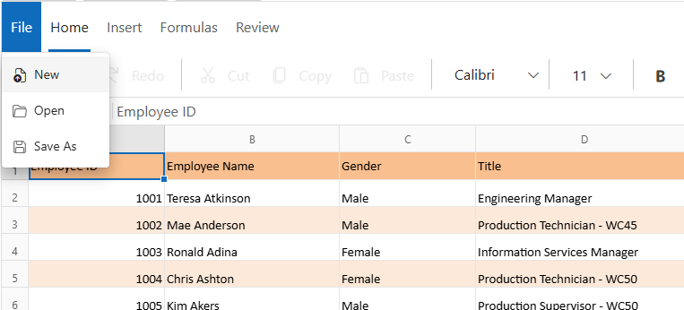

# Open and Save in Blazor Spreadsheet component

The **Open** and **Save** options in the Blazor Spreadsheet component enable efficient management of Excel files. These functionalities support opening existing Excel files for analysis and modification, as well as saving updates or new files to the system in compatible formats.

## Open
The Blazor Spreadsheet component preserves all data, cell styles, formatting, and other spreadsheet elements when loading Excel files. These files can be accessed either through user interface actions or programmatic methods.

### Open an Excel file via UI
To open an Excel document using the interface, select the **File > Open** option from the **Ribbon**. A file explorer dialog will appear, allowing selection of the desired Excel file for loading into the component.

### Open an Excel file from a local path
To load Excel files programmatically, they can be converted into byte arrays. This approach is particularly effective when files are retrieved from a backend service.




@using Syncfusion.Blazor.Spreadsheet

<SfSpreadsheet DataSource="DataSourceBytes" >
    <SpreadsheetRibbon></SpreadsheetRibbon>
</SfSpreadsheet>

@code {
    public byte[] DataSourceBytes { get; set; }

    protected override void OnInitialized()
    {
        string filePath = "wwwroot/Sample.xlsx";
        DataSourceBytes = File.ReadAllBytes(filePath);
    }
}




### Open an Excel file from Base64 string data
To load Excel files encoded as Base64 strings into the component, this option proves effective in scenarios involving data retrieval from databases or APIs.




@using Syncfusion.Blazor.Spreadsheet

 <SfSpreadsheet DataSource="DataSourceBytes" >
    <SpreadsheetRibbon></SpreadsheetRibbon>
 </SfSpreadsheet>

@code {
    public byte[] DataSourceBytes { get; set; }

    protected override void OnInitialized()
    {
        string base64String = "Enter the base64 string data here";
        DataSourceBytes = Convert.FromBase64String(base64String);     
    }
}




### Supported file formats
The Spreadsheet component supports the following file formats for opening:
* MS Excel (.xlsx)
* MS Excel 97-2003 (.xls)

## Save
The Spreadsheet component allows saving data, styles, formatting, and additional content as an Excel file. This functionality ensures that all modifications are retained in a compatible format.

### Save an Excel file using UI
To save the Spreadsheet content through the user interface, select the **File > Save As** option from the **Ribbon**.

### Saving file with active protection settings
When a protected sheet or workbook is saved or downloaded, all associated settings - such as the protection password, unlocked cell ranges, and sheet options - are preserved in the Excel file. These settings remain active and are consistently maintained when the file is opened in other viewers like **Microsoft Excel** or **Google Sheets**, ensuring seamless protection across viewers. To know more about protection, refer [here](https://blazor.syncfusion.com/documentation/spreadsheet/protection#protect-sheet).

### Supported file formats
The Spreadsheet component supports saving files in the MS Excel (.xlsx) format.

## New
To create a new workbook through the user interface, select **File > New** from the **Ribbon**. This action initializes a blank Spreadsheet component, ready for data entry or formatting. If unsaved changes are present, a confirmation dialog will appear, indicating that these changes will be lost. The dialog presents options to proceed with creating the new workbook by selecting **OK**, or to cancel the operation by selecting **Cancel**.

