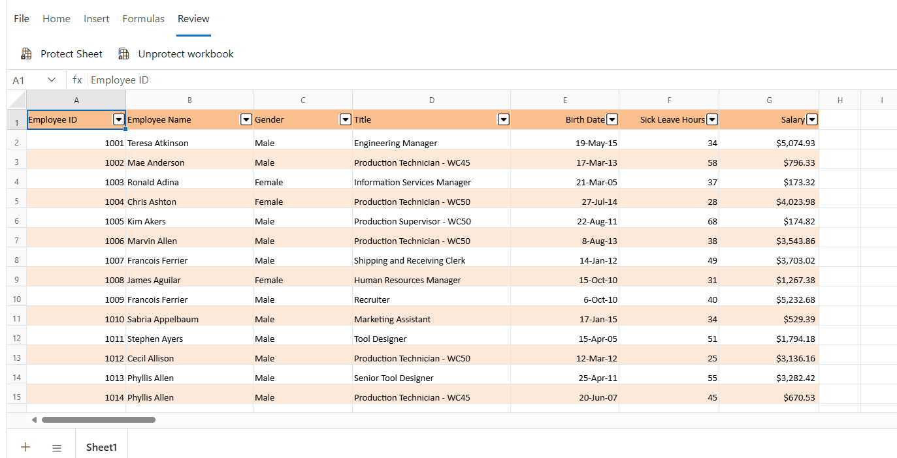

# Protect Sheet in Blazor Spreadsheet Component

Sheet protection is used to prevent unauthorized modification of data within the Spreadsheet.

## Protect Sheet

The **Protect Sheet** feature helps prevent accidental changes such as editing, moving, or deleting data. Protection can be applied with or without a password, depending on the level of security required.

### User interface

In the active Spreadsheet, the sheet protection can be done by any of the following ways:

* Select **Protect Sheet** from the **Review** tab in the Ribbon toolbar and choose the desired options.

* Right-click the sheet tab, select **Protect Sheet** from the context menu, and choose the desired options.

### Unlock Particular Cells in the Protected Sheet via the UI

To allow editing of specific cells or ranges in a protected Spreadsheet:

* Open the **Protect Sheet** dialog.

* Navigate to the **Unlocked Ranges** tab.

* Select the desired cell(s) or range(s) that should remain editable, even when the sheet is protected. These cells will not be locked and can be modified while other parts of the sheet remain restricted.

### Protection Settings in a Protected Sheet

By default, when a sheet is protected, most actions such as formatting, inserting, sorting, and filtering are restricted, while selecting cells remains allowed.

To enable specific functionalities while the sheet is protected:

* Open the **Protect Sheet** dialog from the **Review** tab.

* In the dialog, navigate to the **Sheet Options** tab to view available protection settings.

* Select or deselect the desired options to allow or restrict specific actions.

* Click **OK** to apply the protection settings.

The available protection settings in Spreadsheet are,

| Options | Description |
|------------------------|---------|
| Select Cells | Allows cell selection. |
| Format Cells | Allows cell formatting. |
| Format Rows | Allows row formatting. |
| Format Columns | Allows column formatting. |
| Insert Columns | Allows inserting new columns. |
| Insert Rows | Allows inserting new rows. |
| Insert Hyperlinks | Allows adding hyperlinks. |
| Sort | Allows sorting data. |
| Filter | Allows filtering data. |

## Unprotect Sheet

The **Unprotect Sheet** feature restores access to all actions that were previously restricted by sheet protection. Once unprotected, the sheet allows full interaction, including editing, formatting, inserting, and deleting content.

### User interface

In the active Spreadsheet, the sheet Unprotection can be done by any of the following ways:

* Select **Unprotect Sheet** from the **Review** tab in the Ribbon toolbar.

* Right-click the sheet tab and select **Unprotect Sheet** from the context menu.

## Protect Workbook

The **Protect Workbook** feature restricts structural modifications within a workbook. Actions such as inserting, deleting, renaming, or hiding worksheets are disabled when this protection is enabled. Protection can be configured with or without a password, depending on the desired level of security.

### User interface

To protect the workbook:

* Go to the **Review** tab in the Ribbon toolbar.

* Select **Protect Workbook**, enter and confirm the desired password, and then click **OK** to apply the protection.

## Unprotect Workbook

The **Unprotect Workbook** feature enables structural modifications within a workbook. Once unprotected, actions such as inserting, deleting, renaming, moving, copying, hiding, or unhiding worksheets become available.

### User interface

To unprotect the workbook:

* Select **Unprotect Workbook** from the **Review** tab in the Ribbon toolbar.

* Enter the correct password in the dialog box, then click **OK**.

