# Protect Sheet and Workbook in Blazor Spreadsheet component

The Syncfusion Blazor Spreadsheet component offers protection features to secure data by restricting unauthorized modifications. Sheet protection prevents changes to cell content in the active sheet, while workbook protection safeguards the workbook's structure, such as preventing the addition, deletion, duplication, hiding, moving, or renaming of sheets.

## Protect sheet

The **Protect Sheet** support restricts modifications to a sheet's content, such as editing, formatting or deleting data. Protection can be applied with or without a password, based on the desired security level. The **Protect Sheet** dialog secures sheet content by controlling permitted edits and deletions. It contains three primary sections:

* **Manage Protection**: This section enables the configuration of protection settings, including the option to apply a password. It restricts unauthorized changes to the sheet.

* **Unlock Range**: This section allows the specification of cells or ranges that remain editable, even when the majority of the sheet is protected. It facilitates limited editing permissions within a secure environment.

* **Sheet Options**: This section allows customization of the actions permitted on a protected sheet, ensuring versatility in the sheet's usage while upholding its security.

Each section plays an integral role in maintaining the protection and integrity of the sheet's content.

### Manage Protection

Sheet protection can be enabled through the user interface(UI) in the active sheet using one of the following methods:

* Select **Protect Sheet** from the **Review** tab in the **Ribbon** and choose the desired options.

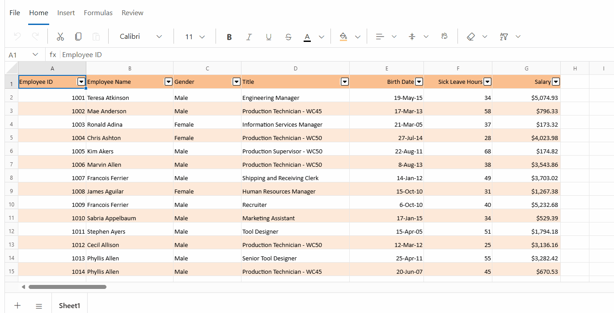

* Right-click the sheet tab context menu option, select **Protect Sheet** from the **Context Menu**, and choose the desired options.

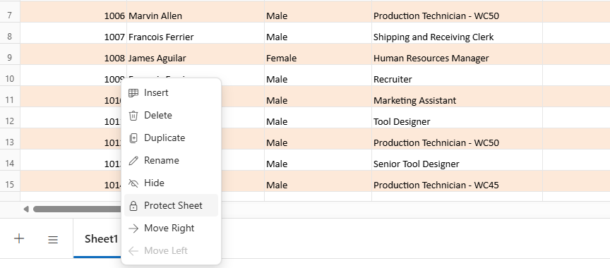

Protecting a sheet includes features that allow for the setup of an optional password. In this scenario, no cells or ranges are specified as unlocked, and all additional sheet options remain in disabled state. This ensures that the sheet is fully protected, with strict access controls applied throughout the entire sheet.

### Unlock Range

Specific cells or ranges in a protected sheet can be unlocked to allow editing while maintaining restrictions on the rest of the sheet. This option supports scenarios where selective data editing is required.

To unlock specific cells or ranges in a protected sheet, follow these steps:

* Open the **Protect Sheet** dialog from the **Review** tab or the sheet tab **Context Menu**.

* Navigate to the **Unlock Range** tab in the dialog.

* Select the desired cells or ranges that should remain editable.

* Confirm the settings and apply protection to the sheet.

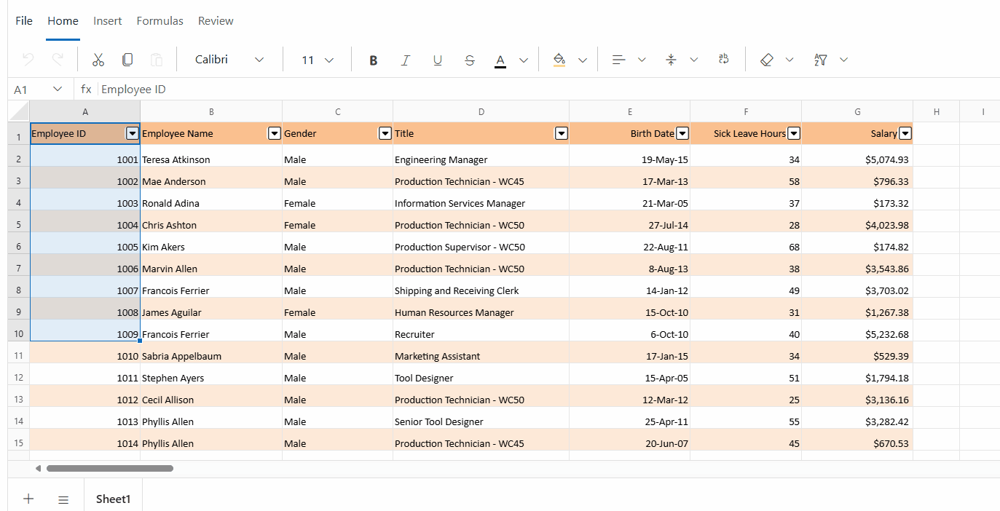

*To edit existing unlocked ranges*:

* In the **Protect Sheet** dialog, under the **Unlock Range** tab, view the unlocked ranges list, which shows all ranges currently set as editable in the protected sheet.

* Position the cursor over a range to reveal the **Edit** icon.

* Click the **Edit** icon, modify the range name or cells (e.g., change "A1:A10" to "A1:A100").

* Click **Update Range** button to save the changes.

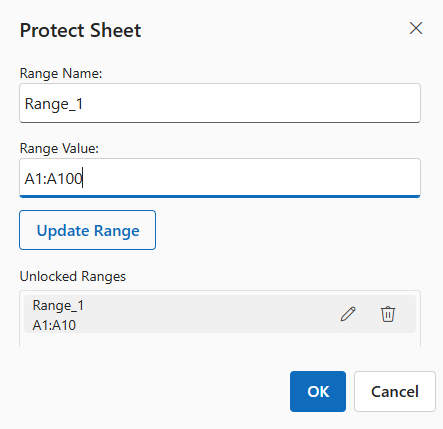

*To delete an existing unlocked range*:

* In the unlocked ranges list, position the cursor over the range to reveal the **Delete** icon.

* Click the **Delete** icon to remove the range. Once removed, the range becomes protected and cannot be edited, aligning with the sheet's protection restrictions.

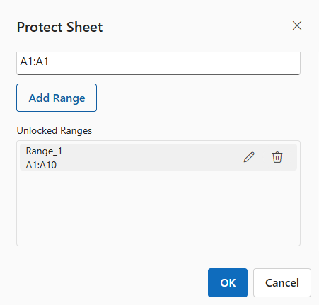

**Allowed actions in protected sheets**

When a sheet is protected, certain operations are always permitted on unlocked cells or ranges, even if additional options in the Sheet options are not selected. These operations include basic editing, formatting, and data entry.

* **Clipboard Actions** :
  - **Cut** operations are not permitted for either locked or unlocked cells in a protected sheet to prevent unintended data removal. 
  - **Copy** operations are permitted for both locked and unlocked cells. 
  - **Paste** operations are permitted only in unlocked cells to prevent unintended modifications to protected areas. For example, copying a value from a locked cell and pasting it into an unlocked cell is supported, but pasting into a locked cell is prohibited.

* **Autofill Actions**: **Autofill** is permitted only for unlocked cells, ensuring protected data remains unchanged.

* **Cell Editing**: Editing a cell content, such as typing new values or modifying existing data, is permitted only in unlocked cells.

* **Formula Bar - Editing**:  Editing cell content via the formula bar, including entering or modifying formulas, inserting formulas using the insert function, or editing text or values, is allowed only in unlocked cells.

* **Clear Actions**: **Clear All** and **Clear Contents** are allowed only for unlocked cells, preserving protected data.

These restrictions ensure that only designated unlocked areas can be modified, providing control over editable content in a protected sheet. If clipboard actions, autofill actions, cell editing, or formula bar editing are attempted on locked cells, a warning popup appears to indicate the action is restricted.

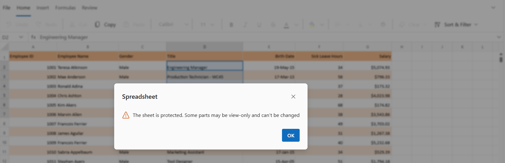

### Sheet Options

In a protected sheet, certain actions such as formatting, inserting, sorting, and filtering are restricted by default to maintain data integrity and prevent unauthorized modifications. The protection settings provide granular control, allowing specific actions to be enabled according to the needs of the Spreadsheet.

To enable specific functionalities while the sheet is protected:

* Open the **Protect Sheet** dialog from the **Review** tab.

* Navigate to the **Sheet Options** tab to view available protection settings.

* Select or deselect the desired options to allow or restrict specific actions.

* Click **OK** to apply the protection settings.

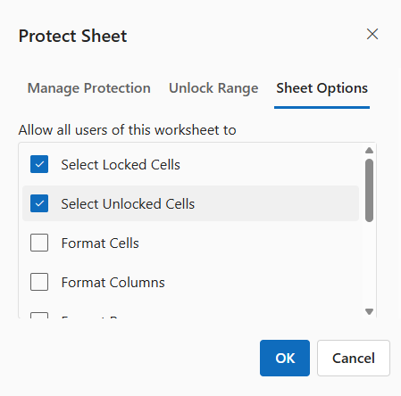

The available protection settings in Spreadsheet component include:

| Options | Description |
|------------------------|---------|
| Select Locked Cells | Permits selection of locked cells in the protected sheet. This option cannot be enabled alone. Enabling it automatically enables the option to select unlocked cells. |
| Select UnLocked Cells | Permits selection of unlocked cells in the protected sheet. |
| Format Cells | Permits formatting of cells, such as changing fonts or colors. |
| Format Rows | Permits formatting of rows, such as adjusting row height. |
| Format Columns | Permits formatting of columns, such as adjusting column width. |
| Insert Columns | Permits inserting new columns in the protected sheet. |
| Insert Rows | Permits inserting new rows in the protected sheet. |
| Insert Hyperlinks | Permits adding hyperlinks to unlocked cells in the protected sheet. |
| Sort | Permits sorting data in unlocked ranges within the protected sheet. |
| Filter | Permits applying filters to data in unlocked ranges within the protected sheet. |

*Impacts of sheet Protection on Ribbon and Context Menu functionality*

- **Select Locked Cells**: Allows selecting and moving across locked cells. If this is disabled, these cells can't be selected.

- **Select Unlocked Cells**: Allows selecting and modifying unlocked cells. If this is disabled, these cells cannot be selected, and interactions like editing, formatting, or any modifications cannot occur.

- **Format Cells**: Allows changing fonts, colors, or styles. When this option enabled, the **Home** tab in the **Ribbon** displays options like Bold, Italic, Font Size, and Fill Color for both locked and unlocked cells. Additionally, the **Clear Formats** option enables in the **Ribbon** for unlocked cells only.

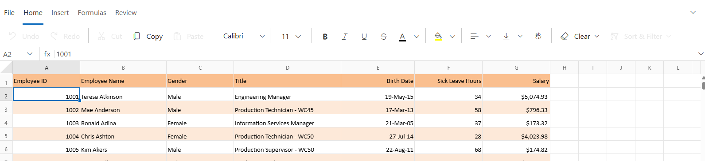

- **Format Rows**: Allows formatting of rows, such as adjusting row height. When this option is enabled, the row resize cursor becomes active for both locked and unlocked cells.

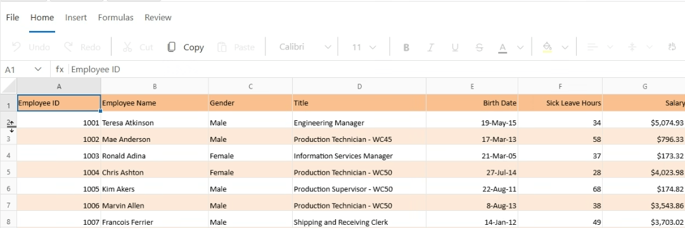

- **Format Columns**: Allows formatting of columns, such as adjusting column width. When this option is enabled, the column resize cursor becomes active for both locked and unlocked cells.

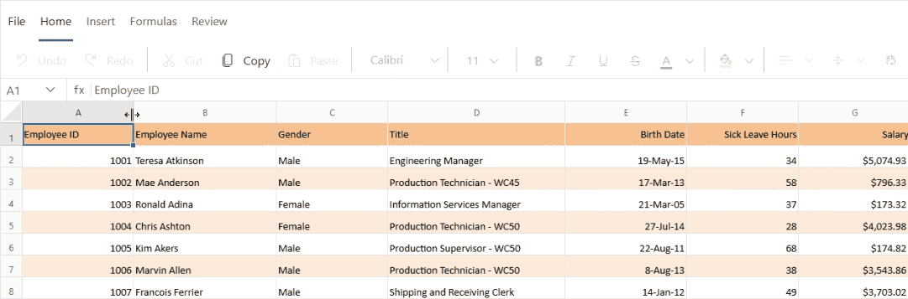

- **Insert Columns**: Allows adding new columns in the protected sheet. When this option is enabled, right-clicking a single column header or a range of selected column headers displays the **Insert Column** option in the context menu. This applies to both locked and unlocked cells.

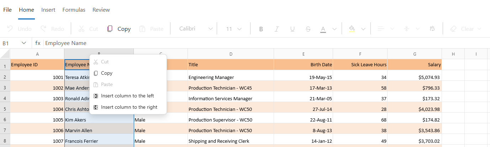

- **Insert Rows**: Allows adding new rows in the protected sheet. When this option is enabled,  right-clicking a single row header or a range of selected row headers displays the **Insert Row** option in the context menu. This applies to both locked and unlocked cells.

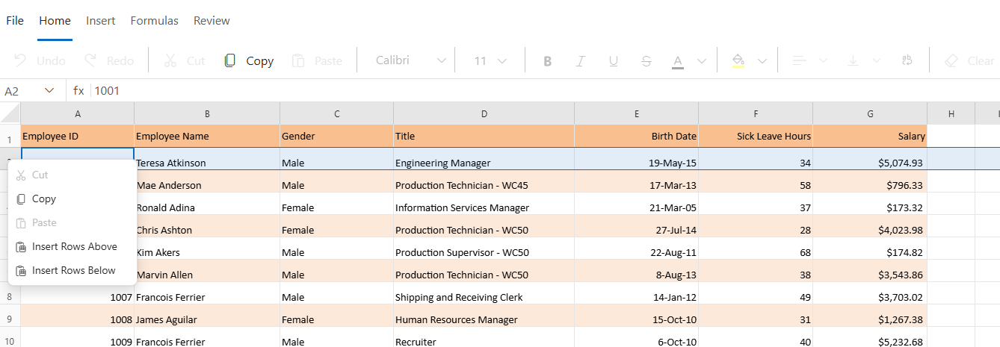

- **Insert Hyperlinks**:  Allows adding hyperlinks to unlocked cells in the protected sheet. When this option is enabled, the **Insert** tab in the **Ribbon** displays the **Link** option, and the **Hyperlink** option becomes available in the context menu. Additionally, the **Clear Hyperlink** option appears in the **Ribbon** for unlocked cells only.

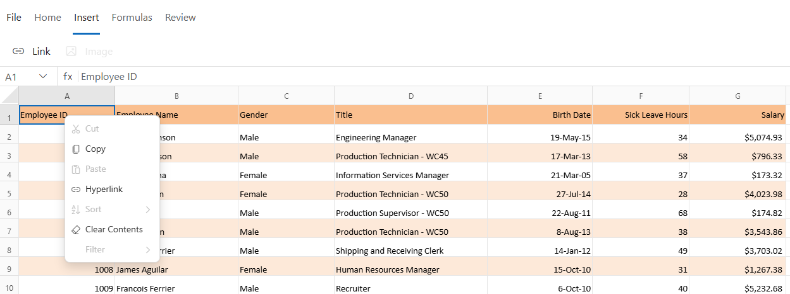

- For locked cells, the **Link** and **Hyperlink** options in the **Ribbon** and **Context Menu** are disabled, preventing hyperlink addition.

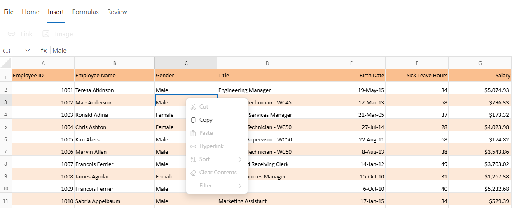

- **Sort**: Allows sorting data in unlocked ranges within the protected sheet. When this option is enabled, the **Home** tab in the **Ribbon** displays the **Sort** option, and the **Sort** option also appears in the context menu.

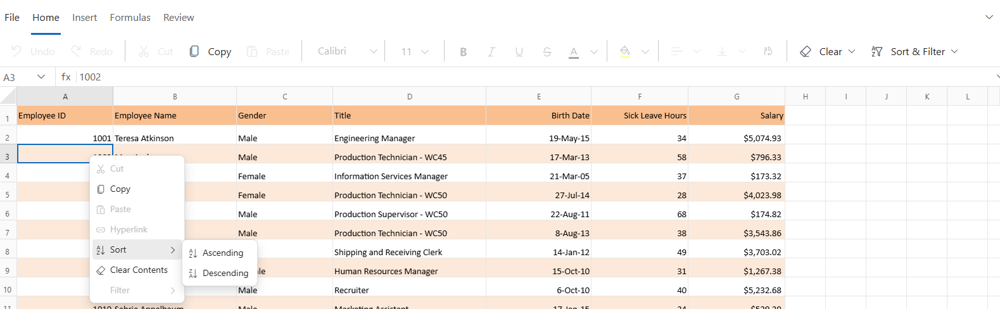
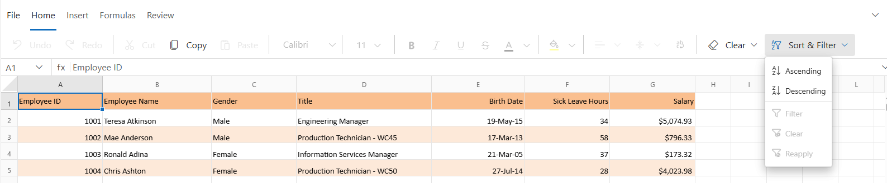

- For locked cells, a warning popup appears if sorting is attempted, indicating the action is not allowed.

- **Filter**: Allows applying filters to data in unlocked ranges within the protected sheet. When this option is enabled, the **Home** tab in the **Ribbon** displays the **Filter** option, and the **Filter** option also appears in the context menu.

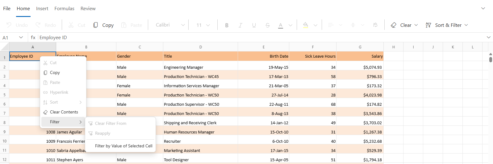
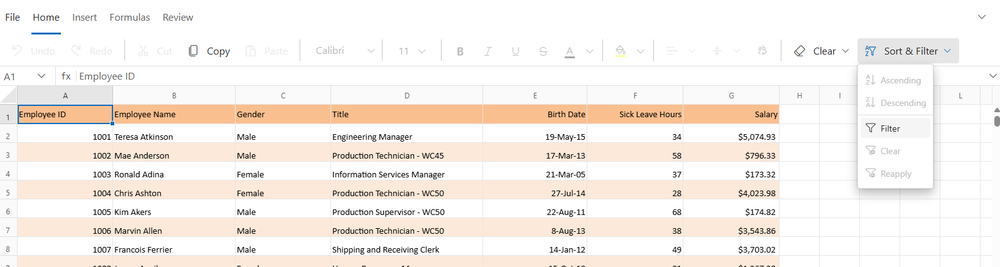

- For locked cells, a warning popup appears if filtering is attempted, indicating the action is not allowed.

## Unprotect Sheet

The **Unprotect Sheet** support removes restrictions on actions previously limited by sheet protection, enabling full interaction, including editing, formatting, inserting, and deleting content.

To unprotect a sheet, follow one of these methods:

* Select **Unprotect Sheet** from the **Review** tab in the **Ribbon**.

* Right-click the sheet tab context menu option and select **Unprotect Sheet** from the **Context Menu**, and enter the password if prompted.

If a password was set during protection, the correct password must be entered to unprotect the sheet. If no password was set, the sheet can be unprotected directly without entering a password.

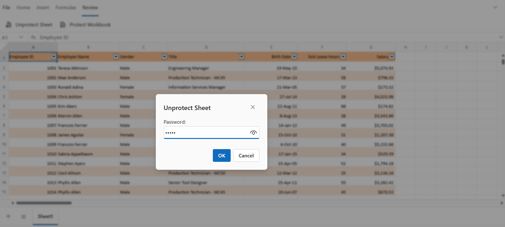

## Protect Workbook

The **Protect Workbook** support prevents structural modifications within a workbook, such as inserting, deleting, renaming, duplicating, hiding, moving, or copying sheets. Protection can be applied with or without a password, depending on the required security level. 
When the workbook is protected, **Context Menu** options in the **Sheet Tab** related to structural changes are disabled to prevent modifications.

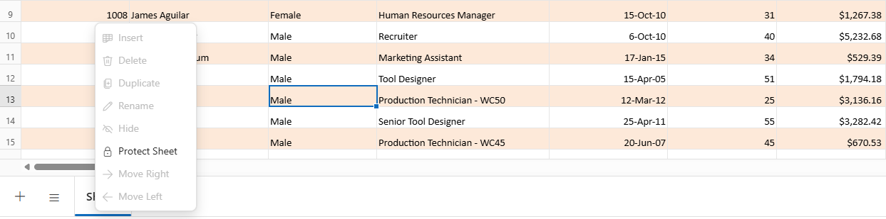

To protect the workbook, follow these steps:

* Navigate to the **Review** tab in the **Ribbon**.

* Select **Protect Workbook**, enter and confirm the desired password, and then click **OK** to apply the protection.

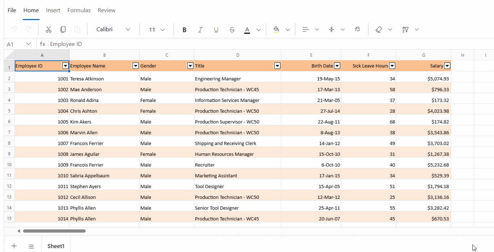

## Unprotect Workbook

The **Unprotect Workbook** support restores the ability to perform structural modifications, enabling actions such as inserting, deleting, renaming, moving, copying, hiding, or unhiding sheets.

To unprotect the workbook, follow these steps:

* Select **Unprotect Workbook** from the **Review** tab in the **Ribbon**.

* If a password was set during protection, enter the correct password in the dialog box, then click **OK** to unprotect the workbook. If no password was set, the workbook can be unprotected directly without entering a password.

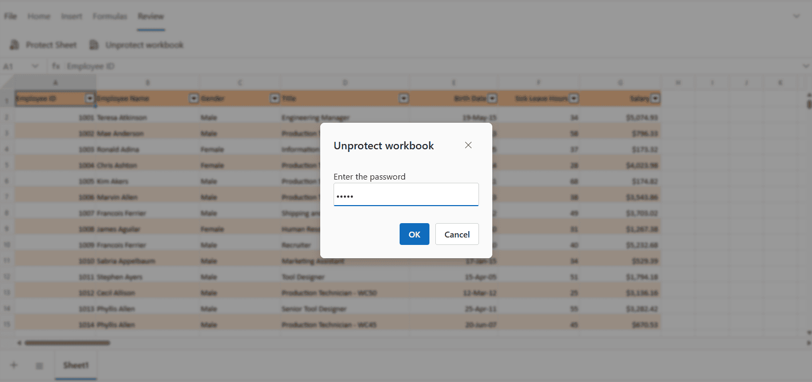