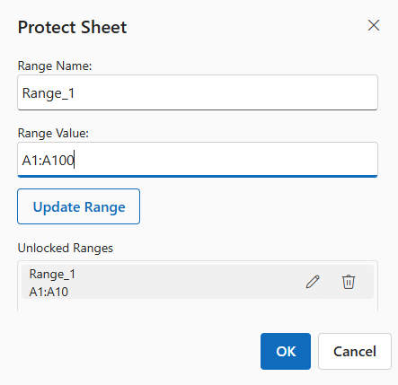

# Protect Sheet and Workbook in Blazor Spreadsheet component

Protection features in the Blazor Spreadsheet component safeguard data by restricting unauthorized modifications to sheets and workbooks. Sheet protection prevents accidental changes to cell content, while workbook protection limits structural modifications, such as inserting or renaming sheets. Both features support optional password protection and customizable permissions for specific actions, ensuring flexibility and security based on application requirements.

## Protect sheet

Sheet protection restricts modifications to a sheet’s content, such as editing or deleting data. Specific actions, like cell selection, filtering, sorting or formatting, can be permitted through configuration settings. Protection can be applied with or without a password, depending on the desired security level.

### Protecting sheets via UI

Sheet protection can be enabled through the user interface in the active sheet using one of the following methods:

* Select **Protect Sheet** from the **Review** tab in the Ribbon toolbar and choose the desired options.

* Right-click the sheet tab context menu option, select **Protect Sheet** from the context menu, and choose the desired options.

The dialog allows setting an optional password and selecting permitted actions.

### Unlock specific cells or ranges

Specific cells or ranges in a protected sheet can be unlocked to allow editing while maintaining restrictions on the rest of the sheet. This feature supports scenarios where selective data editing is required.

To unlock specific cells or ranges in a protected sheet, follow these steps:

* Open the **Protect Sheet** dialog from the **Review** tab or the sheet tab context menu.

* Navigate to the **Unlock Range** tab in the dialog.

* Select the desired cells or ranges that should remain editable.

* Confirm the settings and apply protection to the sheet.

To edit existing unlocked ranges:

* Locate the **Unlocked Ranges** list, which displays all currently unlocked ranges in the sheet.

* Hover over the desired range in the list to reveal the edit and delete icons.

* Click the **edit** icon to modify the range.

* Update the range name and value in the respective fields (e.g., changing "Range_1" with "A1:A10" to a new range such as "A1:A100").

* Click the **Update Range** button to save the changes, which applies the new range settings to the sheet.

To delete an existing unlocked range:

* Hover over the range in the **Unlocked Ranges** list to display the delete icon.

* Click the **delete** icon next to the range in the **Unlocked Ranges** list to remove it. Once deleted, the range is no longer considered unlocked and falls under the sheet's protection restrictions, preventing further editing.

When a sheet is protected, the following operations are permitted only for unlocked cells or ranges:

**Clipboard actions**: **Cut** operations are not permitted for either locked or unlocked cells in a protected sheet to prevent unintended data removal. **Copy** operations are permitted for both locked and unlocked cells, allowing duplication of content. **Paste** operations are permitted only in unlocked cells to prevent unintended modifications to protected areas. For example, copying a value from a locked cell and pasting it into an unlocked cell is supported, but pasting into a locked cell is prohibited.

**Autofill actions**: **Autofill**, which enables dragging cell content to fill adjacent cells with a pattern or sequence, is permitted only for unlocked cells. This ensures that protected data remains unchanged while allowing extension of data in designated editable areas.

**Cell editing**: Direct editing of cell content, such as typing new values or modifying existing data, is permitted only in unlocked cells. This maintains the integrity of protected cells.

**Formula bar editing**:  Editing cell content through the formula bar, including entering or modifying formulas, text, or values, is permitted only in unlocked cells. This prevents changes to protected cells.

**Clear actions**: **Clear All** and **Clear Contents**, which remove cell content, formatting, or both, are permitted only for unlocked cells. Clearing locked cells is prohibited to ensure protected data remains intact. 

These restrictions ensure that only designated unlocked areas can be modified, providing precise control over editable content in a protected sheet.

### Protection settings in a protected sheet

When a sheet is protected, most actions, such as formatting, inserting, sorting, and filtering, are restricted by default. However, specific actions can be enabled through the protection settings to allow controlled interaction with the sheet.

To enable specific functionalities while the sheet is protected:

* Open the **Protect Sheet** dialog from the **Review** tab.

* Go to the **Sheet Options** tab to view available protection settings.

* Select or deselect the desired options to allow or restrict specific actions.

* Click **OK** to apply the protection settings.

The available protection settings in Spreadsheet component include:

| Options | Description |
|------------------------|---------|
| Select Locked Cells | Permits selection of locked cells in the protected sheet. This option cannot be enabled alone. Enabling it automatically enables the option to select unlocked cells. |
| Select UnLocked Cells | Permits selection of unlocked cells in the protected sheet. |
| Format Cells | Permits formatting of cells, such as changing fonts or colors. |
| Format Rows | Permits formatting of rows, such as adjusting row height. |
| Format Columns | Permits formatting of columns, such as adjusting column width. |
| Insert Columns | Permits inserting new columns in the protected sheet. |
| Insert Rows | Permits inserting new rows in the protected sheet. |
| Insert Hyperlinks | Permits adding hyperlinks to unlocked cells in the protected sheet. |
| Sort | Permits sorting data in unlocked ranges within the protected sheet. |
| Filter | Permits applying filters to data in unlocked ranges within the protected sheet. |

## Unprotect Sheet

Unprotecting a sheet removes restrictions on actions previously limited by protection. After unprotecting, the sheet allows full interaction, including editing, formatting, inserting, and deleting content.

### Unprotecting sheets via UI

To unprotect a sheet, follow one of these methods:

* Select **Unprotect Sheet** from the **Review** tab in the Ribbon toolbar.

* Right-click the sheet tab context menu option and select **Unprotect Sheet** from the context menu, and enter the password if prompted.

If a password was set during protection, the correct password must be entered to unprotect the sheet. If no password was set, the sheet can be unprotected directly without entering a password.

## Protect Workbook

The **Protect Workbook** support restricts structural modifications within a workbook. Actions such as inserting, deleting, renaming, or hiding sheets are disabled when this protection is enabled. Protection can be configured with or without a password, depending on the desired level of security.

### Protecting workbooks via UI

To protect the workbook, follow these steps:

* Go to the **Review** tab in the Ribbon toolbar.

* Select **Protect Workbook**, enter and confirm the desired password, and then click **OK** to apply the protection.

## Unprotect Workbook

Unprotecting a workbook removes restrictions on structural modifications, enabling actions such as inserting, deleting, renaming, moving, copying, hiding, or unhiding sheets.

### Unprotecting workbooks via UI

To unprotect the workbook, follow these steps:

* Select **Unprotect Workbook** from the **Review** tab in the Ribbon toolbar.

* If a password was set during protection, enter the correct password in the dialog box, then click **OK** to unprotect the workbook. If no password was set, the workbook can be unprotected directly without entering a password.

