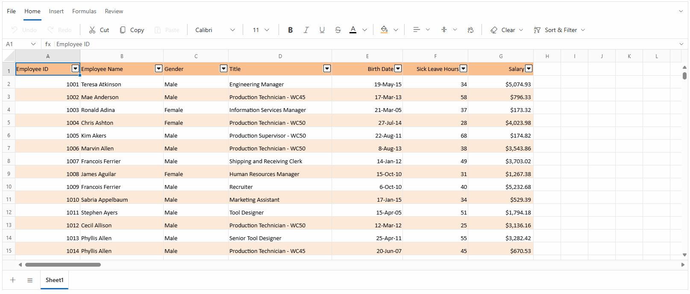

# Selection in Blazor Spreadsheet component

Selection in the Spreadsheet component enables interactive highlighting and manipulation of cells, rows, or columns for data analysis and editing operations. The selection functionality provides intuitive mouse and keyboard interactions for efficient data management.

## Selection operations

The Blazor Spreadsheet provides multiple selection options to manage and analyze data effectively:

* **Cell Selection** - Select individual cells or ranges of cells for data manipulation
* **Row Selection** - Select entire rows for row-based operations
* **Column Selection** - Select entire columns for column-based operations

**Accessing selection via the UI**

In the active sheet, selection can be performed using any of the following ways:

* **Using Mouse Interactions**:
   * Click to select individual cells
   * Click and drag to select ranges
   * Click row or column headers for full row or column selection

* **Using Keyboard Navigation**:
   * Use **Arrow keys** to navigate and select cells
   * Use **Shift + Arrow keys** for range selection
   * Use **Ctrl + click** for non-adjacent selections

* **Using Name Box**: Enter cell references or range names and press **Enter** key to select the specified range.
  

## Cell selection

The Blazor Spreadsheet component allows selecting individual cells or ranges of cells for various data operations. Cell selection forms the foundation of most Spreadsheet interactions and provides the basis for data entry and formatting.

Single cell selection allows focusing on a specific cell for data entry or formatting operations. Range selection enables selecting multiple adjacent cells for batch operations like formatting, data entry, or calculations. Multiple range selection allows selecting non-adjacent cells or ranges for operations that need to be applied to scattered data.

**Selecting ranges via the UI**

To select non-adjacent ranges:

* Select the first cell or range using any of the above ways
* Hold **Ctrl** and click additional cells or drag to select additional ranges
* Each selected range is highlighted independently
* The **Name Box** displays the first selected cell reference

## Row selection

Row selection enables selecting entire rows for operations like formatting, insertion. This selection type is particularly useful for working with complete records or data entries. Rows can be selected individually or in multiples.

**Selecting rows via the UI**

Row selection can be performed in the following methods:

* **Adjacent rows**: Click the first row header, then drag to the last desired row header
* **Adjacent rows with keyboard**: Click the first row header, then hold **Shift** key and click the last row header
* **Non-adjacent rows**: Hold **Ctrl** key while clicking individual row headers
* **Range with keyboard**: Use **Shift + Arrow keys** after selecting the initial row

## Column selection

Column selection allows selecting entire columns for operations like formatting, sorting. This selection type is essential for working with data fields or attributes.Columns can be selected individually or in multiples.

**Selecting columns via the UI**

Column selection can be performed in the following methods:

* **Adjacent columns**: Click the first column header, then drag to the last desired column header
* **Adjacent columns with keyboard**: Click the first column header, then hold **Shift** and click the last column header
* **Non-adjacent columns**: Hold **Ctrl** while clicking individual column headers
* **Range with keyboard**: Use **Shift + Arrow keys** after selecting the initial column

## Implementing selection programmatically

The Spreadsheet component supports comprehensive programmatic selection using the [SelectRangeAsync()](https://help.syncfusion.com/cr/blazor/Syncfusion.Blazor.Spreadsheet.SfSpreadsheet.html#Syncfusion_Blazor_Spreadsheet_SfSpreadsheet_SelectRangeAsync_System_String_) method. This method accepts various range formats and selection patterns.




@using Syncfusion.Blazor.Spreadsheet
@using Syncfusion.Blazor.Buttons

<SfButton OnClick="SelectRangeHandler" Content="Select Range"></SfButton>

<SfSpreadsheet DataSource="DataSourceBytes" @ref="@SpreadsheetRef">
    <SpreadsheetRibbon></SpreadsheetRibbon>
</SfSpreadsheet>

@code {

    public byte[] DataSourceBytes { get; set; }

    public SfSpreadsheet SpreadsheetRef { get; set; }

    protected override void OnInitialized()
    {
        string filePath = "wwwroot/Sample.xlsx";
        DataSourceBytes = File.ReadAllBytes(filePath);
    }

    public async Task SelectRangeHandler()
    {
        await SpreadsheetRef.SelectRangeAsync("A5:GR5");
    }
}




The following animation illustrates the comprehensive selection capabilities available in the Blazor Spreadsheet component, including cell, row and column selection using both mouse and keyboard interactions.

