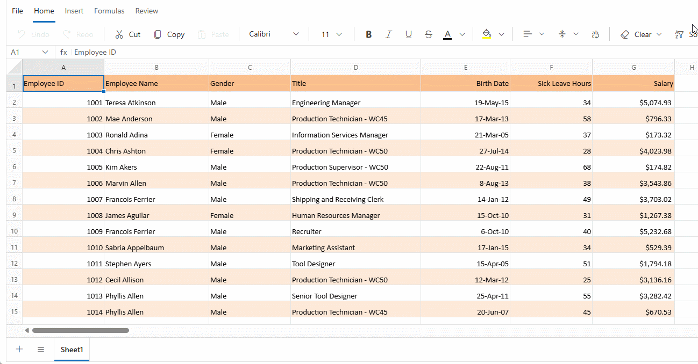

# Selection in Blazor Spreadsheet component

The selection feature in the Syncfusion Blazor Spreadsheet component provides essential functionality for interactive highlighting and manipulation of cells, rows, and columns. Selection serves as the foundation for most spreadsheet operations, including data entry, editing, formatting, and analysis. The feature supports multiple selection methods through intuitive mouse and keyboard interactions, enabling efficient data management across various workflow requirements. Selection capability in the Spreadsheet component accommodates diverse user preferences with support for single cells, contiguous ranges, and non-adjacent selections.

## Selection Types

The Blazor Spreadsheet provides multiple selection options to manage and analyze data effectively:

* **Cell Selection** - Precise targeting of individual cells or cell ranges for focused data entry and formatting operations. This selection type provides the most granular control over spreadsheet content.
* **Row Selection** - Facilitates the highlighting of entire rows for operations that affect complete records or data entries. This selection type streamlines working with horizontal data sets.
* **Column Selection** - Selects the entire columns when operations need to be applied to specific fields or attributes across multiple records. This selection type optimizes vertical data manipulation.

### Cell Selection

The Blazor Spreadsheet component allows selecting individual cells or ranges of cells for various data operations. Cell selection forms the foundation of most Spreadsheet interactions and serves as the basis for data entry and formatting.

The component supports four cell selection modes:

* **Single Cell Selection** - Focuses on an individual cell, establishing a precise target for data entry, formula creation, or formatting operations.
* **Multiple Cell Selection** - Selection of non-adjacent individual cells for applying identical operations across scattered data points. This selection mode enhances efficiency when working with distributed but related data.
* **Range Selection** - Selection of contiguous cell blocks, supporting batch operations on adjacent data. This selection mode optimizes workflows involving related data segments.
* **Multiple Range Selection** - Selection of non-adjacent cell ranges, allowing simultaneous operations on scattered data blocks. This advanced selection mode maximizes efficiency when working with complex data structures.

**Selecting cells via UI**

The Syncfusion Blazor Spreadsheet component provides three primary methods for selecting cells through the user interface:

* **Mouse Interactions**: The most intuitive and visual approach to selection, allowing direct clicking, dragging, and multi-selecting with modifier keys. This method provides immediate visual feedback and requires minimal technical knowledge.
* **Keyboard Shortcuts**: Efficient navigation and selection within spreadsheets, optimizing workflows for users who prefer keyboard-centric operation. These shortcuts significantly enhance productivity by minimizing hand movement between keyboard and mouse.
* **Name Box**: Precise targeting of specific cells or ranges by direct reference input. This method excels at navigating to and selecting distant or specifically named areas within large spreadsheets.

| Selection   | Mouse             | Keyboard | Name Box |
|-------------|-------------------|-------------|-------|
| Single Cell | Clicking on a cell | Navigating to a cell using arrow keys, Tab, Shift + Tab, Enter, Shift + Enter  | Entering a cell reference in the Name Box and press Enter |
| Multiple Cells | Selecting the first cell, then holding Ctrl while clicking additional cells | - | - |

| Selection   | Mouse             | Keyboard | Name Box |
|-------------|-------------------|-------------|-------|
| Range | Clicking and dragging across cells . Clicking a starting cell, then holding Shift and clicking an ending cell | Holding Shift and using arrow keys to extend selection from active cell | Entering a cell range in the Name Box and pressing Enter |
| Multiple Range | Selecting the first range, then holding Ctrl while selecting additional ranges. Each selected range is highlighted independently | - | - |

**Selecting cells programmatically**

The Syncfusion Blazor Spreadsheet component provides the ability to select cells programmatically using the [SelectRangeAsync](https://help.syncfusion.com/cr/blazor/Syncfusion.Blazor.Spreadsheet.SfSpreadsheet.html#Syncfusion_Blazor_Spreadsheet_SfSpreadsheet_SelectRangeAsync_System_String_) method. This method selects a range of cells in the active sheet.

| Parameter   | Type              | Description |
|-------------|-------------------|-------------|
| address | string (optional) | Specifies the target range address to select. The address parameter supports both single ranges (e.g., "A1:B5") and multiple non-adjacent ranges separated by spaces (e.g., "A1:A10 B1:B10 C1:C10"). If null or empty string is provided, no cells will be selected. |




@using Syncfusion.Blazor.Spreadsheet
@using Syncfusion.Blazor.Buttons

<button @onclick="SelectCell">Select Cell</button>
<button @onClick="SelectRange" >Select Range</button>
<button @onClick="SelectMultipleRange" >Select Range</button>

<SfSpreadsheet DataSource="DataSourceBytes" @ref="@SpreadsheetInstance">
    <SpreadsheetRibbon></SpreadsheetRibbon>
</SfSpreadsheet>

@code {

    public byte[] DataSourceBytes { get; set; }

    public SfSpreadsheet SpreadsheetInstance { get; set; }

    protected override void OnInitialized()
    {
        string filePath = "wwwroot/Sample.xlsx";
        DataSourceBytes = File.ReadAllBytes(filePath);
    }

    public async Task SelectCell()
    {
        // Select a single cell "A1" using SelectRangeAsync
        await SpreadsheetInstance.SelectRangeAsync("A1");
    }

    public async Task SelectRange()
    {
        // Select a contiguous cell range from A1 to C3
        await SpreadsheetInstance.SelectRangeAsync("A1:C3");
    }

    public async Task SelectMultipleRange()
    {
        // Select multiple non-adjacent ranges simultaneously
        await SpreadsheetInstance.SelectRangeAsync("A1:A10 B1:B10 C1:C10");
    }
}




### Row selection

The row selection feature allows entire rows to be selected for operations such as formatting or insertion. This selection type is especially useful when working with complete records or data entries. Rows can be selected individually or as multiple row groups.

**Selecting rows via UI**

The row selection operation can be performed using the following methods:

* **Single row** - Click directly on the row header to select the entire row. The row header and all cells in the row will be highlighted.
* **Adjacent rows**: Click the first row header, then drag to the last desired row header
* **Adjacent rows with keyboard**: Click the first row header, then hold **Shift** key and click the last row header
* **Non-adjacent rows**: Select multiple non-consecutive rows by holding the **Ctrl** key while clicking individual row headers
* **Range with keyboard**: After selecting an initial row, use **Shift + Up Arrow** or **Shift + Down Arrow** to extend the selection to adjacent rows

**Selecting rows programmatically**

The Syncfusion Blazor Spreadsheet component enables programmatic row selection through the [SelectRangeAsync](https://help.syncfusion.com/cr/blazor/Syncfusion.Blazor.Spreadsheet.SfSpreadsheet.html#Syncfusion_Blazor_Spreadsheet_SfSpreadsheet_SelectRangeAsync_System_String_) method. Programmatic row selection is beneficial for scenarios requiring automated data processing, batch operations, and integration with business logic.

| Parameter   | Type              | Description |
|-------------|-------------------|-------------|
| address | string (optional) | The address of the row range to select. For a single row, the range spans from column A to column GR (e.g., "A1:GR1" selects the first row completely). When working with spreadsheets that have custom column requirements, the end column reference can be adjusted accordingly (e.g., "A1:ZZ1" for 702 columns). Multiple non-adjacent rows can be selected by separating each row range with spaces (e.g., "A2:GR2 A5:GR5" selects rows 2 and 5). If null or empty string is provided, no cells will be selected. |




@using Syncfusion.Blazor.Spreadsheet
@using Syncfusion.Blazor.Buttons

<button @onclick="SelectRow">Select Row</button>
<button @onClick="SelectMultipleRow" >Select Multiple Row</button>

<SfSpreadsheet DataSource="DataSourceBytes" @ref="@SpreadsheetInstance">
    <SpreadsheetRibbon></SpreadsheetRibbon>
</SfSpreadsheet>

@code {

    public byte[] DataSourceBytes { get; set; }

    public SfSpreadsheet SpreadsheetInstance { get; set; }

    protected override void OnInitialized()
    {
        string filePath = "wwwroot/Sample.xlsx";
        DataSourceBytes = File.ReadAllBytes(filePath);
    }

    public async Task SelectRow()
    {
        // Select the entire first row using SelectRangeAsync
        // The range "A1:GR1" covers the first row from column A to column GR (maximum column)
        await SpreadsheetInstance.SelectRangeAsync("A1:GR1");
    }

    public async Task SelectMultipleRow()
    {
        // Select multiple non-adjacent rows (rows 2 and 5)
        await SpreadsheetInstance.SelectRangeAsync("A2:GR2 A5:GR5");
    }
}




### Column selection

The column selection feature allows entire column to be selected for operations such as formatting and sorting. This selection type is essential for working with data fields or attributes. Column can be selected individually or as multiple column groups.

**Selecting columns via UI**

The column selection operation can be performed using the following methods:

* **Single Column** - Click directly on the column header to select the entire column. The column header and all cells in the column will be highlighted.
* **Adjacent columns**: Clicking the first column header and dragging to the last desired column header.
* **Adjacent columns with keyboard**: Clicking the first column header, then holding **Shift** and clicking the last column header.
* **Non-adjacent columns**: Select multiple non-consecutive columns by holding **Ctrl** while clicking individual column headers.
* **Range with keyboard**: After selecting an initial column, use **Shift + Left Arrow** or **Shift + Right Arrow** to extend the selection to adjacent columns

**Selecting columns programmatically**

The Syncfusion Blazor Spreadsheet component facilitates programmatic column selection through the [SelectRangeAsync](https://help.syncfusion.com/cr/blazor/Syncfusion.Blazor.Spreadsheet.SfSpreadsheet.html#Syncfusion_Blazor_Spreadsheet_SfSpreadsheet_SelectRangeAsync_System_String_) method. This functionality enables precise control over column selection operations within applications, supporting data analysis workflows and automated processing tasks.

| Parameter   | Type              | Description |
|-------------|-------------------|-------------|
| address | string (optional) | The address of the range to select. For a single column, the range spans from the first row to a designated row number (e.g., "A1:A1000" selects the entire A column to row 1000). Multiple non-adjacent columns can be selected by separating each column range with spaces (e.g., "B1:B1000 D1:D1000" selects columns B and D). The row number should be adjusted based on the dataset size - for larger datasets with 10,000 rows, use "D1:D10000" to ensure the entire column is selected. If null or empty string is provided, no cells will be selected. |




@using Syncfusion.Blazor.Spreadsheet
@using Syncfusion.Blazor.Buttons

<button @onclick="SelectColumn">Select Column</button>
<button @onClick="SelectMultipleColumn" >Select Multiple Column</button>

<SfSpreadsheet DataSource="DataSourceBytes" @ref="@SpreadsheetInstance">
    <SpreadsheetRibbon></SpreadsheetRibbon>
</SfSpreadsheet>

@code {

    public byte[] DataSourceBytes { get; set; }

    public SfSpreadsheet SpreadsheetInstance { get; set; }

    protected override void OnInitialized()
    {
        string filePath = "wwwroot/Sample.xlsx";
        DataSourceBytes = File.ReadAllBytes(filePath);
    }

    public async Task SelectColumn()
    {
        // Select the entire column A. The range "A1:A1000" covers column A from row 1 to row 1000
        await SpreadsheetInstance.SelectRangeAsync("A1:A1000");
    }

    public async Task SelectMultipleColumn()
    {
        // Select multiple non-adjacent columns (B and D)
        // Each range spans from row 1 to row 1000 to ensure complete column selection
        await SpreadsheetInstance.SelectRangeAsync("B1:B1000 D1:D1000");
    }
}




N> The Select All operation highlights every cell in the active worksheet. This operation can be performed using the keyboard shortcut **Ctrl + A** or by clicking the Select All button located at the intersection of row and column headers in the top-left corner of the spreadsheet.
