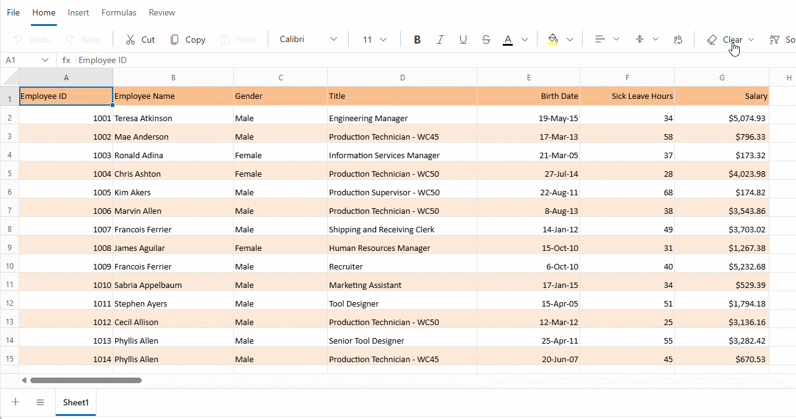

# Selection in Blazor Spreadsheet component

The Syncfusion Blazor Spreadsheet component offers powerful selection functionality that allows to interactively highlight and manipulate cells, rows, and columns. This feature serves as the backbone for key operations such as data entry, editing, formatting, and analysis.

Selections can be made using both mouse and keyboard inputs, enabling seamless and efficient data handling across various workflows. The Blazor Spreadsheet component supports multiple selection modes, including single cells, contiguous ranges, and non-contiguous selections, offering flexibility for diverse data manipulation tasks.

The Blazor Spreadsheet component supports multiple selection methods to facilitate efficient data management and analysis:

- **Cell Selection** – Enables selection of a single cell or a range of cells for performing data-related operations.
- **Row Selection** – Allows selection of entire rows to carry out row-specific tasks.
- **Column Selection** – Permits selection of entire columns for column-based actions.

**Accessing selection via UI**

In the active sheet, selection can be performed using any of the following ways:

* **Using Mouse Interaction**:
   * Click to select individual cells.
   * Click and drag to select ranges.
   * Click row or column headers for full row or column selection.

* **Using Keyboard Navigation**:
   * Use **Arrow** keys to navigate and select cells.
   * Use **Shift + Arrow** keys for range selection.
   * Use **Ctrl + Click** for non-adjacent selections.

* **Using Name Box**: Enter cell references or range names and press **Enter** key to select the specified range.

## Cell selection

The Blazor Spreadsheet component allows selecting individual cells or ranges of cells for various data operations. Cell selection forms the foundation of most Spreadsheet interactions and serves as the basis for data entry and formatting.

The single cell selection mode enables focus on a specific cell for data entry or formatting tasks. Range selection allows multiple adjacent cells to be selected for batch operations, such as formatting, data entry, or calculations. Multiple range selection supports the selection of non-adjacent cells or ranges, facilitating operations on scattered data within the sheet.

- **Single Cell Selection** focuses on a specific cell for targeted operations.
- **Range Selection** allows selection of multiple adjacent cells for batch operations.
- **Multiple Range Selection** enables selection of non-adjacent cells or ranges for applying operations across scattered data or non-contiguous data within the sheet.

N> The **Select All** operation highlights all cells in the active worksheet. To perform this operation, press the keyboard shortcut **Ctrl+A** or click the **Select All** button at the intersection of the row and column headers in the top-left corner of the worksheet.

**Selecting ranges via UI**

* Select the first cell or range using mouse or keyboard.
* Hold **Ctrl** and click or drag to select additional cells or ranges.
* Each selected range is highlighted independently.
* The **Name Box** displays the first selected cell reference.

## Row selection

Row selection allows entire rows to be selected for operations such as formatting, insertion, or deletion. This method is useful when working with complete records or structured data entries.

**Selecting rows via UI**

Row selection can be performed using the following methods:

- **Adjacent Rows**: Click the first row header, then drag to the last desired row header.
- **Adjacent Rows with Keyboard**: Click the first row header, then hold **Shift** and click the last row header.
- **Non-Adjacent Rows**: Hold **Ctrl** while clicking individual row headers.
- **Range with Keyboard**: Use **Shift + Arrow** keys after selecting the initial row.

## Column selection

Column selection enables entire columns to be selected for operations such as formatting, sorting, or applying formulas. This method is essential when working with data fields or attributes.

**Selecting columns via UI**

Column selection can be performed using the following methods:

- **Adjacent Columns**: Click the first column header, then drag to the last desired column header.
- **Adjacent Columns with Keyboard**: Click the first column header, then hold **Shift** and click the last column header.
- **Non-Adjacent Columns**: Hold **Ctrl** while clicking individual column headers.
- **Range with Keyboard**: Use **Shift + Arrow** keys after selecting the initial column.

## Selection via programmatically

Selection can be performed programmatically through the [SelectRangeAsync](https://help.syncfusion.com/cr/blazor/Syncfusion.Blazor.Spreadsheet.SfSpreadsheet.html#Syncfusion_Blazor_Spreadsheet_SfSpreadsheet_SelectRangeAsync_System_String_) method. Programmatic selection is beneficial for scenarios requiring automated data processing, batch operations, and integration with business logic. The available parameter in the `SelectRangeAsync` method are:

| Parameter   | Type              | Description |
|-------------|-------------------|-------------|
| address | string (optional) | Specifies the target range to be selected within the active sheet. This parameter accepts various address formats, including a single cell such as **"A1"**, a contiguous range such as **"A1:B5"**, and multiple non-contiguous ranges separated by spaces, such as **"A1:B5 D1:E5"**. To select an entire row, use a format like **"A1:GR1"**, which selects the first row across the default 200 columns. To select an entire column, use a format like **"A1:A1000"**, which selects Column A across the default 1000 rows. These default limits may vary depending on the `ColumnCount` or `RowCount` settings, or the data present in the Spreadsheet. If the value is null or an empty string, no selection will occur. If an invalid entry is provided, the operation will be ignored without generating an error. |




@using Syncfusion.Blazor.Spreadsheet
@using Syncfusion.Blazor.Buttons

<SfButton OnClick="SelectRange" Content="Select Range"></SfButton>

<SfSpreadsheet DataSource="DataSourceBytes" @ref="@SpreadsheetInstance">
    <SpreadsheetRibbon></SpreadsheetRibbon>
</SfSpreadsheet>

@code {
    public byte[] DataSourceBytes { get; set; }
    public SfSpreadsheet SpreadsheetInstance { get; set; }

    protected override void OnInitialized()
    {
        string filePath = "wwwroot/Sample.xlsx";
        DataSourceBytes = File.ReadAllBytes(filePath);
    }

    public async Task SelectRange()
    {
        // Selects a contiguous range of cells from A1 to C3.
        await SpreadsheetInstance.SelectRangeAsync("A1:C3");

        // Selects the entire first row, spanning Columns A through GR (maximum column supported).
        await SpreadsheetInstance.SelectRangeAsync("A1:GR1");

        // Selects the entire Column A, covering rows 1 through 1000.
        await SpreadsheetInstance.SelectRangeAsync("A1:A1000");
    }
}




## Events

The Syncfusion Blazor Spreadsheet component includes the [Selected](https://help.syncfusion.com/cr/blazor/Syncfusion.Blazor.Spreadsheet.SpreadsheetEvents.html#Syncfusion_Blazor_Spreadsheet_SpreadsheetEvents_Selected) event, which is triggered automatically after a selection is made—either through user interface(UI) or programmatically via the `SelectRangeAsync` method. This event enables the execution of custom logic when there is a change in the selection of cells, rows, or columns. The associated [SelectedEventArgs](https://help.syncfusion.com/cr/blazor/Syncfusion.Blazor.Spreadsheet.SelectedEventArgs.html) object provides details about the selected range, enabling functionalities such as tracking selection patterns, applying validation rules, updating related UI elements, initiating data analysis, and integrating with external systems.

| Event Arguments | Description |
|----------------|-------------|
| Range | Gets the range of cells that have been selected. The format of the returned value can vary, including a single cell such as **"SheetName!A1"**, a cell range such as **"SheetName!A1:B10"**, a column selection such as **"SheetName!A1:A1000"**, or multiple column selections such as **"SheetName!A1:A1000 B1:B1000"**. Row selections are represented using formats like for a single row or **"SheetName!A1:GR1 A2:GR2"** for multiple rows. An entire sheet selection is indicated by a format such as **"SheetName!A1:GR1000"**. Mixed selections involving columns, rows, and individual cells are also supported, for example **"SheetName!A1:GP1 D1:D1000 A5:G5"**. |



 
@using Syncfusion.Blazor.Spreadsheet

<SfSpreadsheet DataSource="DataSourceBytes">
    <SpreadsheetRibbon></SpreadsheetRibbon>
    <SpreadsheetEvents Selected="OnSelected"></SpreadsheetEvents>
</SfSpreadsheet>
 
@code {
    public byte[] DataSourceBytes { get; set; }   

    protected override void OnInitialized()
    {
        string filePath = "wwwroot/Sample.xlsx";
        DataSourceBytes = File.ReadAllBytes(filePath);
    }

    public void OnSelected(SelectedEventArgs args)
    {
        // Prints the selected range.
        Console.WriteLine($"Selected Range: {args.Range}");
    }
}
 


