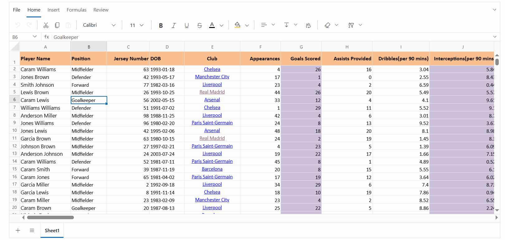

# Sorting in Blazor Spreadsheet component

Sorting in the [Blazor Spreadsheet](https://www.syncfusion.com/blazor-components/blazor-spreadsheet) component enables organizing data in a meaningful order, allowing for better data analysis and presentation. The Blazor Spreadsheet component provides comprehensive sorting capabilities for worksheet data in ascending or descending order.

To control the sorting functionality, the [AllowSorting](https://help.syncfusion.com/cr/blazor/Syncfusion.Blazor.Spreadsheet.SfSpreadsheet.html#Syncfusion_Blazor_Spreadsheet_SfSpreadsheet_AllowSorting) property can be used to enable or disable sorting operations in the Spreadsheet. The default value of the `AllowSorting` property is **true**.

## Sort operations

The Spreadsheet component offers two sorting orders:

* **Ascending** - Arranges data from lowest to highest (A to Z, 0 to 9).
* **Descending** - Arranges data from highest to lowest (Z to A, 9 to 0).

### Sort by active cell

The sort operation uses the column of the active cell as the primary sort criterion. When sorting is applied, the Spreadsheet component sorts all related data based on the values in the active cell's column, maintaining row integrity even when only a specific range is selected.

### Performing sort operations via the UI

In the active sheet, select the cell range to be sorted. Sorting can be performed using any of the following methods:

* **Using Ribbon Toolbar**:
   * Select the **Sort & Filter** icon from the **Home** tab
   * Click **Ascending** or **Descending**

   

* **Using Context Menu**:
   * Right-click the selected range
   * Choose **Sort** > **Ascending** or **Descending**

   

The following image illustrates basic sorting operations in the Spreadsheet component, showing how data can be organized in ascending or descending order while maintaining row relationships.

