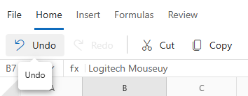

# Undo and Redo in Blazor Spreadsheet component

The Undo and Redo functionality in the Blazor Spreadsheet allows developers to reverse and reapply recent actions. This feature maintains a history of spreadsheet operations, enabling safe experimentation with data and formatting while having the ability to restore previous states. The system supports all major spreadsheet operations including cell editing, formatting, structure changes, and data manipulation.

The keyboard shortcuts `Ctrl + Z` for undo and `Ctrl + Y` for redo  providing immediate access to these functions without using the UI elements.

N> The undo/redo history maintains up to 25 operations to optimize memory usage. When this limit is reached, the oldest operations are automatically removed. Additionally, both undo and redo stacks are cleared when worksheet protection is applied.

## Undo

The Undo operation reverses the most recent action performed in the spreadsheet. This feature restores the spreadsheet to its previous state, ensuring safe modification of content and formatting.

### Performing undo operation via UI

The undo operation can be performed through the user interface in the following ways:

* Click the **Undo** button in the **Home** tab of the Ribbon toolbar to reverse the most recent operation.

* Use the keyboard shortcut `Ctrl + Z` to quickly undo the last operation.

N> The **Undo** button is automatically disabled when no operations are available to undo or during cell editing mode to prevent conflicts with the editing operation.

## Redo

The Redo operation reapplies an action that was previously undone. This functionality allows progression through the operation history and restores both data and user interface states.

### Performing redo operation via UI

The redo operation can be performed through the user interface in the following ways:

* Click the **Redo** button in the **Home** tab of the Ribbon toolbar to reapply the most recently undone operation.

* Use the keyboard shortcut `Ctrl + Y` to quickly redo the last undone operation.

N> The **Redo** button is automatically disabled when no operations are available to redo or during cell editing mode. Additionally, the redo history is cleared whenever a new operation is performed after an undo.

## Supported operations

The Undo and Redo system supports a wide range of spreadsheet operations. Each operation preserves context such as sheet position, scroll location, and cell selection to ensure accurate restoration.

### Cell operations

* **Cell Value Changes** - Text, numbers, formulas, and range-based value modifications
* **Cell Formatting** - Background colors, font colors, and number format changes
* **Text Styling** - Bold, italic, underline, and strikethrough formatting
* **Cell Alignment** - Horizontal and vertical alignment adjustments
* **Text Wrapping** - Wrap text setting changes
* **Font Properties** - Font family and size modifications

### Structure operations

* **Row Operations** - Row insertion and deletion with proper index management
* **Column Operations** - Column insertion and deletion with dimension updates
* **Resize Operations** - Row height and column width adjustments with image position updates

### Data operations

* **Clipboard Operations** - Cut, copy, and paste actions with comprehensive state preservation
* **Clear Operations** - Content clearing, format clearing, and selective clearing options
* **Autofill Operations** - Pattern-based cell filling with range extension
* **Sort Operations** - Data sorting with original order preservation
* **Filter Operations** - Data filtering with state and visibility management

### Advanced operations

* **Hyperlink Management** - Hyperlink insertion, editing, and removal
* **Image Operations** - Image insertion, positioning, and manipulation
* **Named Range Operations** - Named range creation, modification, and deletion

Each operation automatically preserves the necessary context including sheet position, scroll location, and cell selection to ensure accurate restoration.

