# Worksheet in Blazor Spreadsheet component

A worksheet is a collection of cells organized in the form of rows and columns that allows for storing, formatting, and manipulating data. This feature supports data organization across multiple sheets, making it suitable for scenarios like managing department-wise records, financial reports, or project data in separate sheets.

N> If the workbook is protected, operations like inserting, deleting, renaming, hiding, unhiding, moving, or duplicating sheets are disabled through both the user interface (UI) and code. To know more about workbook protection, refer [here](./protection#protect-workbook).

## Insert sheet

The Insert sheet feature in the Syncfusion Blazor Spreadsheet component allows adding new sheets to a workbook, enabling better organization of data across multiple sheets. This feature can be accessed through the user interface (UI) or programmatically, offering flexibility based on the application's requirements.

### Insert sheet via UI

To add or insert a new sheet using the UI, follow these steps:

* Click the `+` icon button in the **Sheet** tab. This will insert a new empty sheet next to current active sheet.
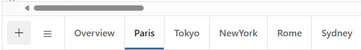

* Right click on a **Sheet** tab, and then select **Insert** option from the context menu to insert a new empty sheet after the current active sheet.
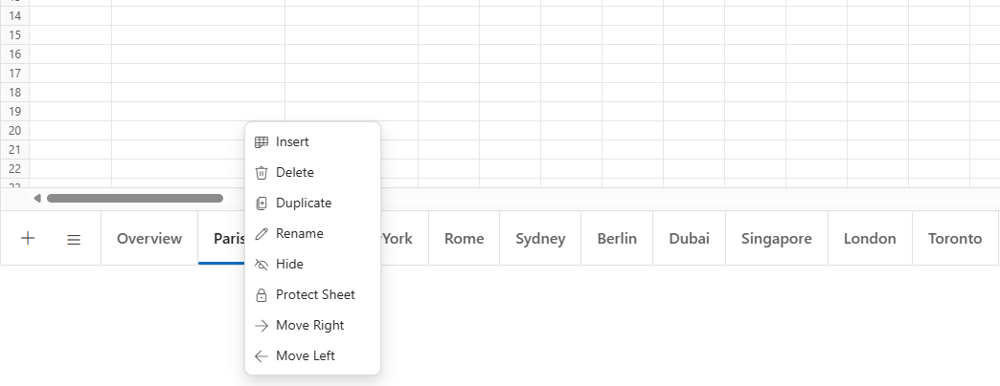

### Insert sheet programmatically

The [InsertSheetAsync()](https://help.syncfusion.com/cr/blazor/Syncfusion.Blazor.Spreadsheet.SfSpreadsheet.html#Syncfusion_Blazor_Spreadsheet_SfSpreadsheet_InsertSheetAsync_System_Nullable_System_Int32__System_Nullable_System_Int32__) method allows adding one or more sheets to a workbook using code. It supports two main scenarios: adding multiple sheets with default names or adding a single sheet with a user-defined name. Below are the details for each scenario, including code examples and parameter information.

**Insert multiple sheets at a specific index**

This method inserts one or more sheets at a specified position in the workbook with default names (e.g., Sheet1, Sheet2). For example, if the spreadsheet has three sheets named Sheet1, Sheet2, and Sheet3, adding two sheets at position 1 results in: Sheet1, Sheet4, Sheet5, Sheet2, Sheet3. If no position is provided, the sheets are added based on active sheet index. This is ideal for scenarios requiring multiple sheets, such as organizing large datasets or creating templates for repetitive tasks.

| Parameter | Type | Description |
| -- | -- | -- |
| index | int (optional) | The zero-based index where the sheets will be inserted. If not specified, sheets are added based on active sheet index. If the specified index is invalid (e.g., negative or beyond the workbook's sheet count), no action occurs. |
| count | int (optional) | The number of sheets to add. Defaults to 1 if not specified. |




@using Syncfusion.Blazor.Spreadsheet

<button @onclick="InsertSheetHandler">Insert Sheet</button>

<SfSpreadsheet @ref=SpreadsheetRef DataSource="DataSourceBytes">
    <SpreadsheetRibbon></SpreadsheetRibbon>
</SfSpreadsheet>

@code {

    public byte[] DataSourceBytes { get; set; }
    public SfSpreadsheet SpreadsheetRef;

    protected override void OnInitialized()
    {
        string filePath = "wwwroot/Sample.xlsx";
        DataSourceBytes = File.ReadAllBytes(filePath);
    }

    public async Task InsertSheetHandler()
    {
        // // Insert 2 sheets at index 1.
        await SpreadsheetRef.InsertSheetAsync(1,2);
    }
}




**Insert a single sheet with a user-defined name**

This method adds one sheet at a specific position with a user-defined name. Each call to this method adds only one sheet. Using meaningful names like "Budget" or "Inventory" makes the workbook easier to understand. If a negative index value is provided, the method will exit without adding any sheet.

| Parameter | Type | Description |
| -- | -- | -- |
| index | int | The zero-based index where the sheet will be inserted. If the specified index is invalid (e.g., negative or beyond the workbook's sheet count), no action occurs. |
| sheetName | string | The name for the new sheet. If the name already exist in workbook, no action occurs. |




@using Syncfusion.Blazor.Spreadsheet

<button @onclick="InsertSheetHandler">Insert Sheet</button>

<SfSpreadsheet @ref=SpreadsheetRef DataSource="DataSourceBytes">
    <SpreadsheetRibbon></SpreadsheetRibbon>
</SfSpreadsheet>

@code {

    public byte[] DataSourceBytes { get; set; }
    public SfSpreadsheet SpreadsheetRef;

    protected override void OnInitialized()
    {
        string filePath = "wwwroot/Sample.xlsx";
        DataSourceBytes = File.ReadAllBytes(filePath);
    }

    public async Task InsertSheetHandler()
    {
        // Insert a sheet at index 1 with a user-defined name.
        await SpreadsheetRef.InsertSheetAsync(1, "Sales");
    }
}




## Delete sheet

The Spreadsheet component supports removing sheets from a spreadsheet. When the workbook contains only one sheet, the delete option is disabled in the interface, and no action occurs during programmatic deletion attempts. Sheets can be deleted using the interface or programmatically, based on application requirements.

### Delete sheet via UI

To remove a sheet using the interface, follow these steps:

* Right click on a **Sheet** tab, and then select **Delete** option from context menu.

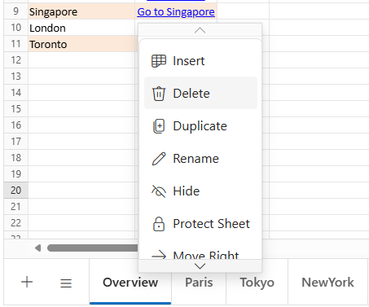

* Click **OK** in the confirmation dialog to delete the sheet.

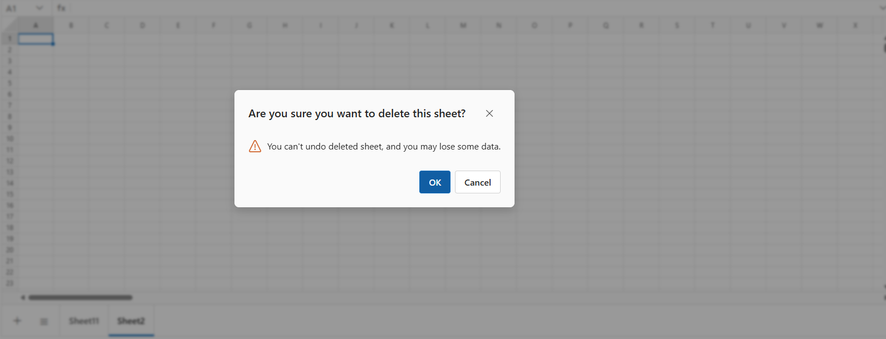

### Delete sheet programmatically

Sheets can be deleted at a specific index using the [DeleteSheetAsync()](https://help.syncfusion.com/cr/blazor/Syncfusion.Blazor.Spreadsheet.SfSpreadsheet.html#Syncfusion_Blazor_Spreadsheet_SfSpreadsheet_DeleteSheetAsync_System_Nullable_System_Int32__) method. It supports two main scenarios: delete sheet by index or delete sheet by name. Below are the details for each scenario, including code examples and parameter information.

**Delete sheet by index**

This method removes a sheet from a specific position. It works best when the sheet location in the workbook is known, such as when removing the first or last sheet through code. If no position is specified, the current active sheet gets deleted.

| Parameter | Type | Description |
| -- | -- | -- |
| index | int (optional) | The zero-based index of the sheet to delete. If no index is provided, the active sheet is deleted. If the index is invalid (e.g., negative or beyond the workbook's sheet count) or the workbook has only one sheet, no action occurs. |




@using Syncfusion.Blazor.Spreadsheet

<button @onclick="DeleteSheetHandler">Delete Sheet</button>

<SfSpreadsheet @ref=SpreadsheetRef DataSource="DataSourceBytes">
    <SpreadsheetRibbon></SpreadsheetRibbon>
</SfSpreadsheet>

@code {

    public byte[] DataSourceBytes { get; set; }
    public SfSpreadsheet SpreadsheetRef;

    protected override void OnInitialized()
    {
        string filePath = "wwwroot/Sample.xlsx";
        DataSourceBytes = File.ReadAllBytes(filePath);
    }

    public async Task DeleteSheetHandler()
    {
        // Remove sheet at index 0.
        await SpreadsheetRef.DeleteSheetAsync(0);
    }
}




**Delete sheet by name**

This method removes a sheet that matches the given name. It helps when the exact sheet name is known, like when deleting sheets called "Budget" or "Sales". No sheets will be deleted if only one sheet exists in the workbook. The method also won't delete any sheets if the provided name is invalid.

| Parameter | Type | Description |
| -- | -- | -- |
| sheetName | string | The name of the sheet to delete. If the name does not exist or the workbook has only one sheet, no action occurs. |




@using Syncfusion.Blazor.Spreadsheet

<button @onclick="DeleteSheetHandler">Delete Sheet</button>

<SfSpreadsheet @ref=SpreadsheetRef DataSource="DataSourceBytes">
    <SpreadsheetRibbon></SpreadsheetRibbon>
</SfSpreadsheet>

@code {

    public byte[] DataSourceBytes { get; set; }
    public SfSpreadsheet SpreadsheetRef;

    protected override void OnInitialized()
    {
        string filePath = "wwwroot/Sample.xlsx";
        DataSourceBytes = File.ReadAllBytes(filePath);
    }

    public async Task DeleteSheetHandler()
    {
        // Remove sheet named "Sales".
        await SpreadsheetRef.DeleteSheetAsync("Sales");
    }
}




## Rename sheet

The Rename Sheet feature allows assigning user-defined names to sheets for better organization. Sheet names must be unique within the workbook, and renaming does not affect data or formulas. This feature is essential for improving workbook clarity, especially in complex workbooks with multiple sheets.

To rename a sheet:

* Right-click a **Sheet** tab and select **Rename** from the context menu.

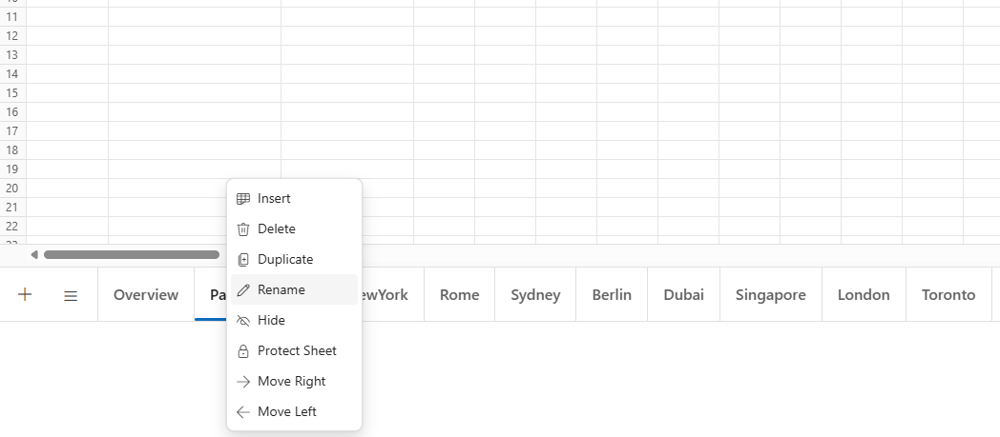

*  Enter a new name and click **update** to confirm.

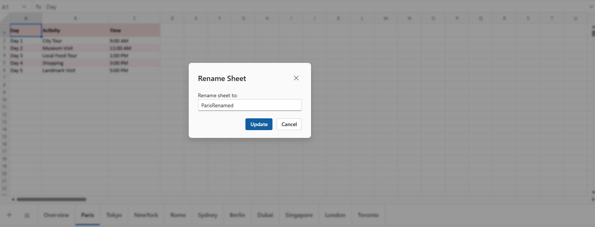

## Hide sheet

Hiding sheets in the Spreadsheet component prevents unauthorized access or accidental changes. Hidden sheets remain in the workbook, retaining all data, formulas, and functionality, but are not visible in the interface.

To hide a sheet:

* Right-click a **Sheet** tab and select the **Hide** option from the context menu. 

**Notes**

* The **Hide** option is available only if the workbook has more than one visible sheet, ensuring at least one sheet remains visible.

* Hidden sheets can still be referenced in formulas and calculations.

* Access the sheet selection menu to view all sheets, including hidden ones.

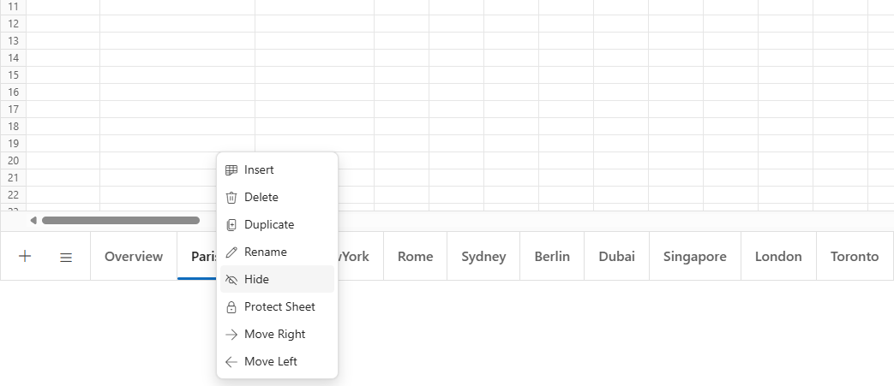

## Unhide sheet

The Spreadsheet component allows restoring hidden sheets to view. Hidden sheets appear in a disabled state within the sheet selection menu. 

To make a hidden sheet visible again:

* Click on the **Sheet** tab list icon and then click the hidden sheet. 

The sheet will reappear in the sheet tab collection and become available for editing.

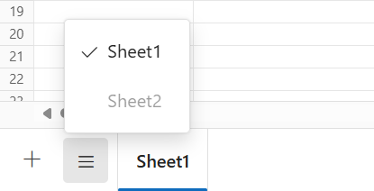

## Move sheet

The Spreadsheet component allows reordering sheets by moving them to different positions within the workbook. This feature helps organize sheets in a preferred sequence for better navigation and workflow efficiency. Sheets can be moved using the interface or programmatically, based on application needs.

### Move sheet via UI

To move a sheet using the interface, follow these steps:

* Click and hold on a **Sheet** tab, then drag it to the desired position.

* Right click on a **Sheet** tab and select **Move Left** or **Move Right** options from the context menu to reposition the sheet accordingly.

**Move Right** is enabled only if a sheet exists to the right, and **Move Left** is enabled only if a sheet exists to the left.

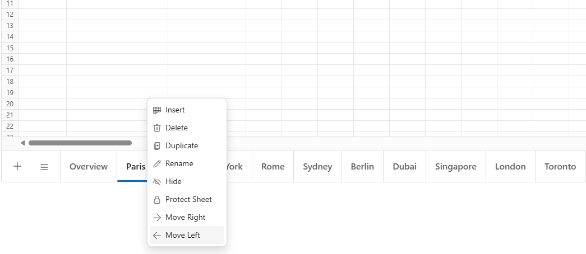
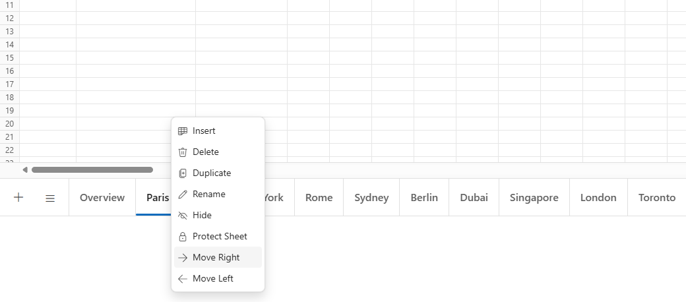

### Move sheet programmatically

The [MoveSheetAsync()](https://help.syncfusion.com/cr/blazor/Syncfusion.Blazor.Spreadsheet.SfSpreadsheet.html#Syncfusion_Blazor_Spreadsheet_SfSpreadsheet_MoveSheetAsync_System_Nullable_System_Int32__System_Int32_) method moves a sheet from one index to another programmatically. This method requires two parameters: the current zero-based index of the sheet to move and the destination zero-based index where the sheet will be placed. If either index is invalid (negative or beyond the sheet count), the method will not perform any action.

| Parameter | Type | Description |
| -- | -- | -- |
| sourceIndex | int | The zero-based index of the sheet to move. If invalid (e.g., negative or beyond sheet count), no action occurs. |
| destinationIndex | int | The zero-based index where the sheet will be moved. If invalid, no action occurs. |




@using Syncfusion.Blazor.Spreadsheet

<button @onclick="MoveSheetHandler">Move Sheet</button>

<SfSpreadsheet @ref=SpreadsheetRef DataSource="DataSourceBytes">
    <SpreadsheetRibbon></SpreadsheetRibbon>
</SfSpreadsheet>

@code {

    public byte[] DataSourceBytes { get; set; }
    public SfSpreadsheet SpreadsheetRef;

    protected override void OnInitialized()
    {
        string filePath = "wwwroot/Sample.xlsx";
        DataSourceBytes = File.ReadAllBytes(filePath);
    }

    public async Task MoveSheetHandler()
    {
        // Move sheet from index 0 to index 2.
        await SpreadsheetRef.MoveSheetAsync(0, 2);
    }
}




## Duplicate sheet

The Spreadsheet component allows creating an exact copy of a sheet, including all data, formatting, formulas, and styling. Duplicating a sheet is useful for creating multiple sheets with similar content or structure. The duplicated sheet is inserted immediately after the original sheet and is assigned a unique name, typically appending a number (e.g., "Sheet1" becomes "Sheet1 (2)"). Sheet duplication can be performed through the user interface (UI) or programmatically, depending on application needs.

### Duplicate sheet via UI

To duplicate a sheet using the interface, follow these steps:

* Right click on a **Sheet** tab that needs to be duplicated and select **Duplicate** option from the context menu.

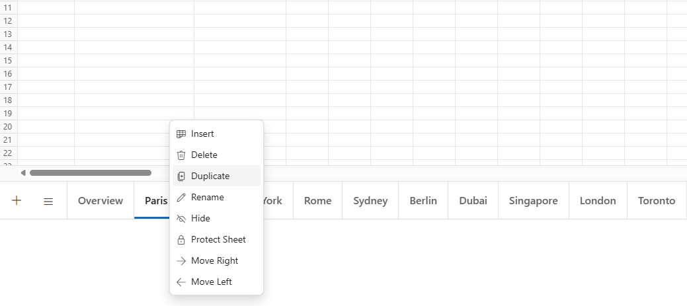

### Duplicate sheet programmatically

The [DuplicateSheetAsync()](https://help.syncfusion.com/cr/blazor/Syncfusion.Blazor.Spreadsheet.SfSpreadsheet.html#Syncfusion_Blazor_Spreadsheet_SfSpreadsheet_DuplicateSheetAsync_System_Nullable_System_Int32__) method allows duplicating a sheet programmatically by specifying its index or name. The duplicated sheet is inserted immediately after the original sheet. Below are details for duplicating a sheet by index or by name, including parameter information and code examples.

**Duplicate sheet by index**

This method creates a copy of the sheet at the specified index. If no index is provided, the active sheet is duplicated. This is useful when the position of the sheet in the workbook is known.

| Parameter | Type | Description |
| -- | -- | -- |
| index | int (optional) | The zero-based index of the sheet to duplicate. If no index is provided, the active sheet is duplicated. If the index is invalid (e.g., negative or beyond sheet count), no action occurs. |




@using Syncfusion.Blazor.Spreadsheet

<button @onclick="DuplicateSheetHandler">Duplicate Sheet</button>

<SfSpreadsheet @ref=SpreadsheetRef DataSource="DataSourceBytes">
    <SpreadsheetRibbon></SpreadsheetRibbon>
</SfSpreadsheet>

@code {

    public byte[] DataSourceBytes { get; set; }
    public SfSpreadsheet SpreadsheetRef;

    protected override void OnInitialized()
    {
        string filePath = "wwwroot/Sample.xlsx";
        DataSourceBytes = File.ReadAllBytes(filePath);
    }

    public async Task DuplicateSheetHandler()
    {
        // Duplicate the sheet at index 0.
        await SpreadsheetRef.DuplicateSheetAsync(0);
    }
}




**Duplicate sheet by name**

This method creates a copy of the sheet with the specified name. The sheet name matching is case-insensitive. This is useful when the exact sheet name is known, such as duplicating a sheet named "Budget" or "Sales".

| Parameter | Type | Description |
| -- | -- | -- |
| sheetName | string | The name of the sheet to duplicate. If the name does not exist, no action occurs. |




@using Syncfusion.Blazor.Spreadsheet

<button @onclick="DuplicateSheetHandler">Duplicate Sheet</button>

<SfSpreadsheet @ref=SpreadsheetRef DataSource="DataSourceBytes">
    <SpreadsheetRibbon></SpreadsheetRibbon>
</SfSpreadsheet>

@code {

    public byte[] DataSourceBytes { get; set; }
    public SfSpreadsheet SpreadsheetRef;

    protected override void OnInitialized()
    {
        string filePath = "wwwroot/Sample.xlsx";
        DataSourceBytes = File.ReadAllBytes(filePath);
    }

    public async Task DuplicateSheetHandler()
    {
        // Duplicate the sheet named "Sheet1".
        await SpreadsheetRef.DuplicateSheetAsync("Sheet1");
    }
}


