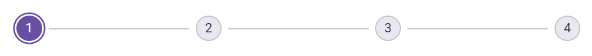

# Animation in Blazor Stepper Component

The Stepper progress state can be animated, smoothly transitioning from one step to another. You can customize the animation's `Duration` and `Delay` by using the [StepperAnimationSettings](https://help.syncfusion.com/cr/blazor/Syncfusion.Blazor.Navigations.StepperAnimationSettings.html) tag directive.

You can disable the animation by setting the [Enable](https://help.syncfusion.com/cr/blazor/Syncfusion.Blazor.Navigations.StepperAnimationSettings.html#Syncfusion_Blazor_Navigations_StepperAnimationSettings_Enable) property to `false`. By default, the value is `true`.

| Fields | Type | Description |
|------|------|-------------|
| [Duration](https://help.syncfusion.com/cr/blazor/Syncfusion.Blazor.Navigations.StepperAnimationSettings.html#Syncfusion_Blazor_Navigations_StepperAnimationSettings_Duration) | `number` | Specifies the duration of the animated transition for each step. The default value is `2000` milliseconds. |
| [Delay](https://help.syncfusion.com/cr/blazor/Syncfusion.Blazor.Navigations.StepperAnimationSettings.html#Syncfusion_Blazor_Navigations_StepperAnimationSettings_Delay) | `number` | Specifies the delay to initiate the animated transition for each step in milliseconds. The default value is `0`. |

The example demonstrates the animation `Duration` and `Delay` settings for the Stepper.

```cshtml
@using Syncfusion.Blazor.Navigations
<SfStepper>
    <StepperSteps>
        <StepperStep></StepperStep>
        <StepperStep></StepperStep>
        <StepperStep></StepperStep>
        <StepperStep></StepperStep>
    </StepperSteps>
    <StepperAnimationSettings Enable=true Delay="500" Duration="2000"></StepperAnimationSettings>
</SfStepper>
```

