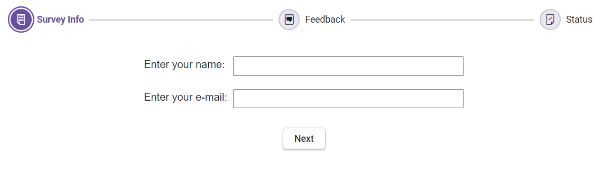

# Steps Validation in Blazor Stepper Component

The Stepper component allows setting the validation state for each step, displaying either a success or error icon. Define the success state of a step by setting the [`IsValid`](https://help.syncfusion.com/cr/blazor/Syncfusion.Blazor.Navigations.StepperStep.html#Syncfusion_Blazor_Navigations_StepperStep_IsValid) property to `true`. If set to `false`, the step displays an error state. By default, the `IsValid` property is `null`.

> Based on the `StepType`, the validation state icon will be displayed either as an indicator or as part of the step label/text.

```cshtml

@using Syncfusion.Blazor.Navigations

<SfStepper>
    <StepperSteps>
        <StepperStep IconCss="sf-icon-cart" IsValid="true"></StepperStep>        
        <StepperStep IconCss="sf-icon-transport"></StepperStep>
        <StepperStep IconCss="sf-icon-payment" IsValid="false"></StepperStep>
        <StepperStep IconCss="sf-icon-success"></StepperStep>
    </StepperSteps>
</SfStepper>

<SfStepper ID="labelStepper">
    <StepperSteps>
        <StepperStep Label="Cart" IsValid="true"></StepperStep>
        <StepperStep Label="Address"></StepperStep>
        <StepperStep Label="Payment" IsValid="false"></StepperStep>
        <StepperStep Label="Confirmation"></StepperStep>
    </StepperSteps>
</SfStepper>

<style>
    @@font-face {
        font-family: 'Default';
        src:
        url(data:application/x-font-ttf;charset=utf-8;base64,AAEAAAAKAIAAAwAgT1MvMj1vSgcAAAEoAAAAVmNtYXCDeIPaAAABmAAAAF5nbHlmEwr+pwAAAggAAAjQaGVhZCYp2+EAAADQAAAANmhoZWEIUQQHAAAArAAAACRobXR4GAAAAAAAAYAAAAAYbG9jYQhUBlAAAAH4AAAADm1heHABFgErAAABCAAAACBuYW1luF5THQAACtgAAAIlcG9zdJ8LuoMAAA0AAAAAbwABAAAEAAAAAFwEAAAAAAAD9AABAAAAAAAAAAAAAAAAAAAABgABAAAAAQAArxT6wV8PPPUACwQAAAAAAOGLy6UAAAAA4YvLpQAAAAAD9AOaAAAACAACAAAAAAAAAAEAAAAGAR8ABgAAAAAAAgAAAAoACgAAAP8AAAAAAAAAAQQAAZAABQAAAokCzAAAAI8CiQLMAAAB6wAyAQgAAAIABQMAAAAAAAAAAAAAAAAAAAAAAAAAAAAAUGZFZABA5wLnFQQAAAAAXAQAAAAAAAABAAAAAAAABAAAAAQAAAAEAAAABAAAAAQAAAAEAAAAAAAAAgAAAAMAAAAUAAMAAQAAABQABABKAAAADAAIAAIABOcC5wbnCOcQ5xX//wAA5wLnBucI5xDnFf//AAAAAAAAAAAAAAABAAwADAAMAAwADAAAAAEABAACAAMABQAAAAAAAAEQAiwC3AQkBGgAAAAFAAAAAAP0A18APwB/AIkAxgDrAAABHw8/Dy8OKwEPDQUfDz8PLw4rAQ8NAR8FFSM1JxEfBz8OOwEfDjM/BzUnIw8GATM/Dx8PMxEhAq8BAQIEBAUFBwYICAgJCQoKCgkKCAkIBwcHBQUEAwMBAQEBAwMEBQUHBwcICQgKCQoKCgkJCAgIBgcFBQQEAgH+CwEBAgQEBQUHBggICAkJCgoKCQoICQgHBwcFBQQDAwEBAQEDAwQFBQcHBwgJCAoJCgoKCQkICAgGBwUFBAQCAQJ8AwUIWAwD3n0BAwMGBgYICAMEBQYHBwkJCgsLDA0NDQ4ODQ4MDAwLCgkJCAYGBQMDKAgIBwYFBAECvLsICAYHBQMD/beAAwQFBQcHCAkKCgsLDA0MDg0NDQwLCwsJCQkHBwUFAwKE/eMBAQoJCQkJCAcHBgYFBAMDAQEBAQMDBAUGBgcHCAkJCQkKCgoJCQgICAcGBgQFAwICAgIDBAUFBgcHCAkJCQoLCgkJCQkIBwcGBgUEAwMBAQEBAwMEBQYGBwcICQkJCQoKCgkJCAgIBwYGBAUDAgICAgMEBQUGBwcICQkJCgGuAQIGehYJBKYp/l0ICAcGBQQCAQ0NDQwLCgoJCAgGBQUDAgIDBQUGCAgJCgoLDA0NDQECBAUGBwQI1foBAgQFBgcH/iwNDAwLCwoJCQgHBgUEAwEBAQEDBAUGBwgJCQoLCwwMDQJJAAAABgAAAAAD8wOWAAYAQgBaAGwArQDuAAABBzcfAwUhLwIHIy8PNS8CKwIPHQEHLwEjDwE1LwMjNz0BJzcfBTcfAg8BLwY3OwEfAQcVHw8/Dy8PDw4BFR8PPw8vDw8OAxEWBgEDAgb8/wNuBAUEDQsVFBQTEhEPDw0GCwoIBgQCFhITE+wQDw8PDg4ODg0NDQwNCwwKCwoKCQgJBwcHBgYEBQMEA5FrBAQDBAMBAwMDBgIDagIEBgYGBxwCAwIBFQYGBAgFBgIWAgQHCPcBAgQGBggKCgsMDQ4PDxAQEBAPDw4NDAsLCQgGBgQCAQECBAYGCAkLCwwNDg8PEBAQEA8PDg0MCwoKCAYGBAL+KgEEBQgKCw0PEBETFBQWFxcXFhYUFBMREQ4NDAkIBgMBAQMGCAkMDQ4RERMUFBYWFxcXFhQUExEQDw0LCggFBAEXBhcFBAMDrxYWDQEBAwUHCAsMDQ4IERESFBQUFQQDAgECAgMEBAUGBgYIBwgJCQoKCwsLDAwMDQ0ODQ4PDgEZawIBAQIGBQMCAQQDBgZqBgoHBQMDMAMHBwMWAQICBQYKChYCBlwICBAPDw4NDAsLCQgGBgQCAQECBAYGCAkLCwwNDg8PEBAQEA8PDg0MCwoKCAYGAwMBAQMDBgYICgoLDA0ODw8QATMLDBYVFRQSERAPDQsKCAUEAQEEBQgKCw0PEBESFBUVFhcXFxYVFBISEA8NCwoIBQQBAQQFCAoLDQ8QEhIUFRYXAAAAAAQAAAAAA/QDRwA/AH8AhwCRAAABFR8OPw49AS8NKwEPDQUVHw4/Dj0BLw0rAQ8NEwcTIRMnMSMhMxMhNSEDBzUhA0YBAgMEBAQGBQcGBwgICAgICAgIBwYHBQYEBAQDAgEBAgMEBAQGBQcGBwgICAgICAgIBwYHBQYEBAQDAgH+aAICAgQEBAYFBwYIBwgICAgICAgHBgcFBgQEBAMCAQECAwQEBAYFBwYHCAgICAgICAcIBgcFBgQEBAICAsH6jAFKjPpu/Z3NwgJZ/dzDAf8AAQkICAgHBwcGBgUFBAQCAgEBAQECAgQEBQUGBgcHBwgICAkIBwgHBwYGBQUEAwMCAQECAwMEBQUGBgcHCAcICQgICAcHBwYGBQUEBAICAQEBAQICBAQFBQYGBwcHCAgICQgHCAcHBgYFBQQDAwIBAQIDAwQFBQYGBwcIBwgB+wH+vQFABP5dOgGkAQEAAAADAAAAAANkA5oAnQDxAR4AAAEzHwEdAR8HFQ8DIy8HDwYdAR8WDw0dAQ8BKwIvAT0BLwc9AT8COwEfBj8HLxc/DTU/AwEfDjsBPxEvFiMPFR8BEw8CFR8HMz8HNS8GIw8ELwQrAQ8BAgoCAgENDAwKCggHBQEBAikCAgIEAwQFDA0SBwcGAgIBAQICBgcHBxYKCQkJCAcHBgUFBAMCAQEBAQIDAwQFBQYGBwcPEQECAhUCAQINDAsLCQgHBQICKQICAgQDBAULDhIHBwYCAQEBAQEBAgYHBwcWCgkKCAgHBwYFBQQDAgEBAQECAwMEBAYFBgcHEBABAQED/qwUFRUVFRYWFhYWFxYXFhcXFxcWFxYXFhYWFhYVFRUVFAQCAQICBAUGCAgJCgsLDA0MDQ0NDBk2EQYGqgYGCEsZDQ0NDA0MCwsKCQgIBgUEAgIBAqQCAQEBAwkRNRIHBqADChI1DQoFAgEBAgMEBAoMEw8eTw4IVxkXCwkJBwYCOAIBAiIDAwUGBwgJCgICAQENAQEFAwIDAgECAgMFAwMEBAUDBAMFAwIBAQECAwMEBAUGBgYHCAgICQgHBwcGBgYFBQQEBAYDIgICAQECAiICBAUGBwgJCQMBAgEMAQUDAwIDAQICBAQDBAQEBAQEAwQEAgEBAQICBAMFBQUGBwcICAgJBwgHBgcGBgUFBAQEBQQiAgEBAf6RDAsLCQkICAYGBQUDAwIBAQIDAwUFBgYICAkJCwsMKSckIiAeGxoYFhQTERAPDQwLCgkIDxsJBQUFBQQnEAkKCwwNDxARExQWGBobHiAiJCcCoAMDAwQECA8XPRcKCgUPFz0REAkIBAMDAwMCAQICAwcYAwEaBwQBAgIAAAEAAAAAA/MDNAA0AAABDwQvAw8EHwQ/ETUnIw8LAYsEJwwGAgIwXmMXFBIICCsqKaEqRUclJSYnJykpKiosLC4GFgsCAWMhISIiIiIjIkJAPRwB8AQmCQMBARQuNgsMDgcIJCYnmyZOTycmJiYlJSQjIiIgHwULCAMCAQ4RERITFBUVKy0tFgAAABIA3gABAAAAAAAAAAEAAAABAAAAAAABAAcAAQABAAAAAAACAAcACAABAAAAAAADAAcADwABAAAAAAAEAAcAFgABAAAAAAAFAAsAHQABAAAAAAAGAAcAKAABAAAAAAAKACwALwABAAAAAAALABIAWwADAAEECQAAAAIAbQADAAEECQABAA4AbwADAAEECQACAA4AfQADAAEECQADAA4AiwADAAEECQAEAA4AmQADAAEECQAFABYApwADAAEECQAGAA4AvQADAAEECQAKAFgAywADAAEECQALACQBIyBEZWZhdWx0UmVndWxhckRlZmF1bHREZWZhdWx0VmVyc2lvbiAxLjBEZWZhdWx0Rm9udCBnZW5lcmF0ZWQgdXNpbmcgU3luY2Z1c2lvbiBNZXRybyBTdHVkaW93d3cuc3luY2Z1c2lvbi5jb20AIABEAGUAZgBhAHUAbAB0AFIAZQBnAHUAbABhAHIARABlAGYAYQB1AGwAdABEAGUAZgBhAHUAbAB0AFYAZQByAHMAaQBvAG4AIAAxAC4AMABEAGUAZgBhAHUAbAB0AEYAbwBuAHQAIABnAGUAbgBlAHIAYQB0AGUAZAAgAHUAcwBpAG4AZwAgAFMAeQBuAGMAZgB1AHMAaQBvAG4AIABNAGUAdAByAG8AIABTAHQAdQBkAGkAbwB3AHcAdwAuAHMAeQBuAGMAZgB1AHMAaQBvAG4ALgBjAG8AbQAAAAACAAAAAAAAAAoAAAAAAAAAAAAAAAAAAAAAAAAAAAAAAAYBAgEDAQQBBQEGAQcADXRyYW5zcG9ydC12YW4LdXNlci1tb2RpZnkRc2hvcHBpbmctY2FydF8wMS0Lc3BlbmQtbW9uZXkFY2hlY2sAAAA=) format('truetype');
        font-weight: normal;
        font-style: normal;
    }

    [class^="sf-icon-"], [class*=" sf-icon-"] {
        font-family: 'Default' !important;
        speak: none;
        font-style: normal;
        font-weight: normal;
        font-variant: normal;
        text-transform: none;
        line-height: inherit;
        -webkit-font-smoothing: antialiased;
        -moz-osx-font-smoothing: grayscale;
    }

    .sf-icon-cart:before { content: "\e710"; }
    .sf-icon-transport:before { content: "\e702"; }
    .sf-icon-payment:before { content: "\e706"; }
    .sf-icon-success:before { content: "\e715"; }

    #labelStepper {
        margin-top: 50px;
    }
</style>

```




## Validating Fields

Validate fields within the stepper component. In the below shared example, as the user progress through steps they enter information, receive feedback, and confirm submission. Validation messages will appear for errors, and a success message confirms the completion.

```cshtml

@using Syncfusion.Blazor.Navigations
@using System.ComponentModel.DataAnnotations

<SfStepper @ref="stepper" StepChanging="@handleStepChange" Linear=true>
    <StepperSteps>
        <StepperStep @ref="stepperStep1" IconCss="sf-icon-survey-intro" Text="Survey Info"></StepperStep>
        <StepperStep @ref="stepperStep2" IconCss="sf-icon-survey-feedback" Text="Feedback"></StepperStep>
        <StepperStep @ref="stepperStep3" IconCss="sf-icon-survey-status" Text="Status"></StepperStep>
    </StepperSteps>
</SfStepper>

<EditForm Model="@model">
    <DataAnnotationsValidator />
    <div class="form-container">
        <div class="valid-form">
        @if (currentStep == 1)
        {
            <div class="form-group">
                <label for="name">Enter your name:</label>
                <div class="validation-container">
                    <InputText id="name" @bind-Value="@model.Name" width="350px" />
                    <ValidationMessage For="@(() => model.Name)" />
                </div>
            </div>
            <div class="form-group">
                <label for="email">Enter your e-mail:</label>
                <div class="validation-container">
                    <InputText id="email" @bind-Value="@model.Email"/>
                    <ValidationMessage For="@(() => model.Email)" />
                </div>
            </div>
        }
        else if (currentStep == 2)
        {
            <div class="feedback-form">
                <p>Anything else you'd like to share?</p>
                <div class="validation-container">
                    <InputTextArea id="Feedback" @bind-Value="@model.Feedback"></InputTextArea>
                    @if (!string.IsNullOrEmpty(model.Feedback) && model.Feedback.Length < 5)
                    {
                        <div class="validation-message">Please enter at least 5 characters.</div>
                    }
                </div>
            </div>
        }
    </div>
    <div class="btn-container">
        @if (currentStep == 2)
        {
            <button type="submit" style="margin: 10px;" class="e-btn" @onclick="@onPreviousStep"> Previous </button>
        }
        @if (currentStep != 3)
        {
            content = "";
            <button type="submit" style="margin: 10px;" class="e-btn" @onclick="@onNextStep">@(currentStep == 1 ? "Next" : "Submit Feedback")</button>
        }
    </div>
    <h5 style="color: green; margin-top: 20px;">@content</h5>
    @if (currentStep == 3)
    {
        if (showFeedBack)
        {
            <h6><b>Please confirm to submit your feedback.</b></h6>
            <p>@model.Feedback</p>
            <div class="btn-container">
                <button type="submit" style="margin: 10px;" class="e-btn" @onclick="@onPreviousStep"> Previous </button>
                <button type="submit" class="e-btn" @onclick="@orderConfirm">Confirm</button>
            </div>
        }
        else
        {
            <button type="submit" style="margin: 10px;" class="e-btn" @onclick="@onReset"> Reset </button>
        }
    }
    </div>
</EditForm>

@code {
    private StepperModel model = new StepperModel();
    private SfStepper stepper;
    private StepperStep stepperStep1;
    private StepperStep stepperStep2;
    private StepperStep stepperStep3;
    private int currentStep = 1;
    private bool isValid = false;
    private string content = "";
    private bool isValidMsg = false;
    private bool showFeedBack = false;

    private async void onNextStep()
    {
        await stepper.NextStepAsync();
    }
    private async void onPreviousStep()
    {
        await stepper.PreviousStepAsync();
    }
    private async void onReset()
    {
        currentStep = 1;        
        await stepper.ResetAsync();
        model = new StepperModel();
        StateHasChanged();
    }

    private void orderConfirm()
    {
        if (isValid && currentStep == 3)
        {
            content = "Thanks! Feedback has been submitted successfully.";
            showFeedBack = false;
        }
    }

    private void handleStepChange(StepperChangeEventArgs args)
    {
        if (args.ActiveStep != args.PreviousStep || currentStep == 3)
        {
            isValid = false;
            switch (currentStep)
            {
                case 1:
                    if (ValidateCurrentStep() && !string.IsNullOrEmpty(model.Name))
                    {
                        stepperStep1.IsValid = true;
                        if (args.ActiveStep < args.PreviousStep)
                        {
                            stepperStep1.IsValid = null;
                            stepperStep2.IsValid = null;
                            stepperStep3.IsValid = null;
                        }
                        else
                        {
                            currentStep++;
                        }
                        args.Cancel = false;
                    }
                    else
                    {
                        stepperStep1.IsValid = false;
                        args.Cancel = true;
                    }
                    break;
                case 2:
                    if (!string.IsNullOrEmpty(model.Feedback) && model.Feedback.Length >= 5)
                    {
                        stepperStep2.IsValid = isValid = true;
                        if (args.ActiveStep < args.PreviousStep)
                        {
                            currentStep = currentStep - 1;
                            stepperStep2.IsValid = null;
                            if (args.ActiveStep == 0)
                            {
                                stepperStep1.IsValid = null;
                            }
                        }
                        else
                        {
                            currentStep++;
                            showFeedBack = true;
                        }
                        args.Cancel = false;
                    }
                    else
                    {
                        if (args.ActiveStep == 0)
                        {
                            stepperStep1.IsValid = null;
                            currentStep -= 1;
                            args.Cancel = false;
                        }
                        else
                        {
                            stepperStep2.IsValid = isValid = false;
                            args.Cancel = isValidMsg = true;
                        }
                    }
                    break;
                case 3:
                    stepperStep3.IsValid = true;
                    if (args.ActiveStep < args.PreviousStep)
                    {
                        currentStep = currentStep - 1;
                        stepperStep2.IsValid = stepperStep3.IsValid = null;
                    }
                    break;
            }
        }
    }

    private bool ValidateCurrentStep()
    {
        bool isStepValid = true;
        var context = new ValidationContext(model);
        var validationResults = new List<ValidationResult>();
        isStepValid = Validator.TryValidateObject(model, context, validationResults, true);

        if (currentStep == 1)
        {
            isStepValid = validationResults.All(result => result.MemberNames.Contains(nameof(StepperModel.Email)) == false || result.ErrorMessage == null);
        }

        return isStepValid;
    }

    public class StepperModel
    {
        [Required(ErrorMessage = "Please enter your name")]
        public string Name { get; set; }

        [Required(ErrorMessage = "Please enter your email address")]
        [EmailAddress(ErrorMessage = "Invalid email address")]
        public string Email { get; set; }

        [Required(ErrorMessage = "Please enter your feedback")]
        [MinLength(5)]
        public string Feedback { get; set; }
    }
}

<style>
    @@font-face {
        font-family: 'Survey-icons';
        src: url(data:application/x-font-ttf;charset=utf-8;base64,AAEAAAAKAIAAAwAgT1MvMj1tSfkAAAEoAAAAVmNtYXC1L7WCAAABkAAAAEpnbHlmDbWrlAAAAegAAAKgaGVhZCXq4xcAAADQAAAANmhoZWEIEgQFAAAArAAAACRobXR4EAAAAAAAAYAAAAAQbG9jYQHmAPwAAAHcAAAACm1heHABFgCIAAABCAAAACBuYW1l7hSegAAABIgAAAJhcG9zdHtFxzkAAAbsAAAATAABAAAEAAAAAFwEAAAAAAADtQABAAAAAAAAAAAAAAAAAAAABAABAAAAAQAAUEyd5l8PPPUACwQAAAAAAOGLzxMAAAAA4YvPEwAAAAADtQP0AAAACAACAAAAAAAAAAEAAAAEAHwACAAAAAAAAgAAAAoACgAAAP8AAAAAAAAAAQQAAZAABQAAAokCzAAAAI8CiQLMAAAB6wAyAQgAAAIABQMAAAAAAAAAAAAAAAAAAAAAAAAAAAAAUGZFZABA5wDnBwQAAAAAXAQAAAAAAAABAAAAAAAABAAAAAQAAAAEAAAABAAAAAAAAAIAAAADAAAAFAADAAEAAAAUAAQANgAAAAgACAACAADnAOcD5wf//wAA5wDnA+cH//8AAAAAAAAAAQAIAAgACAAAAAEAAgADAAAAAAAAAJYA/AFQAAAAAwAAAAADtQP0ADMANwB7AAATFR8KMxc1Mz8KNS8KIQ8KJREhESUhIw8OERUfDiEzPw4TLw7xAQMEBQYHCAgIDhCA0SkPDQsKCAYGBAQEAwEDBAUHBwcICA4Q/oUODQsKCAcFBAQDAwJw/TwCm/2PDQsLCgkICAcHCwkHBQYCAQECAgMDBAQFCgsMDBELDQKACwsKCggJBwcMCggHBQQCAwEBAQECAwMHCAoKCwsLChMCu9AODQsKCAcFBQMFAqenAQIFBQYHCAgHDxDTDw0LCggGBgQEBAMBAwQFBwcHCAgHDtn8vgNCUwECAgMDBAQFCgsMCxELDv0DDAsLCgkICAcGDAkHBQYCAgECAgMDBAQJCwsLDAsKEQL4CwsKCQkIDwwLCAcGBAMEAAAACAAAAAADdgP0AAIABgAKAA4AEgAWACQARgAAJRUnNyE1ITUhNSE1ITUhNyE1IQczNSMlESE9AS8FKwERJxEfBSE/BxEvByEPBgFkcBIB9P4MAfT+DAH0/gycAVj+qJxeXgIz/mkCAwQFBQYGuz8E4AQFBQUB2AYGBQUEAgIBAQICBAUFBgb9UAYGBQUEAgLncHCcPj8+Xj9dPz8/PvyVvAYGBQUEAwICkCD9MRDhAwMCAQEBAwQFBQYGA6oGBgUFBAMBAQECAgQFBQYABAAAAAADdwP0AAIACAAWADgAACUHNQMnBxcBJzcRKwEPBR0BIREnERUfBiE/BRM1LwYhDwYDDHDbTSx5ARItkrsHBQYEBAMC/mk+AgMEBQUGBgHVCAQEBN4HAQIDBAUFBgb9UAYGBQUEAwLncHABM00seQERLLf9bwIDBAQGBga8A2wf/FYGBgUFBAMBAQEBAgPfDQLWBgYFBQQDAQEBAQMEBQUGAAAAAAASAN4AAQAAAAAAAAABAAAAAQAAAAAAAQAMAAEAAQAAAAAAAgAHAA0AAQAAAAAAAwAMABQAAQAAAAAABAAMACAAAQAAAAAABQALACwAAQAAAAAABgAMADcAAQAAAAAACgAsAEMAAQAAAAAACwASAG8AAwABBAkAAAACAIEAAwABBAkAAQAYAIMAAwABBAkAAgAOAJsAAwABBAkAAwAYAKkAAwABBAkABAAYAMEAAwABBAkABQAWANkAAwABBAkABgAYAO8AAwABBAkACgBYAQcAAwABBAkACwAkAV8gU3VydmV5LWljb25zUmVndWxhclN1cnZleS1pY29uc1N1cnZleS1pY29uc1ZlcnNpb24gMS4wU3VydmV5LWljb25zRm9udCBnZW5lcmF0ZWQgdXNpbmcgU3luY2Z1c2lvbiBNZXRybyBTdHVkaW93d3cuc3luY2Z1c2lvbi5jb20AIABTAHUAcgB2AGUAeQAtAGkAYwBvAG4AcwBSAGUAZwB1AGwAYQByAFMAdQByAHYAZQB5AC0AaQBjAG8AbgBzAFMAdQByAHYAZQB5AC0AaQBjAG8AbgBzAFYAZQByAHMAaQBvAG4AIAAxAC4AMABTAHUAcgB2AGUAeQAtAGkAYwBvAG4AcwBGAG8AbgB0ACAAZwBlAG4AZQByAGEAdABlAGQAIAB1AHMAaQBuAGcAIABTAHkAbgBjAGYAdQBzAGkAbwBuACAATQBlAHQAcgBvACAAUwB0AHUAZABpAG8AdwB3AHcALgBzAHkAbgBjAGYAdQBzAGkAbwBuAC4AYwBvAG0AAAAAAgAAAAAAAAAKAAAAAAAAAAAAAAAAAAAAAAAAAAAAAAAEAQIBAwEEAQUACGNvbW1lbnRzCmZvcm0tMDUtd2YKZm9ybS1vay13ZgAA) format('truetype');
        font-weight: normal;
        font-style: normal;
    }

    [class^="sf-icon-"],
    [class*=" sf-icon-"] {
        font-family: 'Survey-icons' !important;
        speak: none;
        font-size: 55px;
        font-style: normal;
        font-weight: normal;
        font-variant: normal;
        text-transform: none;
        line-height: inherit;
        -webkit-font-smoothing: antialiased;
        -moz-osx-font-smoothing: grayscale;
    }

    .sf-icon-survey-feedback:before {
        content: "\e700";
    }

    .sf-icon-survey-intro:before {
        content: "\e703";
    }

    .sf-icon-survey-status:before {
        content: "\e707";
    }

    label {
        min-width: 135px;
    }

    .validation-container input {
        width: 350px;
    }

    .validation-container textarea {
        width: 400px;
    }

    .form-container {
        margin: 0 auto;
        width: fit-content;
        display: flex;
        align-items: center;
        justify-content: center;
        flex-direction: column;
    }

    .btn-container {
        display: flex;
        align-items: center;
        justify-content: center;
    }

    .form-group,
    .feedback-container {
        margin: 20px 0px;
    }

    .form-group {
        display: flex;
    }

    .validation-message {
        font-size: 14px;
    }

    .valid-form {
        margin-top: 20px;
        padding: 0 10px;
    }
</style>

```




