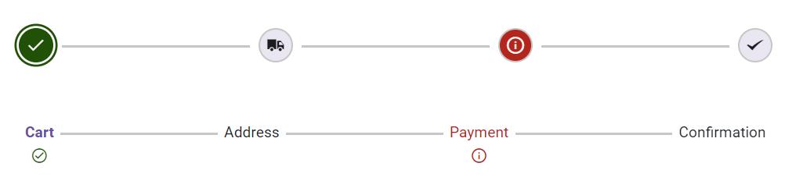

# Steps validation in Blazor Stepper Component

The Stepper control allows you to set the validation state for each step, displaying either a success or error icon. You can define the success state of a step by setting the [IsValid](https://help.syncfusion.com/cr/blazor/Syncfusion.Blazor.Navigations.StepperStep.html#Syncfusion_Blazor_Navigations_StepperStep_IsValid) property to `true`. If set to `false`, the step will display an error state. By default, the `IsValid` property is `null`.

> Based on the `StepType`, the validation state icon will be displayed either as an indicator or as part of the step label/text.

```cshtml

@using Syncfusion.Blazor.Navigations

<SfStepper>
    <StepperSteps>
        <StepperStep IconCss="sf-icon-cart" IsValid="true"></StepperStep>        
        <StepperStep IconCss="sf-icon-transport"></StepperStep>
        <StepperStep IconCss="sf-icon-payment" IsValid="false"></StepperStep>
        <StepperStep IconCss="sf-icon-success"></StepperStep>
    </StepperSteps>
</SfStepper>

<SfStepper ID="labelStepper">
    <StepperSteps>
        <StepperStep Label="Cart" IsValid="true"></StepperStep>
        <StepperStep Label="Address"></StepperStep>
        <StepperStep Label="Payment" IsValid="false"></StepperStep>
        <StepperStep Label="Confirmation"></StepperStep>
    </StepperSteps>
</SfStepper>

<style>
    @@font-face {
        font-family: 'Default';
        src:
        url(data:application/x-font-ttf;charset=utf-8;base64,AAEAAAAKAIAAAwAgT1MvMj1vSgcAAAEoAAAAVmNtYXCDeIPaAAABmAAAAF5nbHlmEwr+pwAAAggAAAjQaGVhZCYp2+EAAADQAAAANmhoZWEIUQQHAAAArAAAACRobXR4GAAAAAAAAYAAAAAYbG9jYQhUBlAAAAH4AAAADm1heHABFgErAAABCAAAACBuYW1luF5THQAACtgAAAIlcG9zdJ8LuoMAAA0AAAAAbwABAAAEAAAAAFwEAAAAAAAD9AABAAAAAAAAAAAAAAAAAAAABgABAAAAAQAArxT6wV8PPPUACwQAAAAAAOGLy6UAAAAA4YvLpQAAAAAD9AOaAAAACAACAAAAAAAAAAEAAAAGAR8ABgAAAAAAAgAAAAoACgAAAP8AAAAAAAAAAQQAAZAABQAAAokCzAAAAI8CiQLMAAAB6wAyAQgAAAIABQMAAAAAAAAAAAAAAAAAAAAAAAAAAAAAUGZFZABA5wLnFQQAAAAAXAQAAAAAAAABAAAAAAAABAAAAAQAAAAEAAAABAAAAAQAAAAEAAAAAAAAAgAAAAMAAAAUAAMAAQAAABQABABKAAAADAAIAAIABOcC5wbnCOcQ5xX//wAA5wLnBucI5xDnFf//AAAAAAAAAAAAAAABAAwADAAMAAwADAAAAAEABAACAAMABQAAAAAAAAEQAiwC3AQkBGgAAAAFAAAAAAP0A18APwB/AIkAxgDrAAABHw8/Dy8OKwEPDQUfDz8PLw4rAQ8NAR8FFSM1JxEfBz8OOwEfDjM/BzUnIw8GATM/Dx8PMxEhAq8BAQIEBAUFBwYICAgJCQoKCgkKCAkIBwcHBQUEAwMBAQEBAwMEBQUHBwcICQgKCQoKCgkJCAgIBgcFBQQEAgH+CwEBAgQEBQUHBggICAkJCgoKCQoICQgHBwcFBQQDAwEBAQEDAwQFBQcHBwgJCAoJCgoKCQkICAgGBwUFBAQCAQJ8AwUIWAwD3n0BAwMGBgYICAMEBQYHBwkJCgsLDA0NDQ4ODQ4MDAwLCgkJCAYGBQMDKAgIBwYFBAECvLsICAYHBQMD/beAAwQFBQcHCAkKCgsLDA0MDg0NDQwLCwsJCQkHBwUFAwKE/eMBAQoJCQkJCAcHBgYFBAMDAQEBAQMDBAUGBgcHCAkJCQkKCgoJCQgICAcGBgQFAwICAgIDBAUFBgcHCAkJCQoLCgkJCQkIBwcGBgUEAwMBAQEBAwMEBQYGBwcICQkJCQoKCgkJCAgIBwYGBAUDAgICAgMEBQUGBwcICQkJCgGuAQIGehYJBKYp/l0ICAcGBQQCAQ0NDQwLCgoJCAgGBQUDAgIDBQUGCAgJCgoLDA0NDQECBAUGBwQI1foBAgQFBgcH/iwNDAwLCwoJCQgHBgUEAwEBAQEDBAUGBwgJCQoLCwwMDQJJAAAABgAAAAAD8wOWAAYAQgBaAGwArQDuAAABBzcfAwUhLwIHIy8PNS8CKwIPHQEHLwEjDwE1LwMjNz0BJzcfBTcfAg8BLwY3OwEfAQcVHw8/Dy8PDw4BFR8PPw8vDw8OAxEWBgEDAgb8/wNuBAUEDQsVFBQTEhEPDw0GCwoIBgQCFhITE+wQDw8PDg4ODg0NDQwNCwwKCwoKCQgJBwcHBgYEBQMEA5FrBAQDBAMBAwMDBgIDagIEBgYGBxwCAwIBFQYGBAgFBgIWAgQHCPcBAgQGBggKCgsMDQ4PDxAQEBAPDw4NDAsLCQgGBgQCAQECBAYGCAkLCwwNDg8PEBAQEA8PDg0MCwoKCAYGBAL+KgEEBQgKCw0PEBETFBQWFxcXFhYUFBMREQ4NDAkIBgMBAQMGCAkMDQ4RERMUFBYWFxcXFhQUExEQDw0LCggFBAEXBhcFBAMDrxYWDQEBAwUHCAsMDQ4IERESFBQUFQQDAgECAgMEBAUGBgYIBwgJCQoKCwsLDAwMDQ0ODQ4PDgEZawIBAQIGBQMCAQQDBgZqBgoHBQMDMAMHBwMWAQICBQYKChYCBlwICBAPDw4NDAsLCQgGBgQCAQECBAYGCAkLCwwNDg8PEBAQEA8PDg0MCwoKCAYGAwMBAQMDBgYICgoLDA0ODw8QATMLDBYVFRQSERAPDQsKCAUEAQEEBQgKCw0PEBESFBUVFhcXFxYVFBISEA8NCwoIBQQBAQQFCAoLDQ8QEhIUFRYXAAAAAAQAAAAAA/QDRwA/AH8AhwCRAAABFR8OPw49AS8NKwEPDQUVHw4/Dj0BLw0rAQ8NEwcTIRMnMSMhMxMhNSEDBzUhA0YBAgMEBAQGBQcGBwgICAgICAgIBwYHBQYEBAQDAgEBAgMEBAQGBQcGBwgICAgICAgIBwYHBQYEBAQDAgH+aAICAgQEBAYFBwYIBwgICAgICAgHBgcFBgQEBAMCAQECAwQEBAYFBwYHCAgICAgICAcIBgcFBgQEBAICAsH6jAFKjPpu/Z3NwgJZ/dzDAf8AAQkICAgHBwcGBgUFBAQCAgEBAQECAgQEBQUGBgcHBwgICAkIBwgHBwYGBQUEAwMCAQECAwMEBQUGBgcHCAcICQgICAcHBwYGBQUEBAICAQEBAQICBAQFBQYGBwcHCAgICQgHCAcHBgYFBQQDAwIBAQIDAwQFBQYGBwcIBwgB+wH+vQFABP5dOgGkAQEAAAADAAAAAANkA5oAnQDxAR4AAAEzHwEdAR8HFQ8DIy8HDwYdAR8WDw0dAQ8BKwIvAT0BLwc9AT8COwEfBj8HLxc/DTU/AwEfDjsBPxEvFiMPFR8BEw8CFR8HMz8HNS8GIw8ELwQrAQ8BAgoCAgENDAwKCggHBQEBAikCAgIEAwQFDA0SBwcGAgIBAQICBgcHBxYKCQkJCAcHBgUFBAMCAQEBAQIDAwQFBQYGBwcPEQECAhUCAQINDAsLCQgHBQICKQICAgQDBAULDhIHBwYCAQEBAQEBAgYHBwcWCgkKCAgHBwYFBQQDAgEBAQECAwMEBAYFBgcHEBABAQED/qwUFRUVFRYWFhYWFxYXFhcXFxcWFxYXFhYWFhYVFRUVFAQCAQICBAUGCAgJCgsLDA0MDQ0NDBk2EQYGqgYGCEsZDQ0NDA0MCwsKCQgIBgUEAgIBAqQCAQEBAwkRNRIHBqADChI1DQoFAgEBAgMEBAoMEw8eTw4IVxkXCwkJBwYCOAIBAiIDAwUGBwgJCgICAQENAQEFAwIDAgECAgMFAwMEBAUDBAMFAwIBAQECAwMEBAUGBgYHCAgICQgHBwcGBgYFBQQEBAYDIgICAQECAiICBAUGBwgJCQMBAgEMAQUDAwIDAQICBAQDBAQEBAQEAwQEAgEBAQICBAMFBQUGBwcICAgJBwgHBgcGBgUFBAQEBQQiAgEBAf6RDAsLCQkICAYGBQUDAwIBAQIDAwUFBgYICAkJCwsMKSckIiAeGxoYFhQTERAPDQwLCgkIDxsJBQUFBQQnEAkKCwwNDxARExQWGBobHiAiJCcCoAMDAwQECA8XPRcKCgUPFz0REAkIBAMDAwMCAQICAwcYAwEaBwQBAgIAAAEAAAAAA/MDNAA0AAABDwQvAw8EHwQ/ETUnIw8LAYsEJwwGAgIwXmMXFBIICCsqKaEqRUclJSYnJykpKiosLC4GFgsCAWMhISIiIiIjIkJAPRwB8AQmCQMBARQuNgsMDgcIJCYnmyZOTycmJiYlJSQjIiIgHwULCAMCAQ4RERITFBUVKy0tFgAAABIA3gABAAAAAAAAAAEAAAABAAAAAAABAAcAAQABAAAAAAACAAcACAABAAAAAAADAAcADwABAAAAAAAEAAcAFgABAAAAAAAFAAsAHQABAAAAAAAGAAcAKAABAAAAAAAKACwALwABAAAAAAALABIAWwADAAEECQAAAAIAbQADAAEECQABAA4AbwADAAEECQACAA4AfQADAAEECQADAA4AiwADAAEECQAEAA4AmQADAAEECQAFABYApwADAAEECQAGAA4AvQADAAEECQAKAFgAywADAAEECQALACQBIyBEZWZhdWx0UmVndWxhckRlZmF1bHREZWZhdWx0VmVyc2lvbiAxLjBEZWZhdWx0Rm9udCBnZW5lcmF0ZWQgdXNpbmcgU3luY2Z1c2lvbiBNZXRybyBTdHVkaW93d3cuc3luY2Z1c2lvbi5jb20AIABEAGUAZgBhAHUAbAB0AFIAZQBnAHUAbABhAHIARABlAGYAYQB1AGwAdABEAGUAZgBhAHUAbAB0AFYAZQByAHMAaQBvAG4AIAAxAC4AMABEAGUAZgBhAHUAbAB0AEYAbwBuAHQAIABnAGUAbgBlAHIAYQB0AGUAZAAgAHUAcwBpAG4AZwAgAFMAeQBuAGMAZgB1AHMAaQBvAG4AIABNAGUAdAByAG8AIABTAHQAdQBkAGkAbwB3AHcAdwAuAHMAeQBuAGMAZgB1AHMAaQBvAG4ALgBjAG8AbQAAAAACAAAAAAAAAAoAAAAAAAAAAAAAAAAAAAAAAAAAAAAAAAYBAgEDAQQBBQEGAQcADXRyYW5zcG9ydC12YW4LdXNlci1tb2RpZnkRc2hvcHBpbmctY2FydF8wMS0Lc3BlbmQtbW9uZXkFY2hlY2sAAAA=) format('truetype');
        font-weight: normal;
        font-style: normal;
    }

    [class^="sf-icon-"], [class*=" sf-icon-"] {
        font-family: 'Default' !important;
        speak: none;
        font-style: normal;
        font-weight: normal;
        font-variant: normal;
        text-transform: none;
        line-height: inherit;
        -webkit-font-smoothing: antialiased;
        -moz-osx-font-smoothing: grayscale;
    }

    .sf-icon-cart:before { content: "\e710"; }
    .sf-icon-transport:before { content: "\e702"; }
    .sf-icon-payment:before { content: "\e706"; }
    .sf-icon-success:before { content: "\e715"; }

    #labelStepper {
        margin-top: 50px;
    }
</style>

```

