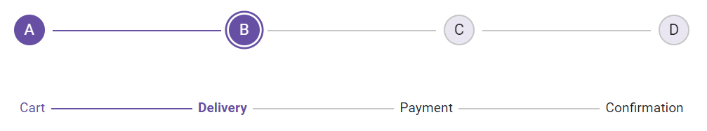
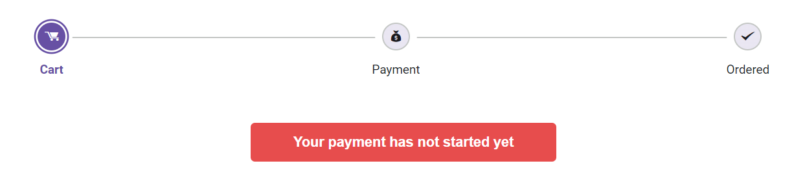

# Steps in Blazor Stepper Component

The Blazor Stepper allows you to add steps using the [StepperStep](https://help.syncfusion.com/cr/blazor/Syncfusion.Blazor.Navigations.StepperStep.html) tag directive. Each step can be configured with options such as `IconCss`, `Text`, `Label`, `CssClass` and more.

## Adding steps

You can define the icon and text content for each step using the `IconCss`, `Text` and `Label` properties.

### Defining icon CSS

You can define the CSS class to show the icon for each step using the `IconCss` property.

```cshtml

@using Syncfusion.Blazor.Navigations

<SfStepper>
    <StepperSteps>
        <StepperStep IconCss="sf-icon-cart"></StepperStep>        
        <StepperStep IconCss="sf-icon-transport"></StepperStep>
        <StepperStep IconCss="sf-icon-payment"></StepperStep>
        <StepperStep IconCss="sf-icon-success"></StepperStep>
    </StepperSteps>
</SfStepper>

<style>
    @@font-face {
        font-family: 'Default';
        src:
        url(data:application/x-font-ttf;charset=utf-8;base64,AAEAAAAKAIAAAwAgT1MvMj1vSgcAAAEoAAAAVmNtYXCDeIPaAAABmAAAAF5nbHlmEwr+pwAAAggAAAjQaGVhZCYp2+EAAADQAAAANmhoZWEIUQQHAAAArAAAACRobXR4GAAAAAAAAYAAAAAYbG9jYQhUBlAAAAH4AAAADm1heHABFgErAAABCAAAACBuYW1luF5THQAACtgAAAIlcG9zdJ8LuoMAAA0AAAAAbwABAAAEAAAAAFwEAAAAAAAD9AABAAAAAAAAAAAAAAAAAAAABgABAAAAAQAArxT6wV8PPPUACwQAAAAAAOGLy6UAAAAA4YvLpQAAAAAD9AOaAAAACAACAAAAAAAAAAEAAAAGAR8ABgAAAAAAAgAAAAoACgAAAP8AAAAAAAAAAQQAAZAABQAAAokCzAAAAI8CiQLMAAAB6wAyAQgAAAIABQMAAAAAAAAAAAAAAAAAAAAAAAAAAAAAUGZFZABA5wLnFQQAAAAAXAQAAAAAAAABAAAAAAAABAAAAAQAAAAEAAAABAAAAAQAAAAEAAAAAAAAAgAAAAMAAAAUAAMAAQAAABQABABKAAAADAAIAAIABOcC5wbnCOcQ5xX//wAA5wLnBucI5xDnFf//AAAAAAAAAAAAAAABAAwADAAMAAwADAAAAAEABAACAAMABQAAAAAAAAEQAiwC3AQkBGgAAAAFAAAAAAP0A18APwB/AIkAxgDrAAABHw8/Dy8OKwEPDQUfDz8PLw4rAQ8NAR8FFSM1JxEfBz8OOwEfDjM/BzUnIw8GATM/Dx8PMxEhAq8BAQIEBAUFBwYICAgJCQoKCgkKCAkIBwcHBQUEAwMBAQEBAwMEBQUHBwcICQgKCQoKCgkJCAgIBgcFBQQEAgH+CwEBAgQEBQUHBggICAkJCgoKCQoICQgHBwcFBQQDAwEBAQEDAwQFBQcHBwgJCAoJCgoKCQkICAgGBwUFBAQCAQJ8AwUIWAwD3n0BAwMGBgYICAMEBQYHBwkJCgsLDA0NDQ4ODQ4MDAwLCgkJCAYGBQMDKAgIBwYFBAECvLsICAYHBQMD/beAAwQFBQcHCAkKCgsLDA0MDg0NDQwLCwsJCQkHBwUFAwKE/eMBAQoJCQkJCAcHBgYFBAMDAQEBAQMDBAUGBgcHCAkJCQkKCgoJCQgICAcGBgQFAwICAgIDBAUFBgcHCAkJCQoLCgkJCQkIBwcGBgUEAwMBAQEBAwMEBQYGBwcICQkJCQoKCgkJCAgIBwYGBAUDAgICAgMEBQUGBwcICQkJCgGuAQIGehYJBKYp/l0ICAcGBQQCAQ0NDQwLCgoJCAgGBQUDAgIDBQUGCAgJCgoLDA0NDQECBAUGBwQI1foBAgQFBgcH/iwNDAwLCwoJCQgHBgUEAwEBAQEDBAUGBwgJCQoLCwwMDQJJAAAABgAAAAAD8wOWAAYAQgBaAGwArQDuAAABBzcfAwUhLwIHIy8PNS8CKwIPHQEHLwEjDwE1LwMjNz0BJzcfBTcfAg8BLwY3OwEfAQcVHw8/Dy8PDw4BFR8PPw8vDw8OAxEWBgEDAgb8/wNuBAUEDQsVFBQTEhEPDw0GCwoIBgQCFhITE+wQDw8PDg4ODg0NDQwNCwwKCwoKCQgJBwcHBgYEBQMEA5FrBAQDBAMBAwMDBgIDagIEBgYGBxwCAwIBFQYGBAgFBgIWAgQHCPcBAgQGBggKCgsMDQ4PDxAQEBAPDw4NDAsLCQgGBgQCAQECBAYGCAkLCwwNDg8PEBAQEA8PDg0MCwoKCAYGBAL+KgEEBQgKCw0PEBETFBQWFxcXFhYUFBMREQ4NDAkIBgMBAQMGCAkMDQ4RERMUFBYWFxcXFhQUExEQDw0LCggFBAEXBhcFBAMDrxYWDQEBAwUHCAsMDQ4IERESFBQUFQQDAgECAgMEBAUGBgYIBwgJCQoKCwsLDAwMDQ0ODQ4PDgEZawIBAQIGBQMCAQQDBgZqBgoHBQMDMAMHBwMWAQICBQYKChYCBlwICBAPDw4NDAsLCQgGBgQCAQECBAYGCAkLCwwNDg8PEBAQEA8PDg0MCwoKCAYGAwMBAQMDBgYICgoLDA0ODw8QATMLDBYVFRQSERAPDQsKCAUEAQEEBQgKCw0PEBESFBUVFhcXFxYVFBISEA8NCwoIBQQBAQQFCAoLDQ8QEhIUFRYXAAAAAAQAAAAAA/QDRwA/AH8AhwCRAAABFR8OPw49AS8NKwEPDQUVHw4/Dj0BLw0rAQ8NEwcTIRMnMSMhMxMhNSEDBzUhA0YBAgMEBAQGBQcGBwgICAgICAgIBwYHBQYEBAQDAgEBAgMEBAQGBQcGBwgICAgICAgIBwYHBQYEBAQDAgH+aAICAgQEBAYFBwYIBwgICAgICAgHBgcFBgQEBAMCAQECAwQEBAYFBwYHCAgICAgICAcIBgcFBgQEBAICAsH6jAFKjPpu/Z3NwgJZ/dzDAf8AAQkICAgHBwcGBgUFBAQCAgEBAQECAgQEBQUGBgcHBwgICAkIBwgHBwYGBQUEAwMCAQECAwMEBQUGBgcHCAcICQgICAcHBwYGBQUEBAICAQEBAQICBAQFBQYGBwcHCAgICQgHCAcHBgYFBQQDAwIBAQIDAwQFBQYGBwcIBwgB+wH+vQFABP5dOgGkAQEAAAADAAAAAANkA5oAnQDxAR4AAAEzHwEdAR8HFQ8DIy8HDwYdAR8WDw0dAQ8BKwIvAT0BLwc9AT8COwEfBj8HLxc/DTU/AwEfDjsBPxEvFiMPFR8BEw8CFR8HMz8HNS8GIw8ELwQrAQ8BAgoCAgENDAwKCggHBQEBAikCAgIEAwQFDA0SBwcGAgIBAQICBgcHBxYKCQkJCAcHBgUFBAMCAQEBAQIDAwQFBQYGBwcPEQECAhUCAQINDAsLCQgHBQICKQICAgQDBAULDhIHBwYCAQEBAQEBAgYHBwcWCgkKCAgHBwYFBQQDAgEBAQECAwMEBAYFBgcHEBABAQED/qwUFRUVFRYWFhYWFxYXFhcXFxcWFxYXFhYWFhYVFRUVFAQCAQICBAUGCAgJCgsLDA0MDQ0NDBk2EQYGqgYGCEsZDQ0NDA0MCwsKCQgIBgUEAgIBAqQCAQEBAwkRNRIHBqADChI1DQoFAgEBAgMEBAoMEw8eTw4IVxkXCwkJBwYCOAIBAiIDAwUGBwgJCgICAQENAQEFAwIDAgECAgMFAwMEBAUDBAMFAwIBAQECAwMEBAUGBgYHCAgICQgHBwcGBgYFBQQEBAYDIgICAQECAiICBAUGBwgJCQMBAgEMAQUDAwIDAQICBAQDBAQEBAQEAwQEAgEBAQICBAMFBQUGBwcICAgJBwgHBgcGBgUFBAQEBQQiAgEBAf6RDAsLCQkICAYGBQUDAwIBAQIDAwUFBgYICAkJCwsMKSckIiAeGxoYFhQTERAPDQwLCgkIDxsJBQUFBQQnEAkKCwwNDxARExQWGBobHiAiJCcCoAMDAwQECA8XPRcKCgUPFz0REAkIBAMDAwMCAQICAwcYAwEaBwQBAgIAAAEAAAAAA/MDNAA0AAABDwQvAw8EHwQ/ETUnIw8LAYsEJwwGAgIwXmMXFBIICCsqKaEqRUclJSYnJykpKiosLC4GFgsCAWMhISIiIiIjIkJAPRwB8AQmCQMBARQuNgsMDgcIJCYnmyZOTycmJiYlJSQjIiIgHwULCAMCAQ4RERITFBUVKy0tFgAAABIA3gABAAAAAAAAAAEAAAABAAAAAAABAAcAAQABAAAAAAACAAcACAABAAAAAAADAAcADwABAAAAAAAEAAcAFgABAAAAAAAFAAsAHQABAAAAAAAGAAcAKAABAAAAAAAKACwALwABAAAAAAALABIAWwADAAEECQAAAAIAbQADAAEECQABAA4AbwADAAEECQACAA4AfQADAAEECQADAA4AiwADAAEECQAEAA4AmQADAAEECQAFABYApwADAAEECQAGAA4AvQADAAEECQAKAFgAywADAAEECQALACQBIyBEZWZhdWx0UmVndWxhckRlZmF1bHREZWZhdWx0VmVyc2lvbiAxLjBEZWZhdWx0Rm9udCBnZW5lcmF0ZWQgdXNpbmcgU3luY2Z1c2lvbiBNZXRybyBTdHVkaW93d3cuc3luY2Z1c2lvbi5jb20AIABEAGUAZgBhAHUAbAB0AFIAZQBnAHUAbABhAHIARABlAGYAYQB1AGwAdABEAGUAZgBhAHUAbAB0AFYAZQByAHMAaQBvAG4AIAAxAC4AMABEAGUAZgBhAHUAbAB0AEYAbwBuAHQAIABnAGUAbgBlAHIAYQB0AGUAZAAgAHUAcwBpAG4AZwAgAFMAeQBuAGMAZgB1AHMAaQBvAG4AIABNAGUAdAByAG8AIABTAHQAdQBkAGkAbwB3AHcAdwAuAHMAeQBuAGMAZgB1AHMAaQBvAG4ALgBjAG8AbQAAAAACAAAAAAAAAAoAAAAAAAAAAAAAAAAAAAAAAAAAAAAAAAYBAgEDAQQBBQEGAQcADXRyYW5zcG9ydC12YW4LdXNlci1tb2RpZnkRc2hvcHBpbmctY2FydF8wMS0Lc3BlbmQtbW9uZXkFY2hlY2sAAAA=) format('truetype');
        font-weight: normal;
        font-style: normal;
    }

    [class^="sf-icon-"], [class*=" sf-icon-"] {
        font-family: 'Default' !important;
        speak: none;
        font-style: normal;
        font-weight: normal;
        font-variant: normal;
        text-transform: none;
        line-height: inherit;
        -webkit-font-smoothing: antialiased;
        -moz-osx-font-smoothing: grayscale;
    }

    .sf-icon-cart:before { content: "\e710"; }
    .sf-icon-transport:before { content: "\e702"; }
    .sf-icon-payment:before { content: "\e706"; }
    .sf-icon-success:before { content: "\e715"; }
</style>

```


### Defining text content

You can define text instead of an icon by setting the [Text](https://help.syncfusion.com/cr/blazor/Syncfusion.Blazor.Navigations.StepperStep.html#Syncfusion_Blazor_Navigations_StepperStep_Text) property and display label content for a step using the [Label](https://help.syncfusion.com/cr/blazor/Syncfusion.Blazor.Navigations.StepperStep.html#Syncfusion_Blazor_Navigations_StepperStep_Label) property.

> When both label and text are defined, the label takes priority for display based on the `StepType`.

```cshtml

@using Syncfusion.Blazor.Navigations

<SfStepper StepType="StepperType.Indicator">
    <StepperSteps>
        <StepperStep Text="A"></StepperStep>
        <StepperStep Text="B"></StepperStep>
        <StepperStep Text="C"></StepperStep>
        <StepperStep Text="D"></StepperStep>
    </StepperSteps>
</SfStepper>
<SfStepper ID="labelStepper">
    <StepperSteps>
        <StepperStep Label="Cart"></StepperStep>
        <StepperStep Label="Delivery"></StepperStep>
        <StepperStep Label="Payment"></StepperStep>
        <StepperStep Label="Confirmation"></StepperStep>
    </StepperSteps>
</SfStepper>

<style>
    #labelStepper {
        margin-top: 50px;
    }
</style>

```


## Optional steps

You can show whether the step is optional or not by using [Optional](https://help.syncfusion.com/cr/blazor/Syncfusion.Blazor.Navigations.StepperStep.html#Syncfusion_Blazor_Navigations_StepperStep_Optional) property. By default, the `Optional` property is false.

```cshtml

@using Syncfusion.Blazor.Navigations

<SfStepper>
    <StepperSteps>
        <StepperStep IconCss="sf-icon-cart"></StepperStep>        
        <StepperStep IconCss="sf-icon-transport"></StepperStep>
        <StepperStep IconCss="sf-icon-payment" Optional=true></StepperStep>
        <StepperStep IconCss="sf-icon-success"></StepperStep>
    </StepperSteps>
</SfStepper>

<style>
    @@font-face {
        font-family: 'Default';
        src:
        url(data:application/x-font-ttf;charset=utf-8;base64,AAEAAAAKAIAAAwAgT1MvMj1vSgcAAAEoAAAAVmNtYXCDeIPaAAABmAAAAF5nbHlmEwr+pwAAAggAAAjQaGVhZCYp2+EAAADQAAAANmhoZWEIUQQHAAAArAAAACRobXR4GAAAAAAAAYAAAAAYbG9jYQhUBlAAAAH4AAAADm1heHABFgErAAABCAAAACBuYW1luF5THQAACtgAAAIlcG9zdJ8LuoMAAA0AAAAAbwABAAAEAAAAAFwEAAAAAAAD9AABAAAAAAAAAAAAAAAAAAAABgABAAAAAQAArxT6wV8PPPUACwQAAAAAAOGLy6UAAAAA4YvLpQAAAAAD9AOaAAAACAACAAAAAAAAAAEAAAAGAR8ABgAAAAAAAgAAAAoACgAAAP8AAAAAAAAAAQQAAZAABQAAAokCzAAAAI8CiQLMAAAB6wAyAQgAAAIABQMAAAAAAAAAAAAAAAAAAAAAAAAAAAAAUGZFZABA5wLnFQQAAAAAXAQAAAAAAAABAAAAAAAABAAAAAQAAAAEAAAABAAAAAQAAAAEAAAAAAAAAgAAAAMAAAAUAAMAAQAAABQABABKAAAADAAIAAIABOcC5wbnCOcQ5xX//wAA5wLnBucI5xDnFf//AAAAAAAAAAAAAAABAAwADAAMAAwADAAAAAEABAACAAMABQAAAAAAAAEQAiwC3AQkBGgAAAAFAAAAAAP0A18APwB/AIkAxgDrAAABHw8/Dy8OKwEPDQUfDz8PLw4rAQ8NAR8FFSM1JxEfBz8OOwEfDjM/BzUnIw8GATM/Dx8PMxEhAq8BAQIEBAUFBwYICAgJCQoKCgkKCAkIBwcHBQUEAwMBAQEBAwMEBQUHBwcICQgKCQoKCgkJCAgIBgcFBQQEAgH+CwEBAgQEBQUHBggICAkJCgoKCQoICQgHBwcFBQQDAwEBAQEDAwQFBQcHBwgJCAoJCgoKCQkICAgGBwUFBAQCAQJ8AwUIWAwD3n0BAwMGBgYICAMEBQYHBwkJCgsLDA0NDQ4ODQ4MDAwLCgkJCAYGBQMDKAgIBwYFBAECvLsICAYHBQMD/beAAwQFBQcHCAkKCgsLDA0MDg0NDQwLCwsJCQkHBwUFAwKE/eMBAQoJCQkJCAcHBgYFBAMDAQEBAQMDBAUGBgcHCAkJCQkKCgoJCQgICAcGBgQFAwICAgIDBAUFBgcHCAkJCQoLCgkJCQkIBwcGBgUEAwMBAQEBAwMEBQYGBwcICQkJCQoKCgkJCAgIBwYGBAUDAgICAgMEBQUGBwcICQkJCgGuAQIGehYJBKYp/l0ICAcGBQQCAQ0NDQwLCgoJCAgGBQUDAgIDBQUGCAgJCgoLDA0NDQECBAUGBwQI1foBAgQFBgcH/iwNDAwLCwoJCQgHBgUEAwEBAQEDBAUGBwgJCQoLCwwMDQJJAAAABgAAAAAD8wOWAAYAQgBaAGwArQDuAAABBzcfAwUhLwIHIy8PNS8CKwIPHQEHLwEjDwE1LwMjNz0BJzcfBTcfAg8BLwY3OwEfAQcVHw8/Dy8PDw4BFR8PPw8vDw8OAxEWBgEDAgb8/wNuBAUEDQsVFBQTEhEPDw0GCwoIBgQCFhITE+wQDw8PDg4ODg0NDQwNCwwKCwoKCQgJBwcHBgYEBQMEA5FrBAQDBAMBAwMDBgIDagIEBgYGBxwCAwIBFQYGBAgFBgIWAgQHCPcBAgQGBggKCgsMDQ4PDxAQEBAPDw4NDAsLCQgGBgQCAQECBAYGCAkLCwwNDg8PEBAQEA8PDg0MCwoKCAYGBAL+KgEEBQgKCw0PEBETFBQWFxcXFhYUFBMREQ4NDAkIBgMBAQMGCAkMDQ4RERMUFBYWFxcXFhQUExEQDw0LCggFBAEXBhcFBAMDrxYWDQEBAwUHCAsMDQ4IERESFBQUFQQDAgECAgMEBAUGBgYIBwgJCQoKCwsLDAwMDQ0ODQ4PDgEZawIBAQIGBQMCAQQDBgZqBgoHBQMDMAMHBwMWAQICBQYKChYCBlwICBAPDw4NDAsLCQgGBgQCAQECBAYGCAkLCwwNDg8PEBAQEA8PDg0MCwoKCAYGAwMBAQMDBgYICgoLDA0ODw8QATMLDBYVFRQSERAPDQsKCAUEAQEEBQgKCw0PEBESFBUVFhcXFxYVFBISEA8NCwoIBQQBAQQFCAoLDQ8QEhIUFRYXAAAAAAQAAAAAA/QDRwA/AH8AhwCRAAABFR8OPw49AS8NKwEPDQUVHw4/Dj0BLw0rAQ8NEwcTIRMnMSMhMxMhNSEDBzUhA0YBAgMEBAQGBQcGBwgICAgICAgIBwYHBQYEBAQDAgEBAgMEBAQGBQcGBwgICAgICAgIBwYHBQYEBAQDAgH+aAICAgQEBAYFBwYIBwgICAgICAgHBgcFBgQEBAMCAQECAwQEBAYFBwYHCAgICAgICAcIBgcFBgQEBAICAsH6jAFKjPpu/Z3NwgJZ/dzDAf8AAQkICAgHBwcGBgUFBAQCAgEBAQECAgQEBQUGBgcHBwgICAkIBwgHBwYGBQUEAwMCAQECAwMEBQUGBgcHCAcICQgICAcHBwYGBQUEBAICAQEBAQICBAQFBQYGBwcHCAgICQgHCAcHBgYFBQQDAwIBAQIDAwQFBQYGBwcIBwgB+wH+vQFABP5dOgGkAQEAAAADAAAAAANkA5oAnQDxAR4AAAEzHwEdAR8HFQ8DIy8HDwYdAR8WDw0dAQ8BKwIvAT0BLwc9AT8COwEfBj8HLxc/DTU/AwEfDjsBPxEvFiMPFR8BEw8CFR8HMz8HNS8GIw8ELwQrAQ8BAgoCAgENDAwKCggHBQEBAikCAgIEAwQFDA0SBwcGAgIBAQICBgcHBxYKCQkJCAcHBgUFBAMCAQEBAQIDAwQFBQYGBwcPEQECAhUCAQINDAsLCQgHBQICKQICAgQDBAULDhIHBwYCAQEBAQEBAgYHBwcWCgkKCAgHBwYFBQQDAgEBAQECAwMEBAYFBgcHEBABAQED/qwUFRUVFRYWFhYWFxYXFhcXFxcWFxYXFhYWFhYVFRUVFAQCAQICBAUGCAgJCgsLDA0MDQ0NDBk2EQYGqgYGCEsZDQ0NDA0MCwsKCQgIBgUEAgIBAqQCAQEBAwkRNRIHBqADChI1DQoFAgEBAgMEBAoMEw8eTw4IVxkXCwkJBwYCOAIBAiIDAwUGBwgJCgICAQENAQEFAwIDAgECAgMFAwMEBAUDBAMFAwIBAQECAwMEBAUGBgYHCAgICQgHBwcGBgYFBQQEBAYDIgICAQECAiICBAUGBwgJCQMBAgEMAQUDAwIDAQICBAQDBAQEBAQEAwQEAgEBAQICBAMFBQUGBwcICAgJBwgHBgcGBgUFBAQEBQQiAgEBAf6RDAsLCQkICAYGBQUDAwIBAQIDAwUFBgYICAkJCwsMKSckIiAeGxoYFhQTERAPDQwLCgkIDxsJBQUFBQQnEAkKCwwNDxARExQWGBobHiAiJCcCoAMDAwQECA8XPRcKCgUPFz0REAkIBAMDAwMCAQICAwcYAwEaBwQBAgIAAAEAAAAAA/MDNAA0AAABDwQvAw8EHwQ/ETUnIw8LAYsEJwwGAgIwXmMXFBIICCsqKaEqRUclJSYnJykpKiosLC4GFgsCAWMhISIiIiIjIkJAPRwB8AQmCQMBARQuNgsMDgcIJCYnmyZOTycmJiYlJSQjIiIgHwULCAMCAQ4RERITFBUVKy0tFgAAABIA3gABAAAAAAAAAAEAAAABAAAAAAABAAcAAQABAAAAAAACAAcACAABAAAAAAADAAcADwABAAAAAAAEAAcAFgABAAAAAAAFAAsAHQABAAAAAAAGAAcAKAABAAAAAAAKACwALwABAAAAAAALABIAWwADAAEECQAAAAIAbQADAAEECQABAA4AbwADAAEECQACAA4AfQADAAEECQADAA4AiwADAAEECQAEAA4AmQADAAEECQAFABYApwADAAEECQAGAA4AvQADAAEECQAKAFgAywADAAEECQALACQBIyBEZWZhdWx0UmVndWxhckRlZmF1bHREZWZhdWx0VmVyc2lvbiAxLjBEZWZhdWx0Rm9udCBnZW5lcmF0ZWQgdXNpbmcgU3luY2Z1c2lvbiBNZXRybyBTdHVkaW93d3cuc3luY2Z1c2lvbi5jb20AIABEAGUAZgBhAHUAbAB0AFIAZQBnAHUAbABhAHIARABlAGYAYQB1AGwAdABEAGUAZgBhAHUAbAB0AFYAZQByAHMAaQBvAG4AIAAxAC4AMABEAGUAZgBhAHUAbAB0AEYAbwBuAHQAIABnAGUAbgBlAHIAYQB0AGUAZAAgAHUAcwBpAG4AZwAgAFMAeQBuAGMAZgB1AHMAaQBvAG4AIABNAGUAdAByAG8AIABTAHQAdQBkAGkAbwB3AHcAdwAuAHMAeQBuAGMAZgB1AHMAaQBvAG4ALgBjAG8AbQAAAAACAAAAAAAAAAoAAAAAAAAAAAAAAAAAAAAAAAAAAAAAAAYBAgEDAQQBBQEGAQcADXRyYW5zcG9ydC12YW4LdXNlci1tb2RpZnkRc2hvcHBpbmctY2FydF8wMS0Lc3BlbmQtbW9uZXkFY2hlY2sAAAA=) format('truetype');
        font-weight: normal;
        font-style: normal;
    }

    [class^="sf-icon-"], [class*=" sf-icon-"] {
        font-family: 'Default' !important;
        speak: none;
        font-style: normal;
        font-weight: normal;
        font-variant: normal;
        text-transform: none;
        line-height: inherit;
        -webkit-font-smoothing: antialiased;
        -moz-osx-font-smoothing: grayscale;
    }

    .sf-icon-cart:before { content: "\e710"; }
    .sf-icon-transport:before { content: "\e702"; }
    .sf-icon-payment:before { content: "\e706"; }
    .sf-icon-success:before { content: "\e715"; }
</style>

```


## Disabling steps

You can use the [Disabled](https://help.syncfusion.com/cr/blazor/Syncfusion.Blazor.Navigations.StepperStep.html#Syncfusion_Blazor_Navigations_StepperStep_Disabled) property to disable a step, preventing user interaction when set to `true`. By default, the value is `false`.

```cshtml

@using Syncfusion.Blazor.Navigations

<SfStepper>
    <StepperSteps>
        <StepperStep IconCss="sf-icon-cart"></StepperStep>        
        <StepperStep IconCss="sf-icon-transport"></StepperStep>
        <StepperStep IconCss="sf-icon-payment" Disabled=true></StepperStep>
        <StepperStep IconCss="sf-icon-success"></StepperStep>
    </StepperSteps>
</SfStepper>

<style>
    @@font-face {
        font-family: 'Default';
        src:
        url(data:application/x-font-ttf;charset=utf-8;base64,AAEAAAAKAIAAAwAgT1MvMj1vSgcAAAEoAAAAVmNtYXCDeIPaAAABmAAAAF5nbHlmEwr+pwAAAggAAAjQaGVhZCYp2+EAAADQAAAANmhoZWEIUQQHAAAArAAAACRobXR4GAAAAAAAAYAAAAAYbG9jYQhUBlAAAAH4AAAADm1heHABFgErAAABCAAAACBuYW1luF5THQAACtgAAAIlcG9zdJ8LuoMAAA0AAAAAbwABAAAEAAAAAFwEAAAAAAAD9AABAAAAAAAAAAAAAAAAAAAABgABAAAAAQAArxT6wV8PPPUACwQAAAAAAOGLy6UAAAAA4YvLpQAAAAAD9AOaAAAACAACAAAAAAAAAAEAAAAGAR8ABgAAAAAAAgAAAAoACgAAAP8AAAAAAAAAAQQAAZAABQAAAokCzAAAAI8CiQLMAAAB6wAyAQgAAAIABQMAAAAAAAAAAAAAAAAAAAAAAAAAAAAAUGZFZABA5wLnFQQAAAAAXAQAAAAAAAABAAAAAAAABAAAAAQAAAAEAAAABAAAAAQAAAAEAAAAAAAAAgAAAAMAAAAUAAMAAQAAABQABABKAAAADAAIAAIABOcC5wbnCOcQ5xX//wAA5wLnBucI5xDnFf//AAAAAAAAAAAAAAABAAwADAAMAAwADAAAAAEABAACAAMABQAAAAAAAAEQAiwC3AQkBGgAAAAFAAAAAAP0A18APwB/AIkAxgDrAAABHw8/Dy8OKwEPDQUfDz8PLw4rAQ8NAR8FFSM1JxEfBz8OOwEfDjM/BzUnIw8GATM/Dx8PMxEhAq8BAQIEBAUFBwYICAgJCQoKCgkKCAkIBwcHBQUEAwMBAQEBAwMEBQUHBwcICQgKCQoKCgkJCAgIBgcFBQQEAgH+CwEBAgQEBQUHBggICAkJCgoKCQoICQgHBwcFBQQDAwEBAQEDAwQFBQcHBwgJCAoJCgoKCQkICAgGBwUFBAQCAQJ8AwUIWAwD3n0BAwMGBgYICAMEBQYHBwkJCgsLDA0NDQ4ODQ4MDAwLCgkJCAYGBQMDKAgIBwYFBAECvLsICAYHBQMD/beAAwQFBQcHCAkKCgsLDA0MDg0NDQwLCwsJCQkHBwUFAwKE/eMBAQoJCQkJCAcHBgYFBAMDAQEBAQMDBAUGBgcHCAkJCQkKCgoJCQgICAcGBgQFAwICAgIDBAUFBgcHCAkJCQoLCgkJCQkIBwcGBgUEAwMBAQEBAwMEBQYGBwcICQkJCQoKCgkJCAgIBwYGBAUDAgICAgMEBQUGBwcICQkJCgGuAQIGehYJBKYp/l0ICAcGBQQCAQ0NDQwLCgoJCAgGBQUDAgIDBQUGCAgJCgoLDA0NDQECBAUGBwQI1foBAgQFBgcH/iwNDAwLCwoJCQgHBgUEAwEBAQEDBAUGBwgJCQoLCwwMDQJJAAAABgAAAAAD8wOWAAYAQgBaAGwArQDuAAABBzcfAwUhLwIHIy8PNS8CKwIPHQEHLwEjDwE1LwMjNz0BJzcfBTcfAg8BLwY3OwEfAQcVHw8/Dy8PDw4BFR8PPw8vDw8OAxEWBgEDAgb8/wNuBAUEDQsVFBQTEhEPDw0GCwoIBgQCFhITE+wQDw8PDg4ODg0NDQwNCwwKCwoKCQgJBwcHBgYEBQMEA5FrBAQDBAMBAwMDBgIDagIEBgYGBxwCAwIBFQYGBAgFBgIWAgQHCPcBAgQGBggKCgsMDQ4PDxAQEBAPDw4NDAsLCQgGBgQCAQECBAYGCAkLCwwNDg8PEBAQEA8PDg0MCwoKCAYGBAL+KgEEBQgKCw0PEBETFBQWFxcXFhYUFBMREQ4NDAkIBgMBAQMGCAkMDQ4RERMUFBYWFxcXFhQUExEQDw0LCggFBAEXBhcFBAMDrxYWDQEBAwUHCAsMDQ4IERESFBQUFQQDAgECAgMEBAUGBgYIBwgJCQoKCwsLDAwMDQ0ODQ4PDgEZawIBAQIGBQMCAQQDBgZqBgoHBQMDMAMHBwMWAQICBQYKChYCBlwICBAPDw4NDAsLCQgGBgQCAQECBAYGCAkLCwwNDg8PEBAQEA8PDg0MCwoKCAYGAwMBAQMDBgYICgoLDA0ODw8QATMLDBYVFRQSERAPDQsKCAUEAQEEBQgKCw0PEBESFBUVFhcXFxYVFBISEA8NCwoIBQQBAQQFCAoLDQ8QEhIUFRYXAAAAAAQAAAAAA/QDRwA/AH8AhwCRAAABFR8OPw49AS8NKwEPDQUVHw4/Dj0BLw0rAQ8NEwcTIRMnMSMhMxMhNSEDBzUhA0YBAgMEBAQGBQcGBwgICAgICAgIBwYHBQYEBAQDAgEBAgMEBAQGBQcGBwgICAgICAgIBwYHBQYEBAQDAgH+aAICAgQEBAYFBwYIBwgICAgICAgHBgcFBgQEBAMCAQECAwQEBAYFBwYHCAgICAgICAcIBgcFBgQEBAICAsH6jAFKjPpu/Z3NwgJZ/dzDAf8AAQkICAgHBwcGBgUFBAQCAgEBAQECAgQEBQUGBgcHBwgICAkIBwgHBwYGBQUEAwMCAQECAwMEBQUGBgcHCAcICQgICAcHBwYGBQUEBAICAQEBAQICBAQFBQYGBwcHCAgICQgHCAcHBgYFBQQDAwIBAQIDAwQFBQYGBwcIBwgB+wH+vQFABP5dOgGkAQEAAAADAAAAAANkA5oAnQDxAR4AAAEzHwEdAR8HFQ8DIy8HDwYdAR8WDw0dAQ8BKwIvAT0BLwc9AT8COwEfBj8HLxc/DTU/AwEfDjsBPxEvFiMPFR8BEw8CFR8HMz8HNS8GIw8ELwQrAQ8BAgoCAgENDAwKCggHBQEBAikCAgIEAwQFDA0SBwcGAgIBAQICBgcHBxYKCQkJCAcHBgUFBAMCAQEBAQIDAwQFBQYGBwcPEQECAhUCAQINDAsLCQgHBQICKQICAgQDBAULDhIHBwYCAQEBAQEBAgYHBwcWCgkKCAgHBwYFBQQDAgEBAQECAwMEBAYFBgcHEBABAQED/qwUFRUVFRYWFhYWFxYXFhcXFxcWFxYXFhYWFhYVFRUVFAQCAQICBAUGCAgJCgsLDA0MDQ0NDBk2EQYGqgYGCEsZDQ0NDA0MCwsKCQgIBgUEAgIBAqQCAQEBAwkRNRIHBqADChI1DQoFAgEBAgMEBAoMEw8eTw4IVxkXCwkJBwYCOAIBAiIDAwUGBwgJCgICAQENAQEFAwIDAgECAgMFAwMEBAUDBAMFAwIBAQECAwMEBAUGBgYHCAgICQgHBwcGBgYFBQQEBAYDIgICAQECAiICBAUGBwgJCQMBAgEMAQUDAwIDAQICBAQDBAQEBAQEAwQEAgEBAQICBAMFBQUGBwcICAgJBwgHBgcGBgUFBAQEBQQiAgEBAf6RDAsLCQkICAYGBQUDAwIBAQIDAwUFBgYICAkJCwsMKSckIiAeGxoYFhQTERAPDQwLCgkIDxsJBQUFBQQnEAkKCwwNDxARExQWGBobHiAiJCcCoAMDAwQECA8XPRcKCgUPFz0REAkIBAMDAwMCAQICAwcYAwEaBwQBAgIAAAEAAAAAA/MDNAA0AAABDwQvAw8EHwQ/ETUnIw8LAYsEJwwGAgIwXmMXFBIICCsqKaEqRUclJSYnJykpKiosLC4GFgsCAWMhISIiIiIjIkJAPRwB8AQmCQMBARQuNgsMDgcIJCYnmyZOTycmJiYlJSQjIiIgHwULCAMCAQ4RERITFBUVKy0tFgAAABIA3gABAAAAAAAAAAEAAAABAAAAAAABAAcAAQABAAAAAAACAAcACAABAAAAAAADAAcADwABAAAAAAAEAAcAFgABAAAAAAAFAAsAHQABAAAAAAAGAAcAKAABAAAAAAAKACwALwABAAAAAAALABIAWwADAAEECQAAAAIAbQADAAEECQABAA4AbwADAAEECQACAA4AfQADAAEECQADAA4AiwADAAEECQAEAA4AmQADAAEECQAFABYApwADAAEECQAGAA4AvQADAAEECQAKAFgAywADAAEECQALACQBIyBEZWZhdWx0UmVndWxhckRlZmF1bHREZWZhdWx0VmVyc2lvbiAxLjBEZWZhdWx0Rm9udCBnZW5lcmF0ZWQgdXNpbmcgU3luY2Z1c2lvbiBNZXRybyBTdHVkaW93d3cuc3luY2Z1c2lvbi5jb20AIABEAGUAZgBhAHUAbAB0AFIAZQBnAHUAbABhAHIARABlAGYAYQB1AGwAdABEAGUAZgBhAHUAbAB0AFYAZQByAHMAaQBvAG4AIAAxAC4AMABEAGUAZgBhAHUAbAB0AEYAbwBuAHQAIABnAGUAbgBlAHIAYQB0AGUAZAAgAHUAcwBpAG4AZwAgAFMAeQBuAGMAZgB1AHMAaQBvAG4AIABNAGUAdAByAG8AIABTAHQAdQBkAGkAbwB3AHcAdwAuAHMAeQBuAGMAZgB1AHMAaQBvAG4ALgBjAG8AbQAAAAACAAAAAAAAAAoAAAAAAAAAAAAAAAAAAAAAAAAAAAAAAAYBAgEDAQQBBQEGAQcADXRyYW5zcG9ydC12YW4LdXNlci1tb2RpZnkRc2hvcHBpbmctY2FydF8wMS0Lc3BlbmQtbW9uZXkFY2hlY2sAAAA=) format('truetype');
        font-weight: normal;
        font-style: normal;
    }

    [class^="sf-icon-"], [class*=" sf-icon-"] {
        font-family: 'Default' !important;
        speak: none;
        font-style: normal;
        font-weight: normal;
        font-variant: normal;
        text-transform: none;
        line-height: inherit;
        -webkit-font-smoothing: antialiased;
        -moz-osx-font-smoothing: grayscale;
    }

    .sf-icon-cart:before { content: "\e710"; }
    .sf-icon-transport:before { content: "\e702"; }
    .sf-icon-payment:before { content: "\e706"; }
    .sf-icon-success:before { content: "\e715"; }
</style>

```


## Setting readonly

You can use [ReadOnly](https://help.syncfusion.com/cr/blazor/Syncfusion.Blazor.Navigations.SfStepper.html#Syncfusion_Blazor_Navigations_SfStepper_ReadOnly) property to disable the user interactions in the stepper.

```cshtml

@using Syncfusion.Blazor.Navigations

<SfStepper ReadOnly="true">
    <StepperSteps>
        <StepperStep IconCss="sf-icon-cart"></StepperStep>        
        <StepperStep IconCss="sf-icon-transport"></StepperStep>
        <StepperStep IconCss="sf-icon-payment"></StepperStep>
        <StepperStep IconCss="sf-icon-success"></StepperStep>
    </StepperSteps>
</SfStepper>

<style>
    @@font-face {
        font-family: 'Default';
        src:
        url(data:application/x-font-ttf;charset=utf-8;base64,AAEAAAAKAIAAAwAgT1MvMj1vSgcAAAEoAAAAVmNtYXCDeIPaAAABmAAAAF5nbHlmEwr+pwAAAggAAAjQaGVhZCYp2+EAAADQAAAANmhoZWEIUQQHAAAArAAAACRobXR4GAAAAAAAAYAAAAAYbG9jYQhUBlAAAAH4AAAADm1heHABFgErAAABCAAAACBuYW1luF5THQAACtgAAAIlcG9zdJ8LuoMAAA0AAAAAbwABAAAEAAAAAFwEAAAAAAAD9AABAAAAAAAAAAAAAAAAAAAABgABAAAAAQAArxT6wV8PPPUACwQAAAAAAOGLy6UAAAAA4YvLpQAAAAAD9AOaAAAACAACAAAAAAAAAAEAAAAGAR8ABgAAAAAAAgAAAAoACgAAAP8AAAAAAAAAAQQAAZAABQAAAokCzAAAAI8CiQLMAAAB6wAyAQgAAAIABQMAAAAAAAAAAAAAAAAAAAAAAAAAAAAAUGZFZABA5wLnFQQAAAAAXAQAAAAAAAABAAAAAAAABAAAAAQAAAAEAAAABAAAAAQAAAAEAAAAAAAAAgAAAAMAAAAUAAMAAQAAABQABABKAAAADAAIAAIABOcC5wbnCOcQ5xX//wAA5wLnBucI5xDnFf//AAAAAAAAAAAAAAABAAwADAAMAAwADAAAAAEABAACAAMABQAAAAAAAAEQAiwC3AQkBGgAAAAFAAAAAAP0A18APwB/AIkAxgDrAAABHw8/Dy8OKwEPDQUfDz8PLw4rAQ8NAR8FFSM1JxEfBz8OOwEfDjM/BzUnIw8GATM/Dx8PMxEhAq8BAQIEBAUFBwYICAgJCQoKCgkKCAkIBwcHBQUEAwMBAQEBAwMEBQUHBwcICQgKCQoKCgkJCAgIBgcFBQQEAgH+CwEBAgQEBQUHBggICAkJCgoKCQoICQgHBwcFBQQDAwEBAQEDAwQFBQcHBwgJCAoJCgoKCQkICAgGBwUFBAQCAQJ8AwUIWAwD3n0BAwMGBgYICAMEBQYHBwkJCgsLDA0NDQ4ODQ4MDAwLCgkJCAYGBQMDKAgIBwYFBAECvLsICAYHBQMD/beAAwQFBQcHCAkKCgsLDA0MDg0NDQwLCwsJCQkHBwUFAwKE/eMBAQoJCQkJCAcHBgYFBAMDAQEBAQMDBAUGBgcHCAkJCQkKCgoJCQgICAcGBgQFAwICAgIDBAUFBgcHCAkJCQoLCgkJCQkIBwcGBgUEAwMBAQEBAwMEBQYGBwcICQkJCQoKCgkJCAgIBwYGBAUDAgICAgMEBQUGBwcICQkJCgGuAQIGehYJBKYp/l0ICAcGBQQCAQ0NDQwLCgoJCAgGBQUDAgIDBQUGCAgJCgoLDA0NDQECBAUGBwQI1foBAgQFBgcH/iwNDAwLCwoJCQgHBgUEAwEBAQEDBAUGBwgJCQoLCwwMDQJJAAAABgAAAAAD8wOWAAYAQgBaAGwArQDuAAABBzcfAwUhLwIHIy8PNS8CKwIPHQEHLwEjDwE1LwMjNz0BJzcfBTcfAg8BLwY3OwEfAQcVHw8/Dy8PDw4BFR8PPw8vDw8OAxEWBgEDAgb8/wNuBAUEDQsVFBQTEhEPDw0GCwoIBgQCFhITE+wQDw8PDg4ODg0NDQwNCwwKCwoKCQgJBwcHBgYEBQMEA5FrBAQDBAMBAwMDBgIDagIEBgYGBxwCAwIBFQYGBAgFBgIWAgQHCPcBAgQGBggKCgsMDQ4PDxAQEBAPDw4NDAsLCQgGBgQCAQECBAYGCAkLCwwNDg8PEBAQEA8PDg0MCwoKCAYGBAL+KgEEBQgKCw0PEBETFBQWFxcXFhYUFBMREQ4NDAkIBgMBAQMGCAkMDQ4RERMUFBYWFxcXFhQUExEQDw0LCggFBAEXBhcFBAMDrxYWDQEBAwUHCAsMDQ4IERESFBQUFQQDAgECAgMEBAUGBgYIBwgJCQoKCwsLDAwMDQ0ODQ4PDgEZawIBAQIGBQMCAQQDBgZqBgoHBQMDMAMHBwMWAQICBQYKChYCBlwICBAPDw4NDAsLCQgGBgQCAQECBAYGCAkLCwwNDg8PEBAQEA8PDg0MCwoKCAYGAwMBAQMDBgYICgoLDA0ODw8QATMLDBYVFRQSERAPDQsKCAUEAQEEBQgKCw0PEBESFBUVFhcXFxYVFBISEA8NCwoIBQQBAQQFCAoLDQ8QEhIUFRYXAAAAAAQAAAAAA/QDRwA/AH8AhwCRAAABFR8OPw49AS8NKwEPDQUVHw4/Dj0BLw0rAQ8NEwcTIRMnMSMhMxMhNSEDBzUhA0YBAgMEBAQGBQcGBwgICAgICAgIBwYHBQYEBAQDAgEBAgMEBAQGBQcGBwgICAgICAgIBwYHBQYEBAQDAgH+aAICAgQEBAYFBwYIBwgICAgICAgHBgcFBgQEBAMCAQECAwQEBAYFBwYHCAgICAgICAcIBgcFBgQEBAICAsH6jAFKjPpu/Z3NwgJZ/dzDAf8AAQkICAgHBwcGBgUFBAQCAgEBAQECAgQEBQUGBgcHBwgICAkIBwgHBwYGBQUEAwMCAQECAwMEBQUGBgcHCAcICQgICAcHBwYGBQUEBAICAQEBAQICBAQFBQYGBwcHCAgICQgHCAcHBgYFBQQDAwIBAQIDAwQFBQYGBwcIBwgB+wH+vQFABP5dOgGkAQEAAAADAAAAAANkA5oAnQDxAR4AAAEzHwEdAR8HFQ8DIy8HDwYdAR8WDw0dAQ8BKwIvAT0BLwc9AT8COwEfBj8HLxc/DTU/AwEfDjsBPxEvFiMPFR8BEw8CFR8HMz8HNS8GIw8ELwQrAQ8BAgoCAgENDAwKCggHBQEBAikCAgIEAwQFDA0SBwcGAgIBAQICBgcHBxYKCQkJCAcHBgUFBAMCAQEBAQIDAwQFBQYGBwcPEQECAhUCAQINDAsLCQgHBQICKQICAgQDBAULDhIHBwYCAQEBAQEBAgYHBwcWCgkKCAgHBwYFBQQDAgEBAQECAwMEBAYFBgcHEBABAQED/qwUFRUVFRYWFhYWFxYXFhcXFxcWFxYXFhYWFhYVFRUVFAQCAQICBAUGCAgJCgsLDA0MDQ0NDBk2EQYGqgYGCEsZDQ0NDA0MCwsKCQgIBgUEAgIBAqQCAQEBAwkRNRIHBqADChI1DQoFAgEBAgMEBAoMEw8eTw4IVxkXCwkJBwYCOAIBAiIDAwUGBwgJCgICAQENAQEFAwIDAgECAgMFAwMEBAUDBAMFAwIBAQECAwMEBAUGBgYHCAgICQgHBwcGBgYFBQQEBAYDIgICAQECAiICBAUGBwgJCQMBAgEMAQUDAwIDAQICBAQDBAQEBAQEAwQEAgEBAQICBAMFBQUGBwcICAgJBwgHBgcGBgUFBAQEBQQiAgEBAf6RDAsLCQkICAYGBQUDAwIBAQIDAwUFBgYICAkJCwsMKSckIiAeGxoYFhQTERAPDQwLCgkIDxsJBQUFBQQnEAkKCwwNDxARExQWGBobHiAiJCcCoAMDAwQECA8XPRcKCgUPFz0REAkIBAMDAwMCAQICAwcYAwEaBwQBAgIAAAEAAAAAA/MDNAA0AAABDwQvAw8EHwQ/ETUnIw8LAYsEJwwGAgIwXmMXFBIICCsqKaEqRUclJSYnJykpKiosLC4GFgsCAWMhISIiIiIjIkJAPRwB8AQmCQMBARQuNgsMDgcIJCYnmyZOTycmJiYlJSQjIiIgHwULCAMCAQ4RERITFBUVKy0tFgAAABIA3gABAAAAAAAAAAEAAAABAAAAAAABAAcAAQABAAAAAAACAAcACAABAAAAAAADAAcADwABAAAAAAAEAAcAFgABAAAAAAAFAAsAHQABAAAAAAAGAAcAKAABAAAAAAAKACwALwABAAAAAAALABIAWwADAAEECQAAAAIAbQADAAEECQABAA4AbwADAAEECQACAA4AfQADAAEECQADAA4AiwADAAEECQAEAA4AmQADAAEECQAFABYApwADAAEECQAGAA4AvQADAAEECQAKAFgAywADAAEECQALACQBIyBEZWZhdWx0UmVndWxhckRlZmF1bHREZWZhdWx0VmVyc2lvbiAxLjBEZWZhdWx0Rm9udCBnZW5lcmF0ZWQgdXNpbmcgU3luY2Z1c2lvbiBNZXRybyBTdHVkaW93d3cuc3luY2Z1c2lvbi5jb20AIABEAGUAZgBhAHUAbAB0AFIAZQBnAHUAbABhAHIARABlAGYAYQB1AGwAdABEAGUAZgBhAHUAbAB0AFYAZQByAHMAaQBvAG4AIAAxAC4AMABEAGUAZgBhAHUAbAB0AEYAbwBuAHQAIABnAGUAbgBlAHIAYQB0AGUAZAAgAHUAcwBpAG4AZwAgAFMAeQBuAGMAZgB1AHMAaQBvAG4AIABNAGUAdAByAG8AIABTAHQAdQBkAGkAbwB3AHcAdwAuAHMAeQBuAGMAZgB1AHMAaQBvAG4ALgBjAG8AbQAAAAACAAAAAAAAAAoAAAAAAAAAAAAAAAAAAAAAAAAAAAAAAAYBAgEDAQQBBQEGAQcADXRyYW5zcG9ydC12YW4LdXNlci1tb2RpZnkRc2hvcHBpbmctY2FydF8wMS0Lc3BlbmQtbW9uZXkFY2hlY2sAAAA=) format('truetype');
        font-weight: normal;
        font-style: normal;
    }

    [class^="sf-icon-"], [class*=" sf-icon-"] {
        font-family: 'Default' !important;
        speak: none;
        font-style: normal;
        font-weight: normal;
        font-variant: normal;
        text-transform: none;
        line-height: inherit;
        -webkit-font-smoothing: antialiased;
        -moz-osx-font-smoothing: grayscale;
    }

    .sf-icon-cart:before { content: "\e710"; }
    .sf-icon-transport:before { content: "\e702"; }
    .sf-icon-payment:before { content: "\e706"; }
    .sf-icon-success:before { content: "\e715"; }
</style>

```


## Setting active step

You can set the active step by specifying its index using the [ActiveStep](https://help.syncfusion.com/cr/blazor/Syncfusion.Blazor.Navigations.SfStepper.html#Syncfusion_Blazor_Navigations_SfStepper_ActiveStep) property. The default value is `0`.

```cshtml

@using Syncfusion.Blazor.Navigations

<SfStepper ActiveStep="1">
    <StepperSteps>
        <StepperStep IconCss="sf-icon-cart"></StepperStep>        
        <StepperStep IconCss="sf-icon-transport"></StepperStep>
        <StepperStep IconCss="sf-icon-payment"></StepperStep>
        <StepperStep IconCss="sf-icon-success"></StepperStep>
    </StepperSteps>
</SfStepper>

<style>
    @@font-face {
        font-family: 'Default';
        src:
        url(data:application/x-font-ttf;charset=utf-8;base64,AAEAAAAKAIAAAwAgT1MvMj1vSgcAAAEoAAAAVmNtYXCDeIPaAAABmAAAAF5nbHlmEwr+pwAAAggAAAjQaGVhZCYp2+EAAADQAAAANmhoZWEIUQQHAAAArAAAACRobXR4GAAAAAAAAYAAAAAYbG9jYQhUBlAAAAH4AAAADm1heHABFgErAAABCAAAACBuYW1luF5THQAACtgAAAIlcG9zdJ8LuoMAAA0AAAAAbwABAAAEAAAAAFwEAAAAAAAD9AABAAAAAAAAAAAAAAAAAAAABgABAAAAAQAArxT6wV8PPPUACwQAAAAAAOGLy6UAAAAA4YvLpQAAAAAD9AOaAAAACAACAAAAAAAAAAEAAAAGAR8ABgAAAAAAAgAAAAoACgAAAP8AAAAAAAAAAQQAAZAABQAAAokCzAAAAI8CiQLMAAAB6wAyAQgAAAIABQMAAAAAAAAAAAAAAAAAAAAAAAAAAAAAUGZFZABA5wLnFQQAAAAAXAQAAAAAAAABAAAAAAAABAAAAAQAAAAEAAAABAAAAAQAAAAEAAAAAAAAAgAAAAMAAAAUAAMAAQAAABQABABKAAAADAAIAAIABOcC5wbnCOcQ5xX//wAA5wLnBucI5xDnFf//AAAAAAAAAAAAAAABAAwADAAMAAwADAAAAAEABAACAAMABQAAAAAAAAEQAiwC3AQkBGgAAAAFAAAAAAP0A18APwB/AIkAxgDrAAABHw8/Dy8OKwEPDQUfDz8PLw4rAQ8NAR8FFSM1JxEfBz8OOwEfDjM/BzUnIw8GATM/Dx8PMxEhAq8BAQIEBAUFBwYICAgJCQoKCgkKCAkIBwcHBQUEAwMBAQEBAwMEBQUHBwcICQgKCQoKCgkJCAgIBgcFBQQEAgH+CwEBAgQEBQUHBggICAkJCgoKCQoICQgHBwcFBQQDAwEBAQEDAwQFBQcHBwgJCAoJCgoKCQkICAgGBwUFBAQCAQJ8AwUIWAwD3n0BAwMGBgYICAMEBQYHBwkJCgsLDA0NDQ4ODQ4MDAwLCgkJCAYGBQMDKAgIBwYFBAECvLsICAYHBQMD/beAAwQFBQcHCAkKCgsLDA0MDg0NDQwLCwsJCQkHBwUFAwKE/eMBAQoJCQkJCAcHBgYFBAMDAQEBAQMDBAUGBgcHCAkJCQkKCgoJCQgICAcGBgQFAwICAgIDBAUFBgcHCAkJCQoLCgkJCQkIBwcGBgUEAwMBAQEBAwMEBQYGBwcICQkJCQoKCgkJCAgIBwYGBAUDAgICAgMEBQUGBwcICQkJCgGuAQIGehYJBKYp/l0ICAcGBQQCAQ0NDQwLCgoJCAgGBQUDAgIDBQUGCAgJCgoLDA0NDQECBAUGBwQI1foBAgQFBgcH/iwNDAwLCwoJCQgHBgUEAwEBAQEDBAUGBwgJCQoLCwwMDQJJAAAABgAAAAAD8wOWAAYAQgBaAGwArQDuAAABBzcfAwUhLwIHIy8PNS8CKwIPHQEHLwEjDwE1LwMjNz0BJzcfBTcfAg8BLwY3OwEfAQcVHw8/Dy8PDw4BFR8PPw8vDw8OAxEWBgEDAgb8/wNuBAUEDQsVFBQTEhEPDw0GCwoIBgQCFhITE+wQDw8PDg4ODg0NDQwNCwwKCwoKCQgJBwcHBgYEBQMEA5FrBAQDBAMBAwMDBgIDagIEBgYGBxwCAwIBFQYGBAgFBgIWAgQHCPcBAgQGBggKCgsMDQ4PDxAQEBAPDw4NDAsLCQgGBgQCAQECBAYGCAkLCwwNDg8PEBAQEA8PDg0MCwoKCAYGBAL+KgEEBQgKCw0PEBETFBQWFxcXFhYUFBMREQ4NDAkIBgMBAQMGCAkMDQ4RERMUFBYWFxcXFhQUExEQDw0LCggFBAEXBhcFBAMDrxYWDQEBAwUHCAsMDQ4IERESFBQUFQQDAgECAgMEBAUGBgYIBwgJCQoKCwsLDAwMDQ0ODQ4PDgEZawIBAQIGBQMCAQQDBgZqBgoHBQMDMAMHBwMWAQICBQYKChYCBlwICBAPDw4NDAsLCQgGBgQCAQECBAYGCAkLCwwNDg8PEBAQEA8PDg0MCwoKCAYGAwMBAQMDBgYICgoLDA0ODw8QATMLDBYVFRQSERAPDQsKCAUEAQEEBQgKCw0PEBESFBUVFhcXFxYVFBISEA8NCwoIBQQBAQQFCAoLDQ8QEhIUFRYXAAAAAAQAAAAAA/QDRwA/AH8AhwCRAAABFR8OPw49AS8NKwEPDQUVHw4/Dj0BLw0rAQ8NEwcTIRMnMSMhMxMhNSEDBzUhA0YBAgMEBAQGBQcGBwgICAgICAgIBwYHBQYEBAQDAgEBAgMEBAQGBQcGBwgICAgICAgIBwYHBQYEBAQDAgH+aAICAgQEBAYFBwYIBwgICAgICAgHBgcFBgQEBAMCAQECAwQEBAYFBwYHCAgICAgICAcIBgcFBgQEBAICAsH6jAFKjPpu/Z3NwgJZ/dzDAf8AAQkICAgHBwcGBgUFBAQCAgEBAQECAgQEBQUGBgcHBwgICAkIBwgHBwYGBQUEAwMCAQECAwMEBQUGBgcHCAcICQgICAcHBwYGBQUEBAICAQEBAQICBAQFBQYGBwcHCAgICQgHCAcHBgYFBQQDAwIBAQIDAwQFBQYGBwcIBwgB+wH+vQFABP5dOgGkAQEAAAADAAAAAANkA5oAnQDxAR4AAAEzHwEdAR8HFQ8DIy8HDwYdAR8WDw0dAQ8BKwIvAT0BLwc9AT8COwEfBj8HLxc/DTU/AwEfDjsBPxEvFiMPFR8BEw8CFR8HMz8HNS8GIw8ELwQrAQ8BAgoCAgENDAwKCggHBQEBAikCAgIEAwQFDA0SBwcGAgIBAQICBgcHBxYKCQkJCAcHBgUFBAMCAQEBAQIDAwQFBQYGBwcPEQECAhUCAQINDAsLCQgHBQICKQICAgQDBAULDhIHBwYCAQEBAQEBAgYHBwcWCgkKCAgHBwYFBQQDAgEBAQECAwMEBAYFBgcHEBABAQED/qwUFRUVFRYWFhYWFxYXFhcXFxcWFxYXFhYWFhYVFRUVFAQCAQICBAUGCAgJCgsLDA0MDQ0NDBk2EQYGqgYGCEsZDQ0NDA0MCwsKCQgIBgUEAgIBAqQCAQEBAwkRNRIHBqADChI1DQoFAgEBAgMEBAoMEw8eTw4IVxkXCwkJBwYCOAIBAiIDAwUGBwgJCgICAQENAQEFAwIDAgECAgMFAwMEBAUDBAMFAwIBAQECAwMEBAUGBgYHCAgICQgHBwcGBgYFBQQEBAYDIgICAQECAiICBAUGBwgJCQMBAgEMAQUDAwIDAQICBAQDBAQEBAQEAwQEAgEBAQICBAMFBQUGBwcICAgJBwgHBgcGBgUFBAQEBQQiAgEBAf6RDAsLCQkICAYGBQUDAwIBAQIDAwUFBgYICAkJCwsMKSckIiAeGxoYFhQTERAPDQwLCgkIDxsJBQUFBQQnEAkKCwwNDxARExQWGBobHiAiJCcCoAMDAwQECA8XPRcKCgUPFz0REAkIBAMDAwMCAQICAwcYAwEaBwQBAgIAAAEAAAAAA/MDNAA0AAABDwQvAw8EHwQ/ETUnIw8LAYsEJwwGAgIwXmMXFBIICCsqKaEqRUclJSYnJykpKiosLC4GFgsCAWMhISIiIiIjIkJAPRwB8AQmCQMBARQuNgsMDgcIJCYnmyZOTycmJiYlJSQjIiIgHwULCAMCAQ4RERITFBUVKy0tFgAAABIA3gABAAAAAAAAAAEAAAABAAAAAAABAAcAAQABAAAAAAACAAcACAABAAAAAAADAAcADwABAAAAAAAEAAcAFgABAAAAAAAFAAsAHQABAAAAAAAGAAcAKAABAAAAAAAKACwALwABAAAAAAALABIAWwADAAEECQAAAAIAbQADAAEECQABAA4AbwADAAEECQACAA4AfQADAAEECQADAA4AiwADAAEECQAEAA4AmQADAAEECQAFABYApwADAAEECQAGAA4AvQADAAEECQAKAFgAywADAAEECQALACQBIyBEZWZhdWx0UmVndWxhckRlZmF1bHREZWZhdWx0VmVyc2lvbiAxLjBEZWZhdWx0Rm9udCBnZW5lcmF0ZWQgdXNpbmcgU3luY2Z1c2lvbiBNZXRybyBTdHVkaW93d3cuc3luY2Z1c2lvbi5jb20AIABEAGUAZgBhAHUAbAB0AFIAZQBnAHUAbABhAHIARABlAGYAYQB1AGwAdABEAGUAZgBhAHUAbAB0AFYAZQByAHMAaQBvAG4AIAAxAC4AMABEAGUAZgBhAHUAbAB0AEYAbwBuAHQAIABnAGUAbgBlAHIAYQB0AGUAZAAgAHUAcwBpAG4AZwAgAFMAeQBuAGMAZgB1AHMAaQBvAG4AIABNAGUAdAByAG8AIABTAHQAdQBkAGkAbwB3AHcAdwAuAHMAeQBuAGMAZgB1AHMAaQBvAG4ALgBjAG8AbQAAAAACAAAAAAAAAAoAAAAAAAAAAAAAAAAAAAAAAAAAAAAAAAYBAgEDAQQBBQEGAQcADXRyYW5zcG9ydC12YW4LdXNlci1tb2RpZnkRc2hvcHBpbmctY2FydF8wMS0Lc3BlbmQtbW9uZXkFY2hlY2sAAAA=) format('truetype');
        font-weight: normal;
        font-style: normal;
    }

    [class^="sf-icon-"], [class*=" sf-icon-"] {
        font-family: 'Default' !important;
        speak: none;
        font-style: normal;
        font-weight: normal;
        font-variant: normal;
        text-transform: none;
        line-height: inherit;
        -webkit-font-smoothing: antialiased;
        -moz-osx-font-smoothing: grayscale;
    }

    .sf-icon-cart:before { content: "\e710"; }
    .sf-icon-transport:before { content: "\e702"; }
    .sf-icon-payment:before { content: "\e706"; }
    .sf-icon-success:before { content: "\e715"; }
</style>

```


## Step status

Each step's progress state can be specified using the [Status](https://help.syncfusion.com/cr/blazor/Syncfusion.Blazor.Navigations.StepperStep.html#Syncfusion_Blazor_Navigations_StepperStep_Status) property. The possible values are `NotStarted`, `InProgress` and `Completed`. By default, the value is `NotStarted`.

```cshtml

@using Syncfusion.Blazor.Navigations

<div class="stepper-template-wrapper">
    <SfStepper ID="stepper" StepChanged="StepChanged">
        <StepperSteps>
            <StepperStep Label="Cart" IconCss="sf-icon-cart"></StepperStep>
            <StepperStep @ref="payment" Label="Payment" IconCss="sf-icon-payment"></StepperStep>
            <StepperStep Label="Ordered" IconCss="sf-icon-success"></StepperStep>
        </StepperSteps>
    </SfStepper>
    <div id="paymentStatus" style="margin-top: 50px; background-color: @color;">@content</div>
</div>
@code {
    private StepperStep payment;
    private string statusMap;
    private string content = "Your payment has not started yet";
    private string color;
    public void StepChanged()
    {
        this.updateStatus(payment.Status);
    }
    public void updateStatus(StepperStatus stepStatus)
    {
        StatusInfo statusMap = new StatusInfo()
        {
            NotStarted = new StatusModel() { Text = "Your payment has not started yet", Color = "#e74d4d" },
            InProgress = new StatusModel() { Text = "Processing your payment", Color = "orange" },
            Completed = new StatusModel() { Text = "Payment successful", Color = "#4CAF50" }
        };

        if (stepStatus == StepperStatus.NotStarted)
        {
            content = statusMap.NotStarted.Text;
            color = statusMap.NotStarted.Color;
        }
        else if (stepStatus == StepperStatus.InProgress)
        {
            content = statusMap.InProgress.Text;
            color = statusMap.InProgress.Color;
        }
        else if (stepStatus == StepperStatus.Completed)
        {
            content = statusMap.Completed.Text;
            color = statusMap.Completed.Color;
        }
    }
    public class StatusInfo
    {
        public StatusModel NotStarted { get; set; }
        public StatusModel InProgress { get; set; }
        public StatusModel Completed { get; set; }
    }

    public class StatusModel
    {
        public string Text { get; set; }
        public string Color { get; set; }
    }
}

<style>
    #paymentStatus {
        padding: 10px;
        background-color: #e74d4d;
        color: white;
        border-radius: 5px;
        margin: 10px auto;
        text-align: center; 
        font-weight: bold; 
        max-width: 350px;

    }
    @@font-face {
        font-family: 'Default';
        src:
        url(data:application/x-font-ttf;charset=utf-8;base64,AAEAAAAKAIAAAwAgT1MvMj1vSgcAAAEoAAAAVmNtYXCDeIPaAAABmAAAAF5nbHlmEwr+pwAAAggAAAjQaGVhZCYp2+EAAADQAAAANmhoZWEIUQQHAAAArAAAACRobXR4GAAAAAAAAYAAAAAYbG9jYQhUBlAAAAH4AAAADm1heHABFgErAAABCAAAACBuYW1luF5THQAACtgAAAIlcG9zdJ8LuoMAAA0AAAAAbwABAAAEAAAAAFwEAAAAAAAD9AABAAAAAAAAAAAAAAAAAAAABgABAAAAAQAArxT6wV8PPPUACwQAAAAAAOGLy6UAAAAA4YvLpQAAAAAD9AOaAAAACAACAAAAAAAAAAEAAAAGAR8ABgAAAAAAAgAAAAoACgAAAP8AAAAAAAAAAQQAAZAABQAAAokCzAAAAI8CiQLMAAAB6wAyAQgAAAIABQMAAAAAAAAAAAAAAAAAAAAAAAAAAAAAUGZFZABA5wLnFQQAAAAAXAQAAAAAAAABAAAAAAAABAAAAAQAAAAEAAAABAAAAAQAAAAEAAAAAAAAAgAAAAMAAAAUAAMAAQAAABQABABKAAAADAAIAAIABOcC5wbnCOcQ5xX//wAA5wLnBucI5xDnFf//AAAAAAAAAAAAAAABAAwADAAMAAwADAAAAAEABAACAAMABQAAAAAAAAEQAiwC3AQkBGgAAAAFAAAAAAP0A18APwB/AIkAxgDrAAABHw8/Dy8OKwEPDQUfDz8PLw4rAQ8NAR8FFSM1JxEfBz8OOwEfDjM/BzUnIw8GATM/Dx8PMxEhAq8BAQIEBAUFBwYICAgJCQoKCgkKCAkIBwcHBQUEAwMBAQEBAwMEBQUHBwcICQgKCQoKCgkJCAgIBgcFBQQEAgH+CwEBAgQEBQUHBggICAkJCgoKCQoICQgHBwcFBQQDAwEBAQEDAwQFBQcHBwgJCAoJCgoKCQkICAgGBwUFBAQCAQJ8AwUIWAwD3n0BAwMGBgYICAMEBQYHBwkJCgsLDA0NDQ4ODQ4MDAwLCgkJCAYGBQMDKAgIBwYFBAECvLsICAYHBQMD/beAAwQFBQcHCAkKCgsLDA0MDg0NDQwLCwsJCQkHBwUFAwKE/eMBAQoJCQkJCAcHBgYFBAMDAQEBAQMDBAUGBgcHCAkJCQkKCgoJCQgICAcGBgQFAwICAgIDBAUFBgcHCAkJCQoLCgkJCQkIBwcGBgUEAwMBAQEBAwMEBQYGBwcICQkJCQoKCgkJCAgIBwYGBAUDAgICAgMEBQUGBwcICQkJCgGuAQIGehYJBKYp/l0ICAcGBQQCAQ0NDQwLCgoJCAgGBQUDAgIDBQUGCAgJCgoLDA0NDQECBAUGBwQI1foBAgQFBgcH/iwNDAwLCwoJCQgHBgUEAwEBAQEDBAUGBwgJCQoLCwwMDQJJAAAABgAAAAAD8wOWAAYAQgBaAGwArQDuAAABBzcfAwUhLwIHIy8PNS8CKwIPHQEHLwEjDwE1LwMjNz0BJzcfBTcfAg8BLwY3OwEfAQcVHw8/Dy8PDw4BFR8PPw8vDw8OAxEWBgEDAgb8/wNuBAUEDQsVFBQTEhEPDw0GCwoIBgQCFhITE+wQDw8PDg4ODg0NDQwNCwwKCwoKCQgJBwcHBgYEBQMEA5FrBAQDBAMBAwMDBgIDagIEBgYGBxwCAwIBFQYGBAgFBgIWAgQHCPcBAgQGBggKCgsMDQ4PDxAQEBAPDw4NDAsLCQgGBgQCAQECBAYGCAkLCwwNDg8PEBAQEA8PDg0MCwoKCAYGBAL+KgEEBQgKCw0PEBETFBQWFxcXFhYUFBMREQ4NDAkIBgMBAQMGCAkMDQ4RERMUFBYWFxcXFhQUExEQDw0LCggFBAEXBhcFBAMDrxYWDQEBAwUHCAsMDQ4IERESFBQUFQQDAgECAgMEBAUGBgYIBwgJCQoKCwsLDAwMDQ0ODQ4PDgEZawIBAQIGBQMCAQQDBgZqBgoHBQMDMAMHBwMWAQICBQYKChYCBlwICBAPDw4NDAsLCQgGBgQCAQECBAYGCAkLCwwNDg8PEBAQEA8PDg0MCwoKCAYGAwMBAQMDBgYICgoLDA0ODw8QATMLDBYVFRQSERAPDQsKCAUEAQEEBQgKCw0PEBESFBUVFhcXFxYVFBISEA8NCwoIBQQBAQQFCAoLDQ8QEhIUFRYXAAAAAAQAAAAAA/QDRwA/AH8AhwCRAAABFR8OPw49AS8NKwEPDQUVHw4/Dj0BLw0rAQ8NEwcTIRMnMSMhMxMhNSEDBzUhA0YBAgMEBAQGBQcGBwgICAgICAgIBwYHBQYEBAQDAgEBAgMEBAQGBQcGBwgICAgICAgIBwYHBQYEBAQDAgH+aAICAgQEBAYFBwYIBwgICAgICAgHBgcFBgQEBAMCAQECAwQEBAYFBwYHCAgICAgICAcIBgcFBgQEBAICAsH6jAFKjPpu/Z3NwgJZ/dzDAf8AAQkICAgHBwcGBgUFBAQCAgEBAQECAgQEBQUGBgcHBwgICAkIBwgHBwYGBQUEAwMCAQECAwMEBQUGBgcHCAcICQgICAcHBwYGBQUEBAICAQEBAQICBAQFBQYGBwcHCAgICQgHCAcHBgYFBQQDAwIBAQIDAwQFBQYGBwcIBwgB+wH+vQFABP5dOgGkAQEAAAADAAAAAANkA5oAnQDxAR4AAAEzHwEdAR8HFQ8DIy8HDwYdAR8WDw0dAQ8BKwIvAT0BLwc9AT8COwEfBj8HLxc/DTU/AwEfDjsBPxEvFiMPFR8BEw8CFR8HMz8HNS8GIw8ELwQrAQ8BAgoCAgENDAwKCggHBQEBAikCAgIEAwQFDA0SBwcGAgIBAQICBgcHBxYKCQkJCAcHBgUFBAMCAQEBAQIDAwQFBQYGBwcPEQECAhUCAQINDAsLCQgHBQICKQICAgQDBAULDhIHBwYCAQEBAQEBAgYHBwcWCgkKCAgHBwYFBQQDAgEBAQECAwMEBAYFBgcHEBABAQED/qwUFRUVFRYWFhYWFxYXFhcXFxcWFxYXFhYWFhYVFRUVFAQCAQICBAUGCAgJCgsLDA0MDQ0NDBk2EQYGqgYGCEsZDQ0NDA0MCwsKCQgIBgUEAgIBAqQCAQEBAwkRNRIHBqADChI1DQoFAgEBAgMEBAoMEw8eTw4IVxkXCwkJBwYCOAIBAiIDAwUGBwgJCgICAQENAQEFAwIDAgECAgMFAwMEBAUDBAMFAwIBAQECAwMEBAUGBgYHCAgICQgHBwcGBgYFBQQEBAYDIgICAQECAiICBAUGBwgJCQMBAgEMAQUDAwIDAQICBAQDBAQEBAQEAwQEAgEBAQICBAMFBQUGBwcICAgJBwgHBgcGBgUFBAQEBQQiAgEBAf6RDAsLCQkICAYGBQUDAwIBAQIDAwUFBgYICAkJCwsMKSckIiAeGxoYFhQTERAPDQwLCgkIDxsJBQUFBQQnEAkKCwwNDxARExQWGBobHiAiJCcCoAMDAwQECA8XPRcKCgUPFz0REAkIBAMDAwMCAQICAwcYAwEaBwQBAgIAAAEAAAAAA/MDNAA0AAABDwQvAw8EHwQ/ETUnIw8LAYsEJwwGAgIwXmMXFBIICCsqKaEqRUclJSYnJykpKiosLC4GFgsCAWMhISIiIiIjIkJAPRwB8AQmCQMBARQuNgsMDgcIJCYnmyZOTycmJiYlJSQjIiIgHwULCAMCAQ4RERITFBUVKy0tFgAAABIA3gABAAAAAAAAAAEAAAABAAAAAAABAAcAAQABAAAAAAACAAcACAABAAAAAAADAAcADwABAAAAAAAEAAcAFgABAAAAAAAFAAsAHQABAAAAAAAGAAcAKAABAAAAAAAKACwALwABAAAAAAALABIAWwADAAEECQAAAAIAbQADAAEECQABAA4AbwADAAEECQACAA4AfQADAAEECQADAA4AiwADAAEECQAEAA4AmQADAAEECQAFABYApwADAAEECQAGAA4AvQADAAEECQAKAFgAywADAAEECQALACQBIyBEZWZhdWx0UmVndWxhckRlZmF1bHREZWZhdWx0VmVyc2lvbiAxLjBEZWZhdWx0Rm9udCBnZW5lcmF0ZWQgdXNpbmcgU3luY2Z1c2lvbiBNZXRybyBTdHVkaW93d3cuc3luY2Z1c2lvbi5jb20AIABEAGUAZgBhAHUAbAB0AFIAZQBnAHUAbABhAHIARABlAGYAYQB1AGwAdABEAGUAZgBhAHUAbAB0AFYAZQByAHMAaQBvAG4AIAAxAC4AMABEAGUAZgBhAHUAbAB0AEYAbwBuAHQAIABnAGUAbgBlAHIAYQB0AGUAZAAgAHUAcwBpAG4AZwAgAFMAeQBuAGMAZgB1AHMAaQBvAG4AIABNAGUAdAByAG8AIABTAHQAdQBkAGkAbwB3AHcAdwAuAHMAeQBuAGMAZgB1AHMAaQBvAG4ALgBjAG8AbQAAAAACAAAAAAAAAAoAAAAAAAAAAAAAAAAAAAAAAAAAAAAAAAYBAgEDAQQBBQEGAQcADXRyYW5zcG9ydC12YW4LdXNlci1tb2RpZnkRc2hvcHBpbmctY2FydF8wMS0Lc3BlbmQtbW9uZXkFY2hlY2sAAAA=) format('truetype');
        font-weight: normal;
        font-style: normal;
    }

    [class^="sf-icon-"], [class*=" sf-icon-"] {
        font-family: 'Default' !important;
        speak: none;
        font-style: normal;
        font-weight: normal;
        font-variant: normal;
        text-transform: none;
        line-height: inherit;
        -webkit-font-smoothing: antialiased;
        -moz-osx-font-smoothing: grayscale;
    }

    .sf-icon-cart:before { content: "\e710"; }
    .sf-icon-payment:before { content: "\e706"; }
    .sf-icon-success:before { content: "\e715"; }

    .stepper-template-wrapper {
        width: 75%;
        margin: 0px auto;
        min-width: 85px;
        padding: 25px 0;
    }
</style>


```


## Step styling

You can use the [CssClass](https://help.syncfusion.com/cr/blazor/Syncfusion.Blazor.Navigations.StepperStep.html#Syncfusion_Blazor_Navigations_StepperStep_CssClass) property to customize the appearance of each step.

```cshtml

@using Syncfusion.Blazor.Navigations

<div class="stepper-customize">
    <SfStepper ID="iconStepper">
        <StepperSteps>
            <StepperStep IconCss="sf-icon-cart" Label="Cart"></StepperStep>
            <StepperStep IconCss="sf-icon-transport" Label="Delivery Address"></StepperStep>
            <StepperStep IconCss="sf-icon-payment" Label="Payment" CssClass="custom-step" Optional=true></StepperStep>
            <StepperStep IconCss="sf-icon-success" Label="Confirmation"></StepperStep>
        </StepperSteps>
    </SfStepper>
</div>

<style>
    @@font-face {
        font-family: 'Default';
        src:
        url(data:application/x-font-ttf;charset=utf-8;base64,AAEAAAAKAIAAAwAgT1MvMj1vSgcAAAEoAAAAVmNtYXCDeIPaAAABmAAAAF5nbHlmEwr+pwAAAggAAAjQaGVhZCYp2+EAAADQAAAANmhoZWEIUQQHAAAArAAAACRobXR4GAAAAAAAAYAAAAAYbG9jYQhUBlAAAAH4AAAADm1heHABFgErAAABCAAAACBuYW1luF5THQAACtgAAAIlcG9zdJ8LuoMAAA0AAAAAbwABAAAEAAAAAFwEAAAAAAAD9AABAAAAAAAAAAAAAAAAAAAABgABAAAAAQAArxT6wV8PPPUACwQAAAAAAOGLy6UAAAAA4YvLpQAAAAAD9AOaAAAACAACAAAAAAAAAAEAAAAGAR8ABgAAAAAAAgAAAAoACgAAAP8AAAAAAAAAAQQAAZAABQAAAokCzAAAAI8CiQLMAAAB6wAyAQgAAAIABQMAAAAAAAAAAAAAAAAAAAAAAAAAAAAAUGZFZABA5wLnFQQAAAAAXAQAAAAAAAABAAAAAAAABAAAAAQAAAAEAAAABAAAAAQAAAAEAAAAAAAAAgAAAAMAAAAUAAMAAQAAABQABABKAAAADAAIAAIABOcC5wbnCOcQ5xX//wAA5wLnBucI5xDnFf//AAAAAAAAAAAAAAABAAwADAAMAAwADAAAAAEABAACAAMABQAAAAAAAAEQAiwC3AQkBGgAAAAFAAAAAAP0A18APwB/AIkAxgDrAAABHw8/Dy8OKwEPDQUfDz8PLw4rAQ8NAR8FFSM1JxEfBz8OOwEfDjM/BzUnIw8GATM/Dx8PMxEhAq8BAQIEBAUFBwYICAgJCQoKCgkKCAkIBwcHBQUEAwMBAQEBAwMEBQUHBwcICQgKCQoKCgkJCAgIBgcFBQQEAgH+CwEBAgQEBQUHBggICAkJCgoKCQoICQgHBwcFBQQDAwEBAQEDAwQFBQcHBwgJCAoJCgoKCQkICAgGBwUFBAQCAQJ8AwUIWAwD3n0BAwMGBgYICAMEBQYHBwkJCgsLDA0NDQ4ODQ4MDAwLCgkJCAYGBQMDKAgIBwYFBAECvLsICAYHBQMD/beAAwQFBQcHCAkKCgsLDA0MDg0NDQwLCwsJCQkHBwUFAwKE/eMBAQoJCQkJCAcHBgYFBAMDAQEBAQMDBAUGBgcHCAkJCQkKCgoJCQgICAcGBgQFAwICAgIDBAUFBgcHCAkJCQoLCgkJCQkIBwcGBgUEAwMBAQEBAwMEBQYGBwcICQkJCQoKCgkJCAgIBwYGBAUDAgICAgMEBQUGBwcICQkJCgGuAQIGehYJBKYp/l0ICAcGBQQCAQ0NDQwLCgoJCAgGBQUDAgIDBQUGCAgJCgoLDA0NDQECBAUGBwQI1foBAgQFBgcH/iwNDAwLCwoJCQgHBgUEAwEBAQEDBAUGBwgJCQoLCwwMDQJJAAAABgAAAAAD8wOWAAYAQgBaAGwArQDuAAABBzcfAwUhLwIHIy8PNS8CKwIPHQEHLwEjDwE1LwMjNz0BJzcfBTcfAg8BLwY3OwEfAQcVHw8/Dy8PDw4BFR8PPw8vDw8OAxEWBgEDAgb8/wNuBAUEDQsVFBQTEhEPDw0GCwoIBgQCFhITE+wQDw8PDg4ODg0NDQwNCwwKCwoKCQgJBwcHBgYEBQMEA5FrBAQDBAMBAwMDBgIDagIEBgYGBxwCAwIBFQYGBAgFBgIWAgQHCPcBAgQGBggKCgsMDQ4PDxAQEBAPDw4NDAsLCQgGBgQCAQECBAYGCAkLCwwNDg8PEBAQEA8PDg0MCwoKCAYGBAL+KgEEBQgKCw0PEBETFBQWFxcXFhYUFBMREQ4NDAkIBgMBAQMGCAkMDQ4RERMUFBYWFxcXFhQUExEQDw0LCggFBAEXBhcFBAMDrxYWDQEBAwUHCAsMDQ4IERESFBQUFQQDAgECAgMEBAUGBgYIBwgJCQoKCwsLDAwMDQ0ODQ4PDgEZawIBAQIGBQMCAQQDBgZqBgoHBQMDMAMHBwMWAQICBQYKChYCBlwICBAPDw4NDAsLCQgGBgQCAQECBAYGCAkLCwwNDg8PEBAQEA8PDg0MCwoKCAYGAwMBAQMDBgYICgoLDA0ODw8QATMLDBYVFRQSERAPDQsKCAUEAQEEBQgKCw0PEBESFBUVFhcXFxYVFBISEA8NCwoIBQQBAQQFCAoLDQ8QEhIUFRYXAAAAAAQAAAAAA/QDRwA/AH8AhwCRAAABFR8OPw49AS8NKwEPDQUVHw4/Dj0BLw0rAQ8NEwcTIRMnMSMhMxMhNSEDBzUhA0YBAgMEBAQGBQcGBwgICAgICAgIBwYHBQYEBAQDAgEBAgMEBAQGBQcGBwgICAgICAgIBwYHBQYEBAQDAgH+aAICAgQEBAYFBwYIBwgICAgICAgHBgcFBgQEBAMCAQECAwQEBAYFBwYHCAgICAgICAcIBgcFBgQEBAICAsH6jAFKjPpu/Z3NwgJZ/dzDAf8AAQkICAgHBwcGBgUFBAQCAgEBAQECAgQEBQUGBgcHBwgICAkIBwgHBwYGBQUEAwMCAQECAwMEBQUGBgcHCAcICQgICAcHBwYGBQUEBAICAQEBAQICBAQFBQYGBwcHCAgICQgHCAcHBgYFBQQDAwIBAQIDAwQFBQYGBwcIBwgB+wH+vQFABP5dOgGkAQEAAAADAAAAAANkA5oAnQDxAR4AAAEzHwEdAR8HFQ8DIy8HDwYdAR8WDw0dAQ8BKwIvAT0BLwc9AT8COwEfBj8HLxc/DTU/AwEfDjsBPxEvFiMPFR8BEw8CFR8HMz8HNS8GIw8ELwQrAQ8BAgoCAgENDAwKCggHBQEBAikCAgIEAwQFDA0SBwcGAgIBAQICBgcHBxYKCQkJCAcHBgUFBAMCAQEBAQIDAwQFBQYGBwcPEQECAhUCAQINDAsLCQgHBQICKQICAgQDBAULDhIHBwYCAQEBAQEBAgYHBwcWCgkKCAgHBwYFBQQDAgEBAQECAwMEBAYFBgcHEBABAQED/qwUFRUVFRYWFhYWFxYXFhcXFxcWFxYXFhYWFhYVFRUVFAQCAQICBAUGCAgJCgsLDA0MDQ0NDBk2EQYGqgYGCEsZDQ0NDA0MCwsKCQgIBgUEAgIBAqQCAQEBAwkRNRIHBqADChI1DQoFAgEBAgMEBAoMEw8eTw4IVxkXCwkJBwYCOAIBAiIDAwUGBwgJCgICAQENAQEFAwIDAgECAgMFAwMEBAUDBAMFAwIBAQECAwMEBAUGBgYHCAgICQgHBwcGBgYFBQQEBAYDIgICAQECAiICBAUGBwgJCQMBAgEMAQUDAwIDAQICBAQDBAQEBAQEAwQEAgEBAQICBAMFBQUGBwcICAgJBwgHBgcGBgUFBAQEBQQiAgEBAf6RDAsLCQkICAYGBQUDAwIBAQIDAwUFBgYICAkJCwsMKSckIiAeGxoYFhQTERAPDQwLCgkIDxsJBQUFBQQnEAkKCwwNDxARExQWGBobHiAiJCcCoAMDAwQECA8XPRcKCgUPFz0REAkIBAMDAwMCAQICAwcYAwEaBwQBAgIAAAEAAAAAA/MDNAA0AAABDwQvAw8EHwQ/ETUnIw8LAYsEJwwGAgIwXmMXFBIICCsqKaEqRUclJSYnJykpKiosLC4GFgsCAWMhISIiIiIjIkJAPRwB8AQmCQMBARQuNgsMDgcIJCYnmyZOTycmJiYlJSQjIiIgHwULCAMCAQ4RERITFBUVKy0tFgAAABIA3gABAAAAAAAAAAEAAAABAAAAAAABAAcAAQABAAAAAAACAAcACAABAAAAAAADAAcADwABAAAAAAAEAAcAFgABAAAAAAAFAAsAHQABAAAAAAAGAAcAKAABAAAAAAAKACwALwABAAAAAAALABIAWwADAAEECQAAAAIAbQADAAEECQABAA4AbwADAAEECQACAA4AfQADAAEECQADAA4AiwADAAEECQAEAA4AmQADAAEECQAFABYApwADAAEECQAGAA4AvQADAAEECQAKAFgAywADAAEECQALACQBIyBEZWZhdWx0UmVndWxhckRlZmF1bHREZWZhdWx0VmVyc2lvbiAxLjBEZWZhdWx0Rm9udCBnZW5lcmF0ZWQgdXNpbmcgU3luY2Z1c2lvbiBNZXRybyBTdHVkaW93d3cuc3luY2Z1c2lvbi5jb20AIABEAGUAZgBhAHUAbAB0AFIAZQBnAHUAbABhAHIARABlAGYAYQB1AGwAdABEAGUAZgBhAHUAbAB0AFYAZQByAHMAaQBvAG4AIAAxAC4AMABEAGUAZgBhAHUAbAB0AEYAbwBuAHQAIABnAGUAbgBlAHIAYQB0AGUAZAAgAHUAcwBpAG4AZwAgAFMAeQBuAGMAZgB1AHMAaQBvAG4AIABNAGUAdAByAG8AIABTAHQAdQBkAGkAbwB3AHcAdwAuAHMAeQBuAGMAZgB1AHMAaQBvAG4ALgBjAG8AbQAAAAACAAAAAAAAAAoAAAAAAAAAAAAAAAAAAAAAAAAAAAAAAAYBAgEDAQQBBQEGAQcADXRyYW5zcG9ydC12YW4LdXNlci1tb2RpZnkRc2hvcHBpbmctY2FydF8wMS0Lc3BlbmQtbW9uZXkFY2hlY2sAAAA=) format('truetype');
        font-weight: normal;
        font-style: normal;
    }

    [class^="sf-icon-"], [class*=" sf-icon-"] {
        font-family: 'Default' !important;
        speak: none;
        font-style: normal;
        font-weight: normal;
        font-variant: normal;
        text-transform: none;
        line-height: inherit;
        -webkit-font-smoothing: antialiased;
        -moz-osx-font-smoothing: grayscale;
    }

    .sf-icon-cart:before { content: "\e710"; }
    .sf-icon-transport:before { content: "\e702"; }
    .sf-icon-payment:before { content: "\e706"; }
    .sf-icon-success:before { content: "\e715"; }

    #iconStepper .custom-step .e-step-label-optional {
        font-style: italic;
        font-weight: 900;
        color: #299100;
    }

    .stepper-customize {
        margin-top: 30px;
        padding: 30px;
    }
</style>

```


## Step validation

You can set the validation state for each step to displaying a success or error icon by using [IsValid](https://help.syncfusion.com/cr/blazor/Syncfusion.Blazor.Navigations.StepperStep.html#Syncfusion_Blazor_Navigations_StepperStep_IsValid) property.

> To know more about Stepper validation, please refer to the [Validation](./steps-validation#validating-steps) section.