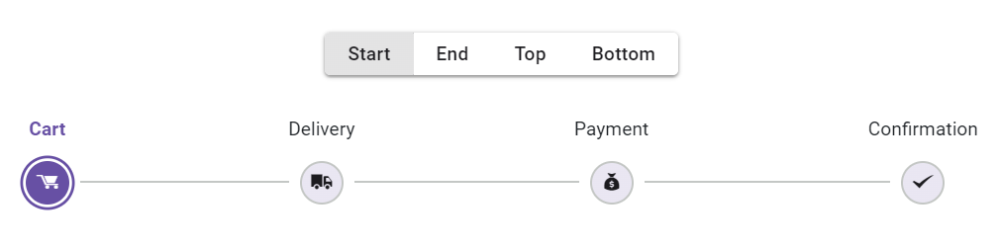
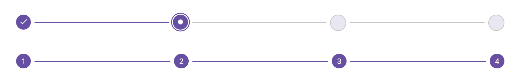

# StepType

The [StepType](https://help.syncfusion.com/cr/blazor/Syncfusion.Blazor.Navigations.SfStepper.html#Syncfusion_Blazor_Navigations_SfStepper_StepType) property in the Stepper determines whether steps should be displayed using only with indicators, only labels, or a combination of both. The available values for this property are [Default](https://help.syncfusion.com/cr/blazor/Syncfusion.Blazor.Navigations.StepperType.html#Syncfusion_Blazor_Navigations_StepperType_Default), [Label](https://help.syncfusion.com/cr/blazor/Syncfusion.Blazor.Navigations.StepperType.html#Syncfusion_Blazor_Navigations_StepperType_Label), and [Indicator](https://help.syncfusion.com/cr/blazor/Syncfusion.Blazor.Navigations.StepperType.html#Syncfusion_Blazor_Navigations_StepperType_Indicator).

## Default

Steps are displayed with icons and the labels when defined.

## Label

Steps are displayed with their defined labels only.

### Label positions

The Stepper control allows you to place the label on the top, bottom, left, or right side of the stepper using the [LabelPosition](https://help.syncfusion.com/cr/blazor/Syncfusion.Blazor.Navigations.SfStepper.html#Syncfusion_Blazor_Navigations_SfStepper_LabelPosition) property.

The following label positions are supported in stepper:

* [Top](https://help.syncfusion.com/cr/blazor/Syncfusion.Blazor.Navigations.StepperLabelPosition.html#Syncfusion_Blazor_Navigations_StepperLabelPosition_Top): Positions the label at the top of the stepper.
* [Bottom](https://help.syncfusion.com/cr/blazor/Syncfusion.Blazor.Navigations.StepperLabelPosition.html#Syncfusion_Blazor_Navigations_StepperLabelPosition_Bottom): Positions the label at the bottom of the stepper.
* [Start](https://help.syncfusion.com/cr/blazor/Syncfusion.Blazor.Navigations.StepperLabelPosition.html#Syncfusion_Blazor_Navigations_StepperLabelPosition_Start): Positions the label to the left side of the stepper.
* [End](https://help.syncfusion.com/cr/blazor/Syncfusion.Blazor.Navigations.StepperLabelPosition.html#Syncfusion_Blazor_Navigations_StepperLabelPosition_End): Positions the label to the right side of the stepper.

```cshtml

@using Syncfusion.Blazor.Navigations

<div id="container">
    <div class="e-btn-group">
        <input type="radio" id="start" name="position" value="start" @oninput="@(() => updateLabelPosition("Start"))" checked />
        <label class="e-btn" for="start">Start</label>
        <input type="radio" id="end" name="position" value="end" @oninput="@(() => updateLabelPosition("End"))" />
        <label class="e-btn" for="end">End</label>
        <input type="radio" id="top" name="position" value="top" @oninput="@(() => updateLabelPosition("Top"))" />
        <label class="e-btn" for="top">Top</label>
        <input type="radio" id="bottom" name="position" value="bottom" @oninput="@(() => updateLabelPosition("Bottom"))" />
        <label class="e-btn" for="bottom">Bottom</label>
    </div>
    <div class="label-stepper-control">
        <SfStepper LabelPosition=@labelPosition>
            <StepperSteps>
                <StepperStep IconCss="sf-icon-cart" Label="Cart"></StepperStep>
                <StepperStep IconCss="sf-icon-transport" Label="Delivery"></StepperStep>
                <StepperStep IconCss="sf-icon-payment" Label="Payment"></StepperStep>
                <StepperStep IconCss="sf-icon-success" Label="Confirmation"></StepperStep>
            </StepperSteps>
        </SfStepper>
    </div>
</div>

@code {
    private StepperLabelPosition labelPosition;
    private void updateLabelPosition(string val)
    {
        labelPosition = val == "Start" ? StepperLabelPosition.Start : val == "End" ? StepperLabelPosition.End : val == "Top" ? StepperLabelPosition.Top : StepperLabelPosition.Bottom;
    }
}

<style>
    @@font-face {
        font-family: 'Default';
        src:
        url(data:application/x-font-ttf;charset=utf-8;base64,AAEAAAAKAIAAAwAgT1MvMj1vSgcAAAEoAAAAVmNtYXCDeIPaAAABmAAAAF5nbHlmEwr+pwAAAggAAAjQaGVhZCYp2+EAAADQAAAANmhoZWEIUQQHAAAArAAAACRobXR4GAAAAAAAAYAAAAAYbG9jYQhUBlAAAAH4AAAADm1heHABFgErAAABCAAAACBuYW1luF5THQAACtgAAAIlcG9zdJ8LuoMAAA0AAAAAbwABAAAEAAAAAFwEAAAAAAAD9AABAAAAAAAAAAAAAAAAAAAABgABAAAAAQAArxT6wV8PPPUACwQAAAAAAOGLy6UAAAAA4YvLpQAAAAAD9AOaAAAACAACAAAAAAAAAAEAAAAGAR8ABgAAAAAAAgAAAAoACgAAAP8AAAAAAAAAAQQAAZAABQAAAokCzAAAAI8CiQLMAAAB6wAyAQgAAAIABQMAAAAAAAAAAAAAAAAAAAAAAAAAAAAAUGZFZABA5wLnFQQAAAAAXAQAAAAAAAABAAAAAAAABAAAAAQAAAAEAAAABAAAAAQAAAAEAAAAAAAAAgAAAAMAAAAUAAMAAQAAABQABABKAAAADAAIAAIABOcC5wbnCOcQ5xX//wAA5wLnBucI5xDnFf//AAAAAAAAAAAAAAABAAwADAAMAAwADAAAAAEABAACAAMABQAAAAAAAAEQAiwC3AQkBGgAAAAFAAAAAAP0A18APwB/AIkAxgDrAAABHw8/Dy8OKwEPDQUfDz8PLw4rAQ8NAR8FFSM1JxEfBz8OOwEfDjM/BzUnIw8GATM/Dx8PMxEhAq8BAQIEBAUFBwYICAgJCQoKCgkKCAkIBwcHBQUEAwMBAQEBAwMEBQUHBwcICQgKCQoKCgkJCAgIBgcFBQQEAgH+CwEBAgQEBQUHBggICAkJCgoKCQoICQgHBwcFBQQDAwEBAQEDAwQFBQcHBwgJCAoJCgoKCQkICAgGBwUFBAQCAQJ8AwUIWAwD3n0BAwMGBgYICAMEBQYHBwkJCgsLDA0NDQ4ODQ4MDAwLCgkJCAYGBQMDKAgIBwYFBAECvLsICAYHBQMD/beAAwQFBQcHCAkKCgsLDA0MDg0NDQwLCwsJCQkHBwUFAwKE/eMBAQoJCQkJCAcHBgYFBAMDAQEBAQMDBAUGBgcHCAkJCQkKCgoJCQgICAcGBgQFAwICAgIDBAUFBgcHCAkJCQoLCgkJCQkIBwcGBgUEAwMBAQEBAwMEBQYGBwcICQkJCQoKCgkJCAgIBwYGBAUDAgICAgMEBQUGBwcICQkJCgGuAQIGehYJBKYp/l0ICAcGBQQCAQ0NDQwLCgoJCAgGBQUDAgIDBQUGCAgJCgoLDA0NDQECBAUGBwQI1foBAgQFBgcH/iwNDAwLCwoJCQgHBgUEAwEBAQEDBAUGBwgJCQoLCwwMDQJJAAAABgAAAAAD8wOWAAYAQgBaAGwArQDuAAABBzcfAwUhLwIHIy8PNS8CKwIPHQEHLwEjDwE1LwMjNz0BJzcfBTcfAg8BLwY3OwEfAQcVHw8/Dy8PDw4BFR8PPw8vDw8OAxEWBgEDAgb8/wNuBAUEDQsVFBQTEhEPDw0GCwoIBgQCFhITE+wQDw8PDg4ODg0NDQwNCwwKCwoKCQgJBwcHBgYEBQMEA5FrBAQDBAMBAwMDBgIDagIEBgYGBxwCAwIBFQYGBAgFBgIWAgQHCPcBAgQGBggKCgsMDQ4PDxAQEBAPDw4NDAsLCQgGBgQCAQECBAYGCAkLCwwNDg8PEBAQEA8PDg0MCwoKCAYGBAL+KgEEBQgKCw0PEBETFBQWFxcXFhYUFBMREQ4NDAkIBgMBAQMGCAkMDQ4RERMUFBYWFxcXFhQUExEQDw0LCggFBAEXBhcFBAMDrxYWDQEBAwUHCAsMDQ4IERESFBQUFQQDAgECAgMEBAUGBgYIBwgJCQoKCwsLDAwMDQ0ODQ4PDgEZawIBAQIGBQMCAQQDBgZqBgoHBQMDMAMHBwMWAQICBQYKChYCBlwICBAPDw4NDAsLCQgGBgQCAQECBAYGCAkLCwwNDg8PEBAQEA8PDg0MCwoKCAYGAwMBAQMDBgYICgoLDA0ODw8QATMLDBYVFRQSERAPDQsKCAUEAQEEBQgKCw0PEBESFBUVFhcXFxYVFBISEA8NCwoIBQQBAQQFCAoLDQ8QEhIUFRYXAAAAAAQAAAAAA/QDRwA/AH8AhwCRAAABFR8OPw49AS8NKwEPDQUVHw4/Dj0BLw0rAQ8NEwcTIRMnMSMhMxMhNSEDBzUhA0YBAgMEBAQGBQcGBwgICAgICAgIBwYHBQYEBAQDAgEBAgMEBAQGBQcGBwgICAgICAgIBwYHBQYEBAQDAgH+aAICAgQEBAYFBwYIBwgICAgICAgHBgcFBgQEBAMCAQECAwQEBAYFBwYHCAgICAgICAcIBgcFBgQEBAICAsH6jAFKjPpu/Z3NwgJZ/dzDAf8AAQkICAgHBwcGBgUFBAQCAgEBAQECAgQEBQUGBgcHBwgICAkIBwgHBwYGBQUEAwMCAQECAwMEBQUGBgcHCAcICQgICAcHBwYGBQUEBAICAQEBAQICBAQFBQYGBwcHCAgICQgHCAcHBgYFBQQDAwIBAQIDAwQFBQYGBwcIBwgB+wH+vQFABP5dOgGkAQEAAAADAAAAAANkA5oAnQDxAR4AAAEzHwEdAR8HFQ8DIy8HDwYdAR8WDw0dAQ8BKwIvAT0BLwc9AT8COwEfBj8HLxc/DTU/AwEfDjsBPxEvFiMPFR8BEw8CFR8HMz8HNS8GIw8ELwQrAQ8BAgoCAgENDAwKCggHBQEBAikCAgIEAwQFDA0SBwcGAgIBAQICBgcHBxYKCQkJCAcHBgUFBAMCAQEBAQIDAwQFBQYGBwcPEQECAhUCAQINDAsLCQgHBQICKQICAgQDBAULDhIHBwYCAQEBAQEBAgYHBwcWCgkKCAgHBwYFBQQDAgEBAQECAwMEBAYFBgcHEBABAQED/qwUFRUVFRYWFhYWFxYXFhcXFxcWFxYXFhYWFhYVFRUVFAQCAQICBAUGCAgJCgsLDA0MDQ0NDBk2EQYGqgYGCEsZDQ0NDA0MCwsKCQgIBgUEAgIBAqQCAQEBAwkRNRIHBqADChI1DQoFAgEBAgMEBAoMEw8eTw4IVxkXCwkJBwYCOAIBAiIDAwUGBwgJCgICAQENAQEFAwIDAgECAgMFAwMEBAUDBAMFAwIBAQECAwMEBAUGBgYHCAgICQgHBwcGBgYFBQQEBAYDIgICAQECAiICBAUGBwgJCQMBAgEMAQUDAwIDAQICBAQDBAQEBAQEAwQEAgEBAQICBAMFBQUGBwcICAgJBwgHBgcGBgUFBAQEBQQiAgEBAf6RDAsLCQkICAYGBQUDAwIBAQIDAwUFBgYICAkJCwsMKSckIiAeGxoYFhQTERAPDQwLCgkIDxsJBQUFBQQnEAkKCwwNDxARExQWGBobHiAiJCcCoAMDAwQECA8XPRcKCgUPFz0REAkIBAMDAwMCAQICAwcYAwEaBwQBAgIAAAEAAAAAA/MDNAA0AAABDwQvAw8EHwQ/ETUnIw8LAYsEJwwGAgIwXmMXFBIICCsqKaEqRUclJSYnJykpKiosLC4GFgsCAWMhISIiIiIjIkJAPRwB8AQmCQMBARQuNgsMDgcIJCYnmyZOTycmJiYlJSQjIiIgHwULCAMCAQ4RERITFBUVKy0tFgAAABIA3gABAAAAAAAAAAEAAAABAAAAAAABAAcAAQABAAAAAAACAAcACAABAAAAAAADAAcADwABAAAAAAAEAAcAFgABAAAAAAAFAAsAHQABAAAAAAAGAAcAKAABAAAAAAAKACwALwABAAAAAAALABIAWwADAAEECQAAAAIAbQADAAEECQABAA4AbwADAAEECQACAA4AfQADAAEECQADAA4AiwADAAEECQAEAA4AmQADAAEECQAFABYApwADAAEECQAGAA4AvQADAAEECQAKAFgAywADAAEECQALACQBIyBEZWZhdWx0UmVndWxhckRlZmF1bHREZWZhdWx0VmVyc2lvbiAxLjBEZWZhdWx0Rm9udCBnZW5lcmF0ZWQgdXNpbmcgU3luY2Z1c2lvbiBNZXRybyBTdHVkaW93d3cuc3luY2Z1c2lvbi5jb20AIABEAGUAZgBhAHUAbAB0AFIAZQBnAHUAbABhAHIARABlAGYAYQB1AGwAdABEAGUAZgBhAHUAbAB0AFYAZQByAHMAaQBvAG4AIAAxAC4AMABEAGUAZgBhAHUAbAB0AEYAbwBuAHQAIABnAGUAbgBlAHIAYQB0AGUAZAAgAHUAcwBpAG4AZwAgAFMAeQBuAGMAZgB1AHMAaQBvAG4AIABNAGUAdAByAG8AIABTAHQAdQBkAGkAbwB3AHcAdwAuAHMAeQBuAGMAZgB1AHMAaQBvAG4ALgBjAG8AbQAAAAACAAAAAAAAAAoAAAAAAAAAAAAAAAAAAAAAAAAAAAAAAAYBAgEDAQQBBQEGAQcADXRyYW5zcG9ydC12YW4LdXNlci1tb2RpZnkRc2hvcHBpbmctY2FydF8wMS0Lc3BlbmQtbW9uZXkFY2hlY2sAAAA=) format('truetype');
        font-weight: normal;
        font-style: normal;
    }

    [class^="sf-icon-"], [class*=" sf-icon-"] {
        font-family: 'Default' !important;
        speak: none;
        font-style: normal;
        font-weight: normal;
        font-variant: normal;
        text-transform: none;
        line-height: inherit;
        -webkit-font-smoothing: antialiased;
        -moz-osx-font-smoothing: grayscale;
    }

    .sf-icon-cart:before { content: "\e710"; }
    .sf-icon-transport:before { content: "\e702"; }
    .sf-icon-payment:before { content: "\e706"; }
    .sf-icon-success:before { content: "\e715"; }

    .label-stepper-control {
        margin: 30px auto;
    }

    #container {
       text-align: center;
    }
</style>

```



## Indicator

Steps are displayed with only indicators.

The example below showcases the various types of steps available in the stepper.

```cshtml

@using Syncfusion.Blazor.Navigations

<div id="container">
    <div class="e-btn-group">
        <input type="radio" id="default" name="stepType" value="default" @oninput="@(() => updateType("Default"))" checked />
        <label class="e-btn" for="default">Default</label>
        <input type="radio" id="indicator" name="stepType" value="indicator" @oninput="@(() => updateType("Indicator"))" />
        <label class="e-btn" for="indicator">Indicator</label>
        <input type="radio" id="label" name="stepType" value="label" @oninput="@(() => updateType("Label"))" />
        <label class="e-btn" for="label">Label</label>
    </div>
    <div class="stepType-stepper-control">
        <SfStepper StepType=@stepType>
            <StepperSteps>
                <StepperStep IconCss="sf-icon-cart" Label="Cart"></StepperStep>
                <StepperStep IconCss="sf-icon-transport" Label="Delivery"></StepperStep>
                <StepperStep IconCss="sf-icon-payment" Label="Payment"></StepperStep>
                <StepperStep IconCss="sf-icon-success" Label="Confirmation"></StepperStep>
            </StepperSteps>
        </SfStepper>
    </div>
</div>

@code {
    private StepperType stepType;
    private void updateType(string val)
    {
        stepType = val == "Default" ? StepperType.Default : val == "Indicator" ? StepperType.Indicator : StepperType.Label;
    }
}

<style>
    @@font-face {
        font-family: 'Default';
        src:
        url(data:application/x-font-ttf;charset=utf-8;base64,AAEAAAAKAIAAAwAgT1MvMj1vSgcAAAEoAAAAVmNtYXCDeIPaAAABmAAAAF5nbHlmEwr+pwAAAggAAAjQaGVhZCYp2+EAAADQAAAANmhoZWEIUQQHAAAArAAAACRobXR4GAAAAAAAAYAAAAAYbG9jYQhUBlAAAAH4AAAADm1heHABFgErAAABCAAAACBuYW1luF5THQAACtgAAAIlcG9zdJ8LuoMAAA0AAAAAbwABAAAEAAAAAFwEAAAAAAAD9AABAAAAAAAAAAAAAAAAAAAABgABAAAAAQAArxT6wV8PPPUACwQAAAAAAOGLy6UAAAAA4YvLpQAAAAAD9AOaAAAACAACAAAAAAAAAAEAAAAGAR8ABgAAAAAAAgAAAAoACgAAAP8AAAAAAAAAAQQAAZAABQAAAokCzAAAAI8CiQLMAAAB6wAyAQgAAAIABQMAAAAAAAAAAAAAAAAAAAAAAAAAAAAAUGZFZABA5wLnFQQAAAAAXAQAAAAAAAABAAAAAAAABAAAAAQAAAAEAAAABAAAAAQAAAAEAAAAAAAAAgAAAAMAAAAUAAMAAQAAABQABABKAAAADAAIAAIABOcC5wbnCOcQ5xX//wAA5wLnBucI5xDnFf//AAAAAAAAAAAAAAABAAwADAAMAAwADAAAAAEABAACAAMABQAAAAAAAAEQAiwC3AQkBGgAAAAFAAAAAAP0A18APwB/AIkAxgDrAAABHw8/Dy8OKwEPDQUfDz8PLw4rAQ8NAR8FFSM1JxEfBz8OOwEfDjM/BzUnIw8GATM/Dx8PMxEhAq8BAQIEBAUFBwYICAgJCQoKCgkKCAkIBwcHBQUEAwMBAQEBAwMEBQUHBwcICQgKCQoKCgkJCAgIBgcFBQQEAgH+CwEBAgQEBQUHBggICAkJCgoKCQoICQgHBwcFBQQDAwEBAQEDAwQFBQcHBwgJCAoJCgoKCQkICAgGBwUFBAQCAQJ8AwUIWAwD3n0BAwMGBgYICAMEBQYHBwkJCgsLDA0NDQ4ODQ4MDAwLCgkJCAYGBQMDKAgIBwYFBAECvLsICAYHBQMD/beAAwQFBQcHCAkKCgsLDA0MDg0NDQwLCwsJCQkHBwUFAwKE/eMBAQoJCQkJCAcHBgYFBAMDAQEBAQMDBAUGBgcHCAkJCQkKCgoJCQgICAcGBgQFAwICAgIDBAUFBgcHCAkJCQoLCgkJCQkIBwcGBgUEAwMBAQEBAwMEBQYGBwcICQkJCQoKCgkJCAgIBwYGBAUDAgICAgMEBQUGBwcICQkJCgGuAQIGehYJBKYp/l0ICAcGBQQCAQ0NDQwLCgoJCAgGBQUDAgIDBQUGCAgJCgoLDA0NDQECBAUGBwQI1foBAgQFBgcH/iwNDAwLCwoJCQgHBgUEAwEBAQEDBAUGBwgJCQoLCwwMDQJJAAAABgAAAAAD8wOWAAYAQgBaAGwArQDuAAABBzcfAwUhLwIHIy8PNS8CKwIPHQEHLwEjDwE1LwMjNz0BJzcfBTcfAg8BLwY3OwEfAQcVHw8/Dy8PDw4BFR8PPw8vDw8OAxEWBgEDAgb8/wNuBAUEDQsVFBQTEhEPDw0GCwoIBgQCFhITE+wQDw8PDg4ODg0NDQwNCwwKCwoKCQgJBwcHBgYEBQMEA5FrBAQDBAMBAwMDBgIDagIEBgYGBxwCAwIBFQYGBAgFBgIWAgQHCPcBAgQGBggKCgsMDQ4PDxAQEBAPDw4NDAsLCQgGBgQCAQECBAYGCAkLCwwNDg8PEBAQEA8PDg0MCwoKCAYGBAL+KgEEBQgKCw0PEBETFBQWFxcXFhYUFBMREQ4NDAkIBgMBAQMGCAkMDQ4RERMUFBYWFxcXFhQUExEQDw0LCggFBAEXBhcFBAMDrxYWDQEBAwUHCAsMDQ4IERESFBQUFQQDAgECAgMEBAUGBgYIBwgJCQoKCwsLDAwMDQ0ODQ4PDgEZawIBAQIGBQMCAQQDBgZqBgoHBQMDMAMHBwMWAQICBQYKChYCBlwICBAPDw4NDAsLCQgGBgQCAQECBAYGCAkLCwwNDg8PEBAQEA8PDg0MCwoKCAYGAwMBAQMDBgYICgoLDA0ODw8QATMLDBYVFRQSERAPDQsKCAUEAQEEBQgKCw0PEBESFBUVFhcXFxYVFBISEA8NCwoIBQQBAQQFCAoLDQ8QEhIUFRYXAAAAAAQAAAAAA/QDRwA/AH8AhwCRAAABFR8OPw49AS8NKwEPDQUVHw4/Dj0BLw0rAQ8NEwcTIRMnMSMhMxMhNSEDBzUhA0YBAgMEBAQGBQcGBwgICAgICAgIBwYHBQYEBAQDAgEBAgMEBAQGBQcGBwgICAgICAgIBwYHBQYEBAQDAgH+aAICAgQEBAYFBwYIBwgICAgICAgHBgcFBgQEBAMCAQECAwQEBAYFBwYHCAgICAgICAcIBgcFBgQEBAICAsH6jAFKjPpu/Z3NwgJZ/dzDAf8AAQkICAgHBwcGBgUFBAQCAgEBAQECAgQEBQUGBgcHBwgICAkIBwgHBwYGBQUEAwMCAQECAwMEBQUGBgcHCAcICQgICAcHBwYGBQUEBAICAQEBAQICBAQFBQYGBwcHCAgICQgHCAcHBgYFBQQDAwIBAQIDAwQFBQYGBwcIBwgB+wH+vQFABP5dOgGkAQEAAAADAAAAAANkA5oAnQDxAR4AAAEzHwEdAR8HFQ8DIy8HDwYdAR8WDw0dAQ8BKwIvAT0BLwc9AT8COwEfBj8HLxc/DTU/AwEfDjsBPxEvFiMPFR8BEw8CFR8HMz8HNS8GIw8ELwQrAQ8BAgoCAgENDAwKCggHBQEBAikCAgIEAwQFDA0SBwcGAgIBAQICBgcHBxYKCQkJCAcHBgUFBAMCAQEBAQIDAwQFBQYGBwcPEQECAhUCAQINDAsLCQgHBQICKQICAgQDBAULDhIHBwYCAQEBAQEBAgYHBwcWCgkKCAgHBwYFBQQDAgEBAQECAwMEBAYFBgcHEBABAQED/qwUFRUVFRYWFhYWFxYXFhcXFxcWFxYXFhYWFhYVFRUVFAQCAQICBAUGCAgJCgsLDA0MDQ0NDBk2EQYGqgYGCEsZDQ0NDA0MCwsKCQgIBgUEAgIBAqQCAQEBAwkRNRIHBqADChI1DQoFAgEBAgMEBAoMEw8eTw4IVxkXCwkJBwYCOAIBAiIDAwUGBwgJCgICAQENAQEFAwIDAgECAgMFAwMEBAUDBAMFAwIBAQECAwMEBAUGBgYHCAgICQgHBwcGBgYFBQQEBAYDIgICAQECAiICBAUGBwgJCQMBAgEMAQUDAwIDAQICBAQDBAQEBAQEAwQEAgEBAQICBAMFBQUGBwcICAgJBwgHBgcGBgUFBAQEBQQiAgEBAf6RDAsLCQkICAYGBQUDAwIBAQIDAwUFBgYICAkJCwsMKSckIiAeGxoYFhQTERAPDQwLCgkIDxsJBQUFBQQnEAkKCwwNDxARExQWGBobHiAiJCcCoAMDAwQECA8XPRcKCgUPFz0REAkIBAMDAwMCAQICAwcYAwEaBwQBAgIAAAEAAAAAA/MDNAA0AAABDwQvAw8EHwQ/ETUnIw8LAYsEJwwGAgIwXmMXFBIICCsqKaEqRUclJSYnJykpKiosLC4GFgsCAWMhISIiIiIjIkJAPRwB8AQmCQMBARQuNgsMDgcIJCYnmyZOTycmJiYlJSQjIiIgHwULCAMCAQ4RERITFBUVKy0tFgAAABIA3gABAAAAAAAAAAEAAAABAAAAAAABAAcAAQABAAAAAAACAAcACAABAAAAAAADAAcADwABAAAAAAAEAAcAFgABAAAAAAAFAAsAHQABAAAAAAAGAAcAKAABAAAAAAAKACwALwABAAAAAAALABIAWwADAAEECQAAAAIAbQADAAEECQABAA4AbwADAAEECQACAA4AfQADAAEECQADAA4AiwADAAEECQAEAA4AmQADAAEECQAFABYApwADAAEECQAGAA4AvQADAAEECQAKAFgAywADAAEECQALACQBIyBEZWZhdWx0UmVndWxhckRlZmF1bHREZWZhdWx0VmVyc2lvbiAxLjBEZWZhdWx0Rm9udCBnZW5lcmF0ZWQgdXNpbmcgU3luY2Z1c2lvbiBNZXRybyBTdHVkaW93d3cuc3luY2Z1c2lvbi5jb20AIABEAGUAZgBhAHUAbAB0AFIAZQBnAHUAbABhAHIARABlAGYAYQB1AGwAdABEAGUAZgBhAHUAbAB0AFYAZQByAHMAaQBvAG4AIAAxAC4AMABEAGUAZgBhAHUAbAB0AEYAbwBuAHQAIABnAGUAbgBlAHIAYQB0AGUAZAAgAHUAcwBpAG4AZwAgAFMAeQBuAGMAZgB1AHMAaQBvAG4AIABNAGUAdAByAG8AIABTAHQAdQBkAGkAbwB3AHcAdwAuAHMAeQBuAGMAZgB1AHMAaQBvAG4ALgBjAG8AbQAAAAACAAAAAAAAAAoAAAAAAAAAAAAAAAAAAAAAAAAAAAAAAAYBAgEDAQQBBQEGAQcADXRyYW5zcG9ydC12YW4LdXNlci1tb2RpZnkRc2hvcHBpbmctY2FydF8wMS0Lc3BlbmQtbW9uZXkFY2hlY2sAAAA=) format('truetype');
        font-weight: normal;
        font-style: normal;
    }

    [class^="sf-icon-"], [class*=" sf-icon-"] {
        font-family: 'Default' !important;
        speak: none;
        font-style: normal;
        font-weight: normal;
        font-variant: normal;
        text-transform: none;
        line-height: inherit;
        -webkit-font-smoothing: antialiased;
        -moz-osx-font-smoothing: grayscale;
    }

    .sf-icon-cart:before { content: "\e710"; }
    .sf-icon-transport:before { content: "\e702"; }
    .sf-icon-payment:before { content: "\e706"; }
    .sf-icon-success:before { content: "\e715"; }

    .stepType-stepper-control {
        margin: 30px auto;
    }

    #container {
       text-align: center;
    }
</style>

```

