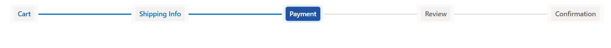
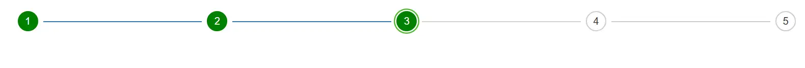
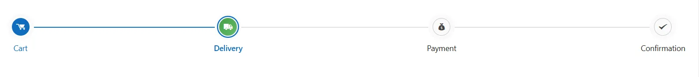
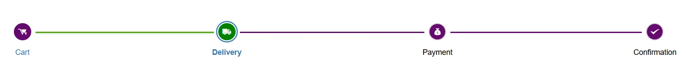

# Style and appearance in Blazor Stepper Component

The following content provides the exact CSS structure that can be used to modify the control's appearance based on the user preference.

## Customizing the stepper progress bar container

Use the following CSS to customize the overall progress bar container of the Stepper.

```css
    .e-stepper .e-stepper-progressbar {
        background-color: #0a0000;
        height: 3px;
        border-radius: 3px;
    }
```


## Customizing the stepper progress bar value

The progress bar value in the Stepper component automatically increases as each step is progressed. You can customize its appearance using CSS to make it visually consistent and more appealing

```css

    .e-stepper .e-stepper-progressbar .e-progressbar-value {
        background: linear-gradient(90deg, #4da40d, #4da40d);
        height: 3px;
        box-shadow: 0 1px 3px rgba(0,0,0,0.2);
    }


```


## Customizing stepper label content

You can customize the label text that appears next to each step in the Stepper by targeting the `.e-label` class. This allows you to change font size, weight, background, and colors for active, completed, and upcoming steps.

```css

@using Syncfusion.Blazor.Navigations

<SfStepper ActiveStep="1" CssClass="custom-stepper">
    <StepperSteps>
        <StepperStep Label="Cart"></StepperStep>
        <StepperStep Label="Shipping Info"></StepperStep>
        <StepperStep Label="Payment"></StepperStep>
        <StepperStep Label="Review"></StepperStep>
        <StepperStep Label="Confirmation"></StepperStep>
    </StepperSteps>
</SfStepper>

<style>
  
    /* General label styling */
    .custom-stepper .e-step-container .e-label {
        font-size: 14px;
        font-weight: 600;
        padding: 4px 8px;
        border-radius: 4px;
        background: #f3f2f1;
        color: #605e5c;
        transition: all 0.3s ease;
    }

    /* Active step label */
    .custom-stepper .e-step-container.e-step-selected .e-label {
        background: #1e4fa0fa;
        color: #fff;
        box-shadow: 0 0 6px rgba(0, 120, 212, 0.5);
    }

    /* Hover effect for labels */
    .custom-stepper .e-step-container .e-label:hover {
        border: 1px solid #fff;
        cursor: pointer;
    }
</style>

```



## Customizing selected stepper item

Use the following CSS to highlight the selected step item.

```css

    .e-stepper .e-step-container.e-step-selected .e-step-content {
        background-color: green;
        color: #fff;
        border-radius: 50%;
        padding: 8px;
    }

    .e-stepper:not(.e-steps-focus) .e-step-selected .e-step {
        box-shadow: 0 0 0 2px #fff, 0 0 0 4px #52b931, 0 0 0 8px #fff;
    }

    .e-stepper .e-step-completed .e-step {
        background: green;
        color: #fff;
    }

```




## Customizing hover state of stepper indicators

Use the following CSS to customize the hover state of step indicators when the Stepper type is not label-based.

```css

    .e-stepper:not(.e-step-type-label) .e-indicator:hover,
    .e-stepper:not(.e-step-type-label) .e-step:hover {
        background: linear-gradient(135deg, #43a047, #66bb6a);
        color: #fff;
        cursor: pointer;
        transition: all 0.3s ease;
    }
```



## Customize each step item

You can use the [CssClass](https://help.syncfusion.com/cr/blazor/Syncfusion.Blazor.Navigations.StepperStep.html#Syncfusion_Blazor_Navigations_StepperStep_CssClass) property to customize the appearance of each step.

```cshtml

@using Syncfusion.Blazor.Navigations

<div id="container">
    <div class="linear-stepper-control">
        <SfStepper Linear=true>
            <StepperSteps>
                <StepperStep CssClass="first-step" IconCss="sf-icon-cart" Label="Cart"></StepperStep>
                <StepperStep CssClass="second-step" IconCss="sf-icon-transport" Label="Delivery"></StepperStep>
                <StepperStep CssClass="third-step" IconCss="sf-icon-payment" Label="Payment"></StepperStep>
                <StepperStep CssClass="fourth-step"  IconCss="sf-icon-success" Label="Confirmation"></StepperStep>
            </StepperSteps>
        </SfStepper>
    </div>
</div>

<style>
    @@font-face {
        font-family: 'Default';
        src: url(data:application/x-font-ttf;charset=utf-8;base64,AAEAAAAKAIAAAwAgT1MvMj1vSgcAAAEoAAAAVmNtYXCDeIPaAAABmAAAAF5nbHlmEwr+pwAAAggAAAjQaGVhZCYp2+EAAADQAAAANmhoZWEIUQQHAAAArAAAACRobXR4GAAAAAAAAYAAAAAYbG9jYQhUBlAAAAH4AAAADm1heHABFgErAAABCAAAACBuYW1luF5THQAACtgAAAIlcG9zdJ8LuoMAAA0AAAAAbwABAAAEAAAAAFwEAAAAAAAD9AABAAAAAAAAAAAAAAAAAAAABgABAAAAAQAArxT6wV8PPPUACwQAAAAAAOGLy6UAAAAA4YvLpQAAAAAD9AOaAAAACAACAAAAAAAAAAEAAAAGAR8ABgAAAAAAAgAAAAoACgAAAP8AAAAAAAAAAQQAAZAABQAAAokCzAAAAI8CiQLMAAAB6wAyAQgAAAIABQMAAAAAAAAAAAAAAAAAAAAAAAAAAAAAUGZFZABA5wLnFQQAAAAAXAQAAAAAAAABAAAAAAAABAAAAAQAAAAEAAAABAAAAAQAAAAEAAAAAAAAAgAAAAMAAAAUAAMAAQAAABQABABKAAAADAAIAAIABOcC5wbnCOcQ5xX//wAA5wLnBucI5xDnFf//AAAAAAAAAAAAAAABAAwADAAMAAwADAAAAAEABAACAAMABQAAAAAAAAEQAiwC3AQkBGgAAAAFAAAAAAP0A18APwB/AIkAxgDrAAABHw8/Dy8OKwEPDQUfDz8PLw4rAQ8NAR8FFSM1JxEfBz8OOwEfDjM/BzUnIw8GATM/Dx8PMxEhAq8BAQIEBAUFBwYICAgJCQoKCgkKCAkIBwcHBQUEAwMBAQEBAwMEBQUHBwcICQgKCQoKCgkJCAgIBgcFBQQEAgH+CwEBAgQEBQUHBggICAkJCgoKCQoICQgHBwcFBQQDAwEBAQEDAwQFBQcHBwgJCAoJCgoKCQkICAgGBwUFBAQCAQJ8AwUIWAwD3n0BAwMGBgYICAMEBQYHBwkJCgsLDA0NDQ4ODQ4MDAwLCgkJCAYGBQMDKAgIBwYFBAECvLsICAYHBQMD/beAAwQFBQcHCAkKCgsLDA0MDg0NDQwLCwsJCQkHBwUFAwKE/eMBAQoJCQkJCAcHBgYFBAMDAQEBAQMDBAUGBgcHCAkJCQkKCgoJCQgICAcGBgQFAwICAgIDBAUFBgcHCAkJCQoLCgkJCQkIBwcGBgUEAwMBAQEBAwMEBQYGBwcICQkJCQoKCgkJCAgIBwYGBAUDAgICAgMEBQUGBwcICQkJCgGuAQIGehYJBKYp/l0ICAcGBQQCAQ0NDQwLCgoJCAgGBQUDAgIDBQUGCAgJCgoLDA0NDQECBAUGBwQI1foBAgQFBgcH/iwNDAwLCwoJCQgHBgUEAwEBAQEDBAUGBwgJCQoLCwwMDQJJAAAABgAAAAAD8wOWAAYAQgBaAGwArQDuAAABBzcfAwUhLwIHIy8PNS8CKwIPHQEHLwEjDwE1LwMjNz0BJzcfBTcfAg8BLwY3OwEfAQcVHw8/Dy8PDw4BFR8PPw8vDw8OAxEWBgEDAgb8/wNuBAUEDQsVFBQTEhEPDw0GCwoIBgQCFhITE+wQDw8PDg4ODg0NDQwNCwwKCwoKCQgJBwcHBgYEBQMEA5FrBAQDBAMBAwMDBgIDagIEBgYGBxwCAwIBFQYGBAgFBgIWAgQHCPcBAgQGBggKCgsMDQ4PDxAQEBAPDw4NDAsLCQgGBgQCAQECBAYGCAkLCwwNDg8PEBAQEA8PDg0MCwoKCAYGBAL+KgEEBQgKCw0PEBETFBQWFxcXFhYUFBMREQ4NDAkIBgMBAQMGCAkMDQ4RERMUFBYWFxcXFhQUExEQDw0LCggFBAEXBhcFBAMDrxYWDQEBAwUHCAsMDQ4IERESFBQUFQQDAgECAgMEBAUGBgYIBwgJCQoKCwsLDAwMDQ0ODQ4PDgEZawIBAQIGBQMCAQQDBgZqBgoHBQMDMAMHBwMWAQICBQYKChYCBlwICBAPDw4NDAsLCQgGBgQCAQECBAYGCAkLCwwNDg8PEBAQEA8PDg0MCwoKCAYGAwMBAQMDBgYICgoLDA0ODw8QATMLDBYVFRQSERAPDQsKCAUEAQEEBQgKCw0PEBESFBUVFhcXFxYVFBISEA8NCwoIBQQBAQQFCAoLDQ8QEhIUFRYXAAAAAAQAAAAAA/QDRwA/AH8AhwCRAAABFR8OPw49AS8NKwEPDQUVHw4/Dj0BLw0rAQ8NEwcTIRMnMSMhMxMhNSEDBzUhA0YBAgMEBAQGBQcGBwgICAgICAgIBwYHBQYEBAQDAgEBAgMEBAQGBQcGBwgICAgICAgIBwYHBQYEBAQDAgH+aAICAgQEBAYFBwYIBwgICAgICAgHBgcFBgQEBAMCAQECAwQEBAYFBwYHCAgICAgICAcIBgcFBgQEBAICAsH6jAFKjPpu/Z3NwgJZ/dzDAf8AAQkICAgHBwcGBgUFBAQCAgEBAQECAgQEBQUGBgcHBwgICAkIBwgHBwYGBQUEAwMCAQECAwMEBQUGBgcHCAcICQgICAcHBwYGBQUEBAICAQEBAQICBAQFBQYGBwcHCAgICQgHCAcHBgYFBQQDAwIBAQIDAwQFBQYGBwcIBwgB+wH+vQFABP5dOgGkAQEAAAADAAAAAANkA5oAnQDxAR4AAAEzHwEdAR8HFQ8DIy8HDwYdAR8WDw0dAQ8BKwIvAT0BLwc9AT8COwEfBj8HLxc/DTU/AwEfDjsBPxEvFiMPFR8BEw8CFR8HMz8HNS8GIw8ELwQrAQ8BAgoCAgENDAwKCggHBQEBAikCAgIEAwQFDA0SBwcGAgIBAQICBgcHBxYKCQkJCAcHBgUFBAMCAQEBAQIDAwQFBQYGBwcPEQECAhUCAQINDAsLCQgHBQICKQICAgQDBAULDhIHBwYCAQEBAQEBAgYHBwcWCgkKCAgHBwYFBQQDAgEBAQECAwMEBAYFBgcHEBABAQED/qwUFRUVFRYWFhYWFxYXFhcXFxcWFxYXFhYWFhYVFRUVFAQCAQICBAUGCAgJCgsLDA0MDQ0NDBk2EQYGqgYGCEsZDQ0NDA0MCwsKCQgIBgUEAgIBAqQCAQEBAwkRNRIHBqADChI1DQoFAgEBAgMEBAoMEw8eTw4IVxkXCwkJBwYCOAIBAiIDAwUGBwgJCgICAQENAQEFAwIDAgECAgMFAwMEBAUDBAMFAwIBAQECAwMEBAUGBgYHCAgICQgHBwcGBgYFBQQEBAYDIgICAQECAiICBAUGBwgJCQMBAgEMAQUDAwIDAQICBAQDBAQEBAQEAwQEAgEBAQICBAMFBQUGBwcICAgJBwgHBgcGBgUFBAQEBQQiAgEBAf6RDAsLCQkICAYGBQUDAwIBAQIDAwUFBgYICAkJCwsMKSckIiAeGxoYFhQTERAPDQwLCgkIDxsJBQUFBQQnEAkKCwwNDxARExQWGBobHiAiJCcCoAMDAwQECA8XPRcKCgUPFz0REAkIBAMDAwMCAQICAwcYAwEaBwQBAgIAAAEAAAAAA/MDNAA0AAABDwQvAw8EHwQ/ETUnIw8LAYsEJwwGAgIwXmMXFBIICCsqKaEqRUclJSYnJykpKiosLC4GFgsCAWMhISIiIiIjIkJAPRwB8AQmCQMBARQuNgsMDgcIJCYnmyZOTycmJiYlJSQjIiIgHwULCAMCAQ4RERITFBUVKy0tFgAAABIA3gABAAAAAAAAAAEAAAABAAAAAAABAAcAAQABAAAAAAACAAcACAABAAAAAAADAAcADwABAAAAAAAEAAcAFgABAAAAAAAFAAsAHQABAAAAAAAGAAcAKAABAAAAAAAKACwALwABAAAAAAALABIAWwADAAEECQAAAAIAbQADAAEECQABAA4AbwADAAEECQACAA4AfQADAAEECQADAA4AiwADAAEECQAEAA4AmQADAAEECQAFABYApwADAAEECQAGAA4AvQADAAEECQAKAFgAywADAAEECQALACQBIyBEZWZhdWx0UmVndWxhckRlZmF1bHREZWZhdWx0VmVyc2lvbiAxLjBEZWZhdWx0Rm9udCBnZW5lcmF0ZWQgdXNpbmcgU3luY2Z1c2lvbiBNZXRybyBTdHVkaW93d3cuc3luY2Z1c2lvbi5jb20AIABEAGUAZgBhAHUAbAB0AFIAZQBnAHUAbABhAHIARABlAGYAYQB1AGwAdABEAGUAZgBhAHUAbAB0AFYAZQByAHMAaQBvAG4AIAAxAC4AMABEAGUAZgBhAHUAbAB0AEYAbwBuAHQAIABnAGUAbgBlAHIAYQB0AGUAZAAgAHUAcwBpAG4AZwAgAFMAeQBuAGMAZgB1AHMAaQBvAG4AIABNAGUAdAByAG8AIABTAHQAdQBkAGkAbwB3AHcAdwAuAHMAeQBuAGMAZgB1AHMAaQBvAG4ALgBjAG8AbQAAAAACAAAAAAAAAAoAAAAAAAAAAAAAAAAAAAAAAAAAAAAAAAYBAgEDAQQBBQEGAQcADXRyYW5zcG9ydC12YW4LdXNlci1tb2RpZnkRc2hvcHBpbmctY2FydF8wMS0Lc3BlbmQtbW9uZXkFY2hlY2sAAAA=) format('truetype');
        font-weight: normal;
        font-style: normal;
    }

    [class^="sf-icon-"], [class*=" sf-icon-"] {
        font-family: 'Default' !important;
        speak: none;
        font-style: normal;
        font-weight: normal;
        font-variant: normal;
        text-transform: none;
        line-height: inherit;
        -webkit-font-smoothing: antialiased;
        -moz-osx-font-smoothing: grayscale;
    }

    .sf-icon-cart:before {
        content: "\e710";
    }

    .sf-icon-transport:before {
        content: "\e702";
    }

    .sf-icon-payment:before {
        content: "\e706";
    }

    .sf-icon-success:before {
        content: "\e715";
    }

    .linear-stepper-control {
        margin: 30px auto;
    }

    #container {
        text-align: center;
    }

     .e-stepper .first-step .e-step {
        background: #64086e;
        color: #fff;
    }

    .e-stepper .second-step .e-step {
        background: #64086e;
        color: #fff;
    }

    .e-stepper .third-step .e-step {
        background: #64086e;
        color: #fff;
    }

    .e-stepper .fourth-step .e-step {
        background: #64086e;
        color: #fff;
    }

    .e-stepper .first-step .e-indicator:hover,
    .e-stepper .second-step .e-indicator:hover,
    .e-stepper .third-step .e-indicator:hover,
    .e-stepper .fourth-step .e-indicator:hover {
        border: 2px solid gray;
        cursor: pointer;
    }

    .e-stepper .e-step-container.e-step-selected .e-indicator {
        background-color:green;
        color: #fff;
    }


    .e-stepper .e-stepper-progressbar {
        background-color: #64086e;
        height: 3px;
        border-radius: 3px;
    }

    .e-stepper .e-stepper-progressbar .e-progressbar-value {
        background: linear-gradient(90deg, #4da40d, #4da40d);
        height: 3px;
        box-shadow: 0 1px 3px rgba(0,0,0,0.2);
    }
</style>


```

