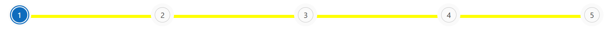
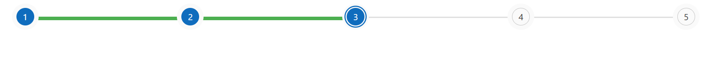
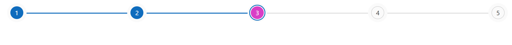
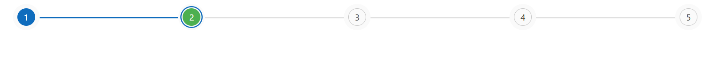
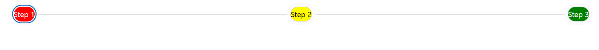

# Style and appearance in Blazor Stepper Component

The following content provides the exact CSS structure that can be used to modify the control's appearance based on the user preference.

## Customizing the stepper progress bar container

Use the following CSS to customize the overall progress bar container of the Stepper.

```css
.e-stepper .e-stepper-progressbar {
    background: yellow;
    height: 6px;
    border-radius: 4px;
}
```


## Customizing the stepper progress bar value

Use the following CSS to customize the progress bar value of the Stepper component.

```css

.e-stepper .e-stepper-progressbar .e-progressbar-value {
    background-color: #4caf50;
    height: 6px;
    border-radius: 3px;
}

```


## Customizing stepper content

Use the following CSS to customize the step content (numbers or labels inside each step).

```css

.e-stepper .e-step-container .e-step-content {
    font-size: 16px;
    font-weight: bold;
    color: #dde216;
}

```


## Customizing selected stepper item

Use the following CSS to highlight the selected step item.

```css

.e-stepper .e-step-container.e-step-selected .e-step-content {
    background-color: #d93ec6;
    color: #fff;
    border-radius: 50%;
    padding: 8px;
}

```




## Customizing hover state of stepper indicators

Use the following CSS to customize the hover state of step indicators when the Stepper type is not label-based.

```css

    .e-stepper:not(.e-step-type-label) .e-indicator:hover,
    .e-stepper:not(.e-step-type-label) .e-step:hover {
        background-color: #4caf50;
        color: #fff;
        cursor: pointer;
        transition: all 0.3s ease;
    }
```



## Customize each step item

You can use the [CssClass](https://help.syncfusion.com/cr/blazor/Syncfusion.Blazor.Navigations.StepperStep.html#Syncfusion_Blazor_Navigations_StepperStep_CssClass) property to customize the appearance of each step.

```cshtml

@using Syncfusion.Blazor.Navigations

<SfStepper>
    <StepperItems>
        <StepperItem CssClass="first-step" Text="Step 1"></StepperItem>
        <StepperItem CssClass="second-step" Text="Step 2"></StepperItem>
        <StepperItem CssClass="third-step" Text="Step 3"></StepperItem>
    </StepperItems>
</SfStepper>

<style>
    .e-stepper .first-step .e-step {
        background: red;
        color: #fff;
    }

    .e-stepper .second-step .e-step {
        background: yellow;
        color: black;
    }

    .e-stepper .third-step .e-step {
        background: green;
        color: #fff;
    }
    .e-stepper .first-step .e-indicator:hover,
    .e-stepper .second-step .e-indicator:hover,
    .e-stepper .third-step .e-indicator:hover {
        border: 2px solid gray;
        cursor: pointer;
    }
</style>


```

