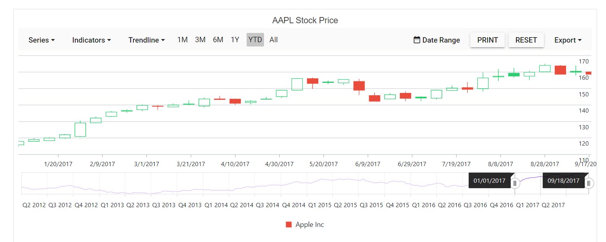
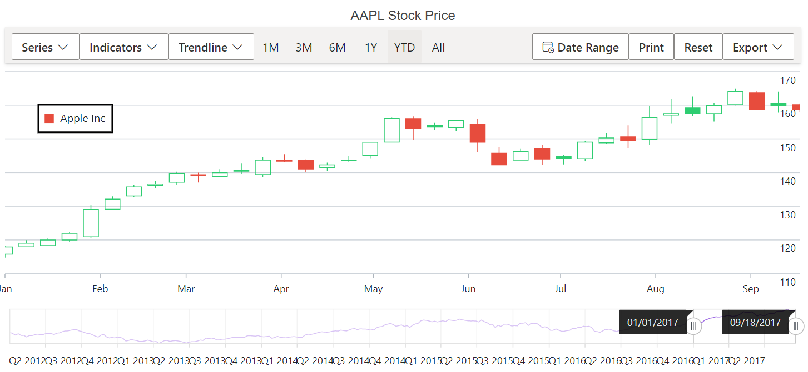
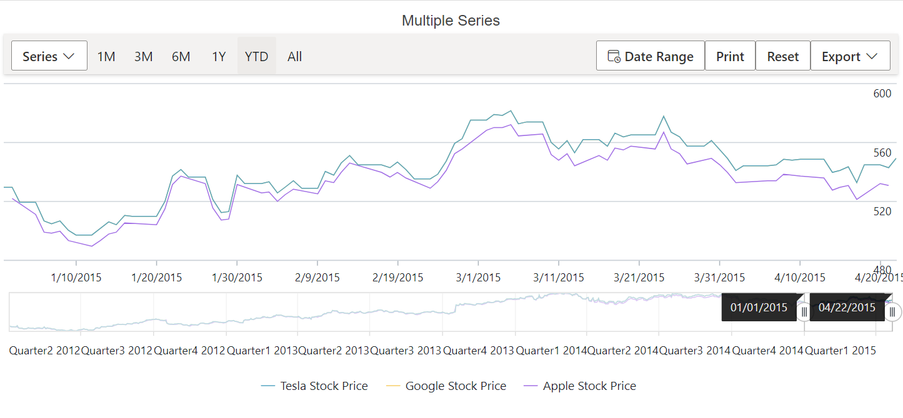
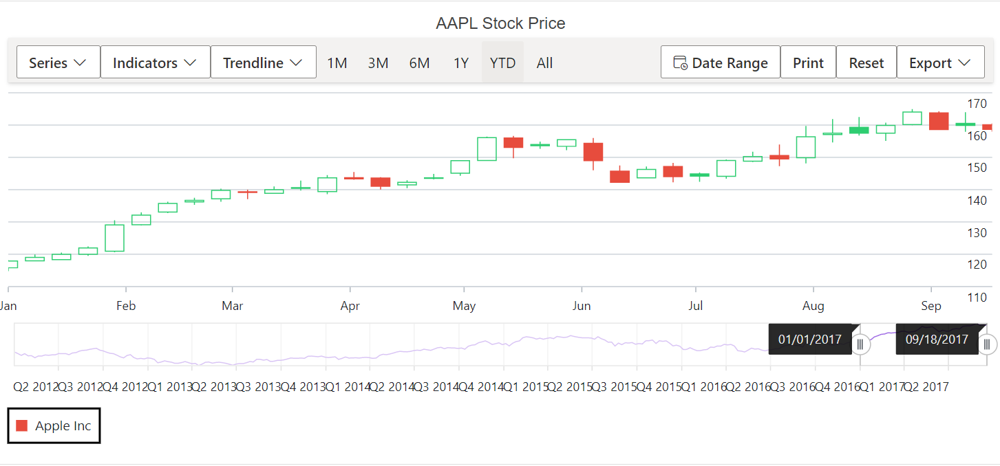
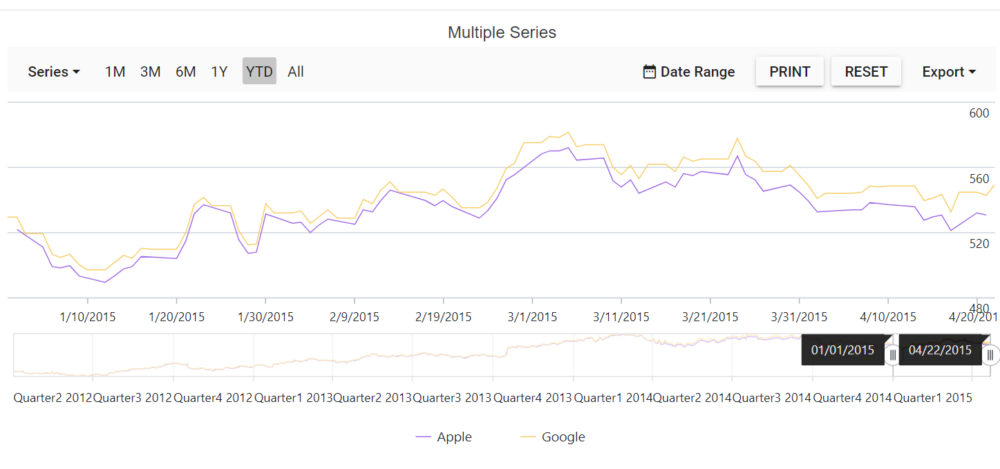
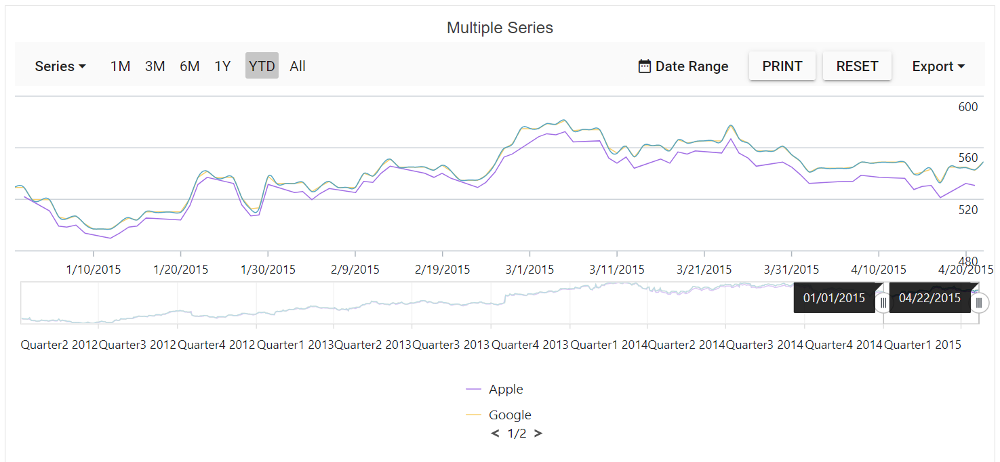
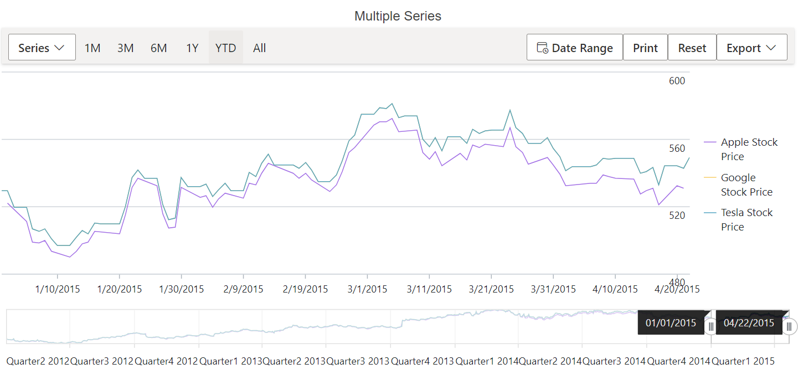

# Legend in Blazor Stock Chart Component

Legend provides information about the series rendered in the Stock chart. Legend can be added to a Stock chart by enabling the `visible` option in the `StockChartlegendSettings`.

## Enable Legend

To display the legend for the Stockchart, set the `visible` property in `StockChartlegendSettings` to true.

```cshtml
@using Syncfusion.Blazor.Charts

        <SfStockChart Title="AAPL Stock Price">
            <StockChartLegendSettings Visible="true"></StockChartLegendSettings>
            <StockChartSeriesCollection>
                <StockChartSeries DataSource="@StockDetails" XName="date" YName="high" Name="Apple Inc" Type="ChartSeriesType.Candle"></StockChartSeries>
            </StockChartSeriesCollection>
        </SfStockChart>
  

@code {
     public class ChartData
    {
        public DateTime Date;
        public Double Open;
        public Double Low;
        public Double Close;
        public Double High;
        public Double Volume;
    }

    public List<ChartData> StockDetails = new List<ChartData>
    {
         new ChartData { Date = new DateTime(2012, 04, 02), Open= 85.9757, High = 90.6657,Low = 85.7685, Close = 90.5257,Volume = 660187068},
         new ChartData { Date = new DateTime(2012, 04, 09), Open= 89.4471, High = 92,Low = 86.2157, Close = 86.4614,Volume = 912634864},
         new ChartData { Date = new DateTime(2012, 04, 16), Open= 87.1514, High = 88.6071,Low = 81.4885, Close = 81.8543,Volume = 1221746066},
         new ChartData { Date = new DateTime(2012, 04, 23), Open= 81.5157, High = 88.2857,Low = 79.2857, Close = 86.1428,Volume = 965935749},
         new ChartData { Date = new DateTime(2012, 04, 30), Open= 85.4, High =  85.4857,Low = 80.7385, Close = 80.75,Volume = 615249365},
   };
}
```




## Position and Alignment

By using the `position` property, legend can be placed at `Left`, `Right`, `Top`, `Bottom` or `Custom` of the Stock Chart. The legend is positioned at the bottom of the Stock Chart, by default.

```cshtml

@using Syncfusion.Blazor.Charts

        <SfStockChart Title="AAPL Stock Price">
            <StockChartLegendSettings Visible="true" Position="LegendPosition.Top"></StockChartLegendSettings>
            <StockChartSeriesCollection>
                <StockChartSeries DataSource="@StockDetails" XName="date" YName="high" Name="Apple Inc" Type="ChartSeriesType.Candle"></StockChartSeries>
            </StockChartSeriesCollection>
        </SfStockChart>
  

@code {
     public class ChartData
    {
        public DateTime Date;
        public Double Open;
        public Double Low;
        public Double Close;
        public Double High;
        public Double Volume;
    }

    public List<ChartData> StockDetails = new List<ChartData>
    {
         new ChartData { Date = new DateTime(2012, 04, 02), Open= 85.9757, High = 90.6657,Low = 85.7685, Close = 90.5257,Volume = 660187068},
         new ChartData { Date = new DateTime(2012, 04, 09), Open= 89.4471, High = 92,Low = 86.2157, Close = 86.4614,Volume = 912634864},
         new ChartData { Date = new DateTime(2012, 04, 16), Open= 87.1514, High = 88.6071,Low = 81.4885, Close = 81.8543,Volume = 1221746066},
         new ChartData { Date = new DateTime(2012, 04, 23), Open= 81.5157, High = 88.2857,Low = 79.2857, Close = 86.1428,Volume = 965935749},
         new ChartData { Date = new DateTime(2012, 04, 30), Open= 85.4, High =  85.4857,Low = 80.7385, Close = 80.75,Volume = 615249365},
   };
}
```


The `Custom` position helps to position the legend anywhere in the Stockchart using x and y coordinates.

```cshtml
@using Syncfusion.Blazor.Charts

        <SfStockChart Title="AAPL Stock Price">
            <StockChartLegendSettings Visible="true" Position="LegendPosition.Custom">
                <StockChartLocation X="50" Y="50"></StockChartLocation>
                <StockChartLegendBorder Color="Black" Width="2"></StockChartLegendBorder>
            </StockChartLegendSettings>
            <StockChartSeriesCollection>
                <StockChartSeries DataSource="@StockDetails" XName="date" YName="high" Name="Apple Inc" Type="ChartSeriesType.Candle"></StockChartSeries>
            </StockChartSeriesCollection>
        </SfStockChart>
  

@code {
     public class ChartData
    {
        public DateTime Date;
        public Double Open;
        public Double Low;
        public Double Close;
        public Double High;
        public Double Volume;
    }

    public List<ChartData> StockDetails = new List<ChartData>
    {
         new ChartData { Date = new DateTime(2012, 04, 02), Open= 85.9757, High = 90.6657,Low = 85.7685, Close = 90.5257,Volume = 660187068},
         new ChartData { Date = new DateTime(2012, 04, 09), Open= 89.4471, High = 92,Low = 86.2157, Close = 86.4614,Volume = 912634864},
         new ChartData { Date = new DateTime(2012, 04, 16), Open= 87.1514, High = 88.6071,Low = 81.4885, Close = 81.8543,Volume = 1221746066},
         new ChartData { Date = new DateTime(2012, 04, 23), Open= 81.5157, High = 88.2857,Low = 79.2857, Close = 86.1428,Volume = 965935749},
         new ChartData { Date = new DateTime(2012, 04, 30), Open= 85.4, High =  85.4857,Low = 80.7385, Close = 80.75,Volume = 615249365},
   };
}
```



## Legend Reverse

You can reverse the order of the legend items by using the `Reverse` property. By default, legend for the first series in the collection will be placed first.

```cshtml
@using Syncfusion.Blazor.Charts

        <SfStockChart Title="AAPL Stock Price">
           <StockChartLegendSettings Visible="true" Reversed="true">
            </StockChartLegendSettings>
           <StockChartSeriesCollection>
                <StockChartSeries DataSource="@StockDetails" Type="ChartSeriesType.Line" XName="x" YName="close" Name="Apple Stock Price"></StockChartSeries>
                <StockChartSeries DataSource="@StockDetails" Type="ChartSeriesType.Line" XName="x" YName="close" Name="Google Stock Price"></StockChartSeries>
                <StockChartSeries DataSource="@StockDetails" Type="ChartSeriesType.Spline" XName="x" YName="close" Name="Tesla Stock Price"></StockChartSeries>
            </StockChartSeriesCollection>
        </SfStockChart>
  

@code {
     public class ChartData
    {
        public DateTime Date;
        public Double Open;
        public Double Low;
        public Double Close;
        public Double High;
        public Double Volume;
    }

    public List<ChartData> StockDetails = new List<ChartData>
    {
         new ChartData { Date = new DateTime(2012, 04, 02), Open= 85.9757, High = 90.6657,Low = 85.7685, Close = 90.5257,Volume = 660187068},
         new ChartData { Date = new DateTime(2012, 04, 09), Open= 89.4471, High = 92,Low = 86.2157, Close = 86.4614,Volume = 912634864},
         new ChartData { Date = new DateTime(2012, 04, 16), Open= 87.1514, High = 88.6071,Low = 81.4885, Close = 81.8543,Volume = 1221746066},
         new ChartData { Date = new DateTime(2012, 04, 23), Open= 81.5157, High = 88.2857,Low = 79.2857, Close = 86.1428,Volume = 965935749},
         new ChartData { Date = new DateTime(2012, 04, 30), Open= 85.4, High =  85.4857,Low = 80.7385, Close = 80.75,Volume = 615249365},
   };
}
```



## Legend Alignment

Using the `Alignment` property, place the legend in `Centre`, `Far`, or `Near` alignment.

```cshtml
@using Syncfusion.Blazor.Charts

        <SfStockChart Title="AAPL Stock Price">
            <StockChartLegendSettings Visible="true" Alignment="Alignment.Near">
            <StockChartLegendBorder Color="Black" Width="2"></StockChartLegendBorder>
            </StockChartLegendSettings>
            <StockChartSeriesCollection>
                <StockChartSeries DataSource="@StockDetails" XName="date" YName="high" Name="Apple Inc" Type="ChartSeriesType.Candle"></StockChartSeries>
            </StockChartSeriesCollection>
        </SfStockChart>
  

@code {
     public class ChartData
    {
        public DateTime Date;
        public Double Open;
        public Double Low;
        public Double Close;
        public Double High;
        public Double Volume;
    }

    public List<ChartData> StockDetails = new List<ChartData>
    {
         new ChartData { Date = new DateTime(2012, 04, 02), Open= 85.9757, High = 90.6657,Low = 85.7685, Close = 90.5257,Volume = 660187068},
         new ChartData { Date = new DateTime(2012, 04, 09), Open= 89.4471, High = 92,Low = 86.2157, Close = 86.4614,Volume = 912634864},
         new ChartData { Date = new DateTime(2012, 04, 16), Open= 87.1514, High = 88.6071,Low = 81.4885, Close = 81.8543,Volume = 1221746066},
         new ChartData { Date = new DateTime(2012, 04, 23), Open= 81.5157, High = 88.2857,Low = 79.2857, Close = 86.1428,Volume = 965935749},
         new ChartData { Date = new DateTime(2012, 04, 30), Open= 85.4, High =  85.4857,Low = 80.7385, Close = 80.75,Volume = 615249365},
   };
}
```



## Legend customization

### Legend Shape

The `LegendShape` property in the `Series` can be used to change the shape of the legend icon. The default icon shape for legends is `SeriesType`.


```cshtml
@using Syncfusion.Blazor.Charts

        <SfStockChart Title="AAPL Stock Price">
            <StockChartLegendSettings Visible="true" ShapeHeight="13" ShapeWidth="13">
            </StockChartLegendSettings>
            <StockChartSeriesCollection>
                <StockChartSeries DataSource="@StockDetails" XName="date" YName="high" Name="Apple Inc" Type="ChartSeriesType.Candle"  LegendShape="LegendShape.Diamond"></StockChartSeries>
            </StockChartSeriesCollection>
        </SfStockChart>
  

@code {
     public class ChartData
    {
        public DateTime Date;
        public Double Open;
        public Double Low;
        public Double Close;
        public Double High;
        public Double Volume;
    }

    public List<ChartData> StockDetails = new List<ChartData>
    {
         new ChartData { Date = new DateTime(2012, 04, 02), Open= 85.9757, High = 90.6657,Low = 85.7685, Close = 90.5257,Volume = 660187068},
         new ChartData { Date = new DateTime(2012, 04, 09), Open= 89.4471, High = 92,Low = 86.2157, Close = 86.4614,Volume = 912634864},
         new ChartData { Date = new DateTime(2012, 04, 16), Open= 87.1514, High = 88.6071,Low = 81.4885, Close = 81.8543,Volume = 1221746066},
         new ChartData { Date = new DateTime(2012, 04, 23), Open= 81.5157, High = 88.2857,Low = 79.2857, Close = 86.1428,Volume = 965935749},
         new ChartData { Date = new DateTime(2012, 04, 30), Open= 85.4, High =  85.4857,Low = 80.7385, Close = 80.75,Volume = 615249365},
   };
}
```


### Legend Size

When the legend is placed on the top or bottom of the Stockchart, it takes up 20% - 25% of the StockChart's height, and 20% - 25% of the StockChart's width when it is positioned on the left or right side of the StockChart. So, the `Width` and `Height` properties can be used to adjust the default legend size.

```cshtml
@using Syncfusion.Blazor.Charts

        <SfStockChart Title="AAPL Stock Price">
           <StockChartLegendSettings Visible="true" Height="50" Width="300">
                <StockChartLegendBorder Color="blue" Width="1"></StockChartLegendBorder>
            </StockChartLegendSettings>
            <StockChartSeriesCollection>
               <StockChartSeries DataSource="@StockDetails" Type="ChartSeriesType.Line" XName="x" YName="close" Name="Apple Stock Price"></StockChartSeries>
                <StockChartSeries DataSource="@StockDetails" Type="ChartSeriesType.Line" XName="x" YName="close" Name="Google Stock Price"></StockChartSeries>
            </StockChartSeriesCollection>
        </SfStockChart>
  

@code {
     public class ChartData
    {
        public DateTime Date;
        public Double Open;
        public Double Low;
        public Double Close;
        public Double High;
        public Double Volume;
    }

    public List<ChartData> StockDetails = new List<ChartData>
    {
         new ChartData { Date = new DateTime(2012, 04, 02), Open= 85.9757, High = 90.6657,Low = 85.7685, Close = 90.5257,Volume = 660187068},
         new ChartData { Date = new DateTime(2012, 04, 09), Open= 89.4471, High = 92,Low = 86.2157, Close = 86.4614,Volume = 912634864},
         new ChartData { Date = new DateTime(2012, 04, 16), Open= 87.1514, High = 88.6071,Low = 81.4885, Close = 81.8543,Volume = 1221746066},
         new ChartData { Date = new DateTime(2012, 04, 23), Open= 81.5157, High = 88.2857,Low = 79.2857, Close = 86.1428,Volume = 965935749},
         new ChartData { Date = new DateTime(2012, 04, 30), Open= 85.4, High =  85.4857,Low = 80.7385, Close = 80.75,Volume = 615249365},
   };
}
```


### Legend Shape Size

The `ShapeHeight` and `ShapeWidth` properties can be used to adjust the dimensions of the legend shape.

```cshtml
@using Syncfusion.Blazor.Charts

        <SfStockChart Title="AAPL Stock Price">
           <StockChartLegendSettings Visible="true" Height="50" Width="300" ShapeHeight="15" ShapeWidth="15">
            </StockChartLegendSettings>
            <StockChartSeriesCollection>
                <StockChartSeries DataSource="@StockDetails" XName="date" YName="high" Name="Apple Inc" Type="ChartSeriesType.Candle"></StockChartSeries>
            </StockChartSeriesCollection>
        </SfStockChart>
  

@code {
     public class ChartData
    {
        public DateTime Date;
        public Double Open;
        public Double Low;
        public Double Close;
        public Double High;
        public Double Volume;
    }

    public List<ChartData> StockDetails = new List<ChartData>
    {
         new ChartData { Date = new DateTime(2012, 04, 02), Open= 85.9757, High = 90.6657,Low = 85.7685, Close = 90.5257,Volume = 660187068},
         new ChartData { Date = new DateTime(2012, 04, 09), Open= 89.4471, High = 92,Low = 86.2157, Close = 86.4614,Volume = 912634864},
         new ChartData { Date = new DateTime(2012, 04, 16), Open= 87.1514, High = 88.6071,Low = 81.4885, Close = 81.8543,Volume = 1221746066},
         new ChartData { Date = new DateTime(2012, 04, 23), Open= 81.5157, High = 88.2857,Low = 79.2857, Close = 86.1428,Volume = 965935749},
         new ChartData { Date = new DateTime(2012, 04, 30), Open= 85.4, High =  85.4857,Low = 80.7385, Close = 80.75,Volume = 615249365},
   };
}
```


### Legend Item Padding

The `ItemPadding` property can be used to adjust the space between the legend items.

```cshtml
@using Syncfusion.Blazor.Charts

        <SfStockChart Title="AAPL Stock Price">
           <StockChartLegendSettings Visible="true" >
            </StockChartLegendSettings>
           <StockChartSeriesCollection>
                <StockChartSeries DataSource="@StockDetails" Type="ChartSeriesType.Line" XName="x" YName="close" Name="Apple"></StockChartSeries>
                <StockChartSeries DataSource="@StockDetails" Type="ChartSeriesType.Line" XName="x" YName="close" Name="Google"></StockChartSeries>
            </StockChartSeriesCollection>
        </SfStockChart>
  

@code {
     public class ChartData
    {
        public DateTime Date;
        public Double Open;
        public Double Low;
        public Double Close;
        public Double High;
        public Double Volume;
    }

    public List<ChartData> StockDetails = new List<ChartData>
    {
         new ChartData { Date = new DateTime(2012, 04, 02), Open= 85.9757, High = 90.6657,Low = 85.7685, Close = 90.5257,Volume = 660187068},
         new ChartData { Date = new DateTime(2012, 04, 09), Open= 89.4471, High = 92,Low = 86.2157, Close = 86.4614,Volume = 912634864},
         new ChartData { Date = new DateTime(2012, 04, 16), Open= 87.1514, High = 88.6071,Low = 81.4885, Close = 81.8543,Volume = 1221746066},
         new ChartData { Date = new DateTime(2012, 04, 23), Open= 81.5157, High = 88.2857,Low = 79.2857, Close = 86.1428,Volume = 965935749},
         new ChartData { Date = new DateTime(2012, 04, 30), Open= 85.4, High =  85.4857,Low = 80.7385, Close = 80.75,Volume = 615249365},
   };
}
```



### Legend Paging

When the legend items exceed legend bounds, paging will be enabled by default. End user can view each legend item using the navigation buttons to navigate between pages.

```cshtml
@using Syncfusion.Blazor.Charts

        <SfStockChart Title="AAPL Stock Price">
           <StockChartLegendSettings Visible="true" Width="100" Height="70" Padding="10" ShapePadding="10">
            </StockChartLegendSettings>
           <StockChartSeriesCollection>
                <StockChartSeries DataSource="@StockDetails" Type="ChartSeriesType.Line" XName="x" YName="close" Name="Apple"></StockChartSeries>
                <StockChartSeries DataSource="@StockDetails" Type="ChartSeriesType.Line" XName="x" YName="close" Name="Google"></StockChartSeries>
                <StockChartSeries DataSource="@StockDetails" Type="ChartSeriesType.Spline" XName="x" YName="close" Name="Tesla"></StockChartSeries>
            </StockChartSeriesCollection>
        </SfStockChart>
  

@code {
     public class ChartData
    {
        public DateTime Date;
        public Double Open;
        public Double Low;
        public Double Close;
        public Double High;
        public Double Volume;
    }

    public List<ChartData> StockDetails = new List<ChartData>
    {
         new ChartData { Date = new DateTime(2012, 04, 02), Open= 85.9757, High = 90.6657,Low = 85.7685, Close = 90.5257,Volume = 660187068},
         new ChartData { Date = new DateTime(2012, 04, 09), Open= 89.4471, High = 92,Low = 86.2157, Close = 86.4614,Volume = 912634864},
         new ChartData { Date = new DateTime(2012, 04, 16), Open= 87.1514, High = 88.6071,Low = 81.4885, Close = 81.8543,Volume = 1221746066},
         new ChartData { Date = new DateTime(2012, 04, 23), Open= 81.5157, High = 88.2857,Low = 79.2857, Close = 86.1428,Volume = 965935749},
         new ChartData { Date = new DateTime(2012, 04, 30), Open= 85.4, High =  85.4857,Low = 80.7385, Close = 80.75,Volume = 615249365},
   };
}
```




### Legend Text Wrap

When the legend text exceeds the container, the text can be wrapped by using `TextWrap` Property. End user can also wrap the legend text based on the `MaximumLabelWidth` property.

```cshtml
@using Syncfusion.Blazor.Charts

        <SfStockChart Title="AAPL Stock Price">
           <StockChartLegendSettings Visible="true" Position="@LegendPosition.Right" TextWrap="@TextWrap.Wrap" MaxLabelWidth="70">
            </StockChartLegendSettings>
           <StockChartSeriesCollection>
                <StockChartSeries DataSource="@StockDetails" Type="ChartSeriesType.Line" XName="x" YName="close" Name="Apple Stock Price"></StockChartSeries>
                <StockChartSeries DataSource="@StockDetails" Type="ChartSeriesType.Line" XName="x" YName="close" Name="Google Stock Price"></StockChartSeries>
                <StockChartSeries DataSource="@StockDetails" Type="ChartSeriesType.Spline" XName="x" YName="close" Name="Tesla Stock Price"></StockChartSeries>
            </StockChartSeriesCollection>
        </SfStockChart>
  

@code {
     public class ChartData
    {
        public DateTime Date;
        public Double Open;
        public Double Low;
        public Double Close;
        public Double High;
        public Double Volume;
    }

    public List<ChartData> StockDetails = new List<ChartData>
    {
         new ChartData { Date = new DateTime(2012, 04, 02), Open= 85.9757, High = 90.6657,Low = 85.7685, Close = 90.5257,Volume = 660187068},
         new ChartData { Date = new DateTime(2012, 04, 09), Open= 89.4471, High = 92,Low = 86.2157, Close = 86.4614,Volume = 912634864},
         new ChartData { Date = new DateTime(2012, 04, 16), Open= 87.1514, High = 88.6071,Low = 81.4885, Close = 81.8543,Volume = 1221746066},
         new ChartData { Date = new DateTime(2012, 04, 23), Open= 81.5157, High = 88.2857,Low = 79.2857, Close = 86.1428,Volume = 965935749},
         new ChartData { Date = new DateTime(2012, 04, 30), Open= 85.4, High =  85.4857,Low = 80.7385, Close = 80.75,Volume = 615249365},
   };
}
```



## Series selection based on legend

By default, when you click on the legend item, the appropriate series visibility is collapsed. On the other hand, `ToggleVisibility` property is used to disable such functionality.

```cshtml
@using Syncfusion.Blazor.Charts

        <SfStockChart Title="AAPL Stock Price" SelectionMode="SelectionMode.Series">
           <StockChartLegendSettings Visible="true"  ToggleVisibility="false">
            </StockChartLegendSettings>
           <StockChartSeriesCollection>
                <StockChartSeries DataSource="@StockDetails" Type="ChartSeriesType.Line" XName="x" YName="close" Name="Apple Stock Price"></StockChartSeries>
                <StockChartSeries DataSource="@StockDetails" Type="ChartSeriesType.Line" XName="x" YName="close" Name="Google Stock Price"></StockChartSeries>
                <StockChartSeries DataSource="@StockDetails" Type="ChartSeriesType.Spline" XName="x" YName="close" Name="Tesla Stock Price"></StockChartSeries>
            </StockChartSeriesCollection>
        </SfStockChart>
  

@code {
     public class ChartData
    {
        public DateTime Date;
        public Double Open;
        public Double Low;
        public Double Close;
        public Double High;
        public Double Volume;
    }

    public List<ChartData> StockDetails = new List<ChartData>
    {
         new ChartData { Date = new DateTime(2012, 04, 02), Open= 85.9757, High = 90.6657,Low = 85.7685, Close = 90.5257,Volume = 660187068},
         new ChartData { Date = new DateTime(2012, 04, 09), Open= 89.4471, High = 92,Low = 86.2157, Close = 86.4614,Volume = 912634864},
         new ChartData { Date = new DateTime(2012, 04, 16), Open= 87.1514, High = 88.6071,Low = 81.4885, Close = 81.8543,Volume = 1221746066},
         new ChartData { Date = new DateTime(2012, 04, 23), Open= 81.5157, High = 88.2857,Low = 79.2857, Close = 86.1428,Volume = 965935749},
         new ChartData { Date = new DateTime(2012, 04, 30), Open= 85.4, High =  85.4857,Low = 80.7385, Close = 80.75,Volume = 615249365},
   };
}
```


## Hiding legend item

The series `Name` will be displayed as the legend text by default. One can skip the legend for particular series by providing an empty string to the series `Name` property.

```cshtml
@using Syncfusion.Blazor.Charts

        <SfStockChart Title="AAPL Stock Price" SelectionMode="SelectionMode.Series">
           <StockChartLegendSettings Visible="true"  ToggleVisibility="true">
            </StockChartLegendSettings>
           <StockChartSeriesCollection>
                <StockChartSeries DataSource="@StockDetails" Type="ChartSeriesType.Line" XName="x" YName="close" Name="Apple Stock Price"></StockChartSeries>
                <StockChartSeries DataSource="@StockDetails" Type="ChartSeriesType.Line" XName="x" YName="close" Name=""></StockChartSeries>
                <StockChartSeries DataSource="@StockDetails" Type="ChartSeriesType.Spline" XName="x" YName="close" Name="Tesla Stock Price"></StockChartSeries>
            </StockChartSeriesCollection>
        </SfStockChart>
  

@code {
     public class ChartData
    {
        public DateTime Date;
        public Double Open;
        public Double Low;
        public Double Close;
        public Double High;
        public Double Volume;
    }

    public List<ChartData> StockDetails = new List<ChartData>
    {
         new ChartData { Date = new DateTime(2012, 04, 02), Open= 85.9757, High = 90.6657,Low = 85.7685, Close = 90.5257,Volume = 660187068},
         new ChartData { Date = new DateTime(2012, 04, 09), Open= 89.4471, High = 92,Low = 86.2157, Close = 86.4614,Volume = 912634864},
         new ChartData { Date = new DateTime(2012, 04, 16), Open= 87.1514, High = 88.6071,Low = 81.4885, Close = 81.8543,Volume = 1221746066},
         new ChartData { Date = new DateTime(2012, 04, 23), Open= 81.5157, High = 88.2857,Low = 79.2857, Close = 86.1428,Volume = 965935749},
         new ChartData { Date = new DateTime(2012, 04, 30), Open= 85.4, High =  85.4857,Low = 80.7385, Close = 80.75,Volume = 615249365},
   };
}
```

