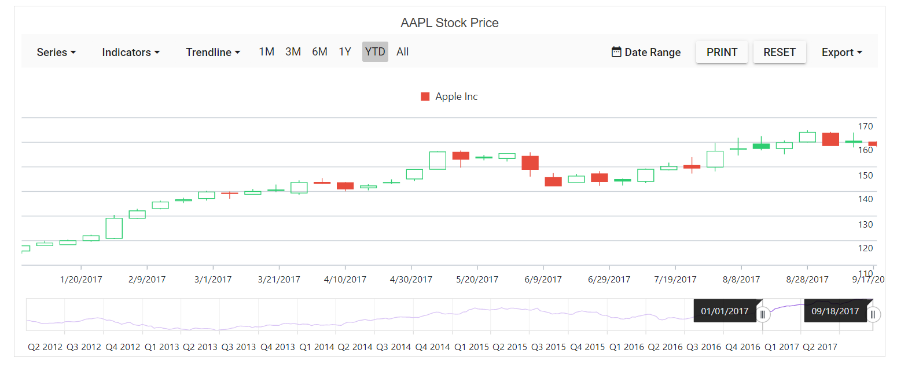

# Legend in Blazor Stock Chart Component

Legend provides information about the series rendered in the Stock Chart. Legend can be added to a Stock Chart by enabling the [visible](https://help.syncfusion.com/cr/blazor/Syncfusion.Blazor.Charts.ChartLegendSettings.html#Syncfusion_Blazor_Charts_ChartLegendSettings_Visible) option in the [legendSettings](https://help.syncfusion.com/cr/blazor/Syncfusion.Blazor.Charts.ChartLegendSettings.html#Syncfusion_Blazor_Charts_ChartLegendSettings__ctor).

## Enable Legend

To display the legend for the chart, set the [Visible](https://help.syncfusion.com/cr/blazor/Syncfusion.Blazor.Charts.ChartLegendSettings.html#Syncfusion_Blazor_Charts_ChartLegendSettings_Visible) property in [ChartLegendSettings](https://help.syncfusion.com/cr/blazor/Syncfusion.Blazor.Charts.ChartLegendSettings.html#Syncfusion_Blazor_Charts_ChartLegendSettings__ctor) to true.

```cshtml
@using Syncfusion.Blazor.Charts

        <SfStockChart Title="AAPL Stock Price">
            <StockChartLegendSettings Visible="true"></StockChartLegendSettings>
            <StockChartSeriesCollection>
                <StockChartSeries DataSource="@StockDetails" XName="date" YName="high" Name="Apple Inc" Type="ChartSeriesType.Candle"></StockChartSeries>
            </StockChartSeriesCollection>
        </SfStockChart>
  

@code {
     public class ChartData
    {
        public DateTime Date;
        public Double Open;
        public Double Low;
        public Double Close;
        public Double High;
        public Double Volume;
    }

    public List<ChartData> StockDetails = new List<ChartData>
    {
         new ChartData { Date = new DateTime(2012, 04, 02), Open= 85.9757, High = 90.6657,Low = 85.7685, Close = 90.5257,Volume = 660187068},
         new ChartData { Date = new DateTime(2012, 04, 09), Open= 89.4471, High = 92,Low = 86.2157, Close = 86.4614,Volume = 912634864},
         new ChartData { Date = new DateTime(2012, 04, 16), Open= 87.1514, High = 88.6071,Low = 81.4885, Close = 81.8543,Volume = 1221746066},
         new ChartData { Date = new DateTime(2012, 04, 23), Open= 81.5157, High = 88.2857,Low = 79.2857, Close = 86.1428,Volume = 965935749},
         new ChartData { Date = new DateTime(2012, 04, 30), Open= 85.4, High =  85.4857,Low = 80.7385, Close = 80.75,Volume = 615249365},
   };
}
```


## Position and Alignment

By using the [position](https://help.syncfusion.com/cr/blazor/Syncfusion.Blazor.Charts.ChartLegendSettings.html?&_ga=2.95009564.1095830672.1664171074-593884109.1639917919#Syncfusion_Blazor_Charts_ChartLegendSettings_Position) property, legend can be placed at [Left](https://help.syncfusion.com/cr/blazor/Syncfusion.Blazor.Charts.LegendPosition.html#Syncfusion_Blazor_Charts_LegendPosition_Left), [Right](https://help.syncfusion.com/cr/blazor/Syncfusion.Blazor.Charts.LegendPosition.html#Syncfusion_Blazor_Charts_LegendPosition_Right), [Top](https://help.syncfusion.com/cr/blazor/Syncfusion.Blazor.Charts.LegendPosition.html#Syncfusion_Blazor_Charts_LegendPosition_Top), [Bottom](https://help.syncfusion.com/cr/blazor/Syncfusion.Blazor.Charts.LegendPosition.html#Syncfusion_Blazor_Charts_LegendPosition_Bottom) or [Custom](https://help.syncfusion.com/cr/blazor/Syncfusion.Blazor.Charts.LegendPosition.html#Syncfusion_Blazor_Charts_LegendPosition_Custom) of the Stock Chart. The legend is positioned at the bottom of the Stock Chart, by default.

```cshtml

@using Syncfusion.Blazor.Charts

        <SfStockChart Title="AAPL Stock Price">
            <StockChartLegendSettings Visible="true" Position="LegendPosition.Top"></StockChartLegendSettings>
            <StockChartSeriesCollection>
                <StockChartSeries DataSource="@StockDetails" XName="date" YName="high" Name="Apple Inc" Type="ChartSeriesType.Candle"></StockChartSeries>
            </StockChartSeriesCollection>
        </SfStockChart>
  

@code {
     public class ChartData
    {
        public DateTime Date;
        public Double Open;
        public Double Low;
        public Double Close;
        public Double High;
        public Double Volume;
    }

    public List<ChartData> StockDetails = new List<ChartData>
    {
         new ChartData { Date = new DateTime(2012, 04, 02), Open= 85.9757, High = 90.6657,Low = 85.7685, Close = 90.5257,Volume = 660187068},
         new ChartData { Date = new DateTime(2012, 04, 09), Open= 89.4471, High = 92,Low = 86.2157, Close = 86.4614,Volume = 912634864},
         new ChartData { Date = new DateTime(2012, 04, 16), Open= 87.1514, High = 88.6071,Low = 81.4885, Close = 81.8543,Volume = 1221746066},
         new ChartData { Date = new DateTime(2012, 04, 23), Open= 81.5157, High = 88.2857,Low = 79.2857, Close = 86.1428,Volume = 965935749},
         new ChartData { Date = new DateTime(2012, 04, 30), Open= 85.4, High =  85.4857,Low = 80.7385, Close = 80.75,Volume = 615249365},
   };
}
```



The [Custom](https://help.syncfusion.com/cr/blazor/Syncfusion.Blazor.Charts.LegendPosition.html#Syncfusion_Blazor_Charts_LegendPosition_Custom) position helps to position the legend anywhere in the chart using x and y coordinates.

```cshtml
@using Syncfusion.Blazor.Charts

        <SfStockChart Title="AAPL Stock Price">
            <StockChartLegendSettings Visible="true" Position="LegendPosition.Custom">
                <StockChartLocation X="50" Y="50"></StockChartLocation>
            </StockChartLegendSettings>
            <StockChartSeriesCollection>
                <StockChartSeries DataSource="@StockDetails" XName="date" YName="high" Name="Apple Inc" Type="ChartSeriesType.Candle"></StockChartSeries>
            </StockChartSeriesCollection>
        </SfStockChart>
  

@code {
     public class ChartData
    {
        public DateTime Date;
        public Double Open;
        public Double Low;
        public Double Close;
        public Double High;
        public Double Volume;
    }

    public List<ChartData> StockDetails = new List<ChartData>
    {
         new ChartData { Date = new DateTime(2012, 04, 02), Open= 85.9757, High = 90.6657,Low = 85.7685, Close = 90.5257,Volume = 660187068},
         new ChartData { Date = new DateTime(2012, 04, 09), Open= 89.4471, High = 92,Low = 86.2157, Close = 86.4614,Volume = 912634864},
         new ChartData { Date = new DateTime(2012, 04, 16), Open= 87.1514, High = 88.6071,Low = 81.4885, Close = 81.8543,Volume = 1221746066},
         new ChartData { Date = new DateTime(2012, 04, 23), Open= 81.5157, High = 88.2857,Low = 79.2857, Close = 86.1428,Volume = 965935749},
         new ChartData { Date = new DateTime(2012, 04, 30), Open= 85.4, High =  85.4857,Low = 80.7385, Close = 80.75,Volume = 615249365},
   };
}
```


## Legend Alignment

Using the [Alignment](https://help.syncfusion.com/cr/blazor/Syncfusion.Blazor.Charts.ChartLegendSettings.html#Syncfusion_Blazor_Charts_ChartLegendSettings_Alignment) property, place the legend in [Centre](https://help.syncfusion.com/cr/blazor/Syncfusion.Blazor.Charts.Alignment.html#Syncfusion_Blazor_Charts_Alignment_Center), [Far](https://help.syncfusion.com/cr/blazor/Syncfusion.Blazor.Charts.Alignment.html#Syncfusion_Blazor_Charts_Alignment_Far), or [Near](https://help.syncfusion.com/cr/blazor/Syncfusion.Blazor.Charts.Alignment.html#Syncfusion_Blazor_Charts_Alignment_Near) alignment.

```cshtml
@using Syncfusion.Blazor.Charts

        <SfStockChart Title="AAPL Stock Price">
            <StockChartLegendSettings Visible="true" Alignment="Alignment.Near">
            </StockChartLegendSettings>
            <StockChartSeriesCollection>
                <StockChartSeries DataSource="@StockDetails" XName="date" YName="high" Name="Apple Inc" Type="ChartSeriesType.Candle"></StockChartSeries>
            </StockChartSeriesCollection>
        </SfStockChart>
  

@code {
     public class ChartData
    {
        public DateTime Date;
        public Double Open;
        public Double Low;
        public Double Close;
        public Double High;
        public Double Volume;
    }

    public List<ChartData> StockDetails = new List<ChartData>
    {
         new ChartData { Date = new DateTime(2012, 04, 02), Open= 85.9757, High = 90.6657,Low = 85.7685, Close = 90.5257,Volume = 660187068},
         new ChartData { Date = new DateTime(2012, 04, 09), Open= 89.4471, High = 92,Low = 86.2157, Close = 86.4614,Volume = 912634864},
         new ChartData { Date = new DateTime(2012, 04, 16), Open= 87.1514, High = 88.6071,Low = 81.4885, Close = 81.8543,Volume = 1221746066},
         new ChartData { Date = new DateTime(2012, 04, 23), Open= 81.5157, High = 88.2857,Low = 79.2857, Close = 86.1428,Volume = 965935749},
         new ChartData { Date = new DateTime(2012, 04, 30), Open= 85.4, High =  85.4857,Low = 80.7385, Close = 80.75,Volume = 615249365},
   };
}
```


## Legend customization

### Legend Shape

The [LegendShape](https://help.syncfusion.com/cr/blazor/Syncfusion.Blazor.Charts.ChartSeries.html#Syncfusion_Blazor_Charts_ChartSeries_LegendShape) property in the [Series](https://help.syncfusion.com/cr/blazor/Syncfusion.Blazor.Charts.ChartSeries.html) can be used to change the shape of the legend icon. The default icon shape for legends is [SeriesType](https://help.syncfusion.com/cr/blazor/Syncfusion.Blazor.Charts.LegendShape.html#Syncfusion_Blazor_Charts_LegendShape_SeriesType).


```cshtml
@using Syncfusion.Blazor.Charts

        <SfStockChart Title="AAPL Stock Price">
            <StockChartLegendSettings Visible="true">
            </StockChartLegendSettings>
            <StockChartSeriesCollection>
                <StockChartSeries DataSource="@StockDetails" XName="date" YName="high" Name="Apple Inc" Type="ChartSeriesType.Candle"  LegendShape="LegendShape.Diamond"></StockChartSeries>
            </StockChartSeriesCollection>
        </SfStockChart>
  

@code {
     public class ChartData
    {
        public DateTime Date;
        public Double Open;
        public Double Low;
        public Double Close;
        public Double High;
        public Double Volume;
    }

    public List<ChartData> StockDetails = new List<ChartData>
    {
         new ChartData { Date = new DateTime(2012, 04, 02), Open= 85.9757, High = 90.6657,Low = 85.7685, Close = 90.5257,Volume = 660187068},
         new ChartData { Date = new DateTime(2012, 04, 09), Open= 89.4471, High = 92,Low = 86.2157, Close = 86.4614,Volume = 912634864},
         new ChartData { Date = new DateTime(2012, 04, 16), Open= 87.1514, High = 88.6071,Low = 81.4885, Close = 81.8543,Volume = 1221746066},
         new ChartData { Date = new DateTime(2012, 04, 23), Open= 81.5157, High = 88.2857,Low = 79.2857, Close = 86.1428,Volume = 965935749},
         new ChartData { Date = new DateTime(2012, 04, 30), Open= 85.4, High =  85.4857,Low = 80.7385, Close = 80.75,Volume = 615249365},
   };
}
```


### Legend Size

When the legend is placed on the top or bottom of the chart, it takes up 20% - 25% of the chart's height, and 20% - 25% of the chart's width when it is positioned on the left or right side of the chart. So, the [Width](https://help.syncfusion.com/cr/blazor/Syncfusion.Blazor.Charts.ChartLegendSettings.html#Syncfusion_Blazor_Charts_ChartLegendSettings_Width) and [Height](https://help.syncfusion.com/cr/blazor/Syncfusion.Blazor.Charts.ChartLegendSettings.html#Syncfusion_Blazor_Charts_ChartLegendSettings_Height) properties can be used to adjust the default legend size.

```cshtml
@using Syncfusion.Blazor.Charts

        <SfStockChart Title="AAPL Stock Price">
           <StockChartLegendSettings Visible="true" Height="50" Width="300">
                <StockChartLegendBorder Color="blue" Width="1"></StockChartLegendBorder>
            </StockChartLegendSettings>
            <StockChartSeriesCollection>
                <StockChartSeries DataSource="@StockDetails" XName="date" YName="high" Name="Apple Inc" Type="ChartSeriesType.Candle"></StockChartSeries>
            </StockChartSeriesCollection>
        </SfStockChart>
  

@code {
     public class ChartData
    {
        public DateTime Date;
        public Double Open;
        public Double Low;
        public Double Close;
        public Double High;
        public Double Volume;
    }

    public List<ChartData> StockDetails = new List<ChartData>
    {
         new ChartData { Date = new DateTime(2012, 04, 02), Open= 85.9757, High = 90.6657,Low = 85.7685, Close = 90.5257,Volume = 660187068},
         new ChartData { Date = new DateTime(2012, 04, 09), Open= 89.4471, High = 92,Low = 86.2157, Close = 86.4614,Volume = 912634864},
         new ChartData { Date = new DateTime(2012, 04, 16), Open= 87.1514, High = 88.6071,Low = 81.4885, Close = 81.8543,Volume = 1221746066},
         new ChartData { Date = new DateTime(2012, 04, 23), Open= 81.5157, High = 88.2857,Low = 79.2857, Close = 86.1428,Volume = 965935749},
         new ChartData { Date = new DateTime(2012, 04, 30), Open= 85.4, High =  85.4857,Low = 80.7385, Close = 80.75,Volume = 615249365},
   };
}
```


### Legend Shape Size

The [ShapeHeight](https://help.syncfusion.com/cr/blazor/Syncfusion.Blazor.Charts.ChartLegendSettings.html#Syncfusion_Blazor_Charts_ChartLegendSettings_ShapeHeight) and [ShapeWidth](https://help.syncfusion.com/cr/blazor/Syncfusion.Blazor.Charts.ChartLegendSettings.html#Syncfusion_Blazor_Charts_ChartLegendSettings_ShapeWidth) properties can be used to adjust the dimensions of the legend shape.

```cshtml
@using Syncfusion.Blazor.Charts

        <SfStockChart Title="AAPL Stock Price">
           <StockChartLegendSettings Visible="true" Height="50" Width="300" ShapeHeight="20" ShapeWidth="20">
            </StockChartLegendSettings>
            <StockChartSeriesCollection>
                <StockChartSeries DataSource="@StockDetails" XName="date" YName="high" Name="Apple Inc" Type="ChartSeriesType.Candle"></StockChartSeries>
            </StockChartSeriesCollection>
        </SfStockChart>
  

@code {
     public class ChartData
    {
        public DateTime Date;
        public Double Open;
        public Double Low;
        public Double Close;
        public Double High;
        public Double Volume;
    }

    public List<ChartData> StockDetails = new List<ChartData>
    {
         new ChartData { Date = new DateTime(2012, 04, 02), Open= 85.9757, High = 90.6657,Low = 85.7685, Close = 90.5257,Volume = 660187068},
         new ChartData { Date = new DateTime(2012, 04, 09), Open= 89.4471, High = 92,Low = 86.2157, Close = 86.4614,Volume = 912634864},
         new ChartData { Date = new DateTime(2012, 04, 16), Open= 87.1514, High = 88.6071,Low = 81.4885, Close = 81.8543,Volume = 1221746066},
         new ChartData { Date = new DateTime(2012, 04, 23), Open= 81.5157, High = 88.2857,Low = 79.2857, Close = 86.1428,Volume = 965935749},
         new ChartData { Date = new DateTime(2012, 04, 30), Open= 85.4, High =  85.4857,Low = 80.7385, Close = 80.75,Volume = 615249365},
   };
}
```


### Legend Item Padding

The [ItemPadding](https://help.syncfusion.com/cr/blazor/Syncfusion.Blazor.Charts.ChartLegendSettings.html#Syncfusion_Blazor_Charts_ChartLegendSettings_ItemPadding) property can be used to adjust the space between the legend items.

```cshtml
@using Syncfusion.Blazor.Charts

        <SfStockChart Title="AAPL Stock Price">
           <StockChartLegendSettings Visible="true" >
            </StockChartLegendSettings>
           <StockChartSeriesCollection>
                <StockChartSeries DataSource="@StockDetails" Type="ChartSeriesType.Line" XName="x" YName="close" Name="Apple"></StockChartSeries>
                <StockChartSeries DataSource="@StockDetails" Type="ChartSeriesType.Line" XName="x" YName="close" Name="Google"></StockChartSeries>
            </StockChartSeriesCollection>
        </SfStockChart>
  

@code {
     public class ChartData
    {
        public DateTime Date;
        public Double Open;
        public Double Low;
        public Double Close;
        public Double High;
        public Double Volume;
    }

    public List<ChartData> StockDetails = new List<ChartData>
    {
         new ChartData { Date = new DateTime(2012, 04, 02), Open= 85.9757, High = 90.6657,Low = 85.7685, Close = 90.5257,Volume = 660187068},
         new ChartData { Date = new DateTime(2012, 04, 09), Open= 89.4471, High = 92,Low = 86.2157, Close = 86.4614,Volume = 912634864},
         new ChartData { Date = new DateTime(2012, 04, 16), Open= 87.1514, High = 88.6071,Low = 81.4885, Close = 81.8543,Volume = 1221746066},
         new ChartData { Date = new DateTime(2012, 04, 23), Open= 81.5157, High = 88.2857,Low = 79.2857, Close = 86.1428,Volume = 965935749},
         new ChartData { Date = new DateTime(2012, 04, 30), Open= 85.4, High =  85.4857,Low = 80.7385, Close = 80.75,Volume = 615249365},
   };
}
```


### Legend Paging

When the legend items exceed legend bounds, paging will be enabled by default. End user can view each legend item using the navigation buttons to navigate between pages.

```cshtml
@using Syncfusion.Blazor.Charts

        <SfStockChart Title="AAPL Stock Price">
           <StockChartLegendSettings Visible="true" >
            </StockChartLegendSettings>
           <StockChartSeriesCollection>
                <StockChartSeries DataSource="@StockDetails" Type="ChartSeriesType.Line" XName="x" YName="close" Name="Apple"></StockChartSeries>
                <StockChartSeries DataSource="@StockDetails" Type="ChartSeriesType.Line" XName="x" YName="close" Name="Google"></StockChartSeries>
                <StockChartSeries DataSource="@StockDetails" Type="ChartSeriesType.Spline" XName="x" YName="close" Name="Tesla"></StockChartSeries>
            </StockChartSeriesCollection>
        </SfStockChart>
  

@code {
     public class ChartData
    {
        public DateTime Date;
        public Double Open;
        public Double Low;
        public Double Close;
        public Double High;
        public Double Volume;
    }

    public List<ChartData> StockDetails = new List<ChartData>
    {
         new ChartData { Date = new DateTime(2012, 04, 02), Open= 85.9757, High = 90.6657,Low = 85.7685, Close = 90.5257,Volume = 660187068},
         new ChartData { Date = new DateTime(2012, 04, 09), Open= 89.4471, High = 92,Low = 86.2157, Close = 86.4614,Volume = 912634864},
         new ChartData { Date = new DateTime(2012, 04, 16), Open= 87.1514, High = 88.6071,Low = 81.4885, Close = 81.8543,Volume = 1221746066},
         new ChartData { Date = new DateTime(2012, 04, 23), Open= 81.5157, High = 88.2857,Low = 79.2857, Close = 86.1428,Volume = 965935749},
         new ChartData { Date = new DateTime(2012, 04, 30), Open= 85.4, High =  85.4857,Low = 80.7385, Close = 80.75,Volume = 615249365},
   };
}
```


### Legend Text Wrap

When the legend text exceeds the container, the text can be wrapped by using [TextWrap](https://help.syncfusion.com/cr/blazor/Syncfusion.Blazor.Charts.ChartLegendSettings.html#Syncfusion_Blazor_Charts_ChartLegendSettings_TextWrap) Property. End user can also wrap the legend text based on the [MaximumLabelWidth](https://help.syncfusion.com/cr/blazor/Syncfusion.Blazor.Charts.ChartLegendSettings.html#Syncfusion_Blazor_Charts_ChartLegendSettings_MaximumLabelWidth) property.

```cshtml
@using Syncfusion.Blazor.Charts

        <SfStockChart Title="AAPL Stock Price">
           <StockChartLegendSettings Visible="true" Position="@LegendPosition.Right" TextWrap="@TextWrap.Wrap" MaxLabelWidth="70">
            </StockChartLegendSettings>
           <StockChartSeriesCollection>
                <StockChartSeries DataSource="@StockDetails" Type="ChartSeriesType.Line" XName="x" YName="close" Name="Apple company"></StockChartSeries>
                <StockChartSeries DataSource="@StockDetails" Type="ChartSeriesType.Line" XName="x" YName="close" Name="Google company"></StockChartSeries>
                <StockChartSeries DataSource="@StockDetails" Type="ChartSeriesType.Spline" XName="x" YName="close" Name="Tesla company"></StockChartSeries>
            </StockChartSeriesCollection>
        </SfStockChart>
  

@code {
     public class ChartData
    {
        public DateTime Date;
        public Double Open;
        public Double Low;
        public Double Close;
        public Double High;
        public Double Volume;
    }

    public List<ChartData> StockDetails = new List<ChartData>
    {
         new ChartData { Date = new DateTime(2012, 04, 02), Open= 85.9757, High = 90.6657,Low = 85.7685, Close = 90.5257,Volume = 660187068},
         new ChartData { Date = new DateTime(2012, 04, 09), Open= 89.4471, High = 92,Low = 86.2157, Close = 86.4614,Volume = 912634864},
         new ChartData { Date = new DateTime(2012, 04, 16), Open= 87.1514, High = 88.6071,Low = 81.4885, Close = 81.8543,Volume = 1221746066},
         new ChartData { Date = new DateTime(2012, 04, 23), Open= 81.5157, High = 88.2857,Low = 79.2857, Close = 86.1428,Volume = 965935749},
         new ChartData { Date = new DateTime(2012, 04, 30), Open= 85.4, High =  85.4857,Low = 80.7385, Close = 80.75,Volume = 615249365},
   };
}
```

