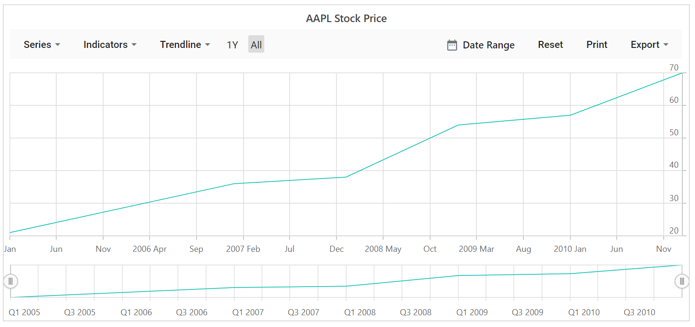

# Appearance in Blazor Stock Chart Component

## Stock Chart Title

Set a chart title using the [Title](https://help.syncfusion.com/cr/blazor/Syncfusion.Blazor.Charts.StockChartModel.html#Syncfusion_Blazor_Charts_StockChartModel_Title) property to provide context for the plotted data.

```cshtml

@using Syncfusion.Blazor.Charts

<SfStockChart Title="AAPL Stock Price">
    <StockChartSeriesCollection>
        <StockChartSeries DataSource="@DataSource" Type="ChartSeriesType.Line" XName="XValue" YName="YValue"></StockChartSeries>
    </StockChartSeriesCollection>
    <StockChartPeriods>
        <StockChartPeriod Text="1Y"></StockChartPeriod>
        <StockChartPeriod Text="All" Selected="true"></StockChartPeriod>
    </StockChartPeriods>
</SfStockChart>

@code {
    public class ChartData
    {
        public DateTime XValue { get; set; }
        public double YValue { get; set; }
    }

    public List<ChartData> DataSource = new List<ChartData>
    {
        new ChartData { XValue = new DateTime(2005, 01, 01), YValue = 21 },
        new ChartData { XValue = new DateTime(2006, 01, 01), YValue = 24 },
        new ChartData { XValue = new DateTime(2007, 01, 01), YValue = 36 },
        new ChartData { XValue = new DateTime(2008, 01, 01), YValue = 38 },
        new ChartData { XValue = new DateTime(2009, 01, 01), YValue = 54 },
        new ChartData { XValue = new DateTime(2010, 01, 01), YValue = 57 },
        new ChartData { XValue = new DateTime(2011, 01, 01), YValue = 70 }
    };
}

```



<!-- markdownlint-disable MD036 -->

## Title Customizations

The `TextStyle` property of the chart title provides options to customize `Size`, `Color`, `FontFamily`, `FontWeight`, `FontStyle`, `Opacity`, `TextAlignment`, and `TextOverflow`.

```cshtml

@using Syncfusion.Blazor.Charts

<SfStockChart Title="AAPL Stock Price">
    <StockChartTitleStyle FontFamily="Arial" FontStyle="Italic" FontWeight="Regular" Color="#E27F2D" Size="20px" TextOverflow="TextOverflow.Wrap"></StockChartTitleStyle>
    <StockChartSeriesCollection>
        <StockChartSeries DataSource="@DataSource" Type="ChartSeriesType.Line" XName="XValue" YName="YValue"></StockChartSeries>
    </StockChartSeriesCollection>
    <StockChartPeriods>
        <StockChartPeriod Text="1Y"></StockChartPeriod>
        <StockChartPeriod Text="All" Selected="true"></StockChartPeriod>
    </StockChartPeriods>
</SfStockChart>

@code {
    public class ChartData
    {
        public DateTime XValue { get; set; }
        public double YValue { get; set; }
    }

    public List<ChartData> DataSource = new List<ChartData>
    {
        new ChartData { XValue = new DateTime(2005, 01, 01), YValue = 21 },
        new ChartData { XValue = new DateTime(2006, 01, 01), YValue = 24 },
        new ChartData { XValue = new DateTime(2007, 01, 01), YValue = 36 },
        new ChartData { XValue = new DateTime(2008, 01, 01), YValue = 38 },
        new ChartData { XValue = new DateTime(2009, 01, 01), YValue = 54 },
        new ChartData { XValue = new DateTime(2010, 01, 01), YValue = 57 },
        new ChartData { XValue = new DateTime(2011, 01, 01), YValue = 70 }
    };
}

```


## Stock Chart Theme

Changing the theme affects background color, gridlines, tooltip appearance, and overall styling.

Stock Chart includes several built-in themes such as `Material`, `Fabric`, `Bootstrap`, `HighContrastLight`, `MaterialDark`, `FabricDark`, `HighContrast`, and `BootstrapDark`.

```cshtml

@using Syncfusion.Blazor.Charts

<SfStockChart Title="AAPL Stock Price" Theme="Theme.Fluent2">
    <StockChartSeriesCollection>
        <StockChartSeries DataSource="@DataSource" Type="ChartSeriesType.Line" XName="XValue" YName="YValue"></StockChartSeries>
    </StockChartSeriesCollection>
    <StockChartPeriods>
        <StockChartPeriod Text="1Y"></StockChartPeriod>
        <StockChartPeriod Text="All" Selected="true"></StockChartPeriod>
    </StockChartPeriods>
</SfStockChart>

@code {
    public class ChartData
    {
        public DateTime XValue { get; set; }
        public double YValue { get; set; }
    }

    public List<ChartData> DataSource = new List<ChartData>
    {
        new ChartData { XValue = new DateTime(2005, 01, 01), YValue = 21 },
        new ChartData { XValue = new DateTime(2006, 01, 01), YValue = 24 },
        new ChartData { XValue = new DateTime(2007, 01, 01), YValue = 36 },
        new ChartData { XValue = new DateTime(2008, 01, 01), YValue = 38 },
        new ChartData { XValue = new DateTime(2009, 01, 01), YValue = 54 },
        new ChartData { XValue = new DateTime(2010, 01, 01), YValue = 57 },
        new ChartData { XValue = new DateTime(2011, 01, 01), YValue = 70 }
    };
}

```


## See Also

* [Axis Customization](./axis-customization)
