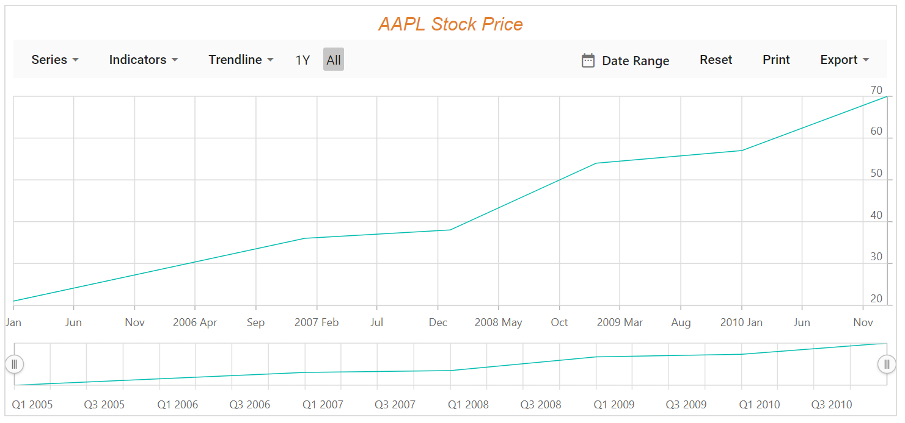
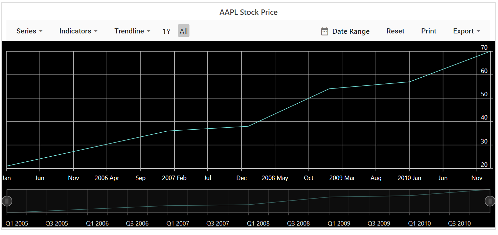

# Appearance

## Stock Chart Title

Stock Chart can be given a title using [`Title`](https://help.syncfusion.com/cr/blazor/Syncfusion.Blazor.Charts.StockChartModel.html#Syncfusion_Blazor_Charts_StockChartModel_Title) property, to show the information
about the data plotted.





<!-- markdownlint-disable MD036 -->

## Title Customizations

The `TextStyle` property of chart title provides options to customize the `Size`, `Color`, `FontFamily`, `FontWeight`, `FontStyle`, `Opacity`, `TextAlignment` and `TextOverflow`.





## Stock Chart Theme

Changing theme will affect background color, gridlines, tooltip colors and appearance.

Stock chart is shipped with several built-in themes such as `Material`, `Fabric`, `Bootstrap` , `HighContrastLight`, `MaterialDark`, `FabricDark`, `FabricDark`, `HighContrast` and `BootstrapDark`.





## See Also

* [Axis Customization](./axis-customization/)
