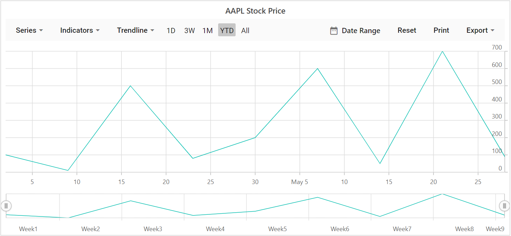
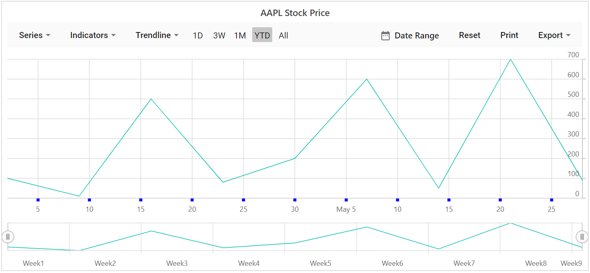
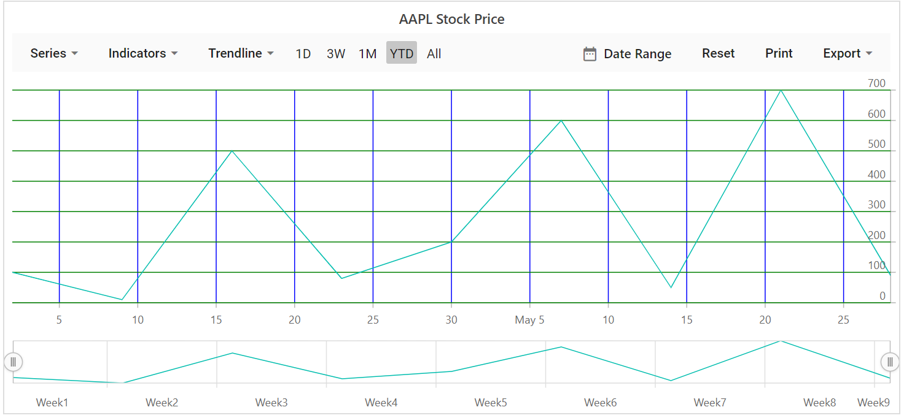
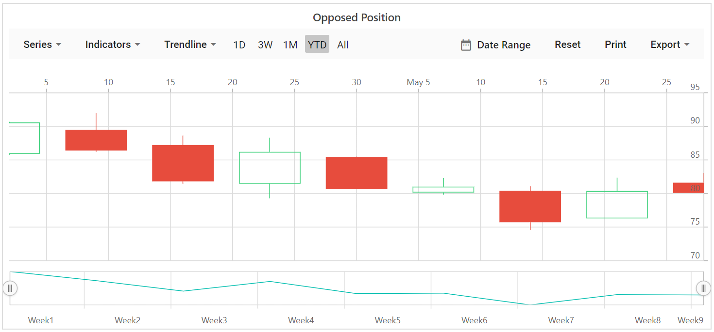

# Axis Customization

<!-- markdownlint-disable MD034 -->

## Title

You can add a title to the axis using [Title](https://help.syncfusion.com/cr/blazor/Syncfusion.Blazor.Charts.StockChartModel.html#Syncfusion_Blazor_Charts_StockChartModel_Title) property to provide quick
information to the user about the data plotted in the axis. Title style can be customized using [`TitleStyle`](https://help.syncfusion.com/cr/blazor/Syncfusion.Blazor.Charts.StockChartModel.html#Syncfusion_Blazor_Charts_StockChartModel_TitleStyle) property of the axis.

```csharp

@using Syncfusion.Blazor.Charts

<SfStockChart Title="AAPL Stock Price">
    <StockChartSeriesCollection>
        <StockChartSeries DataSource="@StockDetails" Type="ChartSeriesType.Line" XName="Date" YName="Y"></StockChartSeries>
    </StockChartSeriesCollection>
</SfStockChart>

@code {

    public class ChartData
    {
        public DateTime Date;
        public Double Y;
    }

    public List<ChartData> StockDetails = new List<ChartData>
{
          new ChartData { Date = new DateTime(2012, 04, 02), Y= 100},
          new ChartData { Date = new DateTime(2012, 04, 09), Y= 10},
          new ChartData { Date = new DateTime(2012, 04, 16), Y= 500},
          new ChartData { Date = new DateTime(2012, 04, 23), Y= 80},
          new ChartData { Date = new DateTime(2012, 04, 30), Y= 200},
          new ChartData { Date = new DateTime(2012, 05, 07), Y= 600},
          new ChartData { Date = new DateTime(2012, 05, 14), Y= 50},
          new ChartData { Date = new DateTime(2012, 05, 21), Y= 700},
          new ChartData { Date = new DateTime(2012, 05, 28), Y= 90}
    };
}


```



## Tick Lines Customization

You can customize the  `Width`, `Color` and `Size` of the minor and major tick lines, using
[`MajorTickLines`](https://help.syncfusion.com/cr/blazor/Syncfusion.Blazor.Charts.StockChartAxis.html#Syncfusion_Blazor_Charts_StockChartAxis_MajorTickLines) and
[`MinorTickLines`](https://help.syncfusion.com/cr/blazor/Syncfusion.Blazor.Charts.StockChartAxis.html#Syncfusion_Blazor_Charts_StockChartAxis_MinorTickLines) properties in the axis.

```csharp

@using Syncfusion.Blazor.Charts

<SfStockChart Title="AAPL Stock Price">
    <StockChartPrimaryXAxis>
        <StockChartAxisMajorTickLines Width="5" Color="blue"></StockChartAxisMajorTickLines>
        <StockChartAxisMinorTickLines Width="0" Color="red"></StockChartAxisMinorTickLines>
    </StockChartPrimaryXAxis>

    <StockChartSeriesCollection>
        <StockChartSeries DataSource="@StockDetails" Type="ChartSeriesType.Line" XName="Date" YName="Y"></StockChartSeries>
    </StockChartSeriesCollection>
</SfStockChart>

@code {

    public class ChartData
    {
        public DateTime Date;
        public Double Y;
    }

    public List<ChartData> StockDetails = new List<ChartData>
{
        new ChartData { Date = new DateTime(2012, 04, 02), Y= 100},
        new ChartData { Date = new DateTime(2012, 04, 09), Y= 10},
        new ChartData { Date = new DateTime(2012, 04, 16), Y= 500},
        new ChartData { Date = new DateTime(2012, 04, 23), Y= 80},
        new ChartData { Date = new DateTime(2012, 04, 30), Y= 200},
        new ChartData { Date = new DateTime(2012, 05, 07), Y= 600},
        new ChartData { Date = new DateTime(2012, 05, 14), Y= 50},
        new ChartData { Date = new DateTime(2012, 05, 21), Y= 700},
        new ChartData { Date = new DateTime(2012, 05, 28), Y= 90}
    };
}

```



## Grid Lines Customization

You can customize the  `Width`, `Color` and `DashArray` of the minor and major grid lines, using
[`MajorGridLines`](https://help.syncfusion.com/cr/blazor/Syncfusion.Blazor~Syncfusion.Blazor.Charts.AxisModel~MajorGridLines.html) and
[`MinorGridLines`](https://help.syncfusion.com/cr/blazor/Syncfusion.Blazor~Syncfusion.Blazor.Charts.AxisModel~MinorGridLines.html) properties in the axis.

```csharp

@using Syncfusion.Blazor.Charts

<SfStockChart Title="AAPL Stock Price">
    <StockChartPrimaryXAxis>
        <StockChartAxisMajorGridLines Width="1" Color="blue"></StockChartAxisMajorGridLines>
        <StockChartAxisMinorGridLines Width="0" Color="red"></StockChartAxisMinorGridLines>
    </StockChartPrimaryXAxis>

    <StockChartPrimaryYAxis>
        <StockChartAxisMajorGridLines Width="1" Color="green"></StockChartAxisMajorGridLines>
        <StockChartAxisMinorGridLines Width="0" Color="red"></StockChartAxisMinorGridLines>
    </StockChartPrimaryYAxis>

    <StockChartSeriesCollection>
        <StockChartSeries DataSource="@StockDetails" Type="ChartSeriesType.Line" XName="Date" YName="Y"></StockChartSeries>
    </StockChartSeriesCollection>
</SfStockChart>

@code {

    public class ChartData
    {
        public DateTime Date;
        public Double Y;
    }

    public List<ChartData> StockDetails = new List<ChartData>
{
        new ChartData { Date = new DateTime(2012, 04, 02), Y= 100},
        new ChartData { Date = new DateTime(2012, 04, 09), Y= 10},
        new ChartData { Date = new DateTime(2012, 04, 16), Y= 500},
        new ChartData { Date = new DateTime(2012, 04, 23), Y= 80},
        new ChartData { Date = new DateTime(2012, 04, 30), Y= 200},
        new ChartData { Date = new DateTime(2012, 05, 07), Y= 600},
        new ChartData { Date = new DateTime(2012, 05, 14), Y= 50},
        new ChartData { Date = new DateTime(2012, 05, 21), Y= 700},
        new ChartData { Date = new DateTime(2012, 05, 28), Y= 90}
    };
}

```



## Multiple Axis

In addition to primary X and Y axis, we can add n number of axis to the chart. Series can be associated with
this [Axis](https://help.syncfusion.com/cr/blazor/Syncfusion.Blazor.Charts.StockChartAxis.html), by mapping with axis's unique name.

```csharp

@using Syncfusion.Blazor.Charts

<SfStockChart Title="Multiple Axis">
    <StockChartAxes>
        <StockChartAxis RowIndex="0" Name="yAxis"></StockChartAxis>
    </StockChartAxes>

    <StockChartPrimaryXAxis>
        <StockChartAxisMajorGridLines Width="0"></StockChartAxisMajorGridLines>
    </StockChartPrimaryXAxis>

    <StockChartPrimaryYAxis Interval="40">
        <StockChartAxisLineStyle Color="Transparent"></StockChartAxisLineStyle>
        <StockChartAxisMajorTickLines Width="0" Color="Transparent"></StockChartAxisMajorTickLines>
    </StockChartPrimaryYAxis>

    <StockChartCrosshairSettings Enable="true"></StockChartCrosshairSettings>

    <StockChartSeriesCollection>
        <StockChartSeries DataSource="@StockDetails" Type="ChartSeriesType.Candle" XName="Date" High="High" Low="Low" Open="Open" Close="Close" Name="Apple"></StockChartSeries>
        <StockChartSeries DataSource="@StockDetails" Type="ChartSeriesType.Column" YAxisName="yAxis" XName="Date" YName="Low" Name="Google"></StockChartSeries>
    </StockChartSeriesCollection>
</SfStockChart>

@code {

    public class ChartData
    {
        public DateTime Date;
        public Double Open;
        public Double Low;
        public Double Close;
        public Double High;
        public Double Volume;
    }

    public List<ChartData> StockDetails = new List<ChartData>
{
        new ChartData { Date = new DateTime(2012, 04, 02), Open= 85.9757, High = 90.6657,Low = 85.7685, Close = 90.5257,Volume = 660187068},
        new ChartData { Date = new DateTime(2012, 04, 09), Open= 89.4471, High = 92,Low = 86.2157, Close = 86.4614,Volume = 912634864},
        new ChartData { Date = new DateTime(2012, 04, 16), Open= 87.1514, High = 88.6071,Low = 81.4885, Close = 81.8543,Volume = 1221746066},
        new ChartData { Date = new DateTime(2012, 04, 23), Open= 81.5157, High = 88.2857,Low = 79.2857, Close = 86.1428,Volume = 965935749},
        new ChartData { Date = new DateTime(2012, 04, 30), Open= 85.4, High =  85.4857,Low = 80.7385, Close = 80.75,Volume = 615249365},
        new ChartData { Date = new DateTime(2012, 05, 07), Open= 80.2143, High = 82.2685,Low = 79.8185, Close = 80.9585,Volume = 541742692},
        new ChartData { Date = new DateTime(2012, 05, 14), Open= 80.3671, High = 81.0728,Low = 74.5971, Close = 75.7685,Volume = 708126233},
        new ChartData { Date = new DateTime(2012, 05, 21), Open= 76.3571, High = 82.3571,Low = 76.2928, Close = 80.3271,Volume = 682076215},
        new ChartData { Date = new DateTime(2012, 05, 28), Open= 81.5571, High = 83.0714,Low = 80.0743, Close = 80.1414,Volume = 480059584}
    };
}

```


## Inversed Axis

<!-- markdownlint-disable MD033 -->

When an axis is inversed, highest value of the axis comes closer to origin and vice versa. To place an axis in inversed manner set this property
 [`IsInversed`](https://help.syncfusion.com/cr/blazor/Syncfusion.Blazor.Charts.StockChartAxis.html#Syncfusion_Blazor_Charts_StockChartAxis_IsInversed) to true.

 ```csharp

@using Syncfusion.Blazor.Charts

<SfStockChart Title="Inversed Axis">
    <StockChartPrimaryXAxis IsInversed="true"></StockChartPrimaryXAxis>

    <StockChartSeriesCollection>
        <StockChartSeries DataSource="@StockDetails" Type="ChartSeriesType.Candle" XName="Date" High="High" Low="Low" Open="Open" Close="Close" Name="Apple"></StockChartSeries>
    </StockChartSeriesCollection>
</SfStockChart>

@code {

    public class ChartData
    {
        public DateTime Date;
        public Double Open;
        public Double Low;
        public Double Close;
        public Double High;
        public Double Volume;
    }

    public List<ChartData> StockDetails = new List<ChartData>
{
        new ChartData { Date = new DateTime(2012, 04, 02), Open= 85.9757, High = 90.6657,Low = 85.7685, Close = 90.5257,Volume = 660187068},
        new ChartData { Date = new DateTime(2012, 04, 09), Open= 89.4471, High = 92,Low = 86.2157, Close = 86.4614,Volume = 912634864},
        new ChartData { Date = new DateTime(2012, 04, 16), Open= 87.1514, High = 88.6071,Low = 81.4885, Close = 81.8543,Volume = 1221746066},
        new ChartData { Date = new DateTime(2012, 04, 23), Open= 81.5157, High = 88.2857,Low = 79.2857, Close = 86.1428,Volume = 965935749},
        new ChartData { Date = new DateTime(2012, 04, 30), Open= 85.4, High =  85.4857,Low = 80.7385, Close = 80.75,Volume = 615249365},
        new ChartData { Date = new DateTime(2012, 05, 07), Open= 80.2143, High = 82.2685,Low = 79.8185, Close = 80.9585,Volume = 541742692},
        new ChartData { Date = new DateTime(2012, 05, 14), Open= 80.3671, High = 81.0728,Low = 74.5971, Close = 75.7685,Volume = 708126233},
        new ChartData { Date = new DateTime(2012, 05, 21), Open= 76.3571, High = 82.3571,Low = 76.2928, Close = 80.3271,Volume = 682076215},
        new ChartData { Date = new DateTime(2012, 05, 28), Open= 81.5571, High = 83.0714,Low = 80.0743, Close = 80.1414,Volume = 480059584}
    };
}


```


## Opposed Position

To place an axis opposite from its original position, set
 [`OpposedPosition`](https://help.syncfusion.com/cr/blazor/Syncfusion.Blazor.Charts.StockChartAxis.html#Syncfusion_Blazor_Charts_StockChartAxis_OpposedPosition) to true.

 ```csharp

@using Syncfusion.Blazor.Charts

<SfStockChart Title="AAPL Stock Price">
    <StockChartPrimaryXAxis OpposedPosition="true"></StockChartPrimaryXAxis>

    <StockChartSeriesCollection>
        <StockChartSeries DataSource="@StockDetails" Type="ChartSeriesType.Line" XName="Date" High="High" Low="Low" Open="Open" Close="Close"></StockChartSeries>
    </StockChartSeriesCollection>
</SfStockChart>

@code {

    public class ChartData
    {
        public DateTime Date;
        public Double Open;
        public Double Low;
        public Double Close;
        public Double High;
        public Double Volume;
    }

    public List<ChartData> StockDetails = new List<ChartData>
{
        new ChartData { Date = new DateTime(2012, 04, 02), Open= 85.9757, High = 90.6657,Low = 85.7685, Close = 90.5257,Volume = 660187068},
        new ChartData { Date = new DateTime(2012, 04, 09), Open= 89.4471, High = 92,Low = 86.2157, Close = 86.4614,Volume = 912634864},
        new ChartData { Date = new DateTime(2012, 04, 16), Open= 87.1514, High = 88.6071,Low = 81.4885, Close = 81.8543,Volume = 1221746066},
        new ChartData { Date = new DateTime(2012, 04, 23), Open= 81.5157, High = 88.2857,Low = 79.2857, Close = 86.1428,Volume = 965935749},
        new ChartData { Date = new DateTime(2012, 04, 30), Open= 85.4, High =  85.4857,Low = 80.7385, Close = 80.75,Volume = 615249365},
        new ChartData { Date = new DateTime(2012, 05, 07), Open= 80.2143, High = 82.2685,Low = 79.8185, Close = 80.9585,Volume = 541742692},
        new ChartData { Date = new DateTime(2012, 05, 14), Open= 80.3671, High = 81.0728,Low = 74.5971, Close = 75.7685,Volume = 708126233},
        new ChartData { Date = new DateTime(2012, 05, 21), Open= 76.3571, High = 82.3571,Low = 76.2928, Close = 80.3271,Volume = 682076215},
        new ChartData { Date = new DateTime(2012, 05, 28), Open= 81.5571, High = 83.0714,Low = 80.0743, Close = 80.1414,Volume = 480059584}
    };
}


```

