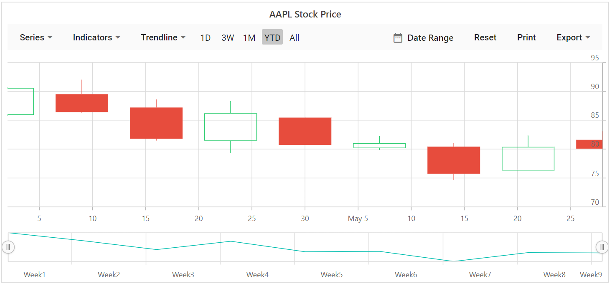

# Stock Chart Dimensions in Blazor Stock Chart Component

## Size for Container

The stock chart adapts to its container size. Set the container dimensions with inline styles or CSS, as shown below.

```cshtml

@using Syncfusion.Blazor.Charts

<div style="height:450px;width:970px">
    <SfStockChart Title="AAPL Stock Price">
        <StockChartSeriesCollection>
            <StockChartSeries DataSource="@StockDetails" Type="ChartSeriesType.Candle" XName="Date" High="High" Low="Low" Open="Open" Close="Close" Volume="Volume"></StockChartSeries>
        </StockChartSeriesCollection>
    </SfStockChart>
</div>

@code {
    public class ChartData
    {
        public DateTime Date { get; set; }
        public Double Open { get; set; }
        public Double Low { get; set; }
        public Double Close { get; set; }
        public Double High { get; set; }
        public Double Volume { get; set; }
    }

    public List<ChartData> StockDetails = new List<ChartData>
    {
        new ChartData { Date = new DateTime(2012, 04, 02), Open= 85.9757, High = 90.6657,Low = 85.7685, Close = 90.5257,Volume = 660187068},
        new ChartData { Date = new DateTime(2012, 04, 09), Open= 89.4471, High = 92,Low = 86.2157, Close = 86.4614,Volume = 912634864},
        new ChartData { Date = new DateTime(2012, 04, 16), Open= 87.1514, High = 88.6071,Low = 81.4885, Close = 81.8543,Volume = 1221746066},
        new ChartData { Date = new DateTime(2012, 04, 23), Open= 81.5157, High = 88.2857,Low = 79.2857, Close = 86.1428,Volume = 965935749},
        new ChartData { Date = new DateTime(2012, 04, 30), Open= 85.4, High =  85.4857,Low = 80.7385, Close = 80.75,Volume = 615249365},
        new ChartData { Date = new DateTime(2012, 05, 07), Open= 80.2143, High = 82.2685,Low = 79.8185, Close = 80.9585,Volume = 541742692},
        new ChartData { Date = new DateTime(2012, 05, 14), Open= 80.3671, High = 81.0728,Low = 74.5971, Close = 75.7685,Volume = 708126233},
        new ChartData { Date = new DateTime(2012, 05, 21), Open= 76.3571, High = 82.3571,Low = 76.2928, Close = 80.3271,Volume = 682076215},
        new ChartData { Date = new DateTime(2012, 05, 28), Open= 81.5571, High = 83.0714,Low = 80.0743, Close = 80.1414,Volume = 480059584}
   };
}

```



## Size for Stock Chart

Set the stock chart size directly using the [Width](https://help.syncfusion.com/cr/blazor/Syncfusion.Blazor.Charts.StockChartModel.html#Syncfusion_Blazor_Charts_StockChartModel_Width) and [Height](https://help.syncfusion.com/cr/blazor/Syncfusion.Blazor.Charts.StockChartModel.html#Syncfusion_Blazor_Charts_StockChartModel_Height) properties.

<!-- markdownlint-disable MD036 -->
**In Pixels**
<!-- markdownlint-disable MD036 -->

```cshtml

@using Syncfusion.Blazor.Charts

<SfStockChart Title="AAPL Stock Price" Width="970px" Height="350px">
    <StockChartSeriesCollection>
        <StockChartSeries DataSource="@StockDetails" Type="ChartSeriesType.Candle" XName="Date" High="High" Low="Low" Open="Open" Close="Close" Volume="Volume"></StockChartSeries>
    </StockChartSeriesCollection>
</SfStockChart>

@code {
    public class ChartData
    {
        public DateTime Date { get; set; }
        public Double Open { get; set; }
        public Double Low { get; set; }
        public Double Close { get; set; }
        public Double High { get; set; }
        public Double Volume { get; set; }
    }

    public List<ChartData> StockDetails = new List<ChartData>
    {
        new ChartData { Date = new DateTime(2012, 04, 02), Open = 85.9757, High = 90.6657, Low = 85.7685, Close = 90.5257, Volume = 660187068 },
        new ChartData { Date = new DateTime(2012, 04, 09), Open = 89.4471, High = 92, Low = 86.2157, Close = 86.4614, Volume = 912634864 },
        new ChartData { Date = new DateTime(2012, 04, 16), Open = 87.1514, High = 88.6071, Low = 81.4885, Close = 81.8543, Volume = 1221746066 },
        new ChartData { Date = new DateTime(2012, 04, 23), Open = 81.5157, High = 88.2857, Low = 79.2857, Close = 86.1428, Volume = 965935749 },
        new ChartData { Date = new DateTime(2012, 04, 30), Open = 85.4, High = 85.4857, Low = 80.7385, Close = 80.75, Volume = 615249365 },
        new ChartData { Date = new DateTime(2012, 05, 07), Open = 80.2143, High = 82.2685, Low = 79.8185, Close = 80.9585, Volume = 541742692 },
        new ChartData { Date = new DateTime(2012, 05, 14), Open = 80.3671, High = 81.0728, Low = 74.5971, Close = 75.7685, Volume = 708126233 },
        new ChartData { Date = new DateTime(2012, 05, 21), Open = 76.3571, High = 82.3571, Low = 76.2928, Close = 80.3271, Volume = 682076215 },
        new ChartData { Date = new DateTime(2012, 05, 28), Open = 81.5571, High = 83.0714, Low = 80.0743, Close = 80.1414, Volume = 480059584 }
   };
}

```


**In Percentage**

When values are specified in percentages, the stock chart sizes relative to its container. For example, a height of '50%' renders at half the container height.

```cshtml

@using Syncfusion.Blazor.Charts

<SfStockChart Title="AAPL Stock Price" Width="100%" Height="90%">
    <StockChartSeriesCollection>
        <StockChartSeries DataSource="@StockDetails" Type="ChartSeriesType.Candle" XName="Date" High="High" Low="Low" Open="Open" Close="Close" Volume="Volume"></StockChartSeries>
    </StockChartSeriesCollection>
</SfStockChart>

@code {
    public class ChartData
    {
        public DateTime Date { get; set; }
        public Double Open { get; set; }
        public Double Low { get; set; }
        public Double Close { get; set; }
        public Double High { get; set; }
        public Double Volume { get; set; }
    }

    public List<ChartData> StockDetails = new List<ChartData>
    {
        new ChartData { Date = new DateTime(2012, 04, 02), Open = 85.9757, High = 90.6657, Low = 85.7685, Close = 90.5257, Volume = 660187068 },
        new ChartData { Date = new DateTime(2012, 04, 09), Open = 89.4471, High = 92, Low = 86.2157, Close = 86.4614, Volume = 912634864 },
        new ChartData { Date = new DateTime(2012, 04, 16), Open = 87.1514, High = 88.6071, Low = 81.4885, Close = 81.8543, Volume = 1221746066 },
        new ChartData { Date = new DateTime(2012, 04, 23), Open = 81.5157, High = 88.2857, Low = 79.2857, Close = 86.1428, Volume = 965935749 },
        new ChartData { Date = new DateTime(2012, 04, 30), Open = 85.4, High = 85.4857, Low = 80.7385, Close = 80.75, Volume = 615249365 },
        new ChartData { Date = new DateTime(2012, 05, 07), Open = 80.2143, High = 82.2685, Low = 79.8185, Close = 80.9585, Volume = 541742692 },
        new ChartData { Date = new DateTime(2012, 05, 14), Open = 80.3671, High = 81.0728, Low = 74.5971, Close = 75.7685, Volume = 708126233 },
        new ChartData { Date = new DateTime(2012, 05, 21), Open = 76.3571, High = 82.3571, Low = 76.2928, Close = 80.3271, Volume = 682076215 },
        new ChartData { Date = new DateTime(2012, 05, 28), Open = 81.5571, High = 83.0714, Low = 80.0743, Close = 80.1414, Volume = 480059584 }
   };
}

```


N> If no size is specified, a default height of 450px is used and the width matches the window size.
