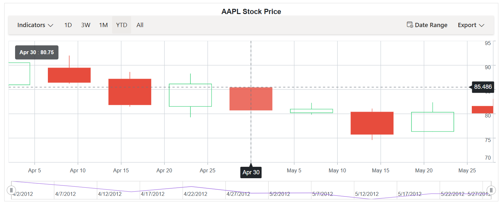

# Crosshair in Blazor Stock Chart Component

Crosshair has a vertical and horizontal line to view the value of the axis at mouse or touch position. Crosshair lines can be enabled by using [Enable](https://help.syncfusion.com/cr/blazor/Syncfusion.Blazor.Charts.StockChartCrosshairSettings.html#Syncfusion_Blazor_Charts_StockChartCrosshairSettings_Enable) property in the `Crosshair`. Enabling the `SnapToData` property in the crosshair aligns it with the nearest data point instead of following the exact mouse position.

```cshtml

@using Syncfusion.Blazor.Charts

<SfStockChart Title="AAPL Stock Price">
     <StockChartPrimaryXAxis>
        <StockChartAxisCrosshairTooltip Enable="true"></StockChartAxisCrosshairTooltip>
    </StockChartPrimaryXAxis>
    <StockChartPrimaryYAxis>
        <StockChartAxisCrosshairTooltip Enable="true"></StockChartAxisCrosshairTooltip>
    </StockChartPrimaryYAxis>
    <StockChartTooltipSettings Enable="true" Shared="true" Format="<b>${point.x}</b> : <b>${point.y}</b>" Header="" EnableMarker="false"></StockChartTooltipSettings>
    <StockChartCrosshairSettings Enable="true" SnapToData="true" DashArray="5,5"></StockChartCrosshairSettings>

    <StockChartSeriesCollection>
        <StockChartSeries DataSource="@StockDetails" Type="ChartSeriesType.Candle" XName="Date" High="High" Low="Low" Open="Open" Close="Close" Volume="Volume"></StockChartSeries>
    </StockChartSeriesCollection>
</SfStockChart>

@code {

    public class ChartData
    {
        public DateTime Date { get; set; }
        public Double Open { get; set; }
        public Double Low { get; set; }
        public Double Close { get; set; }
        public Double High { get; set; }
        public Double Volume { get; set; }
    }

    public List<ChartData> StockDetails = new List<ChartData>
    {
          new ChartData { Date = new DateTime(2012, 04, 02), Open= 85.9757, High = 90.6657,Low = 85.7685, Close = 90.5257,Volume = 660187068},
          new ChartData { Date = new DateTime(2012, 04, 09), Open= 89.4471, High = 92,Low = 86.2157, Close = 86.4614,Volume = 912634864},
          new ChartData { Date = new DateTime(2012, 04, 16), Open= 87.1514, High = 88.6071,Low = 81.4885, Close = 81.8543,Volume = 1221746066},
          new ChartData { Date = new DateTime(2012, 04, 23), Open= 81.5157, High = 88.2857,Low = 79.2857, Close = 86.1428,Volume = 965935749},
          new ChartData { Date = new DateTime(2012, 04, 30), Open= 85.4, High =  85.4857,Low = 80.7385, Close = 80.75,Volume = 615249365},
          new ChartData { Date = new DateTime(2012, 05, 07), Open= 80.2143, High = 82.2685,Low = 79.8185, Close = 80.9585,Volume = 541742692},
          new ChartData { Date = new DateTime(2012, 05, 14), Open= 80.3671, High = 81.0728,Low = 74.5971, Close = 75.7685,Volume = 708126233},
          new ChartData { Date = new DateTime(2012, 05, 21), Open= 76.3571, High = 82.3571,Low = 76.2928, Close = 80.3271,Volume = 682076215},
          new ChartData { Date = new DateTime(2012, 05, 28), Open= 81.5571, High = 83.0714,Low = 80.0743, Close = 80.1414,Volume = 480059584}
    };
}

```



## Tooltip for axis

Tooltip label for an axis can be enabled by using [Enable](https://help.syncfusion.com/cr/blazor/Syncfusion.Blazor.Charts.StockChartCrosshairSettings.html#Syncfusion_Blazor_Charts_StockChartCrosshairSettings_Enable) property of `CrosshairTooltip` in the corresponding axis.

```cshtml

@using Syncfusion.Blazor.Charts

<SfStockChart Title="AAPL Stock Price">
    <StockChartCrosshairSettings Enable="true"></StockChartCrosshairSettings>

    <StockChartPrimaryYAxis>
        <StockChartAxisLineStyle Color="Transparent"></StockChartAxisLineStyle>
        <StockChartAxisMajorTickLines Color="Transparent" Width="0"></StockChartAxisMajorTickLines>
        <StockChartAxisCrosshairTooltip Enable="true"></StockChartAxisCrosshairTooltip>
    </StockChartPrimaryYAxis>

    <StockChartPrimaryXAxis>
        <StockChartAxisMajorGridLines Color="Transparent"></StockChartAxisMajorGridLines>
        <StockChartAxisCrosshairTooltip Enable="true"></StockChartAxisCrosshairTooltip>
    </StockChartPrimaryXAxis>

    <StockChartSeriesCollection>
        <StockChartSeries DataSource="@StockDetails" Type="ChartSeriesType.Candle" XName="Date" High="High" Low="Low" Open="Open" Close="Close" Volume="Volume"></StockChartSeries>
    </StockChartSeriesCollection>
</SfStockChart>

@code {

    public class ChartData
    {
        public DateTime Date { get; set; }
        public Double Open { get; set; }
        public Double Low { get; set; }
        public Double Close { get; set; }
        public Double High { get; set; }
        public Double Volume { get; set; }
    }

    public List<ChartData> StockDetails = new List<ChartData>
    {
          new ChartData { Date = new DateTime(2012, 04, 02), Open= 85.9757, High = 90.6657,Low = 85.7685, Close = 90.5257,Volume = 660187068},
          new ChartData { Date = new DateTime(2012, 04, 09), Open= 89.4471, High = 92,Low = 86.2157, Close = 86.4614,Volume = 912634864},
          new ChartData { Date = new DateTime(2012, 04, 16), Open= 87.1514, High = 88.6071,Low = 81.4885, Close = 81.8543,Volume = 1221746066},
          new ChartData { Date = new DateTime(2012, 04, 23), Open= 81.5157, High = 88.2857,Low = 79.2857, Close = 86.1428,Volume = 965935749},
          new ChartData { Date = new DateTime(2012, 04, 30), Open= 85.4, High =  85.4857,Low = 80.7385, Close = 80.75,Volume = 615249365},
          new ChartData { Date = new DateTime(2012, 05, 07), Open= 80.2143, High = 82.2685,Low = 79.8185, Close = 80.9585,Volume = 541742692},
          new ChartData { Date = new DateTime(2012, 05, 14), Open= 80.3671, High = 81.0728,Low = 74.5971, Close = 75.7685,Volume = 708126233},
          new ChartData { Date = new DateTime(2012, 05, 21), Open= 76.3571, High = 82.3571,Low = 76.2928, Close = 80.3271,Volume = 682076215},
          new ChartData { Date = new DateTime(2012, 05, 28), Open= 81.5571, High = 83.0714,Low = 80.0743, Close = 80.1414,Volume = 480059584}
    };
}

```


## Customization

The `Fill` and `TextStyle` property of the `CrosshairTooltip` is used to customize the background color and font style of the crosshair label respectively. Color and Width of the crosshair line can be customized by using the [Line](https://help.syncfusion.com/cr/blazor/Syncfusion.Blazor.Charts.StockChartCrosshairSettings.html#Syncfusion_Blazor_Charts_StockChartCrosshairSettings_Line) property in the crosshair.

```cshtml

@using Syncfusion.Blazor.Charts

<SfStockChart Title="AAPL Stock Price">
    <StockChartCrosshairSettings Enable="true">
        <StockChartCrosshairLine Width="2" Color="green"></StockChartCrosshairLine>
    </StockChartCrosshairSettings>

    <StockChartSeriesCollection>
        <StockChartSeries DataSource="@StockDetails" Type="ChartSeriesType.Candle" XName="Date" High="High" Low="Low" Open="Open" Close="Close" Volume="Volume"></StockChartSeries>
    </StockChartSeriesCollection>

    <StockChartPrimaryYAxis>
        <StockChartAxisLineStyle Color="Transparent"></StockChartAxisLineStyle>
        <StockChartAxisMajorTickLines Color="Transparent" Width="0"></StockChartAxisMajorTickLines>
        <StockChartAxisCrosshairTooltip Enable="true" Fill="green"></StockChartAxisCrosshairTooltip>
    </StockChartPrimaryYAxis>

    <StockChartPrimaryXAxis>
        <StockChartAxisMajorGridLines Color="Transparent"></StockChartAxisMajorGridLines>
        <StockChartAxisCrosshairTooltip Enable="true" Fill="green"></StockChartAxisCrosshairTooltip>
    </StockChartPrimaryXAxis>
</SfStockChart>

@code {

    public class ChartData
    {
        public DateTime Date { get; set; }
        public Double Open { get; set; }
        public Double Low { get; set; }
        public Double Close { get; set; }
        public Double High { get; set; }
        public Double Volume { get; set; }
    }

    public List<ChartData> StockDetails = new List<ChartData>
    {
        new ChartData { Date = new DateTime(2012, 04, 02), Open= 85.9757, High = 90.6657,Low = 85.7685, Close = 90.5257,Volume = 660187068},
        new ChartData { Date = new DateTime(2012, 04, 09), Open= 89.4471, High = 92,Low = 86.2157, Close = 86.4614,Volume = 912634864},
        new ChartData { Date = new DateTime(2012, 04, 16), Open= 87.1514, High = 88.6071,Low = 81.4885, Close = 81.8543,Volume = 1221746066},
        new ChartData { Date = new DateTime(2012, 04, 23), Open= 81.5157, High = 88.2857,Low = 79.2857, Close = 86.1428,Volume = 965935749},
        new ChartData { Date = new DateTime(2012, 04, 30), Open= 85.4, High =  85.4857,Low = 80.7385, Close = 80.75,Volume = 615249365},
        new ChartData { Date = new DateTime(2012, 05, 07), Open= 80.2143, High = 82.2685,Low = 79.8185, Close = 80.9585,Volume = 541742692},
        new ChartData { Date = new DateTime(2012, 05, 14), Open= 80.3671, High = 81.0728,Low = 74.5971, Close = 75.7685,Volume = 708126233},
        new ChartData { Date = new DateTime(2012, 05, 21), Open= 76.3571, High = 82.3571,Low = 76.2928, Close = 80.3271,Volume = 682076215},
        new ChartData { Date = new DateTime(2012, 05, 28), Open= 81.5571, High = 83.0714,Low = 80.0743, Close = 80.1414,Volume = 480059584}
    };
}

```


## Add Trackball

Trackball is used to track a data point closest to the mouse or touch position. Trackball marker indicates the closest point and trackball tooltip displays the information about the point.

Trackball can be enabled by setting the [Enable](https://help.syncfusion.com/cr/blazor/Syncfusion.Blazor.Charts.StockChartCrosshairSettings.html#Syncfusion_Blazor_Charts_StockChartCrosshairSettings_Enable) property of the crosshair to true and `Shared` property in `Tooltip` to true in chart.

```cshtml

@using Syncfusion.Blazor.Charts

<SfStockChart Title="AAPL Stock Price">
    <StockChartCrosshairSettings Enable="true" LineType="LineType.Vertical"></StockChartCrosshairSettings>

    <StockChartTooltipSettings Enable="true" Shared="true"></StockChartTooltipSettings>

    <StockChartSeriesCollection>
        <StockChartSeries DataSource="@StockDetails" Type="ChartSeriesType.Candle" XName="Date" High="High" Low="Low" Open="Open" Close="Close" Volume="Volume"></StockChartSeries>
    </StockChartSeriesCollection>
</SfStockChart>

@code {

    public class ChartData
    {
        public DateTime Date { get; set; }
        public Double Open { get; set; }
        public Double Low { get; set; }
        public Double Close { get; set; }
        public Double High { get; set; }
        public Double Volume { get; set; }
    }

    public List<ChartData> StockDetails = new List<ChartData>
    {
        new ChartData { Date = new DateTime(2012, 04, 02), Open= 85.9757, High = 90.6657,Low = 85.7685, Close = 90.5257,Volume = 660187068},
        new ChartData { Date = new DateTime(2012, 04, 09), Open= 89.4471, High = 92,Low = 86.2157, Close = 86.4614,Volume = 912634864},
        new ChartData { Date = new DateTime(2012, 04, 16), Open= 87.1514, High = 88.6071,Low = 81.4885, Close = 81.8543,Volume = 1221746066},
        new ChartData { Date = new DateTime(2012, 04, 23), Open= 81.5157, High = 88.2857,Low = 79.2857, Close = 86.1428,Volume = 965935749},
        new ChartData { Date = new DateTime(2012, 04, 30), Open= 85.4, High =  85.4857,Low = 80.7385, Close = 80.75,Volume = 615249365},
        new ChartData { Date = new DateTime(2012, 05, 07), Open= 80.2143, High = 82.2685,Low = 79.8185, Close = 80.9585,Volume = 541742692},
        new ChartData { Date = new DateTime(2012, 05, 14), Open= 80.3671, High = 81.0728,Low = 74.5971, Close = 75.7685,Volume = 708126233},
        new ChartData { Date = new DateTime(2012, 05, 21), Open= 76.3571, High = 82.3571,Low = 76.2928, Close = 80.3271,Volume = 682076215},
        new ChartData { Date = new DateTime(2012, 05, 28), Open= 81.5571, High = 83.0714,Low = 80.0743, Close = 80.1414,Volume = 480059584}
    };
}

```

