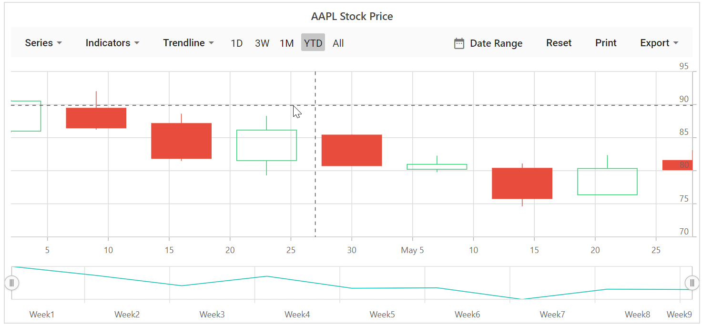
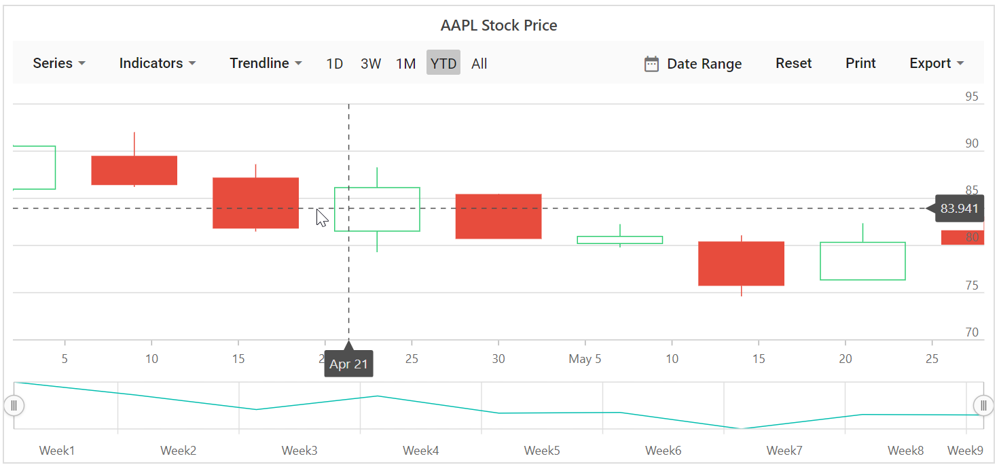
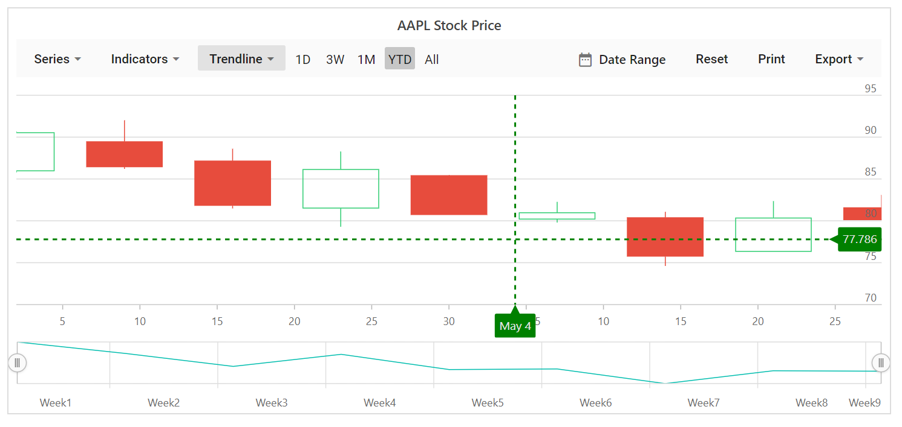
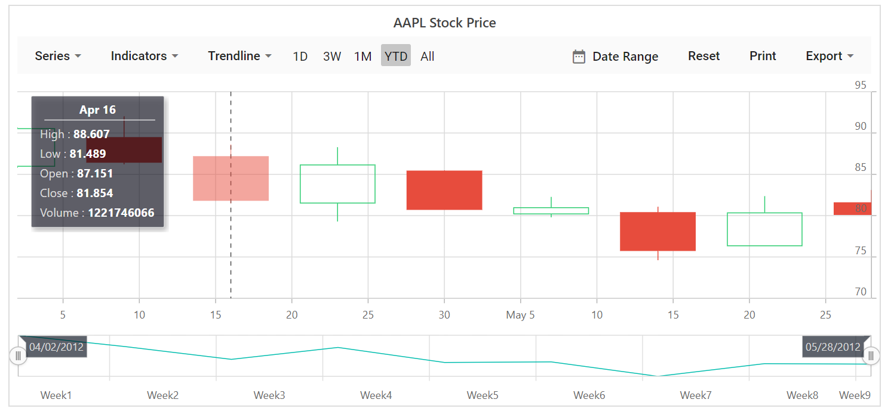

# Add Crosshair

Crosshair has a vertical and horizontal line to view the value of the axis at mouse or touch position.

Crosshair lines can be enabled by using [`Enable`](https://help.syncfusion.com/cr/blazor/Syncfusion.Blazor.Charts.StockChartCrosshairSettings.html#Syncfusion_Blazor_Charts_StockChartCrosshairSettings_Enable)
property in the `Crosshair`.





## Tooltip for axis

Tooltip label for an axis can be enabled by using [`Enable`](https://help.syncfusion.com/cr/blazor/Syncfusion.Blazor.Charts.StockChartCrosshairSettings.html#Syncfusion_Blazor_Charts_StockChartCrosshairSettings_Enable)
property of `CrosshairTooltip` in the corresponding axis.





## Customization

The `Fill` and `TextStyle` property of the `CrosshairTooltip` is used to customize the background color and font style of the crosshair label respectively. Color and Width of the crosshair line can be customized by using the
[`Line`](https://help.syncfusion.com/cr/blazor/Syncfusion.Blazor.Charts.StockChartCrosshairSettings.html#Syncfusion_Blazor_Charts_StockChartCrosshairSettings_Line) property in the crosshair.





## Add Trackball

Trackball is used to track a data point closest to the mouse or touch position. Trackball marker indicates the closest point and trackball tooltip displays the information about the point.

Trackball can be enabled by setting the [`Enable`](https://help.syncfusion.com/cr/blazor/Syncfusion.Blazor.Charts.StockChartCrosshairSettings.html#Syncfusion_Blazor_Charts_StockChartCrosshairSettings_Enable) property of the crosshair to true and
`Shared` property in `Tooltip` to true in chart.





