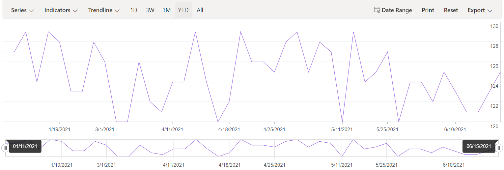

# DateTimeCategory Axis in Blazor Stock Chart Component 

DateTimeCategory Axis in Stock chart is used to display the minimum number of labels without any overlap on various business days.To use the date time category axis set the [ValueType](https://help.syncfusion.com/cr/blazor/Syncfusion.Blazor.Charts.ValueType.html) as [DateTimeCategory](https://help.syncfusion.com/cr/blazor/Syncfusion.Blazor.Charts.ValueType.html#Syncfusion_Blazor_Charts_ValueType_DateTimeCategory) 

```cshtml
@using Syncfusion.Blazor.Charts
@using System.Dynamic

<SfStockChart Title="AAPL Stock Price">
    <StockChartEvents SharedTooltipRendering="@TooltipText"></StockChartEvents>
    <StockChartPrimaryXAxis ValueType="@Syncfusion.Blazor.Charts.ValueType.DateTimeCategory">
        <StockChartAxisMajorGridLines Width="0"></StockChartAxisMajorGridLines>
        <StockChartAxisCrosshairTooltip Enable="true"></StockChartAxisCrosshairTooltip>
    </StockChartPrimaryXAxis>
    <StockChartTooltipSettings Enable="true" Header="AAPL Stock Price"></StockChartTooltipSettings>
    <StockChartCrosshairSettings Enable="true"></StockChartCrosshairSettings>
    <StockChartSeriesCollection>
        <StockChartSeries DataSource="@StockInfo" Type="ChartSeriesType.Line" XName="X"  YName="Y"></StockChartSeries>
    </StockChartSeriesCollection>
</SfStockChart>

@code {
    private List<DateTime> Dates = new List<DateTime> 
    {   new DateTime(2021, 01, 11),new DateTime(2021, 01, 12),new DateTime(2021, 01, 13),new DateTime(2021, 01, 14),new DateTime(2021, 01, 15), 
        new DateTime(2021, 01, 19),new DateTime(2021, 01, 20),new DateTime(2021, 01, 21),new DateTime(2021, 01, 22),new DateTime(2021, 03, 01),
        new DateTime(2021, 03, 02),new DateTime(2021, 04, 01),new DateTime(2021, 04, 05),new DateTime(2021, 04, 06),new DateTime(2021, 04, 07),
        new DateTime(2021, 04, 11),new DateTime(2021, 04, 13),new DateTime(2021, 04, 15),new DateTime(2021, 04, 16),new DateTime(2021, 04, 17),
        new DateTime(2021, 04, 18),new DateTime(2021, 04, 20),new DateTime(2021, 04, 21),new DateTime(2021, 04, 23),new DateTime(2021, 04, 25),
        new DateTime(2021, 05, 01),new DateTime(2021, 05, 02),new DateTime(2021, 05, 06),new DateTime(2021, 05, 07),new DateTime(2021, 05, 08),
        new DateTime(2021, 05, 11),new DateTime(2021, 05, 15),new DateTime(2021, 05, 18),new DateTime(2021, 05, 20),new DateTime(2021, 05, 25),
        new DateTime(2021, 06, 01),new DateTime(2021, 06, 02),new DateTime(2021, 06, 03),new DateTime(2021, 06, 04),new DateTime(2021, 06, 05),
        new DateTime(2021, 06, 10),new DateTime(2021, 06, 11),new DateTime(2021, 06, 12),new DateTime(2021, 06, 13),new DateTime(2021, 06, 15),
        new DateTime(2021, 06, 16),new DateTime(2021, 06, 17),new DateTime(2021, 06, 18),new DateTime(2021, 06, 19),new DateTime(2021, 06, 20)
    };
    public DateTime[] Value = new DateTime[] { new DateTime(2021, 01, 01), new DateTime(2022, 01, 01) };
    public List<ExpandoObject> StockInfo { get; set; } = new List<ExpandoObject>();
    private Random randomNum = new Random();
    protected override void OnInitialized()
    {
        StockInfo = Enumerable.Range(0, 45).Select((x) =>
        {
            dynamic d = new ExpandoObject();
            d.X = Dates[x];
            d.Open = randomNum.Next(75, 85);
            d.High = randomNum.Next(88, 92);
            d.Low = randomNum.Next(76, 86);
            d.Close = randomNum.Next(85, 90);
            d.Volume = randomNum.Next(660187068, 965935749);
            d.Y = randomNum.Next(120, 130);
            return d;
        }).Cast<ExpandoObject>().ToList<ExpandoObject>();
    }


    public void TooltipText(SharedTooltipRenderEventArgs args)
    {
        if (args.Text[0] != null)
        {
            args.Text[0] = args.Text[0].Replace("00:00:00 AM", " ", StringComparison.InvariantCulture);
        }
    }

}
```



## See Also

* [Axis Customization](./axis-customization/)

 