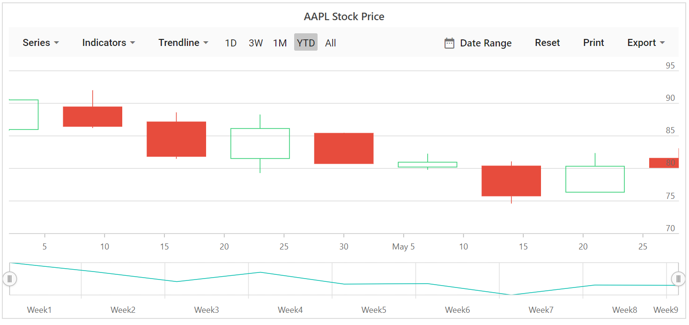
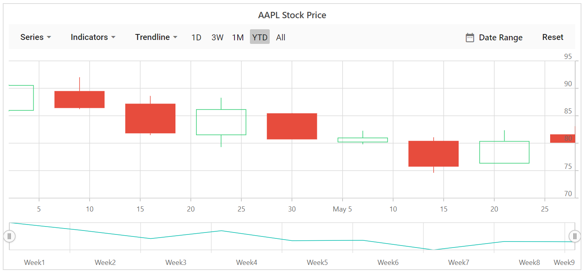

# Print and Export in Blazor Stock Chart Component

The rendered stock chart supports exporting to JPEG, PNG, SVG, PDF, XLSX, and CSV through the export dropdown in the period selector toolbar. The required format can be selected from the export dropdown in the stock chart toolbar.

The rendered stock chart can be printed directly using the print button in the period selector toolbar.

```cshtml

@using Syncfusion.Blazor.Charts

<SfStockChart Title="AAPL Stock Price">
    <StockChartSeriesCollection>
        <StockChartSeries DataSource="@StockDetails" Type="ChartSeriesType.Candle" XName="Date" High="High" Low="Low" Open="Open" Close="Close" Volume="Volume"></StockChartSeries>
    </StockChartSeriesCollection>
    <StockChartPrimaryYAxis>
        <StockChartAxisLineStyle Color="Transparent"></StockChartAxisLineStyle>
        <StockChartAxisMajorTickLines Color="Transparent" Width="0"></StockChartAxisMajorTickLines>
    </StockChartPrimaryYAxis>
    <StockChartPrimaryXAxis>
        <StockChartAxisMajorGridLines Color="Transparent"></StockChartAxisMajorGridLines>
    </StockChartPrimaryXAxis>
</SfStockChart>

@code {
    public class ChartData
    {
        public DateTime Date { get; set; }
        public Double Open { get; set; }
        public Double Low { get; set; }
        public Double Close { get; set; }
        public Double High { get; set; }
        public Double Volume { get; set;} 
    }

    public List<ChartData> StockDetails = new List<ChartData>
    {
        new ChartData { Date = new DateTime(2012, 04, 02), Open = 85.9757, High = 90.6657, Low = 85.7685, Close = 90.5257, Volume = 660187068 },
        new ChartData { Date = new DateTime(2012, 04, 09), Open = 89.4471, High = 92, Low = 86.2157, Close = 86.4614, Volume = 912634864 },
        new ChartData { Date = new DateTime(2012, 04, 16), Open = 87.1514, High = 88.6071, Low = 81.4885, Close = 81.8543, Volume = 1221746066 },
        new ChartData { Date = new DateTime(2012, 04, 23), Open = 81.5157, High = 88.2857, Low = 79.2857, Close = 86.1428, Volume = 965935749 },
        new ChartData { Date = new DateTime(2012, 04, 30), Open = 85.4, High = 85.4857, Low = 80.7385, Close = 80.75, Volume = 615249365 },
        new ChartData { Date = new DateTime(2012, 05, 07), Open = 80.2143, High = 82.2685, Low = 79.8185, Close = 80.9585, Volume = 541742692 },
        new ChartData { Date = new DateTime(2012, 05, 14), Open = 80.3671, High = 81.0728, Low = 74.5971, Close = 75.7685, Volume = 708126233 },
        new ChartData { Date = new DateTime(2012, 05, 21), Open = 76.3571, High = 82.3571, Low = 76.2928, Close = 80.3271, Volume = 682076215 },
        new ChartData { Date = new DateTime(2012, 05, 28), Open = 81.5571, High = 83.0714, Low = 80.0743, Close = 80.1414, Volume = 480059584 }
    };
}

```



## Disable export and print

Set the `ExportType` property to an empty list to disable export options.

```cshtml

@using Syncfusion.Blazor.Charts

<SfStockChart Title="AAPL Stock Price" ExportType="new List<ExportType>() { }">
    <StockChartSeriesCollection>
        <StockChartSeries DataSource="@StockDetails" Type="ChartSeriesType.Candle" XName="Date" High="High" Low="Low" Open="Open" Close="Close" Name="google"></StockChartSeries>
    </StockChartSeriesCollection>
</SfStockChart>

@code {
    public class ChartData
    {
        public DateTime Date { get; set; }
        public Double Open { get; set; }
        public Double Low { get; set; }
        public Double Close { get; set; }
        public Double High { get; set; }
        public Double Volume { get; set;} 
    }

    public List<ChartData> StockDetails = new List<ChartData>
    {
        new ChartData { Date = new DateTime(2012, 04, 02), Open = 85.9757, High = 90.6657, Low = 85.7685, Close = 90.5257, Volume = 660187068 },
        new ChartData { Date = new DateTime(2012, 04, 09), Open = 89.4471, High = 92, Low = 86.2157, Close = 86.4614, Volume = 912634864 },
        new ChartData { Date = new DateTime(2012, 04, 16), Open = 87.1514, High = 88.6071, Low = 81.4885, Close = 81.8543, Volume = 1221746066 },
        new ChartData { Date = new DateTime(2012, 04, 23), Open = 81.5157, High = 88.2857, Low = 79.2857, Close = 86.1428, Volume = 965935749 },
        new ChartData { Date = new DateTime(2012, 04, 30), Open = 85.4, High = 85.4857, Low = 80.7385, Close = 80.75, Volume = 615249365 },
        new ChartData { Date = new DateTime(2012, 05, 07), Open = 80.2143, High = 82.2685, Low = 79.8185, Close = 80.9585, Volume = 541742692 },
        new ChartData { Date = new DateTime(2012, 05, 14), Open = 80.3671, High = 81.0728, Low = 74.5971, Close = 75.7685, Volume = 708126233 },
        new ChartData { Date = new DateTime(2012, 05, 21), Open = 76.3571, High = 82.3571, Low = 76.2928, Close = 80.3271, Volume = 682076215 },
        new ChartData { Date = new DateTime(2012, 05, 28), Open = 81.5571, High = 83.0714, Low = 80.0743, Close = 80.1414, Volume = 480059584 }
    };
}

```



## Customize the exported chart using the Exporting event

The [Exporting](https://help.syncfusion.com/cr/blazor/Syncfusion.Blazor.Charts.StockChartEvents.html#Syncfusion_Blazor_Charts_StockChartEvents_Exporting) event enables customization of the exported stock chart before file generation. The [ChartExportEventArgs](https://help.syncfusion.com/cr/blazor/Syncfusion.Blazor.Charts.ChartExportEventArgs.html) class provides the following options:

- `Cancel`: Cancels the export process when set to true.
- `Height`: Specifies the height of the exported chart. Not applicable for XLSX and CSV formats.
- `Width`: Specifies the width of the exported chart. Not applicable for XLSX and CSV formats.
- `Workbook`: Represents the workbook generated during export. Applicable only for XLSX and CSV formats.

### Customize the exported Excel documents

The [Workbook](https://help.syncfusion.com/cr/blazor/Syncfusion.Blazor.Charts.ChartExportEventArgs.html#Syncfusion_Blazor_Charts_ChartExportEventArgs_Workbook) property in the [Exporting](https://help.syncfusion.com/cr/blazor/Syncfusion.Blazor.Charts.StockChartEvents.html#Syncfusion_Blazor_Charts_StockChartEvents_Exporting) event arguments allows customization of the exported Excel sheet by modifying rows, columns, and cells. Examples include changing font color, font size, and font name; applying bold text; setting background color; and center‑aligning text before the file is generated.

In the following example, when the stock chart is exported to Excel format, the exported Excel document is customized using the `Exporting` event. If a type other than XLSX or CSV is selected, the `Workbook` property is null, and the chart width is set to **500px**.

```cshtml

@using Microsoft.AspNetCore.Components.Web;
@using Syncfusion.PdfExport;
@using Syncfusion.ExcelExport; 
@using Syncfusion.Blazor.Charts

<SfStockChart Title="AAPL Stock Price">
    <StockChartSeriesCollection>
        <StockChartSeries DataSource="@StockDetails" Type="Syncfusion.Blazor.Charts.ChartSeriesType.Candle" XName="Date" High="High" Low="Low" Open="Open" Close="Close" Volume="Volume"></StockChartSeries>
    </StockChartSeriesCollection>
    <StockChartPrimaryYAxis>
        <StockChartAxisLineStyle Color="Transparent"></StockChartAxisLineStyle>
        <StockChartAxisMajorTickLines Color="Transparent" Width="0"></StockChartAxisMajorTickLines>
    </StockChartPrimaryYAxis>
    <StockChartPrimaryXAxis>
        <StockChartAxisMajorGridLines Color="Transparent"></StockChartAxisMajorGridLines>
    </StockChartPrimaryXAxis>
    <StockChartEvents Exporting="BeforeExport"></StockChartEvents>
</SfStockChart>

@code {
    public class ChartData
    {
        public DateTime Date { get; set; }
        public Double Open { get; set; }
        public Double Low { get; set; }
        public Double Close { get; set; }
        public Double High { get; set; }
        public Double Volume { get; set;} 
    }

    public List<ChartData> StockDetails = new List<ChartData>
    {
        new ChartData { Date = new DateTime(2012, 04, 02), Open = 85.9757, High = 90.6657, Low = 85.7685, Close = 90.5257, Volume = 660187068 },
        new ChartData { Date = new DateTime(2012, 04, 09), Open = 89.4471, High = 92, Low = 86.2157, Close = 86.4614, Volume = 912634864 },
        new ChartData { Date = new DateTime(2012, 04, 16), Open = 87.1514, High = 88.6071, Low = 81.4885, Close = 81.8543, Volume = 1221746066 },
        new ChartData { Date = new DateTime(2012, 04, 23), Open = 81.5157, High = 88.2857, Low = 79.2857, Close = 86.1428, Volume = 965935749 },
        new ChartData { Date = new DateTime(2012, 04, 30), Open = 85.4, High = 85.4857, Low = 80.7385, Close = 80.75, Volume = 615249365 },
        new ChartData { Date = new DateTime(2012, 05, 07), Open = 80.2143, High = 82.2685, Low = 79.8185, Close = 80.9585, Volume = 541742692 },
        new ChartData { Date = new DateTime(2012, 05, 14), Open = 80.3671, High = 81.0728, Low = 74.5971, Close = 75.7685, Volume = 708126233 },
        new ChartData { Date = new DateTime(2012, 05, 21), Open = 76.3571, High = 82.3571, Low = 76.2928, Close = 80.3271, Volume = 682076215 },
        new ChartData { Date = new DateTime(2012, 05, 28), Open = 81.5571, High = 83.0714, Low = 80.0743, Close = 80.1414, Volume = 480059584 }
    };

    public void BeforeExport(ChartExportEventArgs args)
    {
        if (args.Workbook != null)
        {
            Worksheet firstSheet = args.Workbook.Worksheets.First();
            firstSheet.Columns[0].Width = 200;
            firstSheet.Columns[1].Width = 200;
            firstSheet.Rows[1].Cells[0].Value = "Country";
            firstSheet.Rows[1].Cells[1].Value = "GigaWatts";
            firstSheet.Rows[0].Cells[0].CellStyle.BackColor = "#FFA07A";

            for (int i = 2; i < firstSheet.Rows.Count; i++)
            {
                for (int j = 0; j < 2; j++)
                {
                    firstSheet.Rows[i].Cells[1].CellStyle.HAlign = HAlignType.Center;
                    firstSheet.Rows[i].Cells[1].CellStyle.VAlign = VAlignType.Center;
                }
            }
        } else {
            args.Width = 500;
        }
    }
}

```
