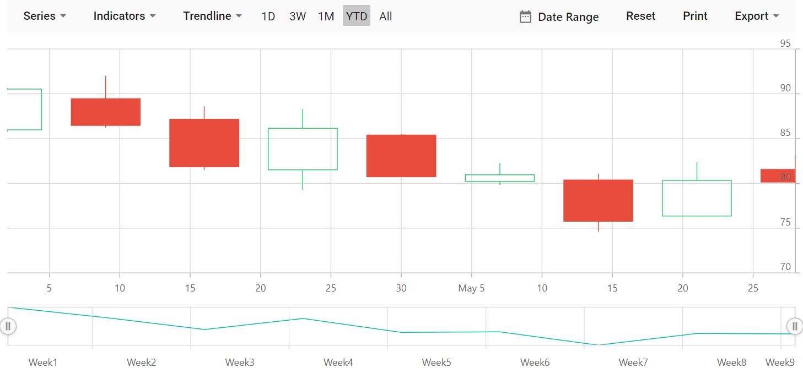

# Getting Started with Blazor Stock Chart Component

This section briefly explains how to include a Stock Chart component in your Blazor server-side application. You can refer to our [Getting Started with Syncfusion Blazor for server-side in Visual Studio 2019](https://blazor.syncfusion.com/documentation/getting-started/blazor-server-side-visual-studio-2019/) page for introduction and configuring common specifications.

To get start quickly with Blazor Stock Chart component, you can check on this video.



## Importing Syncfusion Blazor Stock Chart component in the application

1. Install **Syncfusion.Blazor** NuGet package to the application by using the **NuGet Package Manager**.

2. You can add the client-side resources through CDN or from NuGet package in the **HEAD** element of the **~/Pages/_Host.cshtml** page.

    ```html
    <head>
        <link href="_content/Syncfusion.Blazor.Themes/bootstrap4.css" rel="stylesheet" />
        <!---CDN--->
        @*<link href="https://cdn.syncfusion.com/blazor/{{ site.blazorversion }}/styles/bootstrap4.css" rel="stylesheet" />*@
    </head>
    ```

    > For Internet Explorer 11, kindly refer the polyfills. Refer the [documentation](https://blazor.syncfusion.com/documentation/common/how-to/render-blazor-server-app-in-ie/) for more information.

    ```html
    <head>
        <link href="https://cdn.syncfusion.com/blazor/{{ site.blazorversion }}/styles/bootstrap4.css" rel="stylesheet" />
        <script src="https://github.com/Daddoon/Blazor.Polyfill/releases/download/3.0.1/blazor.polyfill.min.js"></script>
    </head>
    ```

3. Now add the lodash script **mandatorily** to the **HEAD** element of the **/Pages/Host.cshtml** page, since we have used it in our component.

    ```html
    <head>
        <link href="https://cdn.syncfusion.com/blazor/{{ site.blazorversion }}/styles/bootstrap4.css" rel="stylesheet" />
        <script src="https://github.com/Daddoon/Blazor.Polyfill/releases/download/3.0.1/blazor.polyfill.min.js"></script>
        <script src="https://cdnjs.cloudflare.com/ajax/libs/lodash.js/4.17.20/lodash.min.js"></script>
    </head>
    ```

## Adding component package to the application

Open the **~/_Imports.razor** file and include the **Syncfusion.Blazor.Charts** namespace.

```cshtml
@using Syncfusion.Blazor.Charts
```

## Adding SyncfusionBlazor service in Startup.cs

Open the **Startup.cs** file and add services required by Syncfusion components using **services.AddSyncfusionBlazor()** method. Add this method in the **ConfigureServices** function as follows.

```csharp
using Syncfusion.Blazor;

namespace BlazorApplication
{
    public class Startup
    {
        ....
        ....
        public void ConfigureServices(IServiceCollection services)
        {
            ....
            ....
            services.AddSyncfusionBlazor();
        }
    }
}
```

> To enable custom client-side source loading from CRG or CDN, please refer to the section about [custom resources in Blazor application](https://blazor.syncfusion.com/documentation/common/custom-resource-generator/#how-to-use-custom-resources-in-the-blazor-application).

## Adding Stock Chart component

To initialize the Stock Chart component, add the below code to your **Index.razor** view page under **~/Pages** folder. In a new application, if **Index.razor** page has any default content template, then those content can be completely removed and following code can be added.

```cshtml
@page "/"

<SfStockChart>

</SfStockChart>
```

## Populate Stock Chart with Data

To bind data for the Stock Chart component, you can assign a `IEnumerable` object to the [DataSource](https://help.syncfusion.com/cr/blazor/Syncfusion.Blazor.Charts.StockChartSeries.html#Syncfusion_Blazor_Charts_StockChartSeries_DataSource) property. It can also be provided as an instance of the [DataManager](https://help.syncfusion.com/cr/blazor/Syncfusion.Blazor.DataManager.html).

```cshtml
@code{
    public class StockChartData
    {
        public DateTime Date { get; set; }
        public Double Open { get; set; }
        public Double Low { get; set; }
        public Double Close { get; set; }
        public Double High { get; set; }
        public Double Volume { get; set; }
    }

    public List<StockChartData> StockDetails = new List<StockChartData>
    {
        new StockChartData { Date = new DateTime(2012, 04, 02), Open = 85.9757, High = 90.6657, Low = 85.7685, Close = 90.5257, Volume = 660187068},
        new StockChartData { Date = new DateTime(2012, 04, 09), Open = 89.4471, High = 92, Low = 86.2157, Close = 86.4614, Volume = 912634864},
        new StockChartData { Date = new DateTime(2012, 04, 16), Open = 87.1514, High = 88.6071, Low = 81.4885, Close = 81.8543, Volume = 1221746066},
        new StockChartData { Date = new DateTime(2012, 04, 23), Open = 81.5157, High = 88.2857, Low = 79.2857, Close = 86.1428, Volume = 965935749},
        new StockChartData { Date = new DateTime(2012, 04, 30), Open = 85.4, High =  85.4857, Low = 80.7385, Close = 80.75, Volume = 615249365},
        new StockChartData { Date = new DateTime(2012, 05, 07), Open = 80.2143, High = 82.2685, Low = 79.8185, Close = 80.9585, Volume = 541742692},
        new StockChartData { Date = new DateTime(2012, 05, 14), Open = 80.3671, High = 81.0728, Low = 74.5971, Close = 75.7685, Volume = 708126233},
        new StockChartData { Date = new DateTime(2012, 05, 21), Open = 76.3571, High = 82.3571, Low = 76.2928, Close = 80.3271, Volume = 682076215},
        new StockChartData { Date = new DateTime(2012, 05, 28), Open = 81.5571, High = 83.0714, Low = 80.0743, Close = 80.1414, Volume = 480059584},
    };
}
```

Now set the `StockDetails` to [DataSource](https://help.syncfusion.com/cr/blazor/Syncfusion.Blazor.Charts.StockChartSeries.html#Syncfusion_Blazor_Charts_StockChartSeries_DataSource) property. By default, Stock Chart will be rendered based on provided `Date` and `High` fields value from datasource without any mapping.

```cshtml
<SfStockChart>
    <StockChartSeriesCollection>
        <StockChartSeries DataSource="@StockDetails" Type="ChartSeriesType.Candle" XName="Date" YName="Close" High="High" Low="Low" Open="Open" Close="Close" Volume="Volume"></StockChartSeries>
    </StockChartSeriesCollection>
</SfStockChart>
```

On successful compilation of your application, the Syncfusion Blazor Stock Chart component will render in the web browser as shown below.



## Adding Title

You can add a title using [Title](https://help.syncfusion.com/cr/blazor/Syncfusion.Blazor.Charts.SfStockChart.html#Syncfusion_Blazor_Charts_SfStockChart_Title) property in the Stock Chart, to provide quick information to the user about the data plotted in the component.

```cshtml

@using Syncfusion.Blazor.Charts

<SfStockChart Title="AAPL Historical">
    <StockChartSeriesCollection>
        <StockChartSeries DataSource="@StockDetails" Type="ChartSeriesType.Candle" XName="Date" YName="Close" High="High" Low="Low" Open="Open" Close="Close" Volume="Volume"></StockChartSeries>
    </StockChartSeriesCollection>
</SfStockChart>

@code {
    public class ChartData
    {
        public DateTime Date { get; set; }
        public Double Open { get; set; }
        public Double Low { get; set; }
        public Double Close { get; set; }
        public Double High { get; set; }
        public Double Volume { get; set; }
    }
	
    public List<ChartData> StockDetails = new List<ChartData>
    {
        new ChartData { Date = new DateTime(2012, 04, 02), Open= 85.9757, High = 90.6657,Low = 85.7685, Close = 90.5257,Volume = 660187068},
        new ChartData { Date = new DateTime(2012, 04, 09), Open= 89.4471, High = 92,Low = 86.2157, Close = 86.4614,Volume = 912634864},
        new ChartData { Date = new DateTime(2012, 04, 16), Open= 87.1514, High = 88.6071,Low = 81.4885, Close = 81.8543,Volume = 1221746066},
        new ChartData { Date = new DateTime(2012, 04, 23), Open= 81.5157, High = 88.2857,Low = 79.2857, Close = 86.1428,Volume = 965935749},
        new ChartData { Date = new DateTime(2012, 04, 30), Open= 85.4, High =  85.4857,Low = 80.7385, Close = 80.75,Volume = 615249365},
        new ChartData { Date = new DateTime(2012, 05, 07), Open= 80.2143, High = 82.2685,Low = 79.8185, Close = 80.9585,Volume = 541742692},
        new ChartData { Date = new DateTime(2012, 05, 14), Open= 80.3671, High = 81.0728,Low = 74.5971, Close = 75.7685,Volume = 708126233},
        new ChartData { Date = new DateTime(2012, 05, 21), Open= 76.3571, High = 82.3571,Low = 76.2928, Close = 80.3271,Volume = 682076215},
        new ChartData { Date = new DateTime(2012, 05, 28), Open= 81.5571, High = 83.0714,Low = 80.0743, Close = 80.1414,Volume = 480059584}
   };
}

```


## Adding Crosshair

The crosshair is a vertical and horizontal line on the view that shows the value of an axis when the mouse or touch is in a certain position. The crosshair lines can be enabled by using [Enable](https://help.syncfusion.com/cr/blazor/Syncfusion.Blazor.Charts.StockChartCrosshairSettings.html#Syncfusion_Blazor_Charts_StockChartCrosshairSettings_Enable) property in the [StockChartCrosshairSettings](https://help.syncfusion.com/cr/blazor/Syncfusion.Blazor.Charts.StockChartCrosshairSettings.html). Likewise tooltip label for an axis can be enabled by using [Enable](https://help.syncfusion.com/cr/blazor/Syncfusion.Blazor.Charts.StockChartTooltipSettings.html#Syncfusion_Blazor_Charts_StockChartTooltipSettings_Enable) property in the [StockChartTooltipSettings](https://help.syncfusion.com/cr/blazor/Syncfusion.Blazor.Charts.StockChartTooltipSettings.html).

```cshtml

@using Syncfusion.Blazor.Charts

<SfStockChart>
    <StockChartCrosshairSettings Enable="true"></StockChartCrosshairSettings>
    <StockChartSeriesCollection>
        <StockChartSeries DataSource="@StockDetails" Type="ChartSeriesType.Column" XName="Date" YName="Y"></StockChartSeries>
    </StockChartSeriesCollection>
</SfStockChart>

@code {
    public class ChartData
    {
        public DateTime Date { get; set; }
        public Double Y { get; set; }
    }

    public List<ChartData> StockDetails = new List<ChartData>
    {
         new ChartData { Date = new DateTime(2012, 04, 02), Y= 100},
         new ChartData { Date = new DateTime(2012, 04, 09), Y= 10 },
         new ChartData { Date = new DateTime(2012, 04, 16), Y= 500},
         new ChartData { Date = new DateTime(2012, 04, 23), Y= 80 },
         new ChartData { Date = new DateTime(2012, 04, 30), Y= 200},
         new ChartData { Date = new DateTime(2012, 05, 07), Y= 600},
         new ChartData { Date = new DateTime(2012, 05, 14), Y= 50 },
         new ChartData { Date = new DateTime(2012, 05, 21), Y= 700},
         new ChartData { Date = new DateTime(2012, 05, 28), Y= 90 }
   };
}

```


## Adding Trackball

The trackball is used to track a closest data point  to the mouse or touch position. The trackball marker indicates the closest point and trackball tooltip displays the information about the point. It can be enabled by setting the [Enable](https://help.syncfusion.com/cr/blazor/Syncfusion.Blazor.Charts.StockChartCrosshairSettings.html#Syncfusion_Blazor_Charts_StockChartCrosshairSettings_Enable) property in the [StockChartCrosshairSettings](https://help.syncfusion.com/cr/blazor/Syncfusion.Blazor.Charts.StockChartCrosshairSettings.html) to **true** and [Shared](https://help.syncfusion.com/cr/blazor/Syncfusion.Blazor.Charts.StockChartTooltipSettings.html#Syncfusion_Blazor_Charts_StockChartTooltipSettings_Shared) property in the [StockChartTooltipSettings](https://help.syncfusion.com/cr/blazor/Syncfusion.Blazor.Charts.StockChartTooltipSettings.html) to **true** in component.

```cshtml

@using Syncfusion.Blazor.Charts

<SfStockChart>
    <StockChartCrosshairSettings Enable="true" LineType="LineType.Vertical"></StockChartCrosshairSettings>
    <StockChartTooltipSettings Enable="true" Shared="true" Format="${point.x} : ${point.y}" Header="AAPL"></StockChartTooltipSettings>
    <StockChartSeriesCollection>
        <StockChartSeries DataSource="@StockDetails" Type="ChartSeriesType.Line" XName="Date" YName="Y"></StockChartSeries>
        <StockChartSeries DataSource="@StockDetails" Type="ChartSeriesType.Line" XName="Date" YName="Y1"></StockChartSeries>
    </StockChartSeriesCollection>
</SfStockChart>

@code {
    public class ChartData
    {
        public DateTime Date { get; set; }
        public Double Y { get; set; }
        public Double Y1 { get; set; }
    }

    public List<ChartData> StockDetails = new List<ChartData>
    {
         new ChartData { Date = new DateTime(2012, 04, 02), Y= 100, Y1= 50},
         new ChartData { Date = new DateTime(2012, 04, 09), Y= 10 , Y1= 5},
         new ChartData { Date = new DateTime(2012, 04, 16), Y= 500, Y1= 250},
         new ChartData { Date = new DateTime(2012, 04, 23), Y= 80 , Y1= 60},
         new ChartData { Date = new DateTime(2012, 04, 30), Y= 200, Y1= 100},
         new ChartData { Date = new DateTime(2012, 05, 07), Y= 600, Y1= 300},
         new ChartData { Date = new DateTime(2012, 05, 14), Y= 50 , Y1= 25},
         new ChartData { Date = new DateTime(2012, 05, 21), Y= 700, Y1= 350},
         new ChartData { Date = new DateTime(2012, 05, 28), Y= 90 , Y1= 45}
   };
}

```


> You can find the fully working sample [here](https://www.syncfusion.com/downloads/support/directtrac/general/ze/BlazorApp491318120.zip).

## See also

* [Getting Started with Syncfusion Blazor for Client-Side in .NET Core CLI](https://blazor.syncfusion.com/documentation/getting-started/blazor-webassembly-dotnet-cli/)
* [Getting Started with Syncfusion Blazor for Server-Side in Visual Studio 2019 Preview](https://blazor.syncfusion.com/documentation/getting-started/blazor-server-side-visual-studio-2019/?no-cache=1)
* [Getting Started with Syncfusion Blazor for Server-Side in .NET Core CLI](https://blazor.syncfusion.com/documentation/getting-started/blazor-server-side-dotnet-cli/)