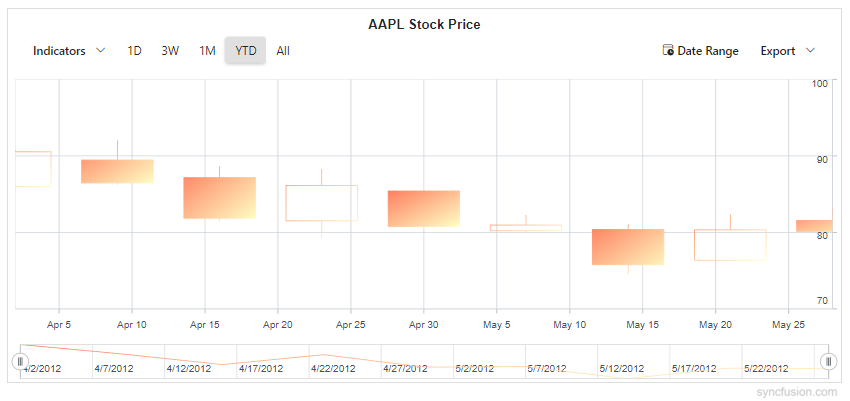
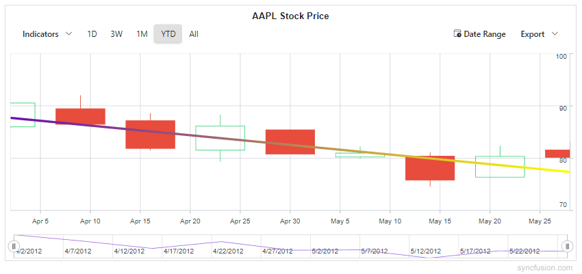
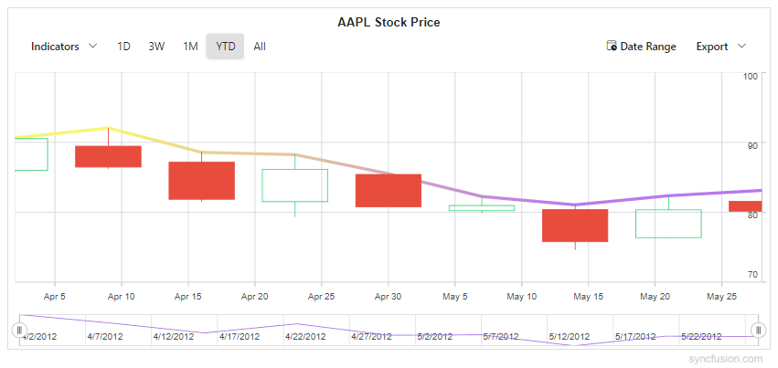
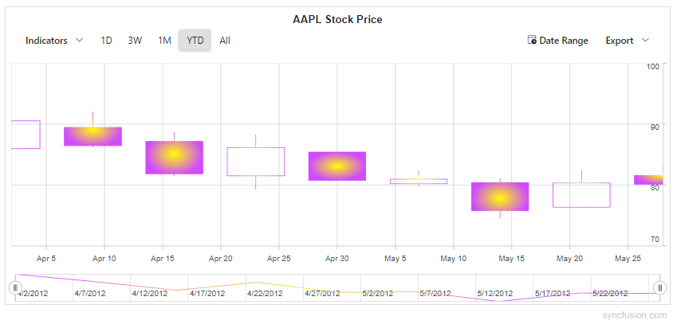

# Gradient in Blazor Stock Chart Component

Gradients add depth and modern styling to stock charts by smoothly blending multiple colors. The Stock Chart component supports two gradient types:

- Linear gradient
- Radial gradient

Gradients can be applied to:

- Series
- Trendlines
- Technical Indicators

## Linear gradient

A linear gradient blends colors along a straight path from a defined start point to an end point. Configure it by adding `StockChartLinearGradient` inside the target element (Series, Trendline, or Indicator) and define one or more color stops that control how colors transition across the gradient. Set the start and end positions of the gradient using `X1`, `Y1`, `X2`, and `Y2` properties. The color stop values such as `Offset`, `Color`, `Opacity`, `Lighten`, and `Brighten` are set using `StockChartGradientColorStop`.

In the `StockChartLinearGradient`:
```cshtml
X1 - Sets the horizontal start position of the gradient (0 to 1).
Y1 - Sets the vertical start position of the gradient (0 to 1).
X2 - Sets the horizontal end position of the gradient (0 to 1).
Y2 - Sets the vertical end position of the gradient (0 to 1).
```

In the `StockChartGradientColorStop`:
- Offset - Specifies the position of the color stop along the gradient (0 to 100).
- Color - Sets the color at the stop.
- Opacity - Defines the transparency of the stop (0 to 1).
- Lighten - Adjusts the lightness at the stop. Positive values lighten the color and negative values darken it.
- Brighten - Adjusts the brightness at the stop. Positive values increase brightness and negative values decrease it.

### Series

Apply a linear gradient to a series by adding `StockChartLinearGradient` inside the target Series. The same gradient is applied to legend and tooltip markers for visual consistency.

```cshtml

@using Syncfusion.Blazor.Charts

@* Initialize the Stock Chart to display AAPL stock price using a Candle series *@
<SfStockChart Title="AAPL Stock Price">
    <StockChartPrimaryXAxis ValueType="Syncfusion.Blazor.Charts.ValueType.DateTime" />
    <StockChartPrimaryYAxis Interval="10" />

    <StockChartSeriesCollection>
        <StockChartSeries Name="AAPL" DataSource="@StockDetails" Type="ChartSeriesType.Candle" XName="Date" High="High" Low="Low" Open="Open" Close="Close" Volume="Volume">
            @* Series Linear Gradient: defines color stops for the entire series *@
            <StockChartLinearGradient X1="0" Y1="0" X2="1" Y2="1">
                <StockChartGradientColorStops>
                    <StockChartGradientColorStop Offset="0" Color="#FF7E5F" Opacity="1" Lighten="0" Brighten="1" />
                    <StockChartGradientColorStop Offset="100" Color="#FEB47B" Opacity="1" Lighten="0" Brighten="0.6" />
                </StockChartGradientColorStops>
            </StockChartLinearGradient>
        </StockChartSeries>
    </StockChartSeriesCollection>
</SfStockChart>

@code {
    public class StockChartData
    {
        public DateTime Date { get; set; }
        public double Open { get; set; }
        public double Low { get; set; }
        public double Close { get; set; }
        public double High { get; set; }
        public double Volume { get; set; }
    }

    public List<StockChartData> StockDetails = new ()
    {
        new StockChartData { Date = new DateTime(2012, 04, 02), Open = 85.9757, High = 90.6657, Low = 85.7685, Close = 90.5257, Volume = 660187068 },
        new StockChartData { Date = new DateTime(2012, 04, 09), Open = 89.4471, High = 92, Low = 86.2157, Close = 86.4614, Volume = 912634864 },
        new StockChartData { Date = new DateTime(2012, 04, 16), Open = 87.1514, High = 88.6071, Low = 81.4885, Close = 81.8543, Volume = 1221746066 },
        new StockChartData { Date = new DateTime(2012, 04, 23), Open = 81.5157, High = 88.2857, Low = 79.2857, Close = 86.1428, Volume = 965935749 },
        new StockChartData { Date = new DateTime(2012, 04, 30), Open = 85.4, High = 85.4857, Low = 80.7385, Close = 80.75, Volume = 615249365 },
        new StockChartData { Date = new DateTime(2012, 05, 07), Open = 80.2143, High = 82.2685, Low = 79.8185, Close = 80.9585, Volume = 541742692 },
        new StockChartData { Date = new DateTime(2012, 05, 14), Open = 80.3671, High = 81.0728, Low = 74.5971, Close = 75.7685, Volume = 708126233 },
        new StockChartData { Date = new DateTime(2012, 05, 21), Open = 76.3571, High = 82.3571, Low = 76.2928, Close = 80.3271, Volume = 682076215 },
        new StockChartData { Date = new DateTime(2012, 05, 28), Open = 81.5571, High = 83.0714, Low = 80.0743, Close = 80.1414, Volume = 480059584 }
    };
}

```


### Trendlines

Apply a linear gradient to a stock chart trendline by adding `StockChartLinearGradient` inside the `StockChartTrendline`.

```cshtml

@using Syncfusion.Blazor.Charts

@* Initialize the Stock Chart to display AAPL stock price using a Candle series *@
<SfStockChart Title="AAPL Stock Price">
    <StockChartPrimaryXAxis ValueType="Syncfusion.Blazor.Charts.ValueType.DateTime" />
    <StockChartPrimaryYAxis Interval="10" />
    <StockChartSeriesCollection>
        <StockChartSeries Name="Series1" DataSource="@StockDetails" Type="ChartSeriesType.Candle" XName="Date" High="High" Low="Low" Open="Open" Close="Close" Volume="Volume">
            <StockChartTrendlines>
                <StockChartTrendline Type="TrendlineTypes.Linear" Width="4">
                    @* Trendline Linear Gradient: applied to the trendline stroke *@
                    <StockChartLinearGradient X1="0" Y1="0" X2="1" Y2="0">
                        <StockChartGradientColorStops>
                            <StockChartGradientColorStop Offset="0" Color="#6A0DAD" Opacity="1" />
                            <StockChartGradientColorStop Offset="100" Color="#FFFF00" Opacity="1" />
                        </StockChartGradientColorStops>
                    </StockChartLinearGradient>
                </StockChartTrendline>
            </StockChartTrendlines>
        </StockChartSeries>
    </StockChartSeriesCollection>
</SfStockChart>

@code {
    public class StockChartData
    {
        public DateTime Date { get; set; }
        public double Open { get; set; }
        public double Low { get; set; }
        public double Close { get; set; }
        public double High { get; set; }
        public double Volume { get; set; }
    }
    public List<StockChartData> StockDetails = new ()
    {
        new StockChartData { Date = new DateTime(2012, 04, 02), Open = 85.9757, High = 90.6657, Low = 85.7685, Close = 90.5257, Volume = 660187068 },
        new StockChartData { Date = new DateTime(2012, 04, 09), Open = 89.4471, High = 92, Low = 86.2157, Close = 86.4614, Volume = 912634864 },
        new StockChartData { Date = new DateTime(2012, 04, 16), Open = 87.1514, High = 88.6071, Low = 81.4885, Close = 81.8543, Volume = 1221746066 },
        new StockChartData { Date = new DateTime(2012, 04, 23), Open = 81.5157, High = 88.2857, Low = 79.2857, Close = 86.1428, Volume = 965935749 },
        new StockChartData { Date = new DateTime(2012, 04, 30), Open = 85.4, High = 85.4857, Low = 80.7385, Close = 80.75, Volume = 615249365 },
        new StockChartData { Date = new DateTime(2012, 05, 07), Open = 80.2143, High = 82.2685, Low = 79.8185, Close = 80.9585, Volume = 541742692 },
        new StockChartData { Date = new DateTime(2012, 05, 14), Open = 80.3671, High = 81.0728, Low = 74.5971, Close = 75.7685, Volume = 708126233 },
        new StockChartData { Date = new DateTime(2012, 05, 21), Open = 76.3571, High = 82.3571, Low = 76.2928, Close = 80.3271, Volume = 682076215 },
        new StockChartData { Date = new DateTime(2012, 05, 28), Open = 81.5571, High = 83.0714, Low = 80.0743, Close = 80.1414, Volume = 480059584 }
    };
}

```


### Technical Indicators

Apply a linear gradient to a technical indicator by adding `StockChartLinearGradient` inside the target `StockChartIndicator`.

```cshtml

@using Syncfusion.Blazor.Charts

@* Initialize the Stock Chart to display AAPL stock price using a Candle series *@
<SfStockChart Title="AAPL Stock Price">
    <StockChartPrimaryXAxis ValueType="Syncfusion.Blazor.Charts.ValueType.DateTime" />
    <StockChartPrimaryYAxis Interval="10" />

    <StockChartSeriesCollection>
        <StockChartSeries Name="Series1" DataSource="@StockDetails" Type="ChartSeriesType.Candle" XName="Date" High="High" Low="Low" Open="Open" Close="Close" Volume="Volume" />
    </StockChartSeriesCollection>

    <StockChartIndicators>
        <StockChartIndicator Type="TechnicalIndicators.Ema" Field="FinancialDataFields.High" SeriesName="Series1" XName="Date" High="High" Low="Low" Open="Open" Close="Close" Volume="Volume" Period="1" Width="4">
            @* Indicator Linear Gradient: applied to the EMA indicator line *@
            <StockChartLinearGradient X1="0" Y1="0" X2="1" Y2="1">
                <StockChartGradientColorStops>
                    <StockChartGradientColorStop Offset="0" Color="#FFFF00" Opacity="1" Lighten="0.2" Brighten="1" />
                    <StockChartGradientColorStop Offset="100" Color="#7C00FF" Opacity="1" Lighten="0.2" Brighten="1" />
                </StockChartGradientColorStops>
            </StockChartLinearGradient>
        </StockChartIndicator>
    </StockChartIndicators>
</SfStockChart>

@code {
    public class StockChartData
    {
        public DateTime Date { get; set; }
        public double Open { get; set; }
        public double Low { get; set; }
        public double Close { get; set; }
        public double High { get; set; }
        public double Volume { get; set; }
    }
    public List<StockChartData> StockDetails = new ()
    {
        new StockChartData { Date = new DateTime(2012, 04, 02), Open = 85.9757, High = 90.6657, Low = 85.7685, Close = 90.5257, Volume = 660187068 },
        new StockChartData { Date = new DateTime(2012, 04, 09), Open = 89.4471, High = 92, Low = 86.2157, Close = 86.4614, Volume = 912634864 },
        new StockChartData { Date = new DateTime(2012, 04, 16), Open = 87.1514, High = 88.6071, Low = 81.4885, Close = 81.8543, Volume = 1221746066 },
        new StockChartData { Date = new DateTime(2012, 04, 23), Open = 81.5157, High = 88.2857, Low = 79.2857, Close = 86.1428, Volume = 965935749 },
        new StockChartData { Date = new DateTime(2012, 04, 30), Open = 85.4, High = 85.4857, Low = 80.7385, Close = 80.75, Volume = 615249365 },
        new StockChartData { Date = new DateTime(2012, 05, 07), Open = 80.2143, High = 82.2685, Low = 79.8185, Close = 80.9585, Volume = 541742692 },
        new StockChartData { Date = new DateTime(2012, 05, 14), Open = 80.3671, High = 81.0728, Low = 74.5971, Close = 75.7685, Volume = 708126233 },
        new StockChartData { Date = new DateTime(2012, 05, 21), Open = 76.3571, High = 82.3571, Low = 76.2928, Close = 80.3271, Volume = 682076215 },
        new StockChartData { Date = new DateTime(2012, 05, 28), Open = 81.5571, High = 83.0714, Low = 80.0743, Close = 80.1414, Volume = 480059584 }
    };
}

```


## Radial gradient

A radial gradient blends colors outward from a central point. Configure it by adding `StockChartRadialGradient` inside the target element (Series, Trendline, or Indicator) and define one or more color stops to control how colors transition from the center to the outer edge. Set the gradient’s center, optional focal point, and radius using `StockChartRadialGradient` properties. The color stop values such as `Offset`, `Color`, `Opacity`, `Lighten`, and `Brighten` are set using `StockChartGradientColorStop`.

In the `StockChartRadialGradient`:
```cshtml
Cx - Sets the normalized horizontal center of the gradient (0 to 1).
Cy - Sets the normalized vertical center of the gradient (0 to 1).
Fx - Sets the normalized horizontal focal point from which the gradient appears to originate (0 to 1).
Fy - Sets the normalized vertical focal point (0 to 1).
R - Sets the normalized radius of the gradient circle (0 to 1).
```

In the `StockChartGradientColorStop`:
- Offset - Specifies the position of the color stop along the gradient (0 to 100).
- Color - Sets the color at the stop.
- Opacity - Defines the transparency of the stop (0 to 1).
- Lighten - Adjusts the lightness at the stop. Positive values lighten and negative values darken the color.
- Brighten - Adjusts the brightness at the stop. Positive values increase and negative values decrease it.

### Series

Apply a radial gradient to a series by adding `StockChartRadialGradient` inside the target Series.

```cshtml

@using Syncfusion.Blazor.Charts

@* Initialize the Stock Chart to display AAPL stock price using a Candle series *@
<SfStockChart Title="AAPL Stock Price">
    <StockChartPrimaryXAxis ValueType="Syncfusion.Blazor.Charts.ValueType.DateTime" />
    <StockChartPrimaryYAxis Interval="10" />

    <StockChartSeriesCollection>
        <StockChartSeries Name="AAPL" DataSource="@StockDetails" Type="ChartSeriesType.Candle" XName="Date" High="High" Low="Low" Open="Open" Close="Close" Volume="Volume">
            @* Series Radial Gradient: defines color stops for the entire series *@
            <StockChartRadialGradient Cx="0.5" Cy="0.5" Fx="0.5" Fy="0.5" R="0.5">
                <StockChartGradientColorStops>
                    <StockChartGradientColorStop Offset="0" Color="#FFFF00" Opacity="1" Lighten="0" Brighten="1" />
                    <StockChartGradientColorStop Offset="100" Color="#7C3AED" Opacity="0.95" Lighten="-0.05" Brighten="0.9" />
                </StockChartGradientColorStops>
            </StockChartRadialGradient>
        </StockChartSeries>
    </StockChartSeriesCollection>
</SfStockChart>

@code {
    public class StockChartData
    {
        public DateTime Date { get; set; }
        public double Open { get; set; }
        public double Low { get; set; }
        public double Close { get; set; }
        public double High { get; set; }
        public double Volume { get; set; }
    }
    public List<StockChartData> StockDetails = new ()
    {
        new StockChartData { Date = new DateTime(2012, 04, 02), Open = 85.9757, High = 90.6657, Low = 85.7685, Close = 90.5257, Volume = 660187068 },
        new StockChartData { Date = new DateTime(2012, 04, 09), Open = 89.4471, High = 92, Low = 86.2157, Close = 86.4614, Volume = 912634864 },
        new StockChartData { Date = new DateTime(2012, 04, 16), Open = 87.1514, High = 88.6071, Low = 81.4885, Close = 81.8543, Volume = 1221746066 },
        new StockChartData { Date = new DateTime(2012, 04, 23), Open = 81.5157, High = 88.2857, Low = 79.2857, Close = 86.1428, Volume = 965935749 },
        new StockChartData { Date = new DateTime(2012, 04, 30), Open = 85.4, High = 85.4857, Low = 80.7385, Close = 80.75, Volume = 615249365 },
        new StockChartData { Date = new DateTime(2012, 05, 07), Open = 80.2143, High = 82.2685, Low = 79.8185, Close = 80.9585, Volume = 541742692 },
        new StockChartData { Date = new DateTime(2012, 05, 14), Open = 80.3671, High = 81.0728, Low = 74.5971, Close = 75.7685, Volume = 708126233 },
        new StockChartData { Date = new DateTime(2012, 05, 21), Open = 76.3571, High = 82.3571, Low = 76.2928, Close = 80.3271, Volume = 682076215 },
        new StockChartData { Date = new DateTime(2012, 05, 28), Open = 81.5571, High = 83.0714, Low = 80.0743, Close = 80.1414, Volume = 480059584 }
    };
}

```


N> Radial gradients can also be applied to Trendlines and Technical Indicators in the same way by placing a `StockChartRadialGradient` with color stops inside the target `StockChartTrendline` or `StockChartIndicator`.

## See also

* [Axis Customization](./axis-customization)
* [Tooltip](./tool-tip)
* [Legend](./legend)
* [Technical Indicators](./technical-indicators)
* [Trendlines](./trend-lines)
