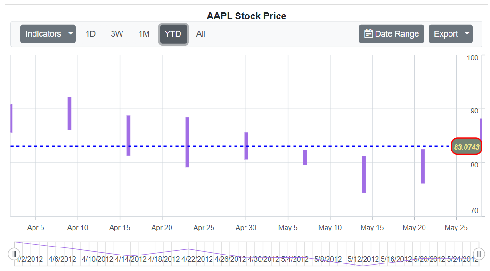

# Last Value Label in Blazor Stock Chart Component

The Last Value Label feature in `StockChartLastDataLabel` allows you to easily display the value of the last data point in a series. This provides an intuitive way to highlight the most recent or final value in your chart.

## Enable Last Value Label

To show the last value label, ensure that the `ShowLabel` property inside `StockChartLastDataLabel` is set to **true** within the series configuration.

```cshtml

@using Syncfusion.Blazor.Charts

<SfStockChart Title="AAPL Stock Price">
    <StockChartPrimaryYAxis Interval="10"></StockChartPrimaryYAxis>
    <StockChartSeriesCollection>
        <StockChartSeries DataSource="@StockDetails" Type="ChartSeriesType.Hilo" Width="3" XName="Date" High="High" Low="Low" Open="Open" Close="Close" Volume="Volume">
            <StockChartLastDataLabel ShowLabel="true" ></StockChartLastDataLabel>
        </StockChartSeries>
    </StockChartSeriesCollection>
</SfStockChart>

@code {

    public class ChartData
    {
        public DateTime Date { get; set; }
        public Double Open { get; set; }
        public Double Low { get; set; }
        public Double Close { get; set; }
        public Double High { get; set; }
        public Double Volume { get; set; }
    }

    public List<ChartData> StockDetails = new List<ChartData>
    {
        new ChartData { Date = new DateTime(2012, 04, 02), Open = 85.9757, High = 90.6657, Low = 85.7685, Close = 90.5257, Volume = 660187068 },
        new ChartData { Date = new DateTime(2012, 04, 09), Open = 89.4471, High = 92, Low = 86.2157, Close = 86.4614, Volume = 912634864 },
        new ChartData { Date = new DateTime(2012, 04, 16), Open = 87.1514, High = 88.6071, Low = 81.4885, Close = 81.8543, Volume = 1221746066 },
        new ChartData { Date = new DateTime(2012, 04, 23), Open = 81.5157, High = 88.2857, Low = 79.2857, Close = 86.1428, Volume = 965935749 },
        new ChartData { Date = new DateTime(2012, 04, 30), Open = 85.4, High =  85.4857, Low = 80.7385, Close = 80.75, Volume = 615249365 },
        new ChartData { Date = new DateTime(2012, 05, 07), Open = 80.2143, High = 82.2685, Low = 79.8185, Close = 80.9585, Volume = 541742692 },
        new ChartData { Date = new DateTime(2012, 05, 14), Open = 80.3671, High = 81.0728, Low = 74.5971, Close = 75.7685, Volume = 708126233 },
        new ChartData { Date = new DateTime(2012, 05, 21), Open = 76.3571, High = 82.3571, Low = 76.2928, Close = 80.3271, Volume = 682076215 },
        new ChartData { Date = new DateTime(2012, 05, 28), Open = 81.5571, High = 88.0714, Low = 83.0743, Close = 80.1414, Volume = 480059584 }
    };
}

```


## Last Value Label Customization

The appearance of the last value label can be customized using various style properties defined across different configuration settings. The background color, line color, line width, dash pattern, and corner radius of the label can be adjusted using properties such as **Background**, **LineColor**, **LineWidth**, **DashArray**, **Rx**, and **Ry** within `StockChartLastDataLabel`. You can customize the color and width of the label’s border through `StockChartLastDataLabelBorder` by setting the **Color** and **Width** properties. To style the label’s text, `StockChartLastDataLabelFont` provides options to specify the font color, font family, font style, font weight, and size. These settings allow you to create a visually distinct and well-integrated label that enhances the clarity and aesthetics of your chart.

```cshtml

@using Syncfusion.Blazor.Charts

<SfStockChart Title="AAPL Stock Price">
    <StockChartPrimaryYAxis Interval="10"></StockChartPrimaryYAxis>
    <StockChartSeriesCollection>
        <StockChartSeries DataSource="@StockDetails" Type="ChartSeriesType.Hilo" Width="3" XName="Date" High="High" Low="Low" Open="Open" Close="Close" Volume="Volume">
            <StockChartLastDataLabel ShowLabel="true" Background="#748574" LineColor="blue" LineWidth="2" DashArray="5" Rx="10" Ry="10">
                <StockChartLastDataLabelBorder Color="red" Width="2"></StockChartLastDataLabelBorder>
                <StockChartLastDataLabelFont Color="#F0E68C" FontFamily="Arial" FontStyle="Italic" FontWeight="bold" Size="12px"></StockChartLastDataLabelFont>
            </StockChartLastDataLabel>
        </StockChartSeries>
    </StockChartSeriesCollection>
</SfStockChart>

@code {

    public class ChartData
    {
        public DateTime Date { get; set; }
        public Double Open { get; set; }
        public Double Low { get; set; }
        public Double Close { get; set; }
        public Double High { get; set; }
        public Double Volume { get; set; }
    }

    public List<ChartData> StockDetails = new List<ChartData>
    {
        new ChartData { Date = new DateTime(2012, 04, 02), Open = 85.9757, High = 90.6657, Low = 85.7685, Close = 90.5257, Volume = 660187068 },
        new ChartData { Date = new DateTime(2012, 04, 09), Open = 89.4471, High = 92, Low = 86.2157, Close = 86.4614, Volume = 912634864 },
        new ChartData { Date = new DateTime(2012, 04, 16), Open = 87.1514, High = 88.6071, Low = 81.4885, Close = 81.8543, Volume = 1221746066 },
        new ChartData { Date = new DateTime(2012, 04, 23), Open = 81.5157, High = 88.2857, Low = 79.2857, Close = 86.1428, Volume = 965935749 },
        new ChartData { Date = new DateTime(2012, 04, 30), Open = 85.4, High =  85.4857, Low = 80.7385, Close = 80.75, Volume = 615249365 },
        new ChartData { Date = new DateTime(2012, 05, 07), Open = 80.2143, High = 82.2685, Low = 79.8185, Close = 80.9585, Volume = 541742692 },
        new ChartData { Date = new DateTime(2012, 05, 14), Open = 80.3671, High = 81.0728, Low = 74.5971, Close = 75.7685, Volume = 708126233 },
        new ChartData { Date = new DateTime(2012, 05, 21), Open = 76.3571, High = 82.3571, Low = 76.2928, Close = 80.3271, Volume = 682076215 },
        new ChartData { Date = new DateTime(2012, 05, 28), Open = 81.5571, High = 88.0714, Low = 83.0743, Close = 80.1414, Volume = 480059584 }
    };
}

```

