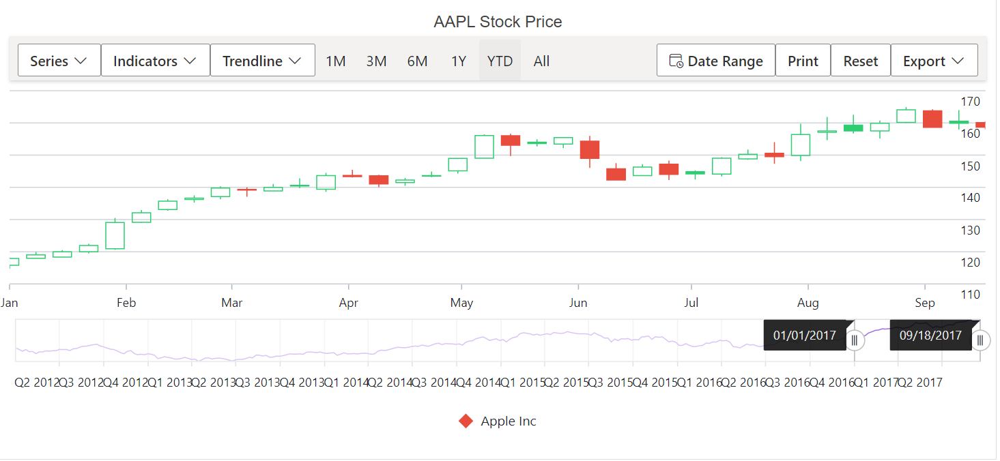
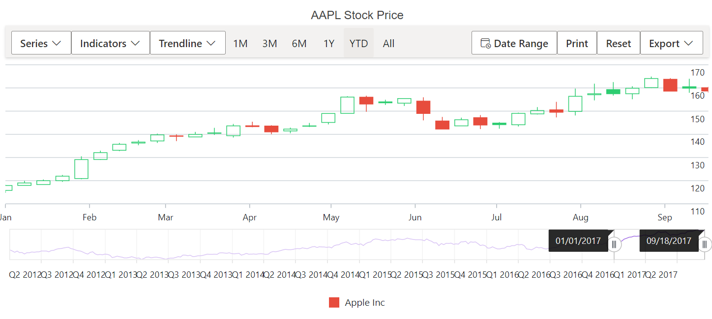
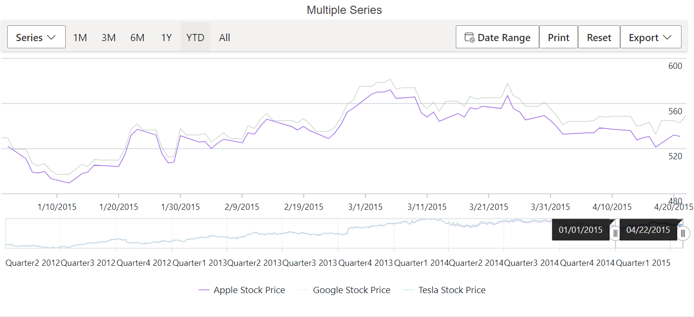
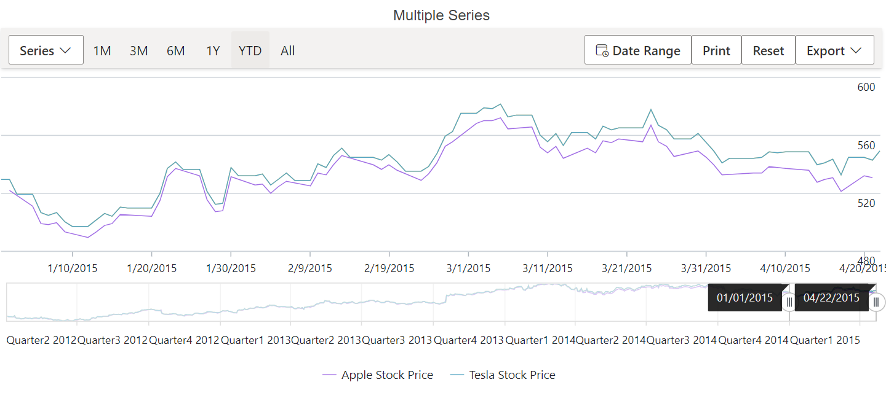

# Legend in Blazor Stock Chart Component

The legend describes the series rendered in the Stock Chart. Enable the legend by setting the [Visible](https://help.syncfusion.com/cr/blazor/Syncfusion.Blazor.Charts.StockChartLegendSettings.html#Syncfusion_Blazor_Charts_StockChartLegendSettings_Visible) option in [StockChartLegendSettings](https://help.syncfusion.com/cr/blazor/Syncfusion.Blazor.Charts.StockChartLegendSettings.html).

## Enable Legend

To display the legend, set the [Visible](https://help.syncfusion.com/cr/blazor/Syncfusion.Blazor.Charts.StockChartLegendSettings.html#Syncfusion_Blazor_Charts_StockChartLegendSettings_Visible) property in [StockChartLegendSettings](https://help.syncfusion.com/cr/blazor/Syncfusion.Blazor.Charts.StockChartLegendSettings.html) to **true**.

```cshtml

@using Syncfusion.Blazor.Charts

<SfStockChart Title="AAPL Stock Price">
    <StockChartLegendSettings Visible="true"></StockChartLegendSettings>
    <StockChartSeriesCollection>
        <StockChartSeries DataSource="@StockDetails" XName="Date" High="High" Low="Low" Open="Open" Close="Close" Name="Apple  Inc" Type="ChartSeriesType.Candle"></StockChartSeries>
    </StockChartSeriesCollection>
</SfStockChart>

@code {
    public class ChartData
    {
        public DateTime Date { get; set; }
        public Double Open { get; set; }
        public Double Low { get; set; }
        public Double Close { get; set; }
        public Double High { get; set; }
        public Double Volume { get; set; }
    }

    public List<ChartData> StockDetails = new List<ChartData>
    {
        new ChartData { Date = new DateTime(2012, 04, 02), Open = 85.9757, High = 90.6657, Low = 85.7685, Close = 90.5257, Volume = 660187068 },
        new ChartData { Date = new DateTime(2012, 04, 09), Open = 89.4471, High = 92, Low = 86.2157, Close = 86.4614, Volume = 912634864 },
        new ChartData { Date = new DateTime(2012, 04, 16), Open = 87.1514, High = 88.6071, Low = 81.4885, Close = 81.8543, Volume = 1221746066 },
        new ChartData { Date = new DateTime(2012, 04, 23), Open = 81.5157, High = 88.2857, Low = 79.2857, Close = 86.1428, Volume = 965935749 },
        new ChartData { Date = new DateTime(2012, 04, 30), Open = 85.4, High = 85.4857, Low = 80.7385, Close = 80.75, Volume = 615249365 }
   };
}

```


## Legend Position

Use the [Position](https://help.syncfusion.com/cr/blazor/Syncfusion.Blazor.Charts.StockChartLegendSettings.html#Syncfusion_Blazor_Charts_StockChartLegendSettings_Position) property to place the legend at the **Left**, **Right**, **Top**, **Bottom**, or **Custom** position. By default, the legend appears at the **Bottom** of the Stock Chart.

```cshtml

@using Syncfusion.Blazor.Charts

<SfStockChart Title="AAPL Stock Price">
    <StockChartLegendSettings Visible="true" Position="LegendPosition.Top"></StockChartLegendSettings>
    <StockChartSeriesCollection>
        <StockChartSeries DataSource="@StockDetails" XName="Date" High="High" Low="Low" Open="Open" Close="Close" Name="Apple Inc" Type="ChartSeriesType.Candle"></StockChartSeries>
    </StockChartSeriesCollection>
</SfStockChart>

@code {
    public class ChartData
    {
        public DateTime Date { get; set; }
        public Double Open { get; set; }
        public Double Low { get; set; }
        public Double Close { get; set; }
        public Double High { get; set; }
        public Double Volume { get; set; }
    }

    public List<ChartData> StockDetails = new List<ChartData>
    {
        new ChartData { Date = new DateTime(2012, 04, 02), Open = 85.9757, High = 90.6657, Low = 85.7685, Close = 90.5257, Volume = 660187068 },
        new ChartData { Date = new DateTime(2012, 04, 09), Open = 89.4471, High = 92, Low = 86.2157, Close = 86.4614, Volume = 912634864 },
        new ChartData { Date = new DateTime(2012, 04, 16), Open = 87.1514, High = 88.6071, Low = 81.4885, Close = 81.8543, Volume = 1221746066 },
        new ChartData { Date = new DateTime(2012, 04, 23), Open = 81.5157, High = 88.2857, Low = 79.2857, Close = 86.1428, Volume = 965935749 },
        new ChartData { Date = new DateTime(2012, 04, 30), Open = 85.4, High = 85.4857, Low = 80.7385, Close = 80.75, Volume = 615249365 }
   };
}

```


The **Custom** position allows placing the legend anywhere within the Stock Chart using x and y coordinates.

```cshtml

@using Syncfusion.Blazor.Charts

<SfStockChart Title="AAPL Stock Price">
    <StockChartLegendSettings Visible="true" Position="LegendPosition.Custom">
        <StockChartLocation X="50" Y="50"></StockChartLocation>
        <StockChartLegendBorder Color="Black" Width="2"></StockChartLegendBorder>
    </StockChartLegendSettings>
    <StockChartSeriesCollection>
        <StockChartSeries DataSource="@StockDetails" XName="Date" High="High" Low="Low" Open="Open" Close="Close" Name="Apple Inc" Type="ChartSeriesType.Candle"></StockChartSeries>
    </StockChartSeriesCollection>
</SfStockChart>
  
@code {
    public class ChartData
    {
        public DateTime Date { get; set; }
        public Double Open { get; set; }
        public Double Low { get; set; }
        public Double Close { get; set; }
        public Double High { get; set; }
        public Double Volume { get; set; }
    }

    public List<ChartData> StockDetails = new List<ChartData>
    {
        new ChartData { Date = new DateTime(2012, 04, 02), Open = 85.9757, High = 90.6657, Low = 85.7685, Close = 90.5257, Volume = 660187068 },
        new ChartData { Date = new DateTime(2012, 04, 09), Open = 89.4471, High = 92, Low = 86.2157, Close = 86.4614, Volume = 912634864 },
        new ChartData { Date = new DateTime(2012, 04, 16), Open = 87.1514, High = 88.6071, Low = 81.4885, Close = 81.8543, Volume = 1221746066 },
        new ChartData { Date = new DateTime(2012, 04, 23), Open = 81.5157, High = 88.2857, Low = 79.2857, Close = 86.1428, Volume = 965935749 },
        new ChartData { Date = new DateTime(2012, 04, 30), Open = 85.4, High = 85.4857, Low = 80.7385, Close = 80.75, Volume = 615249365 }
   };
}

```


## Reverse Legend

Reverse the order of legend items using the [Reversed](https://help.syncfusion.com/cr/blazor/Syncfusion.Blazor.Charts.StockChartLegendSettings.html#Syncfusion_Blazor_Charts_StockChartLegendSettings_Reversed) property. By default, the legend entry for the first series appears first.

```cshtml

@using Syncfusion.Blazor.Charts

<SfStockChart Title="AAPL Stock Price">
    <StockChartLegendSettings Visible="true" Reversed="true">
    </StockChartLegendSettings>
    <StockChartSeriesCollection>

        <StockChartSeries DataSource="@StockDetails" Type="ChartSeriesType.Line" XName="Date" High="High" Low="Low" Open="Open" Close="Close" Name="Apple Stock Price"></StockChartSeries>

        <StockChartSeries DataSource="@StockDetails" Type="ChartSeriesType.Line" XName="Date" High="High" Low="Low" Open="Open" Close="Close" Name="Google Stock Price"></StockChartSeries>

        <StockChartSeries DataSource="@StockDetails" Type="ChartSeriesType.Spline"XName="Date" High="High" Low="Low" Open="Open" Close="Close" Name="Tesla Stock Price"></StockChartSeries>

    </StockChartSeriesCollection>
</SfStockChart>
  
@code {
    public class ChartData
    {
        public DateTime Date { get; set; }
        public Double Open { get; set; }
        public Double Low { get; set; }
        public Double Close { get; set; }
        public Double High { get; set; }
        public Double Volume { get; set; }
    }

    public List<ChartData> StockDetails = new List<ChartData>
    {
        new ChartData { Date = new DateTime(2012, 04, 02), Open = 85.9757, High = 90.6657, Low = 85.7685, Close = 90.5257, Volume = 660187068 },
        new ChartData { Date = new DateTime(2012, 04, 09), Open = 89.4471, High = 92, Low = 86.2157, Close = 86.4614, Volume = 912634864 },
        new ChartData { Date = new DateTime(2012, 04, 16), Open = 87.1514, High = 88.6071, Low = 81.4885, Close = 81.8543, Volume = 1221746066 },
        new ChartData { Date = new DateTime(2012, 04, 23), Open = 81.5157, High = 88.2857, Low = 79.2857, Close = 86.1428, Volume = 965935749 },
        new ChartData { Date = new DateTime(2012, 04, 30), Open = 85.4, High = 85.4857, Low = 80.7385, Close = 80.75, Volume = 615249365 }
   };
}

```


## Legend Alignment

Use the [Alignment](https://help.syncfusion.com/cr/blazor/Syncfusion.Blazor.Charts.StockChartLegendSettings.html#Syncfusion_Blazor_Charts_StockChartLegendSettings_Alignment) property to align the legend to **Center**, **Far**, or **Near**.

```cshtml

@using Syncfusion.Blazor.Charts

<SfStockChart Title="AAPL Stock Price">
    <StockChartLegendSettings Visible="true" Alignment="Alignment.Near">
    <StockChartLegendBorder Color="Black" Width="2"></StockChartLegendBorder>
    </StockChartLegendSettings>
    <StockChartSeriesCollection>
        <StockChartSeries DataSource="@StockDetails"  XName="Date" High="High" Low="Low" Open="Open" Close="Close" Name="Apple Inc" Type="ChartSeriesType.Candle"></StockChartSeries>
    </StockChartSeriesCollection>
</SfStockChart>

@code {
    public class ChartData
    {
        public DateTime Date { get; set; }
        public Double Open { get; set; }
        public Double Low { get; set; }
        public Double Close { get; set; }
        public Double High { get; set; }
        public Double Volume { get; set; }
    }

    public List<ChartData> StockDetails = new List<ChartData>
    {
        new ChartData { Date = new DateTime(2012, 04, 02), Open = 85.9757, High = 90.6657, Low = 85.7685, Close = 90.5257, Volume = 660187068 },
        new ChartData { Date = new DateTime(2012, 04, 09), Open = 89.4471, High = 92, Low = 86.2157, Close = 86.4614, Volume = 912634864 },
        new ChartData { Date = new DateTime(2012, 04, 16), Open = 87.1514, High = 88.6071, Low = 81.4885, Close = 81.8543, Volume = 1221746066 },
        new ChartData { Date = new DateTime(2012, 04, 23), Open = 81.5157, High = 88.2857, Low = 79.2857, Close = 86.1428, Volume = 965935749 },
        new ChartData { Date = new DateTime(2012, 04, 30), Open = 85.4, High = 85.4857, Low = 80.7385, Close = 80.75, Volume = 615249365 }
   };
}

```


## Legend Customization

### Legend Shape

The [LegendShape](https://help.syncfusion.com/cr/blazor/Syncfusion.Blazor.Charts.StockChartSeries.html#Syncfusion_Blazor_Charts_StockChartSeries_LegendShape) property in the [Series](https://help.syncfusion.com/cr/blazor/Syncfusion.Blazor.Charts.StockChartSeries.html#properties) changes the legend icon shape. The default icon shape is based on **SeriesType**.

```cshtml

@using Syncfusion.Blazor.Charts

<SfStockChart Title="AAPL Stock Price">
    <StockChartLegendSettings Visible="true" ShapeHeight="13" ShapeWidth="13">
    </StockChartLegendSettings>
    <StockChartSeriesCollection>
        <StockChartSeries DataSource="@StockDetails" XName="Date" High="High" Low="Low" Open="Open" Close="Close" Name="Apple Inc" Type="ChartSeriesType.Candle"  LegendShape="LegendShape.Diamond"></StockChartSeries>
    </StockChartSeriesCollection>
</SfStockChart>
  
@code {
    public class ChartData
    {
        public DateTime Date { get; set; }
        public Double Open { get; set; }
        public Double Low { get; set; }
        public Double Close { get; set; }
        public Double High { get; set; }
        public Double Volume { get; set; }
    }

    public List<ChartData> StockDetails = new List<ChartData>
    {
        new ChartData { Date = new DateTime(2012, 04, 02), Open = 85.9757, High = 90.6657, Low = 85.7685, Close = 90.5257, Volume = 660187068 },
        new ChartData { Date = new DateTime(2012, 04, 09), Open = 89.4471, High = 92, Low = 86.2157, Close = 86.4614, Volume = 912634864 },
        new ChartData { Date = new DateTime(2012, 04, 16), Open = 87.1514, High = 88.6071, Low = 81.4885, Close = 81.8543, Volume = 1221746066 },
        new ChartData { Date = new DateTime(2012, 04, 23), Open = 81.5157, High = 88.2857, Low = 79.2857, Close = 86.1428, Volume = 965935749 },
        new ChartData { Date = new DateTime(2012, 04, 30), Open = 85.4, High = 85.4857, Low = 80.7385, Close = 80.75, Volume = 615249365 }
   };
}

```



### Legend Size

When placed at the top or bottom, the legend occupies approximately 20%–25% of the chart height; when positioned at the left or right, it occupies approximately 20%–25% of the chart width. Use the [Width](https://help.syncfusion.com/cr/blazor/Syncfusion.Blazor.Charts.StockChartLegendSettings.html#Syncfusion_Blazor_Charts_StockChartLegendSettings_Width) and [Height](https://help.syncfusion.com/cr/blazor/Syncfusion.Blazor.Charts.StockChartLegendSettings.html#Syncfusion_Blazor_Charts_StockChartLegendSettings_Height) properties to adjust the legend size.

```cshtml

@using Syncfusion.Blazor.Charts

<SfStockChart Title="AAPL Stock Price">
    <StockChartLegendSettings Visible="true" Height="50" Width="300">
        <StockChartLegendBorder Color="blue" Width="1"></StockChartLegendBorder>
    </StockChartLegendSettings>
    <StockChartSeriesCollection>
        <StockChartSeries DataSource="@StockDetails" Type="ChartSeriesType.Line" XName="Date" High="High" Low="Low" Open="Open" Close="Close" Name="Apple Stock Price"></StockChartSeries>
        <StockChartSeries DataSource="@StockDetails" Type="ChartSeriesType.Line" XName="Date" High="High" Low="Low" Open="Open" Close="Close" Name="Google Stock Price"></StockChartSeries>
    </StockChartSeriesCollection>
</SfStockChart>

@code {
    public class ChartData
    {
        public DateTime Date { get; set; }
        public Double Open { get; set; }
        public Double Low { get; set; }
        public Double Close { get; set; }
        public Double High { get; set; }
        public Double Volume { get; set; }
    }

    public List<ChartData> StockDetails = new List<ChartData>
    {
        new ChartData { Date = new DateTime(2012, 04, 02), Open = 85.9757, High = 90.6657, Low = 85.7685, Close = 90.5257, Volume = 660187068 },
        new ChartData { Date = new DateTime(2012, 04, 09), Open = 89.4471, High = 92, Low = 86.2157, Close = 86.4614, Volume = 912634864 },
        new ChartData { Date = new DateTime(2012, 04, 16), Open = 87.1514, High = 88.6071, Low = 81.4885, Close = 81.8543, Volume = 1221746066 },
        new ChartData { Date = new DateTime(2012, 04, 23), Open = 81.5157, High = 88.2857, Low = 79.2857, Close = 86.1428, Volume = 965935749 },
        new ChartData { Date = new DateTime(2012, 04, 30), Open = 85.4, High = 85.4857, Low = 80.7385, Close = 80.75, Volume = 615249365 }
   };
}

```


### Legend Shape Size

Use the [ShapeHeight](https://help.syncfusion.com/cr/blazor/Syncfusion.Blazor.Charts.StockChartLegendSettings.html#Syncfusion_Blazor_Charts_StockChartLegendSettings_ShapeHeight) and [ShapeWidth](https://help.syncfusion.com/cr/blazor/Syncfusion.Blazor.Charts.StockChartLegendSettings.html#Syncfusion_Blazor_Charts_StockChartLegendSettings_ShapeWidth) properties to control the legend icon dimensions.

```cshtml

@using Syncfusion.Blazor.Charts

<SfStockChart Title="AAPL Stock Price">
    <StockChartLegendSettings Visible="true" Height="50" Width="300" ShapeHeight="15" ShapeWidth="15">
    </StockChartLegendSettings>
    <StockChartSeriesCollection>
        <StockChartSeries DataSource="@StockDetails" XName="Date" High="High" Low="Low" Open="Open" Close="Close" Name="Apple Inc" Type="ChartSeriesType.Candle"></StockChartSeries>
    </StockChartSeriesCollection>
</SfStockChart>

@code {
    public class ChartData
    {
        public DateTime Date { get; set; }
        public Double Open { get; set; }
        public Double Low { get; set; }
        public Double Close { get; set; }
        public Double High { get; set; }
        public Double Volume { get; set; }
    }

    public List<ChartData> StockDetails = new List<ChartData>
    {
        new ChartData { Date = new DateTime(2012, 04, 02), Open = 85.9757, High = 90.6657, Low = 85.7685, Close = 90.5257, Volume = 660187068 },
        new ChartData { Date = new DateTime(2012, 04, 09), Open = 89.4471, High = 92, Low = 86.2157, Close = 86.4614, Volume = 912634864 },
        new ChartData { Date = new DateTime(2012, 04, 16), Open = 87.1514, High = 88.6071, Low = 81.4885, Close = 81.8543, Volume = 1221746066 },
        new ChartData { Date = new DateTime(2012, 04, 23), Open = 81.5157, High = 88.2857, Low = 79.2857, Close = 86.1428, Volume = 965935749 },
        new ChartData { Date = new DateTime(2012, 04, 30), Open = 85.4, High = 85.4857, Low = 80.7385, Close = 80.75, Volume = 615249365 }
   };
}

```



### Legend Item Padding

Use the [ItemPadding](https://help.syncfusion.com/cr/blazor/Syncfusion.Blazor.Charts.StockChartLegendSettings.html#Syncfusion_Blazor_Charts_StockChartLegendSettings_ItemPadding) property to adjust spacing between legend items.

```cshtml

@using Syncfusion.Blazor.Charts

<SfStockChart Title="AAPL Stock Price">
    <StockChartLegendSettings Visible="true" ItemPadding="30">
    </StockChartLegendSettings>
    <StockChartSeriesCollection>
        <StockChartSeries DataSource="@StockDetails" Type="ChartSeriesType.Line" XName="Date" High="High" Low="Low" Open="Open" Close="Close" Name="Apple"></StockChartSeries>
        <StockChartSeries DataSource="@StockDetails" Type="ChartSeriesType.Line" XName="Date" High="High" Low="Low" Open="Open" Close="Close" Name="Google"></StockChartSeries>
    </StockChartSeriesCollection>
</SfStockChart>

@code {
    public class ChartData
    {
        public DateTime Date { get; set; }
        public Double Open { get; set; }
        public Double Low { get; set; }
        public Double Close { get; set; }
        public Double High { get; set; }
        public Double Volume { get; set; }
    }

    public List<ChartData> StockDetails = new List<ChartData>
    {
        new ChartData { Date = new DateTime(2012, 04, 02), Open = 85.9757, High = 90.6657, Low = 85.7685, Close = 90.5257, Volume = 660187068 },
        new ChartData { Date = new DateTime(2012, 04, 09), Open = 89.4471, High = 92, Low = 86.2157, Close = 86.4614, Volume = 912634864 },
        new ChartData { Date = new DateTime(2012, 04, 16), Open = 87.1514, High = 88.6071, Low = 81.4885, Close = 81.8543, Volume = 1221746066 },
        new ChartData { Date = new DateTime(2012, 04, 23), Open = 81.5157, High = 88.2857, Low = 79.2857, Close = 86.1428, Volume = 965935749 },
        new ChartData { Date = new DateTime(2012, 04, 30), Open = 85.4, High = 85.4857, Low = 80.7385, Close = 80.75, Volume = 615249365 }
   };
}

```


### Legend Paging

When legend items exceed the available bounds, paging is enabled automatically. End users can navigate between pages using the navigation buttons.

```cshtml

@using Syncfusion.Blazor.Charts

<SfStockChart Title="AAPL Stock Price">
    <StockChartLegendSettings Visible="true" Width="100" Height="70" Padding="10" ShapePadding="10">
    </StockChartLegendSettings>
    <StockChartSeriesCollection>
        <StockChartSeries DataSource="@StockDetails" Type="ChartSeriesType.Line" XName="Date" High="High" Low="Low" Open="Open" Close="Close" Name="Apple"></StockChartSeries>
        <StockChartSeries DataSource="@StockDetails" Type="ChartSeriesType.Line" XName="Date" High="High" Low="Low" Open="Open" Close="Close" Name="Google"></StockChartSeries>
        <StockChartSeries DataSource="@StockDetails" Type="ChartSeriesType.Spline" XName="Date" High="High" Low="Low" Open="Open" Close="Close" Name="Tesla"></StockChartSeries>
    </StockChartSeriesCollection>
</SfStockChart>
  
@code {
    public class ChartData
    {
        public DateTime Date { get; set; }
        public Double Open { get; set; }
        public Double Low { get; set; }
        public Double Close { get; set; }
        public Double High { get; set; }
        public Double Volume { get; set; }
    }

    public List<ChartData> StockDetails = new List<ChartData>
    {
        new ChartData { Date = new DateTime(2012, 04, 02), Open = 85.9757, High = 90.6657, Low = 85.7685, Close = 90.5257, Volume = 660187068 },
        new ChartData { Date = new DateTime(2012, 04, 09), Open = 89.4471, High = 92, Low = 86.2157, Close = 86.4614, Volume = 912634864 },
        new ChartData { Date = new DateTime(2012, 04, 16), Open = 87.1514, High = 88.6071, Low = 81.4885, Close = 81.8543, Volume = 1221746066 },
        new ChartData { Date = new DateTime(2012, 04, 23), Open = 81.5157, High = 88.2857, Low = 79.2857, Close = 86.1428, Volume = 965935749 },
        new ChartData { Date = new DateTime(2012, 04, 30), Open = 85.4, High = 85.4857, Low = 80.7385, Close = 80.75, Volume = 615249365 }
   };
}

```


### Legend Text Wrap

When legend text exceeds the container, enable wrapping using the [TextWrap](https://help.syncfusion.com/cr/blazor/Syncfusion.Blazor.Charts.StockChartLegendSettings.html#Syncfusion_Blazor_Charts_StockChartLegendSettings_TextWrap) property. Wrapping can also be controlled using the [MaxLabelWidth](https://help.syncfusion.com/cr/blazor/Syncfusion.Blazor.Charts.StockChartLegendSettings.html#Syncfusion_Blazor_Charts_StockChartLegendSettings_MaxLabelWidth) property.

```cshtml

@using Syncfusion.Blazor.Charts

<SfStockChart Title="AAPL Stock Price">
    <StockChartLegendSettings Visible="true" Position="@LegendPosition.Right" TextWrap="@TextWrap.Wrap" MaxLabelWidth="70">
    </StockChartLegendSettings>
    <StockChartSeriesCollection>
        <StockChartSeries DataSource="@StockDetails" Type="ChartSeriesType.Line" XName="Date" High="High" Low="Low" Open="Open" Close="Close" Name="Apple Stock Price"></StockChartSeries>
        <StockChartSeries DataSource="@StockDetails" Type="ChartSeriesType.Line" XName="Date" High="High" Low="Low" Open="Open" Close="Close" Name="Google Stock Price"></StockChartSeries>
        <StockChartSeries DataSource="@StockDetails" Type="ChartSeriesType.Spline" XName="Date" High="High" Low="Low" Open="Open" Close="Close" Name="Tesla Stock Price"></StockChartSeries>
    </StockChartSeriesCollection>
</SfStockChart>

@code {
    public class ChartData
    {
        public DateTime Date { get; set; }
        public Double Open { get; set; }
        public Double Low { get; set; }
        public Double Close { get; set; }
        public Double High { get; set; }
        public Double Volume { get; set; }
    }

    public List<ChartData> StockDetails = new List<ChartData>
    {
        new ChartData { Date = new DateTime(2012, 04, 02), Open = 85.9757, High = 90.6657, Low = 85.7685, Close = 90.5257, Volume = 660187068 },
        new ChartData { Date = new DateTime(2012, 04, 09), Open = 89.4471, High = 92, Low = 86.2157, Close = 86.4614, Volume = 912634864 },
        new ChartData { Date = new DateTime(2012, 04, 16), Open = 87.1514, High = 88.6071, Low = 81.4885, Close = 81.8543, Volume = 1221746066 },
        new ChartData { Date = new DateTime(2012, 04, 23), Open = 81.5157, High = 88.2857, Low = 79.2857, Close = 86.1428, Volume = 965935749 },
        new ChartData { Date = new DateTime(2012, 04, 30), Open = 85.4, High = 85.4857, Low = 80.7385, Close = 80.75, Volume = 615249365 }
   };
}

```


## Series selection based on legend

By default, clicking a legend item collapses the visibility of the corresponding series. The [ToggleVisibility](https://help.syncfusion.com/cr/blazor/Syncfusion.Blazor.Charts.StockChartLegendSettings.html#Syncfusion_Blazor_Charts_StockChartLegendSettings_ToggleVisibility) property disables this behavior when set to false.

```cshtml

@using Syncfusion.Blazor.Charts

<SfStockChart Title="AAPL Stock Price" SelectionMode="SelectionMode.Series">
    <StockChartLegendSettings Visible="true"  ToggleVisibility="false">
    </StockChartLegendSettings>
    <StockChartSeriesCollection>
        <StockChartSeries DataSource="@StockDetails" Type="ChartSeriesType.Line" XName="Date" High="High" Low="Low" Open="Open" Close="Close" Name="Apple Stock Price"></StockChartSeries>
        <StockChartSeries DataSource="@StockDetails" Type="ChartSeriesType.Line" XName="Date" High="High" Low="Low" Open="Open" Close="Close" Name="Google Stock Price"></StockChartSeries>
        <StockChartSeries DataSource="@StockDetails" Type="ChartSeriesType.Spline" XName="Date" High="High" Low="Low" Open="Open" Close="Close" Name="Tesla Stock Price"></StockChartSeries>
    </StockChartSeriesCollection>
</SfStockChart>

@code {
    public class ChartData
    {
        public DateTime Date { get; set; }
        public Double Open { get; set; }
        public Double Low { get; set; }
        public Double Close { get; set; }
        public Double High { get; set; }
        public Double Volume { get; set; }
    }

    public List<ChartData> StockDetails = new List<ChartData>
    {
        new ChartData { Date = new DateTime(2012, 04, 02), Open = 85.9757, High = 90.6657, Low = 85.7685, Close = 90.5257, Volume = 660187068 },
        new ChartData { Date = new DateTime(2012, 04, 09), Open = 89.4471, High = 92, Low = 86.2157, Close = 86.4614, Volume = 912634864 },
        new ChartData { Date = new DateTime(2012, 04, 16), Open = 87.1514, High = 88.6071, Low = 81.4885, Close = 81.8543, Volume = 1221746066 },
        new ChartData { Date = new DateTime(2012, 04, 23), Open = 81.5157, High = 88.2857, Low = 79.2857, Close = 86.1428, Volume = 965935749 },
        new ChartData { Date = new DateTime(2012, 04, 30), Open = 85.4, High = 85.4857, Low = 80.7385, Close = 80.75, Volume = 615249365 }
   };
}

```



## Hiding legend item

The series [Name](https://help.syncfusion.com/cr/blazor/Syncfusion.Blazor.Charts.StockChartSeries.html#Syncfusion_Blazor_Charts_StockChartSeries_Name) is used as the legend text by default. Skip the legend for a specific series by providing an empty string for the [Name](https://help.syncfusion.com/cr/blazor/Syncfusion.Blazor.Charts.StockChartSeries.html#Syncfusion_Blazor_Charts_StockChartSeries_Name) property.

```cshtml

@using Syncfusion.Blazor.Charts

<SfStockChart Title="AAPL Stock Price" SelectionMode="SelectionMode.Series">
    <StockChartLegendSettings Visible="true"  ToggleVisibility="true">
    </StockChartLegendSettings>
    <StockChartSeriesCollection>
        <StockChartSeries DataSource="@StockDetails" Type="ChartSeriesType.Line" XName="Date" High="High" Low="Low" Open="Open" Close="Close" Name="Apple Stock Price"></StockChartSeries>
        <StockChartSeries DataSource="@StockDetails" Type="ChartSeriesType.Line" XName="Date" High="High" Low="Low" Open="Open" Close="Close" Name="Google Stock Price"></StockChartSeries>
        <StockChartSeries DataSource="@StockDetails" Type="ChartSeriesType.Spline" XName="Date" High="High" Low="Low" Open="Open" Close="Close" Name="Tesla Stock Price"></StockChartSeries>
    </StockChartSeriesCollection>
</SfStockChart>

@code {
    public class ChartData
    {
        public DateTime Date { get; set; }
        public Double Open { get; set; }
        public Double Low { get; set; }
        public Double Close { get; set; }
        public Double High { get; set; }
        public Double Volume { get; set; }
    }

    public List<ChartData> StockDetails = new List<ChartData>
    {
        new ChartData { Date = new DateTime(2012, 04, 02), Open = 85.9757, High = 90.6657, Low = 85.7685, Close = 90.5257, Volume = 660187068 },
        new ChartData { Date = new DateTime(2012, 04, 09), Open = 89.4471, High = 92, Low = 86.2157, Close = 86.4614, Volume = 912634864 },
        new ChartData { Date = new DateTime(2012, 04, 16), Open = 87.1514, High = 88.6071, Low = 81.4885, Close = 81.8543, Volume = 1221746066 },
        new ChartData { Date = new DateTime(2012, 04, 23), Open = 81.5157, High = 88.2857, Low = 79.2857, Close = 86.1428, Volume = 965935749 },
        new ChartData { Date = new DateTime(2012, 04, 30), Open = 85.4, High = 85.4857, Low = 80.7385, Close = 80.75, Volume = 615249365 }
   };
}

```



## Legend Template

Legend templates allow you to replace default legend icons and text with custom HTML or Blazor markup for each series. This enables branded styles, richer content (icons, multi-line text, badges), improved readability, and localization.

To use, add a `LegendItemTemplate` inside any `ChartSeries` you want to customize. The rendered content becomes the legend item and can be styled with CSS. Legend interactions (click to toggle series) remain unless `ToggleVisibility` is set to false. Templates work with all legend positions, alignments, and paging.

```
@using Syncfusion.Blazor.Charts

<SfStockChart Title="AAPL Stock Price" SelectionMode="SelectionMode.Series">
    <StockChartLegendSettings Visible="true"  ToggleVisibility="true">
    </StockChartLegendSettings>
    <StockChartSeriesCollection>
        <StockChartSeries DataSource="@StockDetails" Type="ChartSeriesType.Line" XName="Date" High="High" Low="Low" Open="Open" Close="Close" Name="Apple Stock Price" Fill="red">
            <LegendItemTemplate>
                <div style="font-weight:800; font-family:'Segoe UI'; color: red">
                    <span>Apple Stock Price</span>
                </div>
            </LegendItemTemplate>
        </StockChartSeries>
        <StockChartSeries DataSource="@StockDetails" Type="ChartSeriesType.Spline" XName="Date" High="High" Low="Low" Open="Open" Close="Close" Name="Google Stock Price" Fill="cornflowerblue">
            <LegendItemTemplate>
                <div style="font-weight:800; font-family:'Segoe UI'; color: cornflowerblue">
                    <span>Google Stock Price</span>
                </div>
            </LegendItemTemplate>
        </StockChartSeries>
    </StockChartSeriesCollection>
</SfStockChart>

@code {
    public class ChartData
    {
        public DateTime Date { get; set; }
        public Double Open { get; set; }
        public Double Low { get; set; }
        public Double Close { get; set; }
        public Double High { get; set; }
        public Double Volume { get; set; }
    }

    public List<ChartData> StockDetails = new List<ChartData>
    {
        new ChartData { Date = new DateTime(2012, 04, 02), Open = 85.9757, High = 90.6657, Low = 85.7685, Close = 90.5257, Volume = 660187068 },
        new ChartData { Date = new DateTime(2012, 04, 09), Open = 89.4471, High = 92, Low = 86.2157, Close = 86.4614, Volume = 912634864 },
        new ChartData { Date = new DateTime(2012, 04, 16), Open = 87.1514, High = 88.6071, Low = 81.4885, Close = 81.8543, Volume = 1221746066 },
        new ChartData { Date = new DateTime(2012, 04, 23), Open = 81.5157, High = 88.2857, Low = 79.2857, Close = 86.1428, Volume = 965935749 },
        new ChartData { Date = new DateTime(2012, 04, 30), Open = 85.4, High = 85.4857, Low = 80.7385, Close = 80.75, Volume = 615249365 }
   };
}
```


