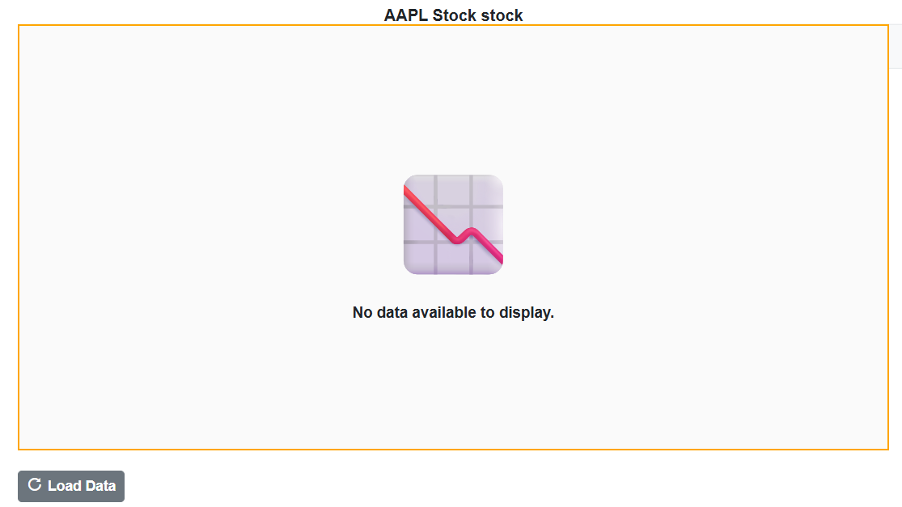
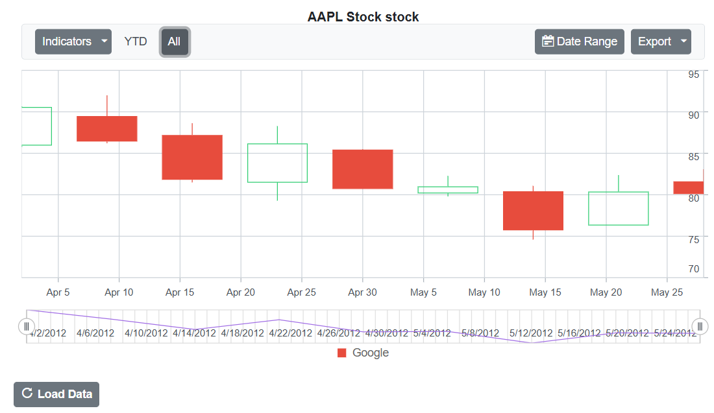

# No Data Template in Blazor Stock Chart Component 

In the Blazor Stock Chart component, when there is no data to render, a customizable layout is displayed within the chart area. This is managed using the `NoDataTemplate` property, which supports styled text, images, and interactive elements to align with the application's design and provide meaningful feedback to users.

This template is especially helpful in empty data scenarios. It can show a message indicating that no data is available, display a relevant image, and include a button to load or refresh data. Once data is available, the chart automatically updates to render the appropriate visualization.

```cshtml
@using Syncfusion.Blazor.Charts
@using Syncfusion.Blazor.Buttons

<SfStockChart @ref="stockChart" Title="AAPL Stock stock">
    <NoDataTemplate>
        <div id="noDataTemplateContainer">
            <div><span style="font-size: 100px;">📉</span><br /></div>
            <div style="font-size:15px;"><strong>No data available to display.</strong></div>
        </div>
    </NoDataTemplate>
    <ChildContent>
        <StockChartChartBorder Width="0"></StockChartChartBorder>
        <StockChartSeriesCollection>
            <StockChartSeries DataSource="@Visible" Type="ChartSeriesType.Candle" XName="Date" High="High" Low="Low" Open="Open" Close="Close" Volume="Volume" Name="Google"/>
        </StockChartSeriesCollection>
        <StockChartLegendSettings Visible="true"></StockChartLegendSettings>
    </ChildContent>
</SfStockChart>

<style>
    #noDataTemplateContainer {
        display: flex;
        flex-direction: column;
        align-items: center;
        justify-content: center;
        height: inherit;
        width: inherit;
        background-color: #fafafa;
        text-align: center;
        border: 2px solid orange;
    }
</style>

<div style="margin-top: 20px;">
    <SfButton IconCss="e-icons e-refresh" OnClick="ToggleChartData"><b>@(HasData ? "Clear Data" : "Load Data")</b></SfButton>
</div>

@code {
    private SfStockChart stockChart;

    private bool HasData { get; set; }
    public class ChartData
    {
        public DateTime Date { get; set; }
        public double Open { get; set; }
        public double Low { get; set; }
        public double Close { get; set; }
        public double High { get; set; }
        public double Volume { get; set; }
    }

    public List<ChartData> StockDetails = new()
    {
        new ChartData { Date = new DateTime(2012, 04, 02), Open = 85.9757, High = 90.6657, Low = 85.7685, Close = 90.5257, Volume = 660187068 },
        new ChartData { Date = new DateTime(2012, 04, 09), Open = 89.4471, High = 92, Low = 86.2157, Close = 86.4614, Volume = 912634864 },
        new ChartData { Date = new DateTime(2012, 04, 16), Open = 87.1514, High = 88.6071, Low = 81.4885, Close = 81.8543, Volume = 1221746066 },
        new ChartData { Date = new DateTime(2012, 04, 23), Open = 81.5157, High = 88.2857, Low = 79.2857, Close = 86.1428, Volume = 965935749 },
        new ChartData { Date = new DateTime(2012, 04, 30), Open = 85.4, High =  85.4857, Low = 80.7385, Close = 80.75, Volume = 615249365 },
        new ChartData { Date = new DateTime(2012, 05, 07), Open = 80.2143, High = 82.2685, Low = 79.8185, Close = 80.9585, Volume = 541742692 },
        new ChartData { Date = new DateTime(2012, 05, 14), Open = 80.3671, High = 81.0728, Low = 74.5971, Close = 75.7685, Volume = 708126233 },
        new ChartData { Date = new DateTime(2012, 05, 21), Open = 76.3571, High = 82.3571, Low = 76.2928, Close = 80.3271, Volume = 682076215 },
        new ChartData { Date = new DateTime(2012, 05, 28), Open = 81.5571, High = 83.0714, Low = 80.0743, Close = 80.1414, Volume = 480059584 }
    };

    private void ToggleChartData()
    {
        if (ShowData)
        {
            ClearData();
        }
        else
        {
            UpdateChart();
        }
    }

    private bool ShowData = false;
    private IEnumerable<ChartData> Visible => ShowData ? StockDetails : new List<ChartData>();

    private void UpdateChart()
    {
        ShowData = true;
        stockChart.UpdateStockChart();
    }

    private void ClearData()
    {
        ShowData = false;
        stockChart.UpdateStockChart();
    }
}

```




N> Refer to our [Blazor Stock Charts](https://www.syncfusion.com/blazor-components/blazor-stock-chart) feature tour page for its groundbreaking feature representations and also explore our [Blazor Stock Chart Example](https://blazor.syncfusion.com/demos/stock-chart/stock-chart?theme=bootstrap5) to know various stock chart types and how to represent time-dependent data, showing trends at equal intervals.