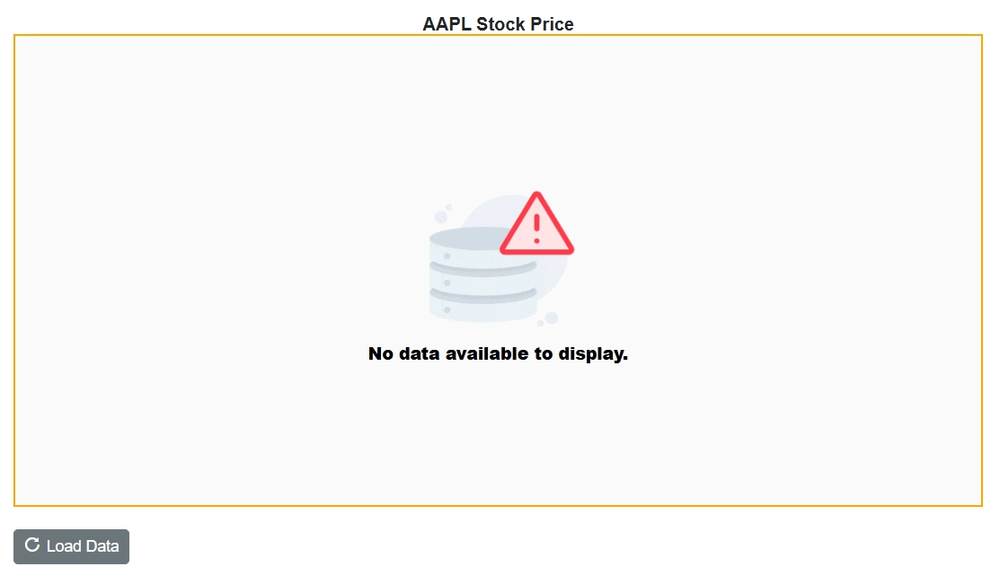

# No Data Template in Blazor Stock Chart Component 

When there is no data available to render in the chart, the `NoDataTemplate` property allows you to display a custom layout within the chart area. This layout can include a message indicating the absence of data, a relevant image, or a button to initiate data loading. You can incorporate styled text, images, or interactive elements to maintain design consistency and enhance user guidance.

Once data becomes available, the chart automatically updates to display the appropriate visualization.

```cshtml
@using Syncfusion.Blazor.Charts
@using Syncfusion.Blazor.Buttons

<SfStockChart @ref="stockChart" Title="AAPL Stock Price">
    <NoDataTemplate>
        <div class="noDataTemplateContainerStyle" style="border: 2px solid orange; display: row-flex; align-items: center; justify-content: center; align-content: center; white-space: normal; text-align: center; width: inherit; height: inherit; font-weight: bolder; font-size: medium;">
            <div></div>
            <div style="font-size:15px;"><strong>No data available to display.</strong></div>
        </div>
    </NoDataTemplate>
    <ChildContent>
        <StockChartChartBorder Width="0"></StockChartChartBorder>
        <StockChartSeriesCollection>
            <StockChartSeries DataSource="@Visible" Type="ChartSeriesType.Candle" XName="Date" High="High" Low="Low" Open="Open" Close="Close" Volume="Volume"/>
        </StockChartSeriesCollection>
        <StockChartLegendSettings Visible="true"></StockChartLegendSettings>
    </ChildContent>
</SfStockChart>

<style>
    .noDataTemplateContainerStyle {
        background-color: #fafafa;
        color: #000000;
    }
</style>

<div style="margin-top: 20px;">
    <SfButton IconCss="e-icons e-refresh" OnClick="LoadData">Load Data</SfButton>
</div>

@code {
    private SfStockChart stockChart;

    private bool HasData { get; set; }
    public class ChartData
    {
        public DateTime Date { get; set; }
        public double Open { get; set; }
        public double Low { get; set; }
        public double Close { get; set; }
        public double High { get; set; }
        public double Volume { get; set; }
    }

    public List<ChartData> StockDetails = new()
    {
        new ChartData { Date = new DateTime(2012, 04, 02), Open = 85.9757, High = 90.6657, Low = 85.7685, Close = 90.5257, Volume = 660187068 },
        new ChartData { Date = new DateTime(2012, 04, 09), Open = 89.4471, High = 92, Low = 86.2157, Close = 86.4614, Volume = 912634864 },
        new ChartData { Date = new DateTime(2012, 04, 16), Open = 87.1514, High = 88.6071, Low = 81.4885, Close = 81.8543, Volume = 1221746066 },
        new ChartData { Date = new DateTime(2012, 04, 23), Open = 81.5157, High = 88.2857, Low = 79.2857, Close = 86.1428, Volume = 965935749 },
        new ChartData { Date = new DateTime(2012, 04, 30), Open = 85.4, High =  85.4857, Low = 80.7385, Close = 80.75, Volume = 615249365 },
        new ChartData { Date = new DateTime(2012, 05, 07), Open = 80.2143, High = 82.2685, Low = 79.8185, Close = 80.9585, Volume = 541742692 },
        new ChartData { Date = new DateTime(2012, 05, 14), Open = 80.3671, High = 81.0728, Low = 74.5971, Close = 75.7685, Volume = 708126233 },
        new ChartData { Date = new DateTime(2012, 05, 21), Open = 76.3571, High = 82.3571, Low = 76.2928, Close = 80.3271, Volume = 682076215 },
        new ChartData { Date = new DateTime(2012, 05, 28), Open = 81.5571, High = 83.0714, Low = 80.0743, Close = 80.1414, Volume = 480059584 }
    };

    private void LoadData()
    {
        ShowData = true;
        stockChart.UpdateStockChart();
    }

    private bool ShowData = false;
    private IEnumerable<ChartData> Visible => ShowData ? StockDetails : new List<ChartData>();
}

```



N> Refer to our [Blazor Stock Charts](https://www.syncfusion.com/blazor-components/blazor-stock-chart) feature tour page for its groundbreaking feature representations and also explore our [Blazor Stock Chart Example](https://blazor.syncfusion.com/demos/stock-chart/stock-chart?theme=bootstrap5) to know various stock chart types and how to represent time-dependent data, showing trends at equal intervals.