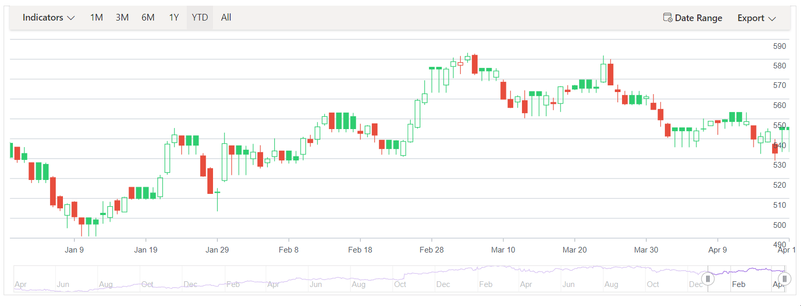

# Panning in Blazor Stock Chart Component 

Panning is enabled by default in the Stock Chart. This behavior is controlled by the [EnablePan](https://help.syncfusion.com/cr/blazor/Syncfusion.Blazor.Charts.StockChartZoomSettings.html#Syncfusion_Blazor_Charts_StockChartZoomSettings_EnablePan) property of [StockChartZoomSettings](https://help.syncfusion.com/cr/blazor/Syncfusion.Blazor.Charts.StockChartZoomSettings.html), which defaults to **true**.

```cshtml

@using Syncfusion.Blazor
@using Syncfusion.Blazor.Charts
@inject NavigationManager NavigationManager
@using System.Net.Http.Json
@inject HttpClient Http

@if (dataSource == null)
{
    <div>Loading...</div>
}
else
{
    <SfStockChart>
        <StockChartPrimaryXAxis>
            <StockChartAxisMajorGridLines Width="0"></StockChartAxisMajorGridLines>
        </StockChartPrimaryXAxis>
        <StockChartPrimaryYAxis>
            <StockChartAxisLineStyle Width="0"></StockChartAxisLineStyle>
            <StockChartAxisMajorTickLines Width="0"></StockChartAxisMajorTickLines>
        </StockChartPrimaryYAxis>
        <StockChartZoomSettings EnablePan="true"></StockChartZoomSettings>
        <StockChartSeriesCollection>
            <StockChartSeries DataSource="@dataSource" Type="ChartSeriesType.HiloOpenClose" XName="x"></StockChartSeries>
        </StockChartSeriesCollection>
        <StockChartChartArea>
            <StockChartChartAreaBorder Width="0"></StockChartChartAreaBorder>
        </StockChartChartArea>
    </SfStockChart>
}

@code {
    private ChartData[] dataSource;

    protected override async Task OnInitializedAsync()
    {
        dataSource = await Http.GetFromJsonAsync<ChartData[]>(NavigationManager.BaseUri + "./googl.json");
    }

    public class ChartData
    {
        public DateTime x { get; set; }
        public double open { get; set; }
        public double low { get; set; }
        public double close { get; set; }
        public double high { get; set; }
        public double volume { get; set; }
    }
}

```



N> Refer to the [Blazor Stock Chart](https://www.syncfusion.com/blazor-components/blazor-stock-chart) feature tour page for feature representations and explore the [Blazor Stock Chart example](https://blazor.syncfusion.com/demos/stock-chart/stock-chart?theme=bootstrap5) to see various stock chart types and time-dependent data rendered at equal intervals.
