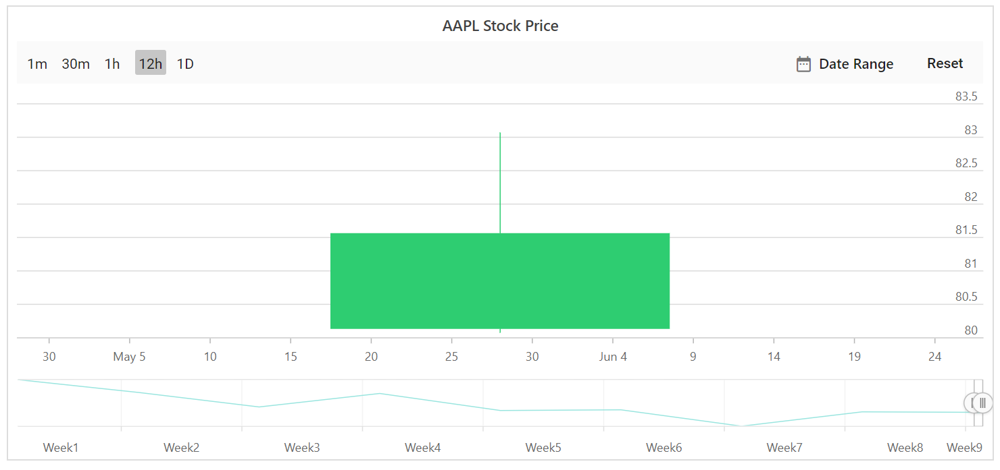
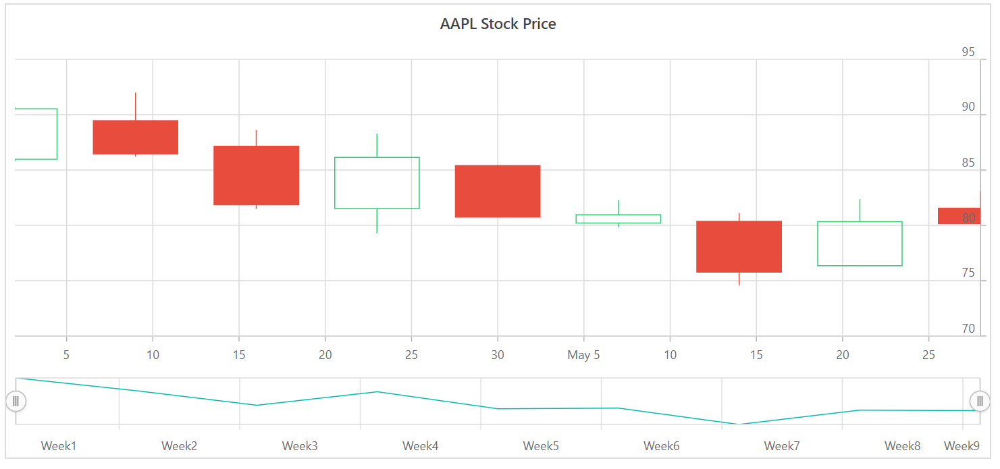

<!-- markdownlint-disable MD036 -->

# Period selector

The period selector allows to select a range with specified periods. By default the period selector is enabled in stock chart.

## Periods

<!-- markdownlint-disable MD034 -->

Periods is an array of objects that allows users to specify the range of [Periods](https://help.syncfusion.com/cr/blazor/Syncfusion.Blazor.Charts.StockChartModel.html#Syncfusion_Blazor_Charts_StockChartModel_Periods). The `Interval` property specifies the count value of the button, and the `Text` property specifies the text to be displayed on button. The `IntervalType` property allows users to customize the intervals of the buttons. The `IntervalType` property supports the following interval types:

* Auto
* Years
* Quarter
* Months
* Weeks
* Days
* Hours
* Minutes
* Seconds





## Visibility of period selector

The [`EnablePeriodSelector`](https://help.syncfusion.com/cr/blazor/Syncfusion.Blazor.Charts.StockChartModel.html#Syncfusion_Blazor_Charts_StockChartModel_EnablePeriodSelector) property allows users to toggle the visibility of period selector.





