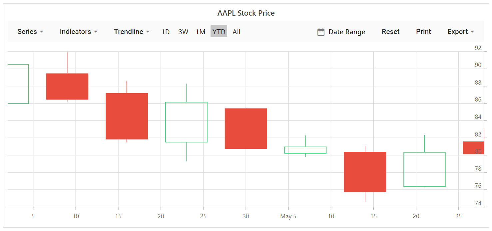

<!-- markdownlint-disable MD036 -->

# Range selector

The range selector allows to select a range with specified periods. By default the range selector is enabled in stock chart.

## Selecting Range

The left and right thumb of RangeNavigator are used to indicate the selected range in the large collection of data. Following are the ways you can select a range.

* By dragging the thumbs.
* By tapping on the labels.
* By setting the start and end through Date Range button.

Following code example shows the [`EnableSelector`](https://help.syncfusion.com/cr/blazor/Syncfusion.Blazor.Charts.StockChartModel.html#Syncfusion_Blazor_Charts_StockChartModel_EnableSelector) property allows users to toggle the visibility of enable selector.





