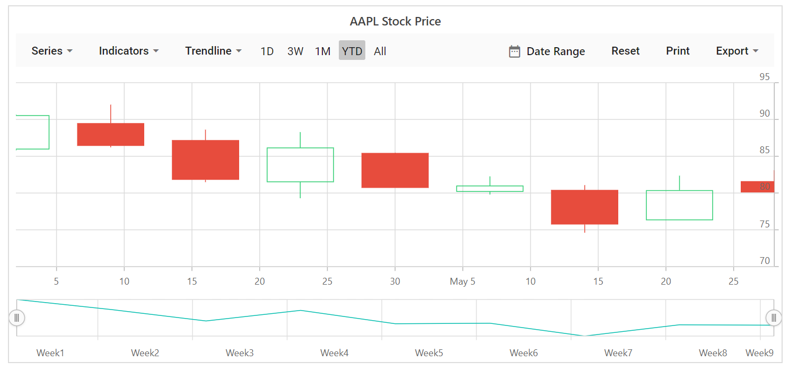

# Series Types in Blazor Stock Chart Component

The Stock Chart supports six series types: `Line`, `Spline`, `Hilo`, `HiloOpenClose`, `Hollow Candle`, and `Candle`. Use the series selector to switch between these types during interaction.

<!-- markdownlint-disable MD036 -->

**Line**

To render a line series, set the series [Type](https://help.syncfusion.com/cr/blazor/Syncfusion.Blazor.Charts.StockChartSeries.html#Syncfusion_Blazor_Charts_StockChartSeries_Type) to `Line`.

```cshtml

@using Syncfusion.Blazor.Charts

<SfStockChart Title="AAPL Stock Price">
    <StockChartSeriesCollection>
        <StockChartSeries DataSource="@StockDetails" Type="ChartSeriesType.Line" XName="Date" YName="Y">
        </StockChartSeries>
    </StockChartSeriesCollection>
</SfStockChart>

@code {
    public class ChartData
    {
        public DateTime Date { get; set; }
        public Double Y { get; set; }
    }

    public List<ChartData> StockDetails = new List<ChartData>
    {
        new ChartData { Date = new DateTime(2012, 04, 02), Y = 100 },
        new ChartData { Date = new DateTime(2012, 04, 09), Y = 10 },
        new ChartData { Date = new DateTime(2012, 04, 16), Y = 500 },
        new ChartData { Date = new DateTime(2012, 04, 23), Y = 80 },
        new ChartData { Date = new DateTime(2012, 04, 30), Y = 200 },
        new ChartData { Date = new DateTime(2012, 05, 07), Y = 600 },
        new ChartData { Date = new DateTime(2012, 05, 14), Y = 50 },
        new ChartData { Date = new DateTime(2012, 05, 21), Y = 700},
        new ChartData { Date = new DateTime(2012, 05, 28), Y = 90 }
   };
}

```


**Spline**

To render a spline series, set the series [Type](https://help.syncfusion.com/cr/blazor/Syncfusion.Blazor.Charts.StockChartSeries.html#Syncfusion_Blazor_Charts_StockChartSeries_Type) to `Spline`.

```cshtml

@using Syncfusion.Blazor.Charts

<SfStockChart Title="AAPL Stock Price">
    <StockChartSeriesCollection>
        <StockChartSeries DataSource="@StockDetails" Type="ChartSeriesType.Spline" XName="Date" YName="Y">
        </StockChartSeries>
    </StockChartSeriesCollection>
</SfStockChart>

@code {
    public class ChartData
    {
        public DateTime Date { get; set; }
        public Double Y { get; set; }
    }

    public List<ChartData> StockDetails = new List<ChartData>
    {
         new ChartData { Date = new DateTime(2012, 04, 02), Y = 100 },
         new ChartData { Date = new DateTime(2012, 04, 09), Y = 10 },
         new ChartData { Date = new DateTime(2012, 04, 16), Y = 500 },
         new ChartData { Date = new DateTime(2012, 04, 23), Y = 80 },
         new ChartData { Date = new DateTime(2012, 04, 30), Y = 200 },
         new ChartData { Date = new DateTime(2012, 05, 07), Y = 600 },
         new ChartData { Date = new DateTime(2012, 05, 14), Y = 50 },
         new ChartData { Date = new DateTime(2012, 05, 21), Y = 700},
         new ChartData { Date = new DateTime(2012, 05, 28), Y = 90 }
   };
}

```


**HollowCandle**

To render a hollow candle series, set the series [Type](https://help.syncfusion.com/cr/blazor/Syncfusion.Blazor.Charts.StockChartSeries.html#Syncfusion_Blazor_Charts_StockChartSeries_Type) to `Candle` and set `EnableSolidCandle` to `false`.

**Hilo**

To render a hilo series, set the series [Type](https://help.syncfusion.com/cr/blazor/Syncfusion.Blazor.Charts.StockChartSeries.html#Syncfusion_Blazor_Charts_StockChartSeries_Type) to `Hilo`.

```cshtml

@using Syncfusion.Blazor.Charts

<SfStockChart Title="AAPL Stock Price">
    <StockChartSeriesCollection>
        <StockChartSeries DataSource="@StockDetails" Type="ChartSeriesType.Hilo" XName="Date" High="High" Low="Low" Open="Open" Close="Close">
        </StockChartSeries>
    </StockChartSeriesCollection>
</SfStockChart>

@code {
    public class StockChartData
    {
        public DateTime Date { get; set; }
        public Double Open { get; set; }
        public Double Low { get; set; }
        public Double Close { get; set; }
        public Double High { get; set; }
        public Double Volume { get; set; }
    }

    public List<StockChartData> StockDetails = new List<StockChartData>
    {
        new StockChartData { Date = new DateTime(2012, 04, 02), Open = 85.9757, High = 90.6657, Low = 85.7685, Close = 90.5257, Volume = 660187068 },
        new StockChartData { Date = new DateTime(2012, 04, 09), Open = 89.4471, High = 92, Low = 86.2157, Close = 86.4614, Volume = 912634864 },
        new StockChartData { Date = new DateTime(2012, 04, 16), Open = 87.1514, High = 88.6071, Low = 81.4885, Close = 81.8543, Volume = 1221746066 },
        new StockChartData { Date = new DateTime(2012, 04, 23), Open = 81.5157, High = 88.2857, Low = 79.2857, Close = 86.1428, Volume = 965935749 },
        new StockChartData { Date = new DateTime(2012, 04, 30), Open = 85.4, High = 85.4857, Low = 80.7385, Close = 80.75, Volume = 615249365 },
        new StockChartData { Date = new DateTime(2012, 05, 07), Open = 80.2143, High = 82.2685, Low = 79.8185, Close = 80.9585, Volume = 541742692 },
        new StockChartData { Date = new DateTime(2012, 05, 14), Open = 80.3671, High = 81.0728, Low = 74.5971, Close = 75.7685, Volume = 708126233 },
        new StockChartData { Date = new DateTime(2012, 05, 21), Open = 76.3571, High = 82.3571, Low = 76.2928, Close = 80.3271, Volume = 682076215 },
        new StockChartData { Date = new DateTime(2012, 05, 28), Open = 81.5571, High = 83.0714, Low = 80.0743, Close = 80.1414, Volume = 480059584 }
    };
}

```


**HiloOpenClose**

To render a HiloOpenClose series, set the series [Type](https://help.syncfusion.com/cr/blazor/Syncfusion.Blazor.Charts.StockChartSeries.html#Syncfusion_Blazor_Charts_StockChartSeries_Type) to `HiloOpenClose`.

```cshtml

@using Syncfusion.Blazor.Charts

<SfStockChart Title="AAPL Stock Price">
    <StockChartSeriesCollection>
        <StockChartSeries DataSource="@StockDetails" Type="ChartSeriesType.HiloOpenClose" XName="Date" High="High" Low="Low" Open="Open" Close="Close">
        </StockChartSeries>
    </StockChartSeriesCollection>
</SfStockChart>

@code {
    public class StockChartData
    {
        public DateTime Date { get; set; }
        public Double Open { get; set; }
        public Double Low { get; set; }
        public Double Close { get; set; }
        public Double High { get; set; }
        public Double Volume { get; set; }
    }

    public List<StockChartData> StockDetails = new List<StockChartData>
    {
        new StockChartData { Date = new DateTime(2012, 04, 02), Open = 85.9757, High = 90.6657, Low = 85.7685, Close = 90.5257, Volume = 660187068 },
        new StockChartData { Date = new DateTime(2012, 04, 09), Open = 89.4471, High = 92, Low = 86.2157, Close = 86.4614, Volume = 912634864 },
        new StockChartData { Date = new DateTime(2012, 04, 16), Open = 87.1514, High = 88.6071, Low = 81.4885, Close = 81.8543, Volume = 1221746066 },
        new StockChartData { Date = new DateTime(2012, 04, 23), Open = 81.5157, High = 88.2857, Low = 79.2857, Close = 86.1428, Volume = 965935749 },
        new StockChartData { Date = new DateTime(2012, 04, 30), Open = 85.4, High = 85.4857, Low = 80.7385, Close = 80.75, Volume = 615249365 },
        new StockChartData { Date = new DateTime(2012, 05, 07), Open = 80.2143, High = 82.2685, Low = 79.8185, Close = 80.9585, Volume = 541742692 },
        new StockChartData { Date = new DateTime(2012, 05, 14), Open = 80.3671, High = 81.0728, Low = 74.5971, Close = 75.7685, Volume = 708126233 },
        new StockChartData { Date = new DateTime(2012, 05, 21), Open = 76.3571, High = 82.3571, Low = 76.2928, Close = 80.3271, Volume = 682076215 },
        new StockChartData { Date = new DateTime(2012, 05, 28), Open = 81.5571, High = 83.0714, Low = 80.0743, Close = 80.1414, Volume = 480059584 }
    };
}

```


**Candle**

To render a candle series, set the series [Type](https://help.syncfusion.com/cr/blazor/Syncfusion.Blazor.Charts.StockChartSeries.html#Syncfusion_Blazor_Charts_StockChartSeries_Type) to `Candle`.

```cshtml

@using Syncfusion.Blazor.Charts

<SfStockChart Title="AAPL Stock Price">
    <StockChartSeriesCollection>
        <StockChartSeries DataSource="@StockDetails" Type="ChartSeriesType.Candle" XName="Date" High="High" Low="Low" Open="Open" Close="Close" Volume="Volume" Name="Google"></StockChartSeries>
    </StockChartSeriesCollection>
</SfStockChart>

@code {
    public class StockChartData
    {
        public DateTime Date { get; set; }
        public Double Y { get; set; }
        public double Open { get; set; }
        public Double Low { get; set; }
        public Double Close { get; set; }
        public Double High { get; set; }
        public Double Volume { get; set; }
    }

    public List<StockChartData> StockDetails = new List<StockChartData>
    {
        new StockChartData { Date = new DateTime(2012, 04, 02), Open = 85.9757, High = 90.6657, Low = 85.7685, Close = 90.5257, Volume = 660187068 },
        new StockChartData { Date = new DateTime(2012, 04, 09), Open = 89.4471, High = 92, Low = 86.2157, Close = 86.4614, Volume = 912634864 },
        new StockChartData { Date = new DateTime(2012, 04, 16), Open = 87.1514, High = 88.6071, Low = 81.4885, Close = 81.8543, Volume = 1221746066 },
        new StockChartData { Date = new DateTime(2012, 04, 23), Open = 81.5157, High = 88.2857, Low = 79.2857, Close = 86.1428, Volume = 965935749 },
        new StockChartData { Date = new DateTime(2012, 04, 30), Open = 85.4, High = 85.4857, Low = 80.7385, Close = 80.75, Volume = 615249365 },
        new StockChartData { Date = new DateTime(2012, 05, 07), Open = 80.2143, High = 82.2685, Low = 79.8185, Close = 80.9585, Volume = 541742692 },
        new StockChartData { Date = new DateTime(2012, 05, 14), Open = 80.3671, High = 81.0728, Low = 74.5971, Close = 75.7685, Volume = 708126233 },
        new StockChartData { Date = new DateTime(2012, 05, 21), Open = 76.3571, High = 82.3571, Low = 76.2928, Close = 80.3271, Volume = 682076215 },
        new StockChartData { Date = new DateTime(2012, 05, 28), Open = 81.5571, High = 83.0714, Low = 80.0743, Close = 80.1414, Volume = 480059584 }
    };
}

```


