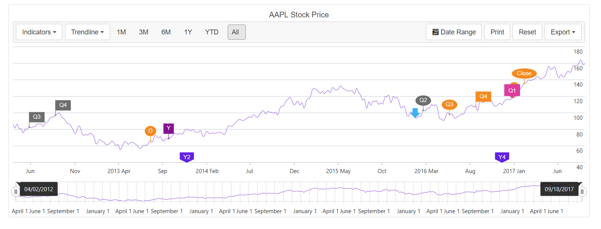

# Stock Events in Blazor Stock Chart Component

Stock events mark notable occurrences such as market open and close, highest or lowest price, and quarter or year boundaries on specific dates. In this section, **SplineSeries** is used to represent selected data values. Specific data values can be customized using `StockEvents`.

## Date

The [Date](https://help.syncfusion.com/cr/blazor/Syncfusion.Blazor.Charts.StockChartStockEvent.html#Syncfusion_Blazor_Charts_StockChartStockEvent_Date) property displays the stock event on the chart at the specified time. For example, when Quarter 1 ends on March 31, 2021, set the stock event date to March 31, 2021. Additional customization options are available in the following sections, including **Text**, **Type**, and **Description**.

## Text

Text provides a concise label for a stock event, such as **Q1** for Quarter 1 or **High** for the highest price over a period. Configure this per event using the [Text](https://help.syncfusion.com/cr/blazor/Syncfusion.Blazor.Charts.StockChartStockEvent.html#Syncfusion_Blazor_Charts_StockChartStockEvent_Text) property.

## Type

The [Type](https://help.syncfusion.com/cr/blazor/Syncfusion.Blazor.Charts.FlagType.html) property sets the background shape of a stock event. Available options include **Circle**, **Square**, **Flag**, **Text**, **Sign**, **Triangle**, **InvertedTriangle**, **ArrowUp**, **ArrowDown**, **ArrowLeft**, and **ArrowRight**.

## Background

The [Background](https://help.syncfusion.com/cr/blazor/Syncfusion.Blazor.Charts.StockChartStockEvent.html#Syncfusion_Blazor_Charts_StockChartStockEvent_Background) property customizes the color of the background shape. It accepts valid CSS color strings such as hex or rgba values.

## Description

The [Description](https://help.syncfusion.com/cr/blazor/Syncfusion.Blazor.Charts.StockChartStockEvent.html#Syncfusion_Blazor_Charts_StockChartStockEvent_Description) property specifies the tooltip content that appears when hovering over a stock event. For example, when [Text](https://help.syncfusion.com/cr/blazor/Syncfusion.Blazor.Charts.StockChartStockEvent.html#Syncfusion_Blazor_Charts_StockChartStockEvent_Text) is **Q1** and the [Description](https://help.syncfusion.com/cr/blazor/Syncfusion.Blazor.Charts.StockChartStockEvent.html#Syncfusion_Blazor_Charts_StockChartStockEvent_Description) is **Quarter 1**, the tooltip displays **Quarter 1**.

```cshtml

@page "/"

@using Syncfusion.Blazor.Charts
@using System.IO
@using System.Runtime.Serialization
@inject NavigationManager NavigationManager
@inject HttpClient Http

@if (DataSource != null)
{
    <SfStockChart Title="AAPL Stock Price" SeriesType="@SeriesValue">
        <StockChartStockEvents>
            @foreach (StockEventDetails stockEvent in StockEvents)
            {
                <StockChartStockEvent Date=@stockEvent.Date Text=@stockEvent.Text Description=@stockEvent.Description Type=@stockEvent.Type Background=@stockEvent.Background ShowOnSeries=@stockEvent.ShowOnSeries>
                    <StockChartStockEventsBorder Color=@stockEvent.BorderColor></StockChartStockEventsBorder>
                    <StockChartStockEventsTextStyle Color=@stockEvent.TextColor></StockChartStockEventsTextStyle>
                </StockChartStockEvent>
            }
        </StockChartStockEvents>
        <StockChartPrimaryXAxis>
            <StockChartAxisMajorGridLines Width="0"></StockChartAxisMajorGridLines>
            <StockChartAxisCrosshairTooltip Enable="true"></StockChartAxisCrosshairTooltip>
        </StockChartPrimaryXAxis>
        <StockChartPrimaryYAxis>
            <StockChartAxisLineStyle Width="0"></StockChartAxisLineStyle>
            <StockChartAxisMajorTickLines Width="0"></StockChartAxisMajorTickLines>
            <StockChartAxisCrosshairTooltip Enable="true"></StockChartAxisCrosshairTooltip>
        </StockChartPrimaryYAxis>
        <StockChartSeriesCollection>
            <StockChartSeries DataSource="@DataSource" Type="ChartSeriesType.Spline"></StockChartSeries>
        </StockChartSeriesCollection>
        <StockChartChartArea>
            <StockChartChartAreaBorder Width="0"></StockChartChartAreaBorder>
        </StockChartChartArea>
    </SfStockChart>
}

@code {
    public class ChartData
    {
        public DateTime date { get; set; }
        public double open { get; set; }
        public double low { get; set; }
        public double close { get; set; }
        public double high { get; set; }
        public double volume { get; set; }
    }

    public class StockEventDetails
    {
        public DateTime Date { get; set; }
        public string Text { get; set; }
        public string Description { get; set; }
        public FlagType Type { get; set; } = FlagType.Flag;
        public string Background { get; set; }
        public string BorderColor { get; set; }
        public string TextColor { get; set; } = "#FFFFFF";
        public bool ShowOnSeries { get; set; } = true;
    }

    public List<ChartSeriesType> SeriesValue = new List<ChartSeriesType>();
    private ChartData[] DataSource;
    private List<StockEventDetails> StockEvents;
    
    protected override async Task OnInitializedAsync()
    {
        GetStockEventsDetails();
        await Task.Run(() =>
        {
            DataSource = await Http.GetFromJsonAsync<ChartData[]>(NavigationManager.BaseUri +"./chart-data.json");
        });
    }

    private void GetStockEventsDetails()
    {
        StockEvents = new List<StockEventDetails>()
        {
            new StockEventDetails() { Date = new DateTime(2011, 03, 01), Text ="Q2", Description = "2012 Quarter2", Type = FlagType.Flag, Background = "#6C6D6D", BorderColor = "#6C6D6D" },
            new StockEventDetails() { Date = new DateTime(2012, 03, 20), Text ="Open", Description = "Markets opened", Background = "#f48a21", Type = FlagType.Circle, BorderColor = "#f48a21" },
            new StockEventDetails() { Date = new DateTime(2012, 06, 01), Text ="Q3", Description = "2013 Quarter3", Background = "#6C6D6D", Type = FlagType.Flag, BorderColor = "#6C6D6D" },
            new StockEventDetails() { Date = new DateTime(2012, 09, 01), Text ="Q4", Description = "2013 Quarter4", Background = "#6C6D6D", Type = FlagType.Flag, BorderColor = "#6C6D6D" },
            new StockEventDetails() { Date = new DateTime(2013, 07, 30), Text ="G", Description = "Google Stock", Background = "#f48a21", Type = FlagType.Circle, BorderColor = "#f48a21" },
            new StockEventDetails() { Date = new DateTime(2013, 10, 01), Text ="Y", Description = "Yahoo Stock", Background = "#841391", Type = FlagType.Square, BorderColor = "#841391" },
            new StockEventDetails() { Date = new DateTime(2013, 12, 04), Text ="Y2", Description = "Year 2013", Background = "#6322e0", Type = FlagType.Pin, BorderColor = "#6322e0", ShowOnSeries = false },
            new StockEventDetails() { Date = new DateTime(2016, 03, 01), Text ="Q2", Description = "2014 Quarter2", Background = "#6C6D6D", Type = FlagType.Circle, BorderColor = "#6C6D6D" },
            new StockEventDetails() { Date = new DateTime(2016, 06, 01), Text ="Q3", Description = "2014 Quarter3", Background = "#f48a21", Type = FlagType.Circle, BorderColor = "#f48a21" },
            new StockEventDetails() { Date = new DateTime(2016, 09, 01), Text ="Q4", Description = "2014 Quarter4", Background = "#f48a21", Type = FlagType.Flag, BorderColor = "#f48a21" },
            new StockEventDetails() { Date = new DateTime(2016, 12, 01), Text ="Y4", Description = "Year 2015", Background = "#6322e0", Type = FlagType.Pin, BorderColor = "#6322e0", ShowOnSeries= false },
            new StockEventDetails() { Date = new DateTime(2016, 02, 02), Text ="End", Description = "Markets closed", Background = "#3ab0f9", Type = FlagType.ArrowDown, BorderColor = "#3ab0f9" },
            new StockEventDetails() { Date = new DateTime(2017, 01, 07), Text ="A", Description = "Amazon Stock", Background = "#f48a21", Type = FlagType.Circle, BorderColor = "#f48a21" },
            new StockEventDetails() { Date = new DateTime(2017, 01, 02), Text ="Q1", Description = "AAPL Stock", Background = "#dd3c9f", Type = FlagType.Text, BorderColor = "#dd3c9f" },
            new StockEventDetails() { Date = new DateTime(2017, 02, 12), Text ="Close", Description = "Markets closed", Background = "#f48a21", Type = FlagType.Circle, BorderColor = "#f48a21" }
        };
    }
}

```


