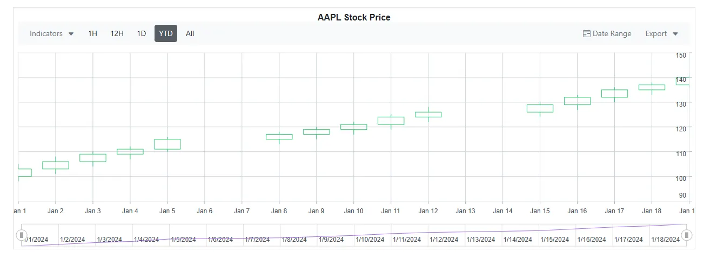

<!-- markdownlint-disable MD036 -->

# Blazor Stock Chart Technical Indicators

A technical indicator is a mathematical calculation based on historical price, volume, or open interest information that aims to forecast financial market direction.

The Stock Chart supports 10 types of technical indicators: `Accumulation Distribution`, `ATR`, `EMA`, `Momentum`, `MACD`, `RSI`, `SMA`, `Stochastic`, `TMA`, and `Bollinger Band`. Use the indicator dropdown, configured through the [IndicatorType](https://help.syncfusion.com/cr/blazor/Syncfusion.Blazor.Charts.SfStockChart.html#Syncfusion_Blazor_Charts_SfStockChart_IndicatorType) property, to add or remove the required indicator types.

To add a technical indicator, include [StockChartIndicators](https://help.syncfusion.com/cr/blazor/Syncfusion.Blazor.Charts.StockChartIndicators.html) and configure a [StockChartIndicator](https://help.syncfusion.com/cr/blazor/Syncfusion.Blazor.Charts.StockChartIndicator.html) with its [Type](https://help.syncfusion.com/cr/blazor/Syncfusion.Blazor.Charts.StockChartIndicator.html#Syncfusion_Blazor_Charts_StockChartIndicator_Type), [Field](https://help.syncfusion.com/cr/blazor/Syncfusion.Blazor.Charts.StockChartIndicator.html#Syncfusion_Blazor_Charts_StockChartIndicator_Field), and [SeriesName](https://help.syncfusion.com/cr/blazor/Syncfusion.Blazor.Charts.StockChartIndicator.html#Syncfusion_Blazor_Charts_StockChartIndicator_SeriesName) properties.

```cshtml

@using Syncfusion.Blazor.Charts

<SfStockChart Title="AAPL Stock Price">
    <StockChartSeriesCollection>
        <StockChartSeries Name="AAPL" DataSource="@StockDetails" Type="ChartSeriesType.Candle" XName="Date" High="High" Low="Low" Open="Open" Close="Close" Volume="Volume"></StockChartSeries>
    </StockChartSeriesCollection>
    <StockChartIndicators>
        <StockChartIndicator Type="TechnicalIndicators.Ema" Field="FinancialDataFields.Close" SeriesName="AAPL" XName="Date" Close="Close" Period="14"></StockChartIndicator>
    </StockChartIndicators>
</SfStockChart>

@code {
    public class ChartData
    {
        public DateTime Date { get; set; }
        public double Open { get; set; }
        public double Low { get; set; }
        public double Close { get; set; }
        public double High { get; set; }
        public double Volume { get; set; }
    }

    public List<ChartData> StockDetails = new List<ChartData>
    {
        new ChartData { Date = new DateTime(2024, 01, 01), Open = 100, High = 105, Low = 98, Close = 103, Volume = 1000000 },
        new ChartData { Date = new DateTime(2024, 01, 02), Open = 103, High = 108, Low = 101, Close = 106, Volume = 1200000 },
        new ChartData { Date = new DateTime(2024, 01, 03), Open = 106, High = 110, Low = 104, Close = 109, Volume = 1350000 },
        new ChartData { Date = new DateTime(2024, 01, 04), Open = 109, High = 112, Low = 107, Close = 111, Volume = 1400000 },
        new ChartData { Date = new DateTime(2024, 01, 05), Open = 111, High = 116, Low = 110, Close = 115, Volume = 1500000 },
        new ChartData { Date = new DateTime(2024, 01, 08), Open = 115, High = 118, Low = 113, Close = 117, Volume = 1450000 },
        new ChartData { Date = new DateTime(2024, 01, 09), Open = 117, High = 120, Low = 115, Close = 119, Volume = 1580000 },
        new ChartData { Date = new DateTime(2024, 01, 10), Open = 119, High = 122, Low = 117, Close = 121, Volume = 1620000 },
        new ChartData { Date = new DateTime(2024, 01, 11), Open = 121, High = 125, Low = 119, Close = 124, Volume = 1700000 },
        new ChartData { Date = new DateTime(2024, 01, 12), Open = 124, High = 128, Low = 122, Close = 126, Volume = 1800000 },
        new ChartData { Date = new DateTime(2024, 01, 15), Open = 126, High = 130, Low = 124, Close = 129, Volume = 1900000 },
        new ChartData { Date = new DateTime(2024, 01, 16), Open = 129, High = 133, Low = 127, Close = 132, Volume = 2000000 },
        new ChartData { Date = new DateTime(2024, 01, 17), Open = 132, High = 136, Low = 130, Close = 135, Volume = 2100000 },
        new ChartData { Date = new DateTime(2024, 01, 18), Open = 135, High = 138, Low = 133, Close = 137, Volume = 2250000 },
        new ChartData { Date = new DateTime(2024, 01, 19), Open = 137, High = 141, Low = 136, Close = 140, Volume = 2400000 }
    };
}

```



## Accumulation Distribution

Accumulation Distribution combines price and volume to show potential money flow into or out of a stock. To render an Accumulation Distribution indicator, set the indicator [Type](https://help.syncfusion.com/cr/blazor/Syncfusion.Blazor.Charts.StockChartIndicator.html#Syncfusion_Blazor_Charts_StockChartIndicator_Type) to `AccumulationDistribution`. To calculate the signal line, the [Volume](https://help.syncfusion.com/cr/blazor/Syncfusion.Blazor.Charts.StockChartIndicator.html#Syncfusion_Blazor_Charts_StockChartIndicator_Volume) field must be included in the [DataSource](https://help.syncfusion.com/cr/blazor/Syncfusion.Blazor.Charts.StockChartIndicator.html#Syncfusion_Blazor_Charts_StockChartIndicator_DataSource).

```cshtml

@using Syncfusion.Blazor.Charts

<SfStockChart Title="AAPL Stock Price">
    <StockChartSeriesCollection>
        <StockChartSeries Name="AAPL" DataSource="@StockDetails" Type="ChartSeriesType.Candle" XName="Date" High="High" Low="Low" Open="Open" Close="Close" Volume="Volume"></StockChartSeries>
    </StockChartSeriesCollection>
    <StockChartIndicators>
        <StockChartIndicator Type="TechnicalIndicators.AccumulationDistribution" SeriesName="AAPL" XName="Date" High="High" Low="Low" Close="Close" Volume="Volume"></StockChartIndicator>
    </StockChartIndicators>
</SfStockChart>

@code {
    public class ChartData
    {
        public DateTime Date { get; set; }
        public double Open { get; set; }
        public double Low { get; set; }
        public double Close { get; set; }
        public double High { get; set; }
        public double Volume { get; set; }
    }

    public List<ChartData> StockDetails = new List<ChartData>
    {
        new ChartData { Date = new DateTime(2024, 01, 01), Open = 100, High = 105, Low = 98, Close = 103, Volume = 1000000 },
        new ChartData { Date = new DateTime(2024, 01, 02), Open = 103, High = 108, Low = 101, Close = 106, Volume = 1200000 },
        new ChartData { Date = new DateTime(2024, 01, 03), Open = 106, High = 110, Low = 104, Close = 109, Volume = 1350000 },
        new ChartData { Date = new DateTime(2024, 01, 04), Open = 109, High = 112, Low = 107, Close = 111, Volume = 1400000 },
        new ChartData { Date = new DateTime(2024, 01, 05), Open = 111, High = 116, Low = 110, Close = 115, Volume = 1500000 },
        new ChartData { Date = new DateTime(2024, 01, 08), Open = 115, High = 118, Low = 113, Close = 117, Volume = 1450000 },
        new ChartData { Date = new DateTime(2024, 01, 09), Open = 117, High = 120, Low = 115, Close = 119, Volume = 1580000 },
        new ChartData { Date = new DateTime(2024, 01, 10), Open = 119, High = 122, Low = 117, Close = 121, Volume = 1620000 },
        new ChartData { Date = new DateTime(2024, 01, 11), Open = 121, High = 125, Low = 119, Close = 124, Volume = 1700000 },
        new ChartData { Date = new DateTime(2024, 01, 12), Open = 124, High = 128, Low = 122, Close = 126, Volume = 1800000 },
        new ChartData { Date = new DateTime(2024, 01, 15), Open = 126, High = 130, Low = 124, Close = 129, Volume = 1900000 },
        new ChartData { Date = new DateTime(2024, 01, 16), Open = 129, High = 133, Low = 127, Close = 132, Volume = 2000000 },
        new ChartData { Date = new DateTime(2024, 01, 17), Open = 132, High = 136, Low = 130, Close = 135, Volume = 2100000 },
        new ChartData { Date = new DateTime(2024, 01, 18), Open = 135, High = 138, Low = 133, Close = 137, Volume = 2250000 },
        new ChartData { Date = new DateTime(2024, 01, 19), Open = 137, High = 141, Low = 136, Close = 140, Volume = 2400000 }
    };
}

```

## Average True Range (ATR)

ATR measures stock volatility by comparing the current value with the previous value. To render an Average True Range (ATR) indicator, set the indicator [Type](https://help.syncfusion.com/cr/blazor/Syncfusion.Blazor.Charts.StockChartIndicator.html#Syncfusion_Blazor_Charts_StockChartIndicator_Type) to `Atr`.

## Exponential Moving Average (EMA)

Moving average indicators are used to define the direction of the trend. To render an EMA indicator, set the indicator [Type](https://help.syncfusion.com/cr/blazor/Syncfusion.Blazor.Charts.StockChartIndicator.html#Syncfusion_Blazor_Charts_StockChartIndicator_Type) to `Ema`.

## Momentum

Momentum shows the speed at which the stock price is changing. To render a Momentum indicator, set the indicator [Type](https://help.syncfusion.com/cr/blazor/Syncfusion.Blazor.Charts.StockChartIndicator.html#Syncfusion_Blazor_Charts_StockChartIndicator_Type) to `Momentum`. The Momentum indicator is represented by two lines (`upperLine`, `signalLine`). In the Momentum indicator, the `upperLine` value is always rendered at 100.

## Moving Average Convergence Divergence (MACD)

MACD is based on the difference between two EMAs. To render a MACD indicator, set the indicator [Type](https://help.syncfusion.com/cr/blazor/Syncfusion.Blazor.Charts.StockChartIndicator.html#Syncfusion_Blazor_Charts_StockChartIndicator_Type) to `Macd`. The MACD indicator is represented by the MACD line, signal line, and MACD histogram. The histogram highlights the difference between the MACD line and the signal line.

## Relative Strength Index (RSI)

RSI shows how strongly a stock is moving in its current direction. To render an RSI indicator, set the indicator [Type](https://help.syncfusion.com/cr/blazor/Syncfusion.Blazor.Charts.StockChartIndicator.html#Syncfusion_Blazor_Charts_StockChartIndicator_Type) to `Rsi`. The RSI indicator is represented by three lines (`upperBand`, `lowerBand`, `signalLine`). The `upperBand` and `lowerBand` values are customized by the [OverBought](https://help.syncfusion.com/cr/blazor/Syncfusion.Blazor.Charts.StockChartIndicator.html#Syncfusion_Blazor_Charts_StockChartIndicator_OverBought) and [OverSold](https://help.syncfusion.com/cr/blazor/Syncfusion.Blazor.Charts.StockChartIndicator.html#Syncfusion_Blazor_Charts_StockChartIndicator_OverSold) properties, and the `signalLine` is calculated using the RSI formula.

```cshtml

@using Syncfusion.Blazor.Charts

<SfStockChart Title="AAPL Stock Price">
    <StockChartSeriesCollection>
        <StockChartSeries Name="AAPL" DataSource="@StockDetails" Type="ChartSeriesType.Candle" XName="Date" High="High" Low="Low" Open="Open" Close="Close" Volume="Volume"></StockChartSeries>
    </StockChartSeriesCollection>
    <StockChartIndicators>
        <StockChartIndicator Type="TechnicalIndicators.Rsi" Field="FinancialDataFields.Close" SeriesName="AAPL" XName="Date" Close="Close" Period="14" OverBought="70" OverSold="30"></StockChartIndicator>
    </StockChartIndicators>
</SfStockChart>

@code {
    public class ChartData
    {
        public DateTime Date { get; set; }
        public double Open { get; set; }
        public double Low { get; set; }
        public double Close { get; set; }
        public double High { get; set; }
        public double Volume { get; set; }
    }

    public List<ChartData> StockDetails = new List<ChartData>
    {
        new ChartData { Date = new DateTime(2024, 01, 01), Open = 100, High = 105, Low = 98, Close = 103, Volume = 1000000 },
        new ChartData { Date = new DateTime(2024, 01, 02), Open = 103, High = 108, Low = 101, Close = 106, Volume = 1200000 },
        new ChartData { Date = new DateTime(2024, 01, 03), Open = 106, High = 110, Low = 104, Close = 109, Volume = 1350000 },
        new ChartData { Date = new DateTime(2024, 01, 04), Open = 109, High = 112, Low = 107, Close = 111, Volume = 1400000 },
        new ChartData { Date = new DateTime(2024, 01, 05), Open = 111, High = 116, Low = 110, Close = 115, Volume = 1500000 },
        new ChartData { Date = new DateTime(2024, 01, 08), Open = 115, High = 118, Low = 113, Close = 117, Volume = 1450000 },
        new ChartData { Date = new DateTime(2024, 01, 09), Open = 117, High = 120, Low = 115, Close = 119, Volume = 1580000 },
        new ChartData { Date = new DateTime(2024, 01, 10), Open = 119, High = 122, Low = 117, Close = 121, Volume = 1620000 },
        new ChartData { Date = new DateTime(2024, 01, 11), Open = 121, High = 125, Low = 119, Close = 124, Volume = 1700000 },
        new ChartData { Date = new DateTime(2024, 01, 12), Open = 124, High = 128, Low = 122, Close = 126, Volume = 1800000 },
        new ChartData { Date = new DateTime(2024, 01, 15), Open = 126, High = 130, Low = 124, Close = 129, Volume = 1900000 },
        new ChartData { Date = new DateTime(2024, 01, 16), Open = 129, High = 133, Low = 127, Close = 132, Volume = 2000000 },
        new ChartData { Date = new DateTime(2024, 01, 17), Open = 132, High = 136, Low = 130, Close = 135, Volume = 2100000 },
        new ChartData { Date = new DateTime(2024, 01, 18), Open = 135, High = 138, Low = 133, Close = 137, Volume = 2250000 },
        new ChartData { Date = new DateTime(2024, 01, 19), Open = 137, High = 141, Low = 136, Close = 140, Volume = 2400000 }
    };
}

```

## Simple Moving Average (SMA)

Moving average indicators are used to define the direction of the trend. To render an SMA indicator, set the indicator [Type](https://help.syncfusion.com/cr/blazor/Syncfusion.Blazor.Charts.StockChartIndicator.html#Syncfusion_Blazor_Charts_StockChartIndicator_Type) to `Sma`.

## Stochastic

Stochastic indicates how a stock compares to its previous state. To render a Stochastic indicator, set the indicator [Type](https://help.syncfusion.com/cr/blazor/Syncfusion.Blazor.Charts.StockChartIndicator.html#Syncfusion_Blazor_Charts_StockChartIndicator_Type) to `Stochastic`. The Stochastic indicator is represented by four lines (`upperLine`, `lowerLine`, `periodLine`, `signalLine`). The `upperBand` and `lowerBand` values are customized by the [OverBought](https://help.syncfusion.com/cr/blazor/Syncfusion.Blazor.Charts.StockChartIndicator.html#Syncfusion_Blazor_Charts_StockChartIndicator_OverBought) and [OverSold](https://help.syncfusion.com/cr/blazor/Syncfusion.Blazor.Charts.StockChartIndicator.html#Syncfusion_Blazor_Charts_StockChartIndicator_OverSold) properties, and the `periodLine` and `signalLine` are rendered based on the stochastic formula.

```cshtml

@using Syncfusion.Blazor.Charts

<SfStockChart Title="AAPL Stock Price">
    <StockChartSeriesCollection>
        <StockChartSeries Name="AAPL" DataSource="@StockDetails" Type="ChartSeriesType.Candle" XName="Date" High="High" Low="Low" Open="Open" Close="Close" Volume="Volume"></StockChartSeries>
    </StockChartSeriesCollection>
    <StockChartIndicators>
        <StockChartIndicator Type="TechnicalIndicators.Stochastic" SeriesName="AAPL" XName="Date" High="High" Low="Low" Close="Close" Period="14" OverBought="80" OverSold="20"></StockChartIndicator>
    </StockChartIndicators>
</SfStockChart>

@code {
    public class ChartData
    {
        public DateTime Date { get; set; }
        public double Open { get; set; }
        public double Low { get; set; }
        public double Close { get; set; }
        public double High { get; set; }
        public double Volume { get; set; }
    }

    public List<ChartData> StockDetails = new List<ChartData>
    {
        new ChartData { Date = new DateTime(2024, 01, 01), Open = 100, High = 105, Low = 98, Close = 103, Volume = 1000000 },
        new ChartData { Date = new DateTime(2024, 01, 02), Open = 103, High = 108, Low = 101, Close = 106, Volume = 1200000 },
        new ChartData { Date = new DateTime(2024, 01, 03), Open = 106, High = 110, Low = 104, Close = 109, Volume = 1350000 },
        new ChartData { Date = new DateTime(2024, 01, 04), Open = 109, High = 112, Low = 107, Close = 111, Volume = 1400000 },
        new ChartData { Date = new DateTime(2024, 01, 05), Open = 111, High = 116, Low = 110, Close = 115, Volume = 1500000 },
        new ChartData { Date = new DateTime(2024, 01, 08), Open = 115, High = 118, Low = 113, Close = 117, Volume = 1450000 },
        new ChartData { Date = new DateTime(2024, 01, 09), Open = 117, High = 120, Low = 115, Close = 119, Volume = 1580000 },
        new ChartData { Date = new DateTime(2024, 01, 10), Open = 119, High = 122, Low = 117, Close = 121, Volume = 1620000 },
        new ChartData { Date = new DateTime(2024, 01, 11), Open = 121, High = 125, Low = 119, Close = 124, Volume = 1700000 },
        new ChartData { Date = new DateTime(2024, 01, 12), Open = 124, High = 128, Low = 122, Close = 126, Volume = 1800000 },
        new ChartData { Date = new DateTime(2024, 01, 15), Open = 126, High = 130, Low = 124, Close = 129, Volume = 1900000 },
        new ChartData { Date = new DateTime(2024, 01, 16), Open = 129, High = 133, Low = 127, Close = 132, Volume = 2000000 },
        new ChartData { Date = new DateTime(2024, 01, 17), Open = 132, High = 136, Low = 130, Close = 135, Volume = 2100000 },
        new ChartData { Date = new DateTime(2024, 01, 18), Open = 135, High = 138, Low = 133, Close = 137, Volume = 2250000 },
        new ChartData { Date = new DateTime(2024, 01, 19), Open = 137, High = 141, Low = 136, Close = 140, Volume = 2400000 }
    };
}

```

## Triangular Moving Average (TMA)

Moving average indicators are used to define the direction of the trend. To render a TMA indicator, set the indicator [Type](https://help.syncfusion.com/cr/blazor/Syncfusion.Blazor.Charts.StockChartIndicator.html#Syncfusion_Blazor_Charts_StockChartIndicator_Type) to `Tma`.

## Bollinger Band

<!-- markdownlint-disable MD034 -->

A Stock Chart overlay that shows the upper and lower limits of normal price movements based on the standard deviation of prices. To render a Bollinger Band, set the indicator [Type](https://help.syncfusion.com/cr/blazor/Syncfusion.Blazor.Charts.StockChartIndicator.html#Syncfusion_Blazor_Charts_StockChartIndicator_Type) to `BollingerBand`. The Bollinger Band is represented by three lines (`upperLine`, `lowerLine`, `signalLine`), and the default [StandardDeviation](https://help.syncfusion.com/cr/blazor/Syncfusion.Blazor.Charts.StockChartIndicator.html#Syncfusion_Blazor_Charts_StockChartIndicator_StandardDeviation) value is 2.

```cshtml

@using Syncfusion.Blazor.Charts

<SfStockChart Title="AAPL Stock Price">
    <StockChartSeriesCollection>
        <StockChartSeries Name="AAPL" DataSource="@StockDetails" Type="ChartSeriesType.Candle" XName="Date" High="High" Low="Low" Open="Open" Close="Close" Volume="Volume"></StockChartSeries>
    </StockChartSeriesCollection>
    <StockChartIndicators>
        <StockChartIndicator Type="TechnicalIndicators.BollingerBand" Field="FinancialDataFields.Close" SeriesName="AAPL" XName="Date" Close="Close" Period="14" StandardDeviation="2"></StockChartIndicator>
    </StockChartIndicators>
</SfStockChart>

@code {
    public class ChartData
    {
        public DateTime Date { get; set; }
        public double Open { get; set; }
        public double Low { get; set; }
        public double Close { get; set; }
        public double High { get; set; }
        public double Volume { get; set; }
    }

    public List<ChartData> StockDetails = new List<ChartData>
    {
        new ChartData { Date = new DateTime(2024, 01, 01), Open = 100, High = 105, Low = 98, Close = 103, Volume = 1000000 },
        new ChartData { Date = new DateTime(2024, 01, 02), Open = 103, High = 108, Low = 101, Close = 106, Volume = 1200000 },
        new ChartData { Date = new DateTime(2024, 01, 03), Open = 106, High = 110, Low = 104, Close = 109, Volume = 1350000 },
        new ChartData { Date = new DateTime(2024, 01, 04), Open = 109, High = 112, Low = 107, Close = 111, Volume = 1400000 },
        new ChartData { Date = new DateTime(2024, 01, 05), Open = 111, High = 116, Low = 110, Close = 115, Volume = 1500000 },
        new ChartData { Date = new DateTime(2024, 01, 08), Open = 115, High = 118, Low = 113, Close = 117, Volume = 1450000 },
        new ChartData { Date = new DateTime(2024, 01, 09), Open = 117, High = 120, Low = 115, Close = 119, Volume = 1580000 },
        new ChartData { Date = new DateTime(2024, 01, 10), Open = 119, High = 122, Low = 117, Close = 121, Volume = 1620000 },
        new ChartData { Date = new DateTime(2024, 01, 11), Open = 121, High = 125, Low = 119, Close = 124, Volume = 1700000 },
        new ChartData { Date = new DateTime(2024, 01, 12), Open = 124, High = 128, Low = 122, Close = 126, Volume = 1800000 },
        new ChartData { Date = new DateTime(2024, 01, 15), Open = 126, High = 130, Low = 124, Close = 129, Volume = 1900000 },
        new ChartData { Date = new DateTime(2024, 01, 16), Open = 129, High = 133, Low = 127, Close = 132, Volume = 2000000 },
        new ChartData { Date = new DateTime(2024, 01, 17), Open = 132, High = 136, Low = 130, Close = 135, Volume = 2100000 },
        new ChartData { Date = new DateTime(2024, 01, 18), Open = 135, High = 138, Low = 133, Close = 137, Volume = 2250000 },
        new ChartData { Date = new DateTime(2024, 01, 19), Open = 137, High = 141, Low = 136, Close = 140, Volume = 2400000 }
    };
}

```

## See also

* [Trendlines](./trend-lines)
* [Series Types](./series-types)
