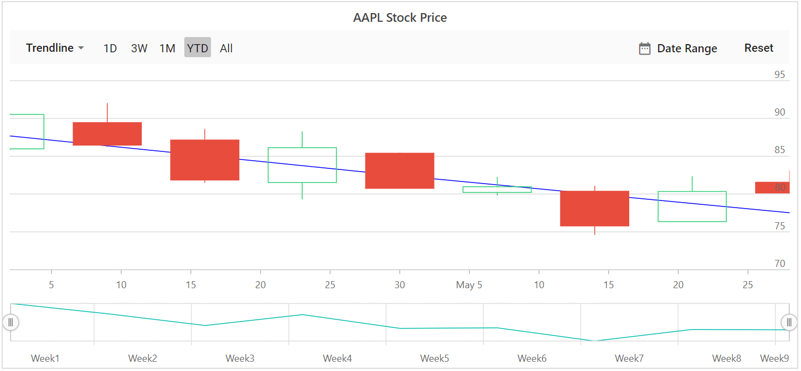
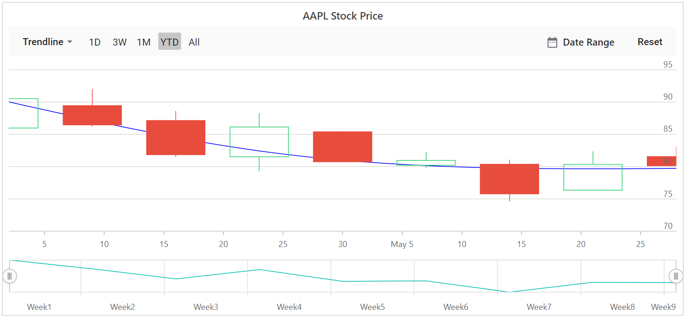

# Trendlines

Trendlines are used to show the direction and speed of price.

Stock Chart supports 6 types of trendlines namely `Linear`,`Exponential`,`Logarithmic`,`Polynomial`,`Power`,`Moving Average`. By using trendline dropdown button you can add or remove the required trendline type.

## Linear

A linear trendline is a best fit straight line that is used with simpler data sets. To render a linear trendline,
use trendline [`Type`](https://help.syncfusion.com/cr/blazor/Syncfusion.Blazor.Charts.StockChartTrendline.html#Syncfusion_Blazor_Charts_StockChartTrendline_Type) as `Linear`.



@using Syncfusion.Blazor.Charts

<SfStockChart Title="AAPL Stock Price" SeriesType="@SeriesType" IndicatorType="@Indicator" ExportType="@ExportType">
    <StockChartPrimaryXAxis>
        <StockChartAxisMajorGridLines Color="Transparent"></StockChartAxisMajorGridLines>
    </StockChartPrimaryXAxis>
    <StockChartPrimaryYAxis>
        <StockChartAxisLineStyle Color="Transparent"></StockChartAxisLineStyle>
        <StockChartAxisMajorTickLines Color="Transparent" Width="0"></StockChartAxisMajorTickLines>
    </StockChartPrimaryYAxis>
    <StockChartSeriesCollection>
        <StockChartSeries DataSource="@StockDetails" Type="ChartSeriesType.Candle" XName="Date" High="High" Low="Low" Open="Open" Close="Close" Volume="Volume" Name="Google">
            <StockChartTrendlines>
                <StockChartTrendline Type="TrendlineTypes.Linear" EnableTooltip="false"></StockChartTrendline>
            </StockChartTrendlines>
        </StockChartSeries>
    </StockChartSeriesCollection>
</SfStockChart>

@code {

    public List<TechnicalIndicators> Indicator = new List<TechnicalIndicators>();
    public List<ChartSeriesType> SeriesType = new List<ChartSeriesType>();
    public List<ExportType> ExportType = new List<ExportType>();

    public class StockChartData
    {
        public DateTime Date;
        public Double Open;
        public Double Low;
        public Double Close;
        public Double High;
        public Double Volume;
    }

    public List<StockChartData> StockDetails = new List<StockChartData>
 {
         new StockChartData { Date = new DateTime(2012, 04, 02), Open = 85.9757, High = 90.6657, Low = 85.7685, Close = 90.5257, Volume = 660187068},
         new StockChartData { Date = new DateTime(2012, 04, 09), Open = 89.4471, High = 92, Low = 86.2157, Close = 86.4614, Volume = 912634864},
         new StockChartData { Date = new DateTime(2012, 04, 16), Open = 87.1514, High = 88.6071, Low = 81.4885, Close = 81.8543, Volume = 1221746066},
         new StockChartData { Date = new DateTime(2012, 04, 23), Open = 81.5157, High = 88.2857, Low = 79.2857, Close = 86.1428, Volume = 965935749},
         new StockChartData { Date = new DateTime(2012, 04, 30), Open = 85.4, High =  85.4857, Low = 80.7385, Close = 80.75, Volume = 615249365},
         new StockChartData { Date = new DateTime(2012, 05, 07), Open = 80.2143, High = 82.2685, Low = 79.8185, Close = 80.9585, Volume = 541742692},
         new StockChartData { Date = new DateTime(2012, 05, 14), Open = 80.3671, High = 81.0728, Low = 74.5971, Close = 75.7685, Volume = 708126233},
         new StockChartData { Date = new DateTime(2012, 05, 21), Open = 76.3571, High = 82.3571, Low = 76.2928, Close = 80.3271, Volume = 682076215},
         new StockChartData { Date = new DateTime(2012, 05, 28), Open = 81.5571, High = 83.0714, Low = 80.0743, Close = 80.1414, Volume = 480059584},
     };
}



## Logarithmic

A logarithmic trendline is a best-fit curved line that is most useful when the rate of change in the data increases or decreases quickly and then levels out. A logarithmic trendline can use negative and/or positive values.
To render a logarithmic trendline, use trendline [`Type`](https://help.syncfusion.com/cr/blazor/Syncfusion.Blazor.Charts.StockChartTrendline.html#Syncfusion_Blazor_Charts_StockChartTrendline_Type) as `Logarithmic`.



@using Syncfusion.Blazor.Charts

<SfStockChart Title="AAPL Stock Price" SeriesType="@SeriesType" IndicatorType="@Indicator" ExportType="@ExportType">
    <StockChartPrimaryXAxis>
        <StockChartAxisMajorGridLines Color="Transparent"></StockChartAxisMajorGridLines>
    </StockChartPrimaryXAxis>
    <StockChartPrimaryYAxis>
        <StockChartAxisLineStyle Color="Transparent"></StockChartAxisLineStyle>
        <StockChartAxisMajorTickLines Color="Transparent" Width="0"></StockChartAxisMajorTickLines>
    </StockChartPrimaryYAxis>
    <StockChartSeriesCollection>
        <StockChartSeries DataSource="@StockDetails" Type="ChartSeriesType.Candle" XName="Date" High="High" Low="Low" Open="Open" Close="Close" Volume="Volume" Name="Google">
            <StockChartTrendlines>
                <StockChartTrendline Type="TrendlineTypes.Logarithmic" EnableTooltip="false"></StockChartTrendline>
            </StockChartTrendlines>
        </StockChartSeries>
    </StockChartSeriesCollection>
</SfStockChart>
@code {

    public List<TechnicalIndicators> Indicator = new List<TechnicalIndicators>();
    public List<ChartSeriesType> SeriesType = new List<ChartSeriesType>();
    public List<ExportType> ExportType = new List<ExportType>();

    public class StockChartData
    {
        public DateTime Date;
        public Double Open;
        public Double Low;
        public Double Close;
        public Double High;
        public Double Volume;
    }

    public List<StockChartData> StockDetails = new List<StockChartData>
{
         new StockChartData { Date = new DateTime(2012, 04, 02), Open = 85.9757, High = 90.6657, Low = 85.7685, Close = 90.5257, Volume = 660187068},
         new StockChartData { Date = new DateTime(2012, 04, 09), Open = 89.4471, High = 92, Low = 86.2157, Close = 86.4614, Volume = 912634864},
         new StockChartData { Date = new DateTime(2012, 04, 16), Open = 87.1514, High = 88.6071, Low = 81.4885, Close = 81.8543, Volume = 1221746066},
         new StockChartData { Date = new DateTime(2012, 04, 23), Open = 81.5157, High = 88.2857, Low = 79.2857, Close = 86.1428, Volume = 965935749},
         new StockChartData { Date = new DateTime(2012, 04, 30), Open = 85.4, High =  85.4857, Low = 80.7385, Close = 80.75, Volume = 615249365},
         new StockChartData { Date = new DateTime(2012, 05, 07), Open = 80.2143, High = 82.2685, Low = 79.8185, Close = 80.9585, Volume = 541742692},
         new StockChartData { Date = new DateTime(2012, 05, 14), Open = 80.3671, High = 81.0728, Low = 74.5971, Close = 75.7685, Volume = 708126233},
         new StockChartData { Date = new DateTime(2012, 05, 21), Open = 76.3571, High = 82.3571, Low = 76.2928, Close = 80.3271, Volume = 682076215},
         new StockChartData { Date = new DateTime(2012, 05, 28), Open = 81.5571, High = 83.0714, Low = 80.0743, Close = 80.1414, Volume = 480059584},
     };
}



## Exponential

An exponential trendline is a curved line that is most useful when data values rise or fall at increasingly higher rates. You cannot create an exponential trendline, if your data contains zero or negative values.
To render a exponential trendline,
use trendline [`Type`](https://help.syncfusion.com/cr/blazor/Syncfusion.Blazor.Charts.StockChartTrendline.html#Syncfusion_Blazor_Charts_StockChartTrendline_Type) as `Exponential`.



@using Syncfusion.Blazor.Charts

<SfStockChart Title="AAPL Stock Price" SeriesType="@SeriesType" IndicatorType="@Indicator" ExportType="@ExportType">
    <StockChartPrimaryXAxis>
        <StockChartAxisMajorGridLines Color="Transparent"></StockChartAxisMajorGridLines>
    </StockChartPrimaryXAxis>
    <StockChartPrimaryYAxis>
        <StockChartAxisLineStyle Color="Transparent"></StockChartAxisLineStyle>
        <StockChartAxisMajorTickLines Color="Transparent" Width="0"></StockChartAxisMajorTickLines>
    </StockChartPrimaryYAxis>
    <StockChartSeriesCollection>
        <StockChartSeries DataSource="@StockDetails" Type="ChartSeriesType.Candle" XName="Date" High="High" Low="Low" Open="Open" Close="Close" Volume="Volume" Name="Google">
            <StockChartTrendlines>
                <StockChartTrendline Type="TrendlineTypes.Exponential" EnableTooltip="false"></StockChartTrendline>
            </StockChartTrendlines>
        </StockChartSeries>
    </StockChartSeriesCollection>
</SfStockChart>
@code {

    public List<TechnicalIndicators>
    Indicator = new List<TechnicalIndicators>
        ();
        public List<ChartSeriesType>
            SeriesType = new List<ChartSeriesType>
                ();
                public List<ExportType>
                    ExportType = new List<ExportType>
                        ();

                        public class StockChartData
                        {
                        public DateTime Date;
                        public Double Open;
                        public Double Low;
                        public Double Close;
                        public Double High;
                        public Double Volume;
                        }

                        public List<StockChartData>
                            StockDetails = new List<StockChartData>
                                {
                                new StockChartData { Date = new DateTime(2012, 04, 02), Open = 85.9757, High = 90.6657, Low = 85.7685, Close = 90.5257, Volume = 660187068},
                                new StockChartData { Date = new DateTime(2012, 04, 09), Open = 89.4471, High = 92, Low = 86.2157, Close = 86.4614, Volume = 912634864},
                                new StockChartData { Date = new DateTime(2012, 04, 16), Open = 87.1514, High = 88.6071, Low = 81.4885, Close = 81.8543, Volume = 1221746066},
                                new StockChartData { Date = new DateTime(2012, 04, 23), Open = 81.5157, High = 88.2857, Low = 79.2857, Close = 86.1428, Volume = 965935749},
                                new StockChartData { Date = new DateTime(2012, 04, 30), Open = 85.4, High =  85.4857, Low = 80.7385, Close = 80.75, Volume = 615249365},
                                new StockChartData { Date = new DateTime(2012, 05, 07), Open = 80.2143, High = 82.2685, Low = 79.8185, Close = 80.9585, Volume = 541742692},
                                new StockChartData { Date = new DateTime(2012, 05, 14), Open = 80.3671, High = 81.0728, Low = 74.5971, Close = 75.7685, Volume = 708126233},
                                new StockChartData { Date = new DateTime(2012, 05, 21), Open = 76.3571, High = 82.3571, Low = 76.2928, Close = 80.3271, Volume = 682076215},
                                new StockChartData { Date = new DateTime(2012, 05, 28), Open = 81.5571, High = 83.0714, Low = 80.0743, Close = 80.1414, Volume = 480059584},
                                };
                                }



## Polynomial

A polynomial trendline is a curved line that is used when data fluctuates.
to render a polynomial trendline,
use trendline [`Type`](https://help.syncfusion.com/cr/blazor/Syncfusion.Blazor.Charts.StockChartTrendline.html#Syncfusion_Blazor_Charts_StockChartTrendline_Type) as `Polynomial`.
`PolynomialOrder` used to define the polynomial value.



@using Syncfusion.Blazor.Charts

<SfStockChart Title="AAPL Stock Price" SeriesType="@SeriesType" IndicatorType="@Indicator" ExportType="@ExportType">
    <StockChartPrimaryXAxis>
        <StockChartAxisMajorGridLines Color="Transparent"></StockChartAxisMajorGridLines>
    </StockChartPrimaryXAxis>
    <StockChartPrimaryYAxis>
        <StockChartAxisLineStyle Color="Transparent"></StockChartAxisLineStyle>
        <StockChartAxisMajorTickLines Color="Transparent" Width="0"></StockChartAxisMajorTickLines>
    </StockChartPrimaryYAxis>
    <StockChartSeriesCollection>
        <StockChartSeries DataSource="@StockDetails" Type="ChartSeriesType.Candle" XName="Date" High="High" Low="Low" Open="Open" Close="Close" Volume="Volume" Name="Google">
            <StockChartTrendlines>
                <StockChartTrendline Type="TrendlineTypes.Polynomial" EnableTooltip="false"></StockChartTrendline>
            </StockChartTrendlines>
        </StockChartSeries>
    </StockChartSeriesCollection>
</SfStockChart>
@code {

    public List<TechnicalIndicators> Indicator = new List<TechnicalIndicators>();
    public List<ChartSeriesType> SeriesType = new List<ChartSeriesType>();
    public List<ExportType> ExportType = new List<ExportType>();

    public class StockChartData
    {
        public DateTime Date;
        public Double Open;
        public Double Low;
        public Double Close;
        public Double High;
        public Double Volume;
    }

    public List<StockChartData> StockDetails = new List<StockChartData>
{
         new StockChartData { Date = new DateTime(2012, 04, 02), Open = 85.9757, High = 90.6657, Low = 85.7685, Close = 90.5257, Volume = 660187068},
         new StockChartData { Date = new DateTime(2012, 04, 09), Open = 89.4471, High = 92, Low = 86.2157, Close = 86.4614, Volume = 912634864},
         new StockChartData { Date = new DateTime(2012, 04, 16), Open = 87.1514, High = 88.6071, Low = 81.4885, Close = 81.8543, Volume = 1221746066},
         new StockChartData { Date = new DateTime(2012, 04, 23), Open = 81.5157, High = 88.2857, Low = 79.2857, Close = 86.1428, Volume = 965935749},
         new StockChartData { Date = new DateTime(2012, 04, 30), Open = 85.4, High =  85.4857, Low = 80.7385, Close = 80.75, Volume = 615249365},
         new StockChartData { Date = new DateTime(2012, 05, 07), Open = 80.2143, High = 82.2685, Low = 79.8185, Close = 80.9585, Volume = 541742692},
         new StockChartData { Date = new DateTime(2012, 05, 14), Open = 80.3671, High = 81.0728, Low = 74.5971, Close = 75.7685, Volume = 708126233},
         new StockChartData { Date = new DateTime(2012, 05, 21), Open = 76.3571, High = 82.3571, Low = 76.2928, Close = 80.3271, Volume = 682076215},
         new StockChartData { Date = new DateTime(2012, 05, 28), Open = 81.5571, High = 83.0714, Low = 80.0743, Close = 80.1414, Volume = 480059584},
     };
}



## Power

A power trendline is a curved line that is best used with data sets that compare measurements that increase at a specific rate.
To render a power trendline, use trendline [`Type`](https://help.syncfusion.com/cr/blazor/Syncfusion.Blazor.Charts.StockChartTrendline.html#Syncfusion_Blazor_Charts_StockChartTrendline_Type) as `Power`.

## Moving Average

A moving average trendline smoothen out fluctuations in data to show a pattern or trend more clearly.
To render a moving average trendline, use trendline [`Type`](https://help.syncfusion.com/cr/blazor/Syncfusion.Blazor.Charts.StockChartTrendline.html#Syncfusion_Blazor_Charts_StockChartTrendline_Type) as `MovingAverage`.

`Period` property defines the period to find the moving average.



@using Syncfusion.Blazor.Charts

<SfStockChart Title="AAPL Stock Price" SeriesType="@SeriesType" IndicatorType="@Indicator" ExportType="@ExportType">
    <StockChartPrimaryXAxis>
        <StockChartAxisMajorGridLines Color="Transparent"></StockChartAxisMajorGridLines>
    </StockChartPrimaryXAxis>
    <StockChartPrimaryYAxis>
        <StockChartAxisLineStyle Color="Transparent"></StockChartAxisLineStyle>
        <StockChartAxisMajorTickLines Color="Transparent" Width="0"></StockChartAxisMajorTickLines>
    </StockChartPrimaryYAxis>
    <StockChartSeriesCollection>
        <StockChartSeries DataSource="@StockDetails" Type="ChartSeriesType.Candle" XName="Date" High="High" Low="Low" Open="Open" Close="Close" Volume="Volume" Name="Google">
            <StockChartTrendlines>
                <StockChartTrendline Type="TrendlineTypes.MovingAverage" EnableTooltip="false"></StockChartTrendline>
            </StockChartTrendlines>
        </StockChartSeries>
    </StockChartSeriesCollection>
</SfStockChart>

@code {

    public List<TechnicalIndicators> Indicator = new List<TechnicalIndicators>();
    public List<ChartSeriesType> SeriesType = new List<ChartSeriesType>();
    public List<ExportType> ExportType = new List<ExportType>();
    public class ChartData
    {
        public DateTime Date;
        public Double Open;
        public Double Low;
        public Double Close;
        public Double High;
        public Double Volume;
    }

    public List<ChartData> StockDetails = new List<ChartData>
{
         new ChartData { Date = new DateTime(2012, 04, 02), Open= 85.9757, High = 90.6657,Low = 85.7685, Close = 90.5257,Volume = 660187068},
         new ChartData { Date = new DateTime(2012, 04, 09), Open= 89.4471, High = 92,Low = 86.2157, Close = 86.4614,Volume = 912634864},
         new ChartData { Date = new DateTime(2012, 04, 16), Open= 87.1514, High = 88.6071,Low = 81.4885, Close = 81.8543,Volume = 1221746066},
         new ChartData { Date = new DateTime(2012, 04, 23), Open= 81.5157, High = 88.2857,Low = 79.2857, Close = 86.1428,Volume = 965935749},
         new ChartData { Date = new DateTime(2012, 04, 30), Open= 85.4, High =  85.4857,Low = 80.7385, Close = 80.75,Volume = 615249365},
         new ChartData { Date = new DateTime(2012, 05, 07), Open= 80.2143, High = 82.2685,Low = 79.8185, Close = 80.9585,Volume = 541742692},
         new ChartData { Date = new DateTime(2012, 05, 14), Open= 80.3671, High = 81.0728,Low = 74.5971, Close = 75.7685,Volume = 708126233},
         new ChartData { Date = new DateTime(2012, 05, 21), Open= 76.3571, High = 82.3571,Low = 76.2928, Close = 80.3271,Volume = 682076215},
         new ChartData { Date = new DateTime(2012, 05, 28), Open= 81.5571, High = 83.0714,Low = 80.0743, Close = 80.1414,Volume = 480059584}
   };
}



## Customization of Trendline

The [`Fill`](https://help.syncfusion.com/cr/blazor/Syncfusion.Blazor.Charts.StockChartTrendline.html#Syncfusion_Blazor_Charts_StockChartTrendline_Fill) and [`Width`](https://help.syncfusion.com/cr/blazor/Syncfusion.Blazor.Charts.StockChartTrendline.html#Syncfusion_Blazor_Charts_StockChartTrendline_Width) properties are used to customize the appearance of the trendline.



@using Syncfusion.Blazor.Charts

<SfStockChart Title="AAPL Stock Price">
    <StockChartSeriesCollection>
        <StockChartSeries DataSource="@StockDetails" Type="ChartSeriesType.Candle" XName="Date" Name="Google">
            <StockChartTrendlines>
                <StockChartTrendline Type="TrendlineTypes.MovingAverage" EnableTooltip="false" Fill="red" Width="2"></StockChartTrendline>
            </StockChartTrendlines>
        </StockChartSeries>
    </StockChartSeriesCollection>
</SfStockChart>
@code {

    public class ChartData
    {
        public DateTime Date;
        public Double Open;
        public Double Low;
        public Double Close;
        public Double High;
        public Double Volume;
    }

    public List<ChartData> StockDetails = new List<ChartData>
{
         new ChartData { Date = new DateTime(2012, 04, 02), Open= 85.9757, High = 90.6657,Low = 85.7685, Close = 90.5257,Volume = 660187068},
         new ChartData { Date = new DateTime(2012, 04, 09), Open= 89.4471, High = 92,Low = 86.2157, Close = 86.4614,Volume = 912634864},
         new ChartData { Date = new DateTime(2012, 04, 16), Open= 87.1514, High = 88.6071,Low = 81.4885, Close = 81.8543,Volume = 1221746066},
         new ChartData { Date = new DateTime(2012, 04, 23), Open= 81.5157, High = 88.2857,Low = 79.2857, Close = 86.1428,Volume = 965935749},
         new ChartData { Date = new DateTime(2012, 04, 30), Open= 85.4, High =  85.4857,Low = 80.7385, Close = 80.75,Volume = 615249365},
         new ChartData { Date = new DateTime(2012, 05, 07), Open= 80.2143, High = 82.2685,Low = 79.8185, Close = 80.9585,Volume = 541742692},
         new ChartData { Date = new DateTime(2012, 05, 14), Open= 80.3671, High = 81.0728,Low = 74.5971, Close = 75.7685,Volume = 708126233},
         new ChartData { Date = new DateTime(2012, 05, 21), Open= 76.3571, High = 82.3571,Low = 76.2928, Close = 80.3271,Volume = 682076215},
         new ChartData { Date = new DateTime(2012, 05, 28), Open= 81.5571, High = 83.0714,Low = 80.0743, Close = 80.1414,Volume = 480059584}
   };
}



