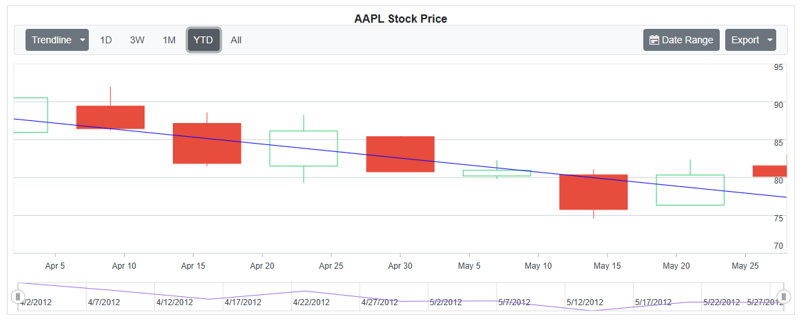
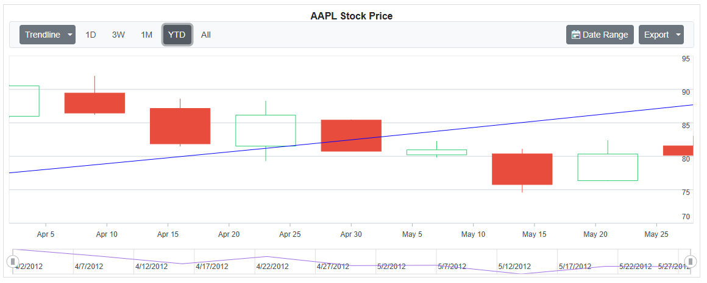
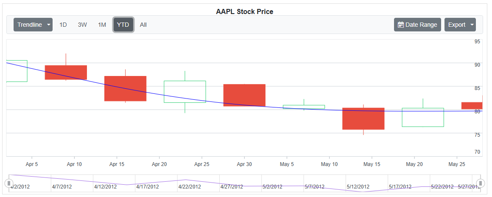
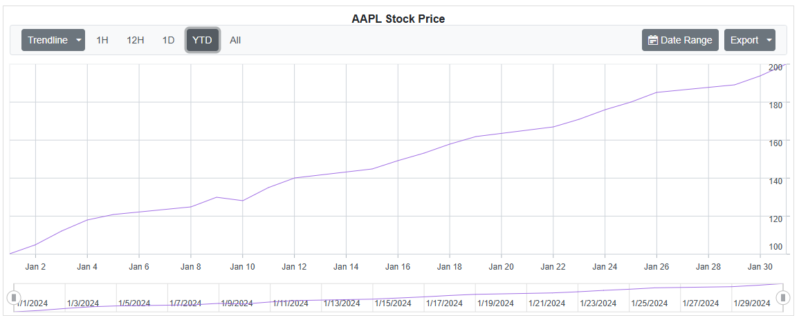
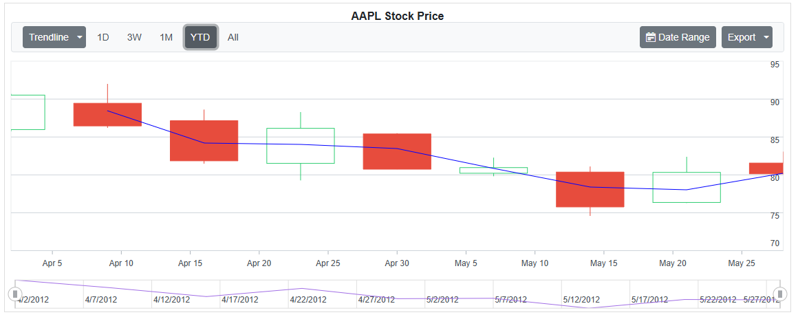
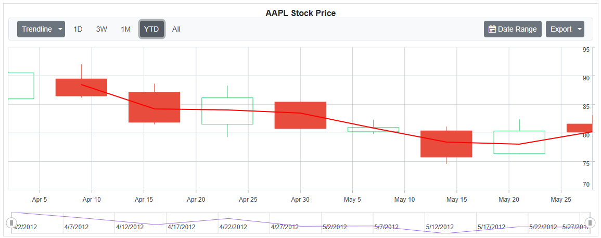

# Blazor Stock Chart Trendlines

Trendlines illustrate the direction and speed of price movement. The Stock Chart supports six trendline types: `Linear`, `Logarithmic`, `Exponential`, `Polynomial`, `Power`, and `Moving Average`. Use the [TrendlineType](https://help.syncfusion.com/cr/blazor/Syncfusion.Blazor.Charts.SfStockChart.html#Syncfusion_Blazor_Charts_SfStockChart_TrendlineType) property to configure the trendline dropdown and add or remove trendline types.

## Linear

A linear trendline is a best-fit straight line used with simpler datasets. To render a linear trendline, set the trendline [Type](https://help.syncfusion.com/cr/blazor/Syncfusion.Blazor.Charts.StockChartTrendline.html#Syncfusion_Blazor_Charts_StockChartTrendline_Type) to `Linear`.

```cshtml

@using Syncfusion.Blazor.Charts

<SfStockChart Title="AAPL Stock Price" TrendlineType="@Trendlines" SeriesType="@SeriesType" IndicatorType="@Indicator" ExportType="@ExportType">
    <StockChartPrimaryXAxis>
        <StockChartAxisMajorGridLines Color="Transparent"></StockChartAxisMajorGridLines>
    </StockChartPrimaryXAxis>
    <StockChartPrimaryYAxis>
        <StockChartAxisLineStyle Color="Transparent"></StockChartAxisLineStyle>
        <StockChartAxisMajorTickLines Color="Transparent" Width="0"></StockChartAxisMajorTickLines>
    </StockChartPrimaryYAxis>
    <StockChartSeriesCollection>
        <StockChartSeries DataSource="@StockDetails" Type="ChartSeriesType.Candle" XName="Date" High="High" Low="Low" Open="Open" Close="Close" Volume="Volume" Name="Google">
            <StockChartTrendlines>
                <StockChartTrendline Type="TrendlineTypes.Linear" EnableTooltip="false"></StockChartTrendline>
            </StockChartTrendlines>
        </StockChartSeries>
    </StockChartSeriesCollection>
</SfStockChart>

@code {
    public List<TechnicalIndicators> Indicator = new List<TechnicalIndicators>();
    public List<ChartSeriesType> SeriesType = new List<ChartSeriesType>();
    public List<ExportType> ExportType = new List<ExportType>();
    public List<TrendlineTypes> Trendlines = new List<TrendlineTypes>()
    {
        TrendlineTypes.Linear,
        TrendlineTypes.Exponential,
        TrendlineTypes.Polynomial,
        TrendlineTypes.Power,
        TrendlineTypes.Logarithmic,
        TrendlineTypes.MovingAverage
    };


    public class StockChartData
    {
        public DateTime Date { get; set; }
        public double Open { get; set; }
        public double Low { get; set; }
        public double Close { get; set; }
        public double High { get; set; }
        public double Volume { get; set; }
    }

    public List<StockChartData> StockDetails = new List<StockChartData>
    {
        new StockChartData { Date = new DateTime(2012, 04, 02), Open = 85.9757, High = 90.6657, Low = 85.7685, Close = 90.5257, Volume = 660187068 },
        new StockChartData { Date = new DateTime(2012, 04, 09), Open = 89.4471, High = 92, Low = 86.2157, Close = 86.4614, Volume = 912634864 },
        new StockChartData { Date = new DateTime(2012, 04, 16), Open = 87.1514, High = 88.6071, Low = 81.4885, Close = 81.8543, Volume = 1221746066 },
        new StockChartData { Date = new DateTime(2012, 04, 23), Open = 81.5157, High = 88.2857, Low = 79.2857, Close = 86.1428, Volume = 965935749 },
        new StockChartData { Date = new DateTime(2012, 04, 30), Open = 85.4, High = 85.4857, Low = 80.7385, Close = 80.75, Volume = 615249365 },
        new StockChartData { Date = new DateTime(2012, 05, 07), Open = 80.2143, High = 82.2685, Low = 79.8185, Close = 80.9585, Volume = 541742692 },
        new StockChartData { Date = new DateTime(2012, 05, 14), Open = 80.3671, High = 81.0728, Low = 74.5971, Close = 75.7685, Volume = 708126233 },
        new StockChartData { Date = new DateTime(2012, 05, 21), Open = 76.3571, High = 82.3571, Low = 76.2928, Close = 80.3271, Volume = 682076215 },
        new StockChartData { Date = new DateTime(2012, 05, 28), Open = 81.5571, High = 83.0714, Low = 80.0743, Close = 80.1414, Volume = 480059584 }
     };
}

```



## Logarithmic

A logarithmic trendline is a best-fit curved line that is most useful when the rate of change in the data increases or decreases quickly and then levels out. A logarithmic trendline can use negative and positive values.

To render a logarithmic trendline, set the trendline [Type](https://help.syncfusion.com/cr/blazor/Syncfusion.Blazor.Charts.StockChartTrendline.html#Syncfusion_Blazor_Charts_StockChartTrendline_Type) to `Logarithmic`.

```cshtml

@using Syncfusion.Blazor.Charts

<SfStockChart Title="AAPL Stock Price" TrendlineType="@Trendlines" SeriesType="@SeriesType" IndicatorType="@Indicator" ExportType="@ExportType">
    <StockChartPrimaryXAxis>
        <StockChartAxisMajorGridLines Color="Transparent"></StockChartAxisMajorGridLines>
    </StockChartPrimaryXAxis>
    <StockChartPrimaryYAxis>
        <StockChartAxisLineStyle Color="Transparent"></StockChartAxisLineStyle>
        <StockChartAxisMajorTickLines Color="Transparent" Width="0"></StockChartAxisMajorTickLines>
    </StockChartPrimaryYAxis>
    <StockChartSeriesCollection>
        <StockChartSeries DataSource="@StockDetails" Type="ChartSeriesType.Candle" XName="Date" High="High" Low="Low" Open="Open" Close="Close" Volume="Volume" Name="Google">
            <StockChartTrendlines>
                <StockChartTrendline Type="TrendlineTypes.Logarithmic" EnableTooltip="false"></StockChartTrendline>
            </StockChartTrendlines>
        </StockChartSeries>
    </StockChartSeriesCollection>
</SfStockChart>

@code {
    public List<TechnicalIndicators> Indicator = new List<TechnicalIndicators>();
    public List<ChartSeriesType> SeriesType = new List<ChartSeriesType>();
    public List<ExportType> ExportType = new List<ExportType>();
    public List<TrendlineTypes> Trendlines = new List<TrendlineTypes>()
    {
        TrendlineTypes.Linear,
        TrendlineTypes.Exponential,
        TrendlineTypes.Polynomial,
        TrendlineTypes.Power,
        TrendlineTypes.Logarithmic,
        TrendlineTypes.MovingAverage
    };

    public class StockChartData
    {
        public DateTime Date { get; set; }
        public double Open { get; set; }
        public double Low { get; set; }
        public double Close { get; set; }
        public double High { get; set; }
        public double Volume { get; set; }
    }

    public List<StockChartData> StockDetails = new List<StockChartData>
    {
        new StockChartData { Date = new DateTime(2012, 04, 02), Open = 85.9757, High = 90.6657, Low = 85.7685, Close = 90.5257, Volume = 660187068 },
        new StockChartData { Date = new DateTime(2012, 04, 09), Open = 89.4471, High = 92, Low = 86.2157, Close = 86.4614, Volume = 912634864 },
        new StockChartData { Date = new DateTime(2012, 04, 16), Open = 87.1514, High = 88.6071, Low = 81.4885, Close = 81.8543, Volume = 1221746066 },
        new StockChartData { Date = new DateTime(2012, 04, 23), Open = 81.5157, High = 88.2857, Low = 79.2857, Close = 86.1428, Volume = 965935749 },
        new StockChartData { Date = new DateTime(2012, 04, 30), Open = 85.4, High = 85.4857, Low = 80.7385, Close = 80.75, Volume = 615249365 },
        new StockChartData { Date = new DateTime(2012, 05, 07), Open = 80.2143, High = 82.2685, Low = 79.8185, Close = 80.9585, Volume = 541742692 },
        new StockChartData { Date = new DateTime(2012, 05, 14), Open = 80.3671, High = 81.0728, Low = 74.5971, Close = 75.7685, Volume = 708126233 },
        new StockChartData { Date = new DateTime(2012, 05, 21), Open = 76.3571, High = 82.3571, Low = 76.2928, Close = 80.3271, Volume = 682076215 },
        new StockChartData { Date = new DateTime(2012, 05, 28), Open = 81.5571, High = 83.0714, Low = 80.0743, Close = 80.1414, Volume = 480059584 }
     };
}

```


## Exponential

An exponential trendline is a curved line that is most useful when data values rise or fall at increasingly higher rates. An exponential trendline cannot be created if the data contains zero or negative values.

To render an exponential trendline, set the trendline [Type](https://help.syncfusion.com/cr/blazor/Syncfusion.Blazor.Charts.StockChartTrendline.html#Syncfusion_Blazor_Charts_StockChartTrendline_Type) to `Exponential`.

```cshtml

@using Syncfusion.Blazor.Charts

<SfStockChart Title="AAPL Stock Price" TrendlineType="@Trendlines" SeriesType="@SeriesType" IndicatorType="@Indicator" ExportType="@ExportType">
    <StockChartPrimaryXAxis>
        <StockChartAxisMajorGridLines Color="Transparent"></StockChartAxisMajorGridLines>
    </StockChartPrimaryXAxis>
    <StockChartPrimaryYAxis>
        <StockChartAxisLineStyle Color="Transparent"></StockChartAxisLineStyle>
        <StockChartAxisMajorTickLines Color="Transparent" Width="0"></StockChartAxisMajorTickLines>
    </StockChartPrimaryYAxis>
    <StockChartSeriesCollection>
        <StockChartSeries DataSource="@StockDetails" Type="ChartSeriesType.Candle" XName="Date" High="High" Low="Low" Open="Open" Close="Close" Volume="Volume" Name="Google">
            <StockChartTrendlines>
                <StockChartTrendline Type="TrendlineTypes.Exponential" EnableTooltip="false"></StockChartTrendline>
            </StockChartTrendlines>
        </StockChartSeries>
    </StockChartSeriesCollection>
</SfStockChart>

@code {
    public List<ChartSeriesType> SeriesType = new List<ChartSeriesType>();
    public List<ExportType> ExportType = new List<ExportType>();
    public List<TechnicalIndicators> Indicator = new List<TechnicalIndicators>();
    public List<TrendlineTypes> Trendlines = new List<TrendlineTypes>()
    {
        TrendlineTypes.Linear,
        TrendlineTypes.Exponential,
        TrendlineTypes.Polynomial,
        TrendlineTypes.Power,
        TrendlineTypes.Logarithmic,
        TrendlineTypes.MovingAverage
    };

    public class StockChartData
    {
        public DateTime Date { get; set; }
        public double Open { get; set; }
        public double Low { get; set; }
        public double Close { get; set; }
        public double High { get; set; }
        public double Volume { get; set; }
    }

    public List<StockChartData> StockDetails = new List<StockChartData>
    {
        new StockChartData { Date = new DateTime(2012, 04, 02), Open = 85.9757, High = 90.6657, Low = 85.7685, Close = 90.5257, Volume = 660187068 },
        new StockChartData { Date = new DateTime(2012, 04, 09), Open = 89.4471, High = 92, Low = 86.2157, Close = 86.4614, Volume = 912634864 },
        new StockChartData { Date = new DateTime(2012, 04, 16), Open = 87.1514, High = 88.6071, Low = 81.4885, Close = 81.8543, Volume = 1221746066 },
        new StockChartData { Date = new DateTime(2012, 04, 23), Open = 81.5157, High = 88.2857, Low = 79.2857, Close = 86.1428, Volume = 965935749 },
        new StockChartData { Date = new DateTime(2012, 04, 30), Open = 85.4, High = 85.4857, Low = 80.7385, Close = 80.75, Volume = 615249365 },
        new StockChartData { Date = new DateTime(2012, 05, 07), Open = 80.2143, High = 82.2685, Low = 79.8185, Close = 80.9585, Volume = 541742692 },
        new StockChartData { Date = new DateTime(2012, 05, 14), Open = 80.3671, High = 81.0728, Low = 74.5971, Close = 75.7685, Volume = 708126233 },
        new StockChartData { Date = new DateTime(2012, 05, 21), Open = 76.3571, High = 82.3571, Low = 76.2928, Close = 80.3271, Volume = 682076215 },
        new StockChartData { Date = new DateTime(2012, 05, 28), Open = 81.5571, High = 83.0714, Low = 80.0743, Close = 80.1414, Volume = 480059584 }
    };
}

```



## Polynomial

A polynomial trendline is a curved line used when data fluctuates. To render a polynomial trendline, set the trendline [Type](https://help.syncfusion.com/cr/blazor/Syncfusion.Blazor.Charts.StockChartTrendline.html#Syncfusion_Blazor_Charts_StockChartTrendline_Type) to `Polynomial`. The [PolynomialOrder](https://help.syncfusion.com/cr/blazor/Syncfusion.Blazor.Charts.StockChartTrendline.html#Syncfusion_Blazor_Charts_StockChartTrendline_PolynomialOrder) property defines the polynomial order.

```cshtml

@using Syncfusion.Blazor.Charts

<SfStockChart Title="AAPL Stock Price" TrendlineType="@Trendlines" SeriesType="@SeriesType" IndicatorType="@Indicator" ExportType="@ExportType">
    <StockChartPrimaryXAxis>
        <StockChartAxisMajorGridLines Color="Transparent"></StockChartAxisMajorGridLines>
    </StockChartPrimaryXAxis>
    <StockChartPrimaryYAxis>
        <StockChartAxisLineStyle Color="Transparent"></StockChartAxisLineStyle>
        <StockChartAxisMajorTickLines Color="Transparent" Width="0"></StockChartAxisMajorTickLines>
    </StockChartPrimaryYAxis>
    <StockChartSeriesCollection>
        <StockChartSeries DataSource="@StockDetails" Type="ChartSeriesType.Candle" XName="Date" High="High" Low="Low" Open="Open" Close="Close" Volume="Volume" Name="Google">
            <StockChartTrendlines>
                <StockChartTrendline Type="TrendlineTypes.Polynomial" EnableTooltip="false"></StockChartTrendline>
            </StockChartTrendlines>
        </StockChartSeries>
    </StockChartSeriesCollection>
</SfStockChart>

@code {
    public List<TechnicalIndicators> Indicator = new List<TechnicalIndicators>();
    public List<ChartSeriesType> SeriesType = new List<ChartSeriesType>();
    public List<ExportType> ExportType = new List<ExportType>();
    public List<TrendlineTypes> Trendlines = new List<TrendlineTypes>()
    {
        TrendlineTypes.Linear,
        TrendlineTypes.Exponential,
        TrendlineTypes.Polynomial,
        TrendlineTypes.Power,
        TrendlineTypes.Logarithmic,
        TrendlineTypes.MovingAverage
    };

    public class StockChartData
    {
        public DateTime Date { get; set; }
        public double Open { get; set; }
        public double Low { get; set; }
        public double Close { get; set; }
        public double High { get; set; }
        public double Volume { get; set; }
    }

    public List<StockChartData> StockDetails = new List<StockChartData>
    {
        new StockChartData { Date = new DateTime(2012, 04, 02), Open = 85.9757, High = 90.6657, Low = 85.7685, Close = 90.5257, Volume = 660187068 },
        new StockChartData { Date = new DateTime(2012, 04, 09), Open = 89.4471, High = 92, Low = 86.2157, Close = 86.4614, Volume = 912634864 },
        new StockChartData { Date = new DateTime(2012, 04, 16), Open = 87.1514, High = 88.6071, Low = 81.4885, Close = 81.8543, Volume = 1221746066 },
        new StockChartData { Date = new DateTime(2012, 04, 23), Open = 81.5157, High = 88.2857, Low = 79.2857, Close = 86.1428, Volume = 965935749 },
        new StockChartData { Date = new DateTime(2012, 04, 30), Open = 85.4, High = 85.4857, Low = 80.7385, Close = 80.75, Volume = 615249365 },
        new StockChartData { Date = new DateTime(2012, 05, 07), Open = 80.2143, High = 82.2685, Low = 79.8185, Close = 80.9585, Volume = 541742692 },
        new StockChartData { Date = new DateTime(2012, 05, 14), Open = 80.3671, High = 81.0728, Low = 74.5971, Close = 75.7685, Volume = 708126233 },
        new StockChartData { Date = new DateTime(2012, 05, 21), Open = 76.3571, High = 82.3571, Low = 76.2928, Close = 80.3271, Volume = 682076215 },
        new StockChartData { Date = new DateTime(2012, 05, 28), Open = 81.5571, High = 83.0714, Low = 80.0743, Close = 80.1414, Volume = 480059584 }
     };
}

```



## Power

A power trendline is a curved line best used with datasets that compare measurements increasing at a specific rate. To render a power trendline, set the trendline [Type](https://help.syncfusion.com/cr/blazor/Syncfusion.Blazor.Charts.StockChartTrendline.html#Syncfusion_Blazor_Charts_StockChartTrendline_Type) to `Power`.

```cshtml

@using Syncfusion.Blazor.Charts

<SfStockChart Title="AAPL Stock Price" TrendlineType="@Trendlines" IndicatorType="@Indicator">
    <StockChartSeriesCollection>
        <StockChartSeries DataSource="@StockDetails" Type="ChartSeriesType.Line" XName="Date" YName="Close">
            <StockChartTrendlines>
                <StockChartTrendline Type="TrendlineTypes.Power"></StockChartTrendline>
            </StockChartTrendlines>
        </StockChartSeries>
    </StockChartSeriesCollection>
</SfStockChart>

@code {
    public List<TechnicalIndicators> Indicator = new List<TechnicalIndicators>();
    public List<TrendlineTypes> Trendlines = new List<TrendlineTypes>()
    {
        TrendlineTypes.Linear,
        TrendlineTypes.Exponential,
        TrendlineTypes.Polynomial,
        TrendlineTypes.Power,
        TrendlineTypes.Logarithmic,
        TrendlineTypes.MovingAverage
    };
    public class ChartData
    {
        public DateTime Date { get; set; }
        public double Close { get; set; }
    }

    public List<ChartData> StockDetails = new()
    {
        new ChartData { Date = new DateTime(2024, 01, 01), Close = 100 },
        new ChartData { Date = new DateTime(2024, 01, 02), Close = 105 },
        new ChartData { Date = new DateTime(2024, 01, 03), Close = 112 },
        new ChartData { Date = new DateTime(2024, 01, 04), Close = 118 },
        new ChartData { Date = new DateTime(2024, 01, 05), Close = 121 },
        new ChartData { Date = new DateTime(2024, 01, 08), Close = 125 },
        new ChartData { Date = new DateTime(2024, 01, 09), Close = 130 },
        new ChartData { Date = new DateTime(2024, 01, 10), Close = 128 },
        new ChartData { Date = new DateTime(2024, 01, 11), Close = 135 },
        new ChartData { Date = new DateTime(2024, 01, 12), Close = 140 },
        new ChartData { Date = new DateTime(2024, 01, 15), Close = 145 },
        new ChartData { Date = new DateTime(2024, 01, 16), Close = 149 },
        new ChartData { Date = new DateTime(2024, 01, 17), Close = 153 },
        new ChartData { Date = new DateTime(2024, 01, 18), Close = 158 },
        new ChartData { Date = new DateTime(2024, 01, 19), Close = 162 },
        new ChartData { Date = new DateTime(2024, 01, 22), Close = 167 },
        new ChartData { Date = new DateTime(2024, 01, 23), Close = 171 },
        new ChartData { Date = new DateTime(2024, 01, 24), Close = 176 },
        new ChartData { Date = new DateTime(2024, 01, 25), Close = 180 },
        new ChartData { Date = new DateTime(2024, 01, 26), Close = 185 },
        new ChartData { Date = new DateTime(2024, 01, 29), Close = 189 },
        new ChartData { Date = new DateTime(2024, 01, 30), Close = 194 },
        new ChartData { Date = new DateTime(2024, 01, 31), Close = 200 }
    };
}

```



## Moving Average

A moving average trendline smooths fluctuations in data to show a pattern or trend more clearly. To render a moving average trendline, set the trendline [Type](https://help.syncfusion.com/cr/blazor/Syncfusion.Blazor.Charts.StockChartTrendline.html#Syncfusion_Blazor_Charts_StockChartTrendline_Type) to `MovingAverage`.

The [Period](https://help.syncfusion.com/cr/blazor/Syncfusion.Blazor.Charts.StockChartTrendline.html#Syncfusion_Blazor_Charts_StockChartTrendline_Period) property defines the period used to calculate the moving average.

```cshtml

@using Syncfusion.Blazor.Charts

<SfStockChart Title="AAPL Stock Price" TrendlineType="@Trendlines" SeriesType="@SeriesType" IndicatorType="@Indicator" ExportType="@ExportType">
    <StockChartPrimaryXAxis>
        <StockChartAxisMajorGridLines Color="Transparent"></StockChartAxisMajorGridLines>
    </StockChartPrimaryXAxis>
    <StockChartPrimaryYAxis>
        <StockChartAxisLineStyle Color="Transparent"></StockChartAxisLineStyle>
        <StockChartAxisMajorTickLines Color="Transparent" Width="0"></StockChartAxisMajorTickLines>
    </StockChartPrimaryYAxis>
    <StockChartSeriesCollection>
        <StockChartSeries DataSource="@StockDetails" Type="ChartSeriesType.Candle" XName="Date" High="High" Low="Low" Open="Open" Close="Close" Volume="Volume" Name="Google">
            <StockChartTrendlines>
                <StockChartTrendline Type="TrendlineTypes.MovingAverage" EnableTooltip="false"></StockChartTrendline>
            </StockChartTrendlines>
        </StockChartSeries>
    </StockChartSeriesCollection>
</SfStockChart>

@code {
    public List<TechnicalIndicators> Indicator = new List<TechnicalIndicators>();
    public List<ChartSeriesType> SeriesType = new List<ChartSeriesType>();
    public List<ExportType> ExportType = new List<ExportType>();
    public List<TrendlineTypes> Trendlines = new List<TrendlineTypes>()
    {
        TrendlineTypes.Linear,
        TrendlineTypes.Exponential,
        TrendlineTypes.Polynomial,
        TrendlineTypes.Power,
        TrendlineTypes.Logarithmic,
        TrendlineTypes.MovingAverage
    };

    public class ChartData
    {
        public DateTime Date { get; set; }
        public double Open { get; set; }
        public double Low { get; set; }
        public double Close { get; set; }
        public double High { get; set; }
        public double Volume { get; set; }
    }

    public List<ChartData> StockDetails = new List<ChartData>
    {
        new ChartData { Date = new DateTime(2012, 04, 02), Open = 85.9757, High = 90.6657, Low = 85.7685, Close = 90.5257, Volume = 660187068 },
        new ChartData { Date = new DateTime(2012, 04, 09), Open = 89.4471, High = 92, Low = 86.2157, Close = 86.4614, Volume = 912634864 },
        new ChartData { Date = new DateTime(2012, 04, 16), Open = 87.1514, High = 88.6071, Low = 81.4885, Close = 81.8543, Volume = 1221746066 },
        new ChartData { Date = new DateTime(2012, 04, 23), Open = 81.5157, High = 88.2857, Low = 79.2857, Close = 86.1428, Volume = 965935749 },
        new ChartData { Date = new DateTime(2012, 04, 30), Open = 85.4, High = 85.4857, Low = 80.7385, Close = 80.75, Volume = 615249365 },
        new ChartData { Date = new DateTime(2012, 05, 07), Open = 80.2143, High = 82.2685, Low = 79.8185, Close = 80.9585, Volume = 541742692 },
        new ChartData { Date = new DateTime(2012, 05, 14), Open = 80.3671, High = 81.0728, Low = 74.5971, Close = 75.7685, Volume = 708126233 },
        new ChartData { Date = new DateTime(2012, 05, 21), Open = 76.3571, High = 82.3571, Low = 76.2928, Close = 80.3271, Volume = 682076215 },
        new ChartData { Date = new DateTime(2012, 05, 28), Open = 81.5571, High = 83.0714, Low = 80.0743, Close = 80.1414, Volume = 480059584 }
   };
}

```



## Trendline Customization

The [Fill](https://help.syncfusion.com/cr/blazor/Syncfusion.Blazor.Charts.StockChartTrendline.html#Syncfusion_Blazor_Charts_StockChartTrendline_Fill) and [Width](https://help.syncfusion.com/cr/blazor/Syncfusion.Blazor.Charts.StockChartTrendline.html#Syncfusion_Blazor_Charts_StockChartTrendline_Width) properties customize the appearance of the trendline. The [EnableTooltip](https://help.syncfusion.com/cr/blazor/Syncfusion.Blazor.Charts.StockChartTrendline.html#Syncfusion_Blazor_Charts_StockChartTrendline_EnableTooltip) property controls whether the trendline tooltip is displayed.

```cshtml

@using Syncfusion.Blazor.Charts

<SfStockChart Title="AAPL Stock Price" TrendlineType="@Trendlines" IndicatorType="@Indicator">
    <StockChartSeriesCollection>
        <StockChartSeries DataSource="@StockDetails" Type="ChartSeriesType.Candle" XName="Date" High="High" Low="Low" Close="Close" Open="Open" Name="Google">
            <StockChartTrendlines>
                <StockChartTrendline Type="TrendlineTypes.MovingAverage" EnableTooltip="false" Fill="red" Width="2"></StockChartTrendline>
            </StockChartTrendlines>
        </StockChartSeries>
    </StockChartSeriesCollection>
</SfStockChart>

@code {
    public List<TechnicalIndicators> Indicator = new List<TechnicalIndicators>();
    public List<TrendlineTypes> Trendlines = new List<TrendlineTypes>()
    {
        TrendlineTypes.Linear,
        TrendlineTypes.Exponential,
        TrendlineTypes.Polynomial,
        TrendlineTypes.Power,
        TrendlineTypes.Logarithmic,
        TrendlineTypes.MovingAverage
    };
    public class ChartData
    {
        public DateTime Date { get; set; }
        public double Open { get; set; }
        public double Low { get; set; }
        public double Close { get; set; }
        public double High { get; set; }
        public double Volume { get; set; }
    }

    public List<ChartData> StockDetails = new List<ChartData>
    {
        new ChartData { Date = new DateTime(2012, 04, 02), Open = 85.9757, High = 90.6657, Low = 85.7685, Close = 90.5257, Volume = 660187068 },
        new ChartData { Date = new DateTime(2012, 04, 09), Open = 89.4471, High = 92, Low = 86.2157, Close = 86.4614, Volume = 912634864 },
        new ChartData { Date = new DateTime(2012, 04, 16), Open = 87.1514, High = 88.6071, Low = 81.4885, Close = 81.8543, Volume = 1221746066 },
        new ChartData { Date = new DateTime(2012, 04, 23), Open = 81.5157, High = 88.2857, Low = 79.2857, Close = 86.1428, Volume = 965935749 },
        new ChartData { Date = new DateTime(2012, 04, 30), Open = 85.4, High = 85.4857, Low = 80.7385, Close = 80.75, Volume = 615249365 },
        new ChartData { Date = new DateTime(2012, 05, 07), Open = 80.2143, High = 82.2685, Low = 79.8185, Close = 80.9585, Volume = 541742692 },
        new ChartData { Date = new DateTime(2012, 05, 14), Open = 80.3671, High = 81.0728, Low = 74.5971, Close = 75.7685, Volume = 708126233 },
        new ChartData { Date = new DateTime(2012, 05, 21), Open = 76.3571, High = 82.3571, Low = 76.2928, Close = 80.3271, Volume = 682076215 },
        new ChartData { Date = new DateTime(2012, 05, 28), Open = 81.5571, High = 83.0714, Low = 80.0743, Close = 80.1414, Volume = 480059584 }
   };
}

```



## See also

* [Technical Indicators](./technical-indicators)
* [Series Types](./series-types)
