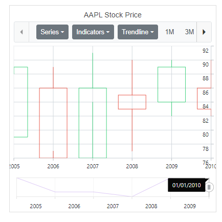
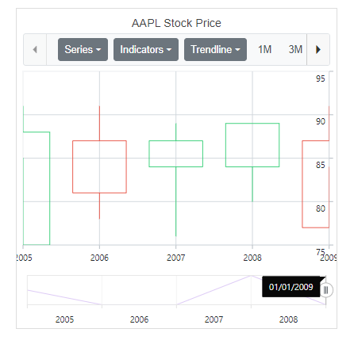
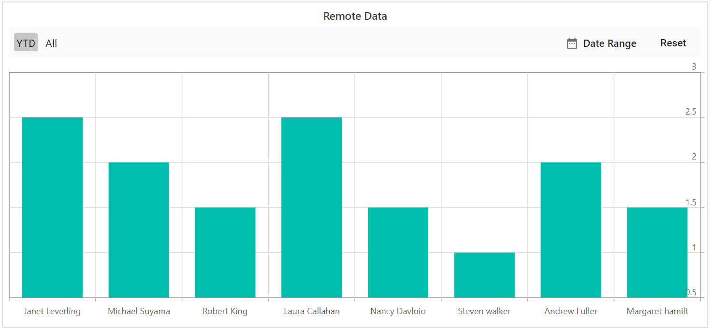
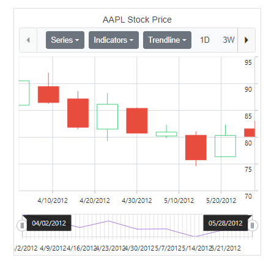
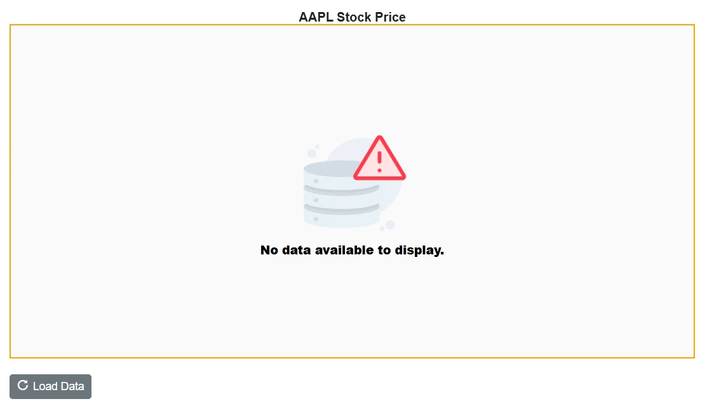

<!-- markdownlint-disable MD036 -->

# Working with Data in Blazor Stock Chart Component

The Stock Chart uses [SfDataManager](https://help.syncfusion.com/cr/blazor/Syncfusion.Blazor.Data.SfDataManager.html), which supports both RESTful JSON data services binding and IEnumerable binding. The [DataSource](https://help.syncfusion.com/cr/blazor/Syncfusion.Blazor.Charts.ChartSeries.html#Syncfusion_Blazor_Charts_ChartSeries_DataSource) value can be set using either [SfDataManager](https://help.syncfusion.com/cr/blazor/Syncfusion.Blazor.Data.SfDataManager.html) property value or a list of business objects.

It supports the following data binding methods:
* List binding
* Remote data

## List binding

To do list binding to the stock chart, an IEnumerable object can be assigned to the [DataSource](https://help.syncfusion.com/cr/blazor/Syncfusion.Blazor.Charts.ChartSeries.html#Syncfusion_Blazor_Charts_ChartSeries_DataSource) property. The list data source can also be provided as an instance of the [SfDataManager](https://help.syncfusion.com/cr/blazor/Syncfusion.Blazor.DataManager.html) or by using SfDataManager component. Now map the fields in list to
[XName](https://help.syncfusion.com/cr/blazor/Syncfusion.Blazor.Charts.StockChartSeries.html#Syncfusion_Blazor_Charts_StockChartSeries_XName), [High](https://help.syncfusion.com/cr/blazor/Syncfusion.Blazor.Charts.StockChartSeries.html#Syncfusion_Blazor_Charts_StockChartSeries_High), [Low](https://help.syncfusion.com/cr/blazor/Syncfusion.Blazor.Charts.StockChartSeries.html#Syncfusion_Blazor_Charts_StockChartSeries_Low), [Open](https://help.syncfusion.com/cr/blazor/Syncfusion.Blazor.Charts.StockChartSeries.html#Syncfusion_Blazor_Charts_StockChartSeries_Open) and [Close](https://help.syncfusion.com/cr/blazor/Syncfusion.Blazor.Charts.StockChartSeries.html#Syncfusion_Blazor_Charts_StockChartSeries_Close)
properties.

```cshtml

@using Syncfusion.Blazor.Charts

<SfStockChart Title="AAPL Stock Price">
    <StockChartSeriesCollection>
        <StockChartSeries DataSource="@StockDetails" Type="ChartSeriesType.Candle" XName="Date" High="High" Low="Low" Open="Open" Close="Close" Volume="Volume" Name="Google"></StockChartSeries>
    </StockChartSeriesCollection>
</SfStockChart>

@code {

    public class ChartData
    {
        public DateTime Date {get; set;}
        public Double Open {get; set;}
        public Double Low {get; set;}
        public Double Close {get; set;}
        public Double High {get; set;}
        public Double Volume{get; set;}
    }

    public List<ChartData> StockDetails = new List<ChartData>
    {
         new ChartData { Date = new DateTime(2012, 04, 02), Open= 85.9757, High = 90.6657,Low = 85.7685, Close = 90.5257,Volume = 660187068},
         new ChartData { Date = new DateTime(2012, 04, 09), Open= 89.4471, High = 92,Low = 86.2157, Close = 86.4614,Volume = 912634864},
         new ChartData { Date = new DateTime(2012, 04, 16), Open= 87.1514, High = 88.6071,Low = 81.4885, Close = 81.8543,Volume = 1221746066},
         new ChartData { Date = new DateTime(2012, 04, 23), Open= 81.5157, High = 88.2857,Low = 79.2857, Close = 86.1428,Volume = 965935749},
         new ChartData { Date = new DateTime(2012, 04, 30), Open= 85.4, High =  85.4857,Low = 80.7385, Close = 80.75,Volume = 615249365},
         new ChartData { Date = new DateTime(2012, 05, 07), Open= 80.2143, High = 82.2685,Low = 79.8185, Close = 80.9585,Volume = 541742692},
         new ChartData { Date = new DateTime(2012, 05, 14), Open= 80.3671, High = 81.0728,Low = 74.5971, Close = 75.7685,Volume = 708126233},
         new ChartData { Date = new DateTime(2012, 05, 21), Open= 76.3571, High = 82.3571,Low = 76.2928, Close = 80.3271,Volume = 682076215},
         new ChartData { Date = new DateTime(2012, 05, 28), Open= 81.5571, High = 83.0714,Low = 80.0743, Close = 80.1414,Volume = 480059584}
   };
}

```


N> By default, [SfDataManager](https://help.syncfusion.com/cr/blazor/Syncfusion.Blazor.Data.SfDataManager.html) uses **BlazorAdaptor** for list data-binding.

### ExpandoObject binding

Stock Chart is a generic component which is strongly bound to a model type. There are cases when the model type is unknown during compile time. In such circumstances data can be bound to the Stock chart as a list of **ExpandoObject**. The **ExpandoObject** can be bound to Stock chart by assigning to the [DataSource](https://help.syncfusion.com/cr/blazor/Syncfusion.Blazor.Charts.ChartSeries.html#Syncfusion_Blazor_Charts_ChartSeries_DataSource) property.

```cshtml
@using Syncfusion.Blazor.Charts
@using System.Dynamic

<SfStockChart Title="AAPL Stock Price">
    <StockChartSeriesCollection>
        <StockChartSeries DataSource="@StockInfo" Type="ChartSeriesType.Candle" XName="X" High="High" Low="Low" Open="Open" Close="Close" Volume="Volume" Name="Google"></StockChartSeries>
    </StockChartSeriesCollection>
</SfStockChart>

@code{
    private List<DateTime> Dates = new List<DateTime> { new DateTime(2005, 01, 01), new DateTime(2006, 01, 01), 
        new DateTime(2007, 01, 01), new DateTime(2008, 01, 01), new DateTime(2009, 01, 01), new DateTime(2010, 01, 01), new DateTime(2011, 01, 01) };
    public DateTime[] Value = new DateTime[] { new DateTime(2006, 01, 01), new DateTime(2008, 01, 01) };
    public List<ExpandoObject> StockInfo { get; set; } = new List<ExpandoObject>();
    private Random randomNum = new Random();
    protected override void OnInitialized()
    {
        StockInfo = Enumerable.Range(0, 6).Select((x) =>
        {
            dynamic d = new ExpandoObject();
            d.X = Dates[x];
            d.Open = randomNum.Next(75, 85);
            d.High = randomNum.Next(88, 92);
            d.Low = randomNum.Next(76, 86);
            d.Close = randomNum.Next(85, 90);
            d.Volume = randomNum.Next(660187068, 965935749);
            return d;
        }).Cast<ExpandoObject>().ToList<ExpandoObject>();
    }
}
```



### DynamicObject binding

Stock Chart supports **DynamicObject** data source when the model type is unknown. The **DynamicObject** can be bound to Stock chart by assigning to the [DataSource](https://help.syncfusion.com/cr/blazor/Syncfusion.Blazor.Charts.ChartSeries.html#Syncfusion_Blazor_Charts_ChartSeries_DataSource) property.

```cshtml

@using Syncfusion.Blazor.Charts
@using System.Dynamic

<SfStockChart Title="AAPL Stock Price">
    <StockChartSeriesCollection>
        <StockChartSeries DataSource="@MedalDetails" Type="ChartSeriesType.Candle" XName="X" High="High" Low="Low" Open="Open" Close="Close" Volume="Volume" Name="Google"></StockChartSeries>
    </StockChartSeriesCollection>
</SfStockChart>

@code{
    private List<DateTime> Dates = new List<DateTime> { new DateTime(2005, 01, 01), new DateTime(2006, 01, 01), 
        new DateTime(2007, 01, 01), new DateTime(2008, 01, 01), new DateTime(2009, 01, 01), new DateTime(2010, 01, 01), new DateTime(2011, 01, 01) };
    public DateTime[] Value = new DateTime[] { new DateTime(2006, 01, 01), new DateTime(2008, 01, 01) };
    private Random randomNum = new Random();
    public List<DynamicDictionary> MedalDetails = new List<DynamicDictionary>() { };
    protected override void OnInitialized()
    {
        MedalDetails = Enumerable.Range(0, 5).Select((x) =>
        {
            dynamic d = new DynamicDictionary();
            d.X = Dates[x];
            d.Open = randomNum.Next(75, 85);
            d.High = randomNum.Next(88, 92);
            d.Low = randomNum.Next(76, 86);
            d.Close = randomNum.Next(85, 90);
            d.Volume = randomNum.Next(660187068, 965935749);
            return d;
        }).Cast<DynamicDictionary>().ToList<DynamicDictionary>();
    }
    public class DynamicDictionary : DynamicObject
    {
        Dictionary<string, object> dictionary = new Dictionary<string, object>();

        public override bool TryGetMember(GetMemberBinder binder, out object result)
        {
            string name = binder.Name;
            return dictionary.TryGetValue(name, out result);
        }
        public override bool TrySetMember(SetMemberBinder binder, object value)
        {
            dictionary[binder.Name] = value;
            return true;
        }

        public override System.Collections.Generic.IEnumerable<string> GetDynamicMemberNames()
        {
            return this.dictionary?.Keys;
        }
    }
}
```



## Remote Data

### Binding with OData services

[OData](https://www.odata.org/documentation/odata-version-3-0/) is a standardized protocol for creating and consuming data. You can retrieve data from OData service using the [SfDataManager](https://help.syncfusion.com/cr/blazor/Syncfusion.Blazor.Data.SfDataManager.html). Refer to the following code example for remote data binding using OData service.

```cshtml

@using Syncfusion.Blazor.Charts
@using Syncfusion.Blazor.Data

<SfStockChart Title="Remote Data" EnableSelector="false" TrendlineType="@TrendlineType" IndicatorType="@Indicator" SeriesType="@SeriesType" ExportType="@ExportType">
    <SfDataManager Url="https://mvc.syncfusion.com/Services/Northwnd.svc/Tasks/" CrossDomain="true" Adaptor="Adaptors.ODataAdaptor"></SfDataManager>
    <StockChartPrimaryXAxis ValueType="Syncfusion.Blazor.Charts.ValueType.Category"></StockChartPrimaryXAxis>
    <StockChartPrimaryYAxis Maximum="3"></StockChartPrimaryYAxis>
    <StockChartSeriesCollection>
        <StockChartSeries XName="Assignee" YName="Estimate" Query="new ej.data.Query().take(10).where('Estimate', 'lessThan', 3, false)" Type="ChartSeriesType.Column">
        </StockChartSeries>
    </StockChartSeriesCollection>
</SfStockChart>

@code {
    public List<TrendlineTypes> TrendlineType = new List<TrendlineTypes>();
    public List<TechnicalIndicators> Indicator = new List<TechnicalIndicators>();
    public List<ChartSeriesType> SeriesType = new List<ChartSeriesType>();
    public List<ExportType> ExportType = new List<ExportType>();
}

```



### Binding with OData v4 services

The [SfDataManager](https://help.syncfusion.com/cr/blazor/Syncfusion.Blazor.Data.SfDataManager.html) can retrieve and consume OData v4 services, which is an upgraded version of OData protocols. Refer to the  [OData documentation](http://docs.oasis-open.org/odata/odata/v4.0/errata03/os/complete/part1-protocol/odata-v4.0-errata03-os-part1-protocol-complete.html#_Toc453752197) for additional information on OData v4 services. To bind an OData v4 service, use the **ODataV4Adaptor**.

```cshtml

@using Syncfusion.Blazor.Charts
@using Syncfusion.Blazor.Data

<SfStockChart Title="Remote Data" EnableSelector="false" TrendlineType="@TrendlineType" IndicatorType="@Indicator" SeriesType="@SeriesType" ExportType="@ExportType">
    <SfDataManager Url="https://mvc.syncfusion.com/Services/Northwnd.svc/Tasks/" CrossDomain="true" Adaptor="Adaptors.ODataV4Adaptor"></SfDataManager>
    <StockChartPrimaryXAxis ValueType="Syncfusion.Blazor.Charts.ValueType.Category"></StockChartPrimaryXAxis>
    <StockChartPrimaryYAxis Maximum="3"></StockChartPrimaryYAxis>
    <StockChartSeriesCollection>
        <StockChartSeries XName="Assignee" YName="Estimate" Query="new ej.data.Query().take(10).where('Estimate', 'lessThan', 3, false)" Type="ChartSeriesType.Column">
        </StockChartSeries>
    </StockChartSeriesCollection>
</SfStockChart>

@code {
    public List<TrendlineTypes> TrendlineType = new List<TrendlineTypes>();
    public List<TechnicalIndicators> Indicator = new List<TechnicalIndicators>();
    public List<ChartSeriesType> SeriesType = new List<ChartSeriesType>();
    public List<ExportType> ExportType = new List<ExportType>();
}

```


### Web API

The [WebApiAdaptor](https://help.syncfusion.com/cr/blazor/Syncfusion.Blazor.Data.WebApiAdaptor.html) can be used to bind a Stock chart to a Web API created using an [OData](https://www.odata.org/documentation/odata-version-3-0/) endpoint.

```cshtml
@using Syncfusion.Blazor.Charts
@using Syncfusion.Blazor.Data

<SfStockChart Title="Remote Data" EnableSelector="false" TrendlineType="@TrendlineType" IndicatorType="@Indicator" SeriesType="@SeriesType" ExportType="@ExportType">
    <SfDataManager Url="https://mvc.syncfusion.com/Services/Northwnd.svc/Tasks/" CrossDomain="true" Adaptor="Adaptors.WebAPIAdaptor"></SfDataManager>
    <StockChartPrimaryXAxis ValueType="Syncfusion.Blazor.Charts.ValueType.Category"></StockChartPrimaryXAxis>
    <StockChartPrimaryYAxis Maximum="3"></StockChartPrimaryYAxis>
    <StockChartSeriesCollection>
        <StockChartSeries XName="Assignee" YName="Estimate" Query="new ej.data.Query().take(10).where('Estimate', 'lessThan', 3, false)" Type="ChartSeriesType.Column">
        </StockChartSeries>
    </StockChartSeriesCollection>
</SfStockChart>

@code {
    public List<TrendlineTypes> TrendlineType = new List<TrendlineTypes>();
    public List<TechnicalIndicators> Indicator = new List<TechnicalIndicators>();
    public List<ChartSeriesType> SeriesType = new List<ChartSeriesType>();
    public List<ExportType> ExportType = new List<ExportType>();
}

```


## Observable collection

The [ObservableCollection](https://learn.microsoft.com/en-us/dotnet/api/system.collections.objectmodel.observablecollection-1?view=net-6.0) (dynamic data collection) provides notifications when items are added, removed, and moved. The implemented [INotifyCollectionChanged](https://learn.microsoft.com/en-us/dotnet/api/system.collections.specialized.inotifycollectionchanged?view=net-6.0) provides notification when the dynamic changes of adding, removing, moving, and clearing the collection occur.

```cshtml

@using Syncfusion.Blazor.Charts
@using System.Collections.ObjectModel;

<SfStockChart Title="AAPL Stock Price">
    <StockChartSeriesCollection>
        <StockChartSeries DataSource="@ChartPoints" Type="ChartSeriesType.Candle" XName="Date" High="High" Low="Low" Open="Open" Close="Close" Volume="Volume" Name="Google"></StockChartSeries>
    </StockChartSeriesCollection>
</SfStockChart>

@code {
    public ObservableCollection<ChartData> ChartPoints { get; set; }

    public DateTime[] Value = new DateTime[] { new DateTime(2006, 01, 01), new DateTime(2008, 01, 01) };

    public class ChartData
    {
        public DateTime Date { get; set; }
        public double High { get; set; }
        public double Low { get; set; }
        public double Volume { get; set; }
        public double Close { get; set; }
        public double Open { get; set; }
        public static ObservableCollection<ChartData> GetData()
        {
            ObservableCollection<ChartData> ChartPoints = new ObservableCollection<ChartData>()
            {
                new ChartData { Date = new DateTime(2012, 04, 02), Open= 85.9757, High = 90.6657,Low = 85.7685, Close = 90.5257,Volume = 660187068},
                new ChartData { Date = new DateTime(2012, 04, 09), Open= 89.4471, High = 92,Low = 86.2157, Close = 86.4614,Volume = 912634864},
                new ChartData { Date = new DateTime(2012, 04, 16), Open= 87.1514, High = 88.6071,Low = 81.4885, Close = 81.8543,Volume = 1221746066},
                new ChartData { Date = new DateTime(2012, 04, 23), Open= 81.5157, High = 88.2857,Low = 79.2857, Close = 86.1428,Volume = 965935749},
                new ChartData { Date = new DateTime(2012, 04, 30), Open= 85.4, High =  85.4857,Low = 80.7385, Close = 80.75,Volume = 615249365},
                new ChartData { Date = new DateTime(2012, 05, 07), Open= 80.2143, High = 82.2685,Low = 79.8185, Close = 80.9585,Volume = 541742692},
                new ChartData { Date = new DateTime(2012, 05, 14), Open= 80.3671, High = 81.0728,Low = 74.5971, Close = 75.7685,Volume = 708126233},
                new ChartData { Date = new DateTime(2012, 05, 21), Open= 76.3571, High = 82.3571,Low = 76.2928, Close = 80.3271,Volume = 682076215},
                new ChartData { Date = new DateTime(2012, 05, 28), Open= 81.5571, High = 83.0714,Low = 80.0743, Close = 80.1414,Volume = 480059584}
            };
            return ChartPoints;
        }
    }

    protected override void OnInitialized()
    {
        this.ChartPoints = ChartData.GetData();
    }
}
```



## Entity Framework

Entity Framework acts as a modern object-database mapper for .NET. This section explains how to consume data from the **Microsoft SQL Server** database and bind it to the chart component.

### Create DBContext class

The first step is to create a DBContext class called **OrderContext** for establishing connection to a Microsoft SQL Server database.

```csharp
using System;
using System.Collections.Generic;
using System.Linq;
using System.Threading.Tasks;
using Microsoft.EntityFrameworkCore;
using System.ComponentModel.DataAnnotations;
using EFChart.Data;

namespace EFChart.Data
{
    public class OrderContext : DbContext
    {
        public virtual DbSet<Order> Orders { get; set; }

        protected override void OnConfiguring(DbContextOptionsBuilder optionsBuilder)
        {
            if (!optionsBuilder.IsConfigured)
            {
                // Configures the context to connect to a Microsoft SQL Serve database
                optionsBuilder.UseSqlServer(@"Data Source=(LocalDB)\MSSQLLocalDB;AttachDbFilename='D:\blazor\EFTreeMap\App_Data\NORTHWND.MDF';Integrated Security=True;Connect Timeout=30");
            }
        }
    }

    public class Order
    {
        [Key]
        public int? OrderID { get; set; }
        [Required]
        public string CustomerID { get; set; }
        [Required]
        public int EmployeeID { get; set; }
    }
}

```

### Create data access layer to perform data operation

Now, create a class called **OrderDataAccessLayer**, which acts as a data access layer to retrieve the records from the database table.

```csharp
using Microsoft.EntityFrameworkCore;
using System;
using System.Collections.Generic;
using System.Linq;
using System.Threading.Tasks;
using static BlazorApp1.Data.OrderContext;
using EFChart.Data;

namespace EFChart.Data
{
    public class OrderDataAccessLayer
    {
        OrderContext db = new OrderContext();

        //To Get all Orders details
        public DbSet<Order> GetAllOrders()
        {
            try
            {
                return db.Orders;
            }
            catch
            {
                throw;
            }
        }
    }
}

```

### Creating Web API Controller

A Web API Controller must be created which allows the chart to directly consume data from the Entity Framework.

```csharp
using System;
using System.Collections;
using System.Collections.Generic;
using System.Linq;
using System.Threading.Tasks;
using Microsoft.AspNetCore.Http;
using Microsoft.AspNetCore.Mvc;
using Microsoft.Extensions.Primitives;
using static BlazorApp1.Data.OrderContext;
using EFChart.Data;

namespace EFChart.Controller
{
    [Route("api/[controller]")]
    [ApiController]
    public class DefaultController : ControllerBase
    {
        OrderDataAccessLayer db = new OrderDataAccessLayer();
        [HttpGet]
        public object Get()
        {
            IQueryable<Order> data = db.GetAllOrders().AsQueryable();
            var count = data.Count();
            var queryString = Request.Query;
            if (queryString.Keys.Contains("$inlinecount"))
            {
                StringValues Skip;
                StringValues Take;
                int skip = (queryString.TryGetValue("$skip", out Skip)) ? Convert.ToInt32(Skip[0]) : 0;
                int top = (queryString.TryGetValue("$top", out Take)) ? Convert.ToInt32(Take[0]) : data.Count();
                return new { Items = data.Skip(skip).Take(top), Count = count };
            }
            else
            {
                return data;
            }
        }
    }
}

```

### Add Web API Controller services in Startup.cs

Open the **Startup.cs** file and add services and endpoints required for Web API Controller as follows.

```csharp
using EFChart.Data;
using Newtonsoft.Json.Serialization;

namespace BlazorApplication
{
    public class Startup
    {
        ....
        ....
        public void ConfigureServices(IServiceCollection services)
        {
            ....
            ....
            services.AddSingleton<OrderDataAccessLayer>();

            // Adds services for controllers to the specified Microsoft.Extensions.DependencyInjection.IServiceCollection.
            services.AddControllers().AddNewtonsoftJson(options =>
            {
                options.SerializerSettings.ContractResolver = new DefaultContractResolver();
            });
        }

        public void Configure(IApplicationBuilder app, IWebHostEnvironment env)
        {
            ....
            ....
            app.UseEndpoints(endpoints =>
            {
                // Adds endpoints for controller actions to the Microsoft.AspNetCore.Routing.IEndpointRouteBuilder
                endpoints.MapDefaultControllerRoute();
                .....
                .....
            });
        }
    }
}
```

### Configure chart component

Configure the chart to bind data using either [DataSource](https://help.syncfusion.com/cr/blazor/Syncfusion.Blazor.Charts.SfChart.html#Syncfusion_Blazor_Charts_SfChart_DataSource) property or [SfDataManager](https://help.syncfusion.com/cr/blazor/Syncfusion.Blazor.DataManager.html).

For instance, to bind data directly from the data access layer class **OrderDataAccessLayer**, assign the [DataSource](https://help.syncfusion.com/cr/blazor/Syncfusion.Blazor.Charts.SfChart.html#Syncfusion_Blazor_Charts_SfChart_DataSource) property to be **OrderData.GetAllOrders()**.

```cshtml

@using EFChart.Data;
@inject OrderDataAccessLayer OrderData;

@using Syncfusion.Blazor.Charts

<SfStockChart EnableSelector="false"  DataSource="@OrderData.GetAllOrders()">
    <StockChartPrimaryXAxis ValueType="Syncfusion.Blazor.Charts.ValueType.Category"></StockChartPrimaryXAxis>
    <StockChartSeriesCollection>
        <StockChartSeries Type="ChartSeriesType.Column" XName="CustomerID" YName="OrderID"></StockChartSeries>
    </StockChartSeriesCollection>
</SfStockChart>
@code{

}
```

On the other hand, to configure the chart using Web API, provide the appropriate endpoint Url within [SfDataManager](https://help.syncfusion.com/cr/blazor/Syncfusion.Blazor.DataManager.html) along with [Adaptor](https://blazor.syncfusion.com/documentation/data/adaptors). Here, use [WebApiAdaptor](https://blazor.syncfusion.com/documentation/data/adaptors?no-cache=1#web-api-adaptor) in-order to interact with the Web API to consume data from the Entity Framework appropriately.

```cshtml
@using Syncfusion.Blazor.Charts
@using Syncfusion.Blazor.Data

<div class="control-section">
    <div>
        <SfStockChart EnableSelector="false">
        <SfDataManager Url="api/Default" Adaptor="Syncfusion.Blazor.Adaptors.WebApiAdaptor">
        </SfDataManager>
        <StockChartPrimaryXAxis ValueType="Syncfusion.Blazor.Charts.ValueType.Category"></StockChartPrimaryXAxis>
        <StockChartSeriesCollection>
            <StockChartSeries Type="ChartSeriesType.Column" XName="CustomerID" YName="OrderID"></StockChartSeries>
        </StockChartSeriesCollection>
    </SfStockChart>
    </div>
</div>
@code{

}
```

## No Data Template in Blazor Stock Chart Component 

When there is no data available to render in the chart, the `NoDataTemplate` property allows you to display a custom layout within the chart area. This layout can include a message indicating the absence of data, a relevant image, or a button to initiate data loading. You can incorporate styled text, images, or interactive elements to maintain design consistency and enhance user guidance.

Once data becomes available, the chart automatically updates to display the appropriate visualization.

```cshtml
@using Syncfusion.Blazor.Charts
@using Syncfusion.Blazor.Buttons

<SfStockChart @ref="stockChart" Title="AAPL Stock Price">
    <NoDataTemplate>
        <div class="noDataTemplateContainerStyle" style="border: 2px solid orange; display: row-flex; align-items: center; justify-content: center; align-content: center; white-space: normal; text-align: center; width: inherit; height: inherit; font-weight: bolder; font-size: medium;">
            <div></div>
            <div style="font-size:15px;"><strong>No data available to display.</strong></div>
        </div>
    </NoDataTemplate>
    <ChildContent>
        <StockChartChartBorder Width="0"></StockChartChartBorder>
        <StockChartSeriesCollection>
            <StockChartSeries DataSource="@Visible" Type="ChartSeriesType.Candle" XName="Date" High="High" Low="Low" Open="Open" Close="Close" Volume="Volume"/>
        </StockChartSeriesCollection>
        <StockChartLegendSettings Visible="true"></StockChartLegendSettings>
    </ChildContent>
</SfStockChart>

<style>
    .noDataTemplateContainerStyle {
        background-color: #fafafa;
        color: #000000;
    }
</style>

<div style="margin-top: 20px;">
    <SfButton IconCss="e-icons e-refresh" OnClick="LoadData">Load Data</SfButton>
</div>

@code {
    private SfStockChart stockChart;

    private bool HasData { get; set; }
    public class ChartData
    {
        public DateTime Date { get; set; }
        public double Open { get; set; }
        public double Low { get; set; }
        public double Close { get; set; }
        public double High { get; set; }
        public double Volume { get; set; }
    }

    public List<ChartData> StockDetails = new()
    {
        new ChartData { Date = new DateTime(2012, 04, 02), Open = 85.9757, High = 90.6657, Low = 85.7685, Close = 90.5257, Volume = 660187068 },
        new ChartData { Date = new DateTime(2012, 04, 09), Open = 89.4471, High = 92, Low = 86.2157, Close = 86.4614, Volume = 912634864 },
        new ChartData { Date = new DateTime(2012, 04, 16), Open = 87.1514, High = 88.6071, Low = 81.4885, Close = 81.8543, Volume = 1221746066 },
        new ChartData { Date = new DateTime(2012, 04, 23), Open = 81.5157, High = 88.2857, Low = 79.2857, Close = 86.1428, Volume = 965935749 },
        new ChartData { Date = new DateTime(2012, 04, 30), Open = 85.4, High =  85.4857, Low = 80.7385, Close = 80.75, Volume = 615249365 },
        new ChartData { Date = new DateTime(2012, 05, 07), Open = 80.2143, High = 82.2685, Low = 79.8185, Close = 80.9585, Volume = 541742692 },
        new ChartData { Date = new DateTime(2012, 05, 14), Open = 80.3671, High = 81.0728, Low = 74.5971, Close = 75.7685, Volume = 708126233 },
        new ChartData { Date = new DateTime(2012, 05, 21), Open = 76.3571, High = 82.3571, Low = 76.2928, Close = 80.3271, Volume = 682076215 },
        new ChartData { Date = new DateTime(2012, 05, 28), Open = 81.5571, High = 83.0714, Low = 80.0743, Close = 80.1414, Volume = 480059584 }
    };

    private void LoadData()
    {
        ShowData = true;
        stockChart.UpdateStockChart();
    }

    private bool ShowData = false;
    private IEnumerable<ChartData> Visible => ShowData ? StockDetails : new List<ChartData>();
}

```



## See Also

* [Series Types](./series-types)