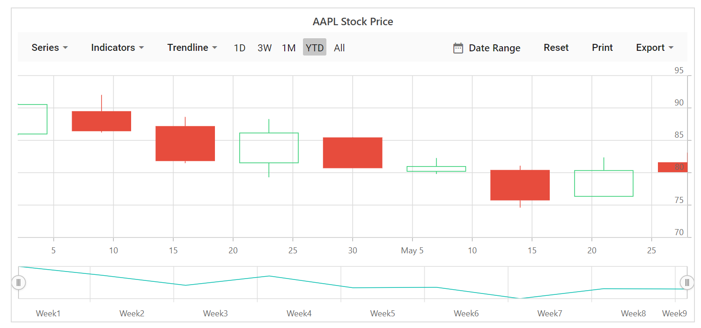

<!-- markdownlint-disable MD036 -->

# Working with Data

Stock Chart can visualise data bound from local or remote data.

## Local Data

To bind list binding to the stock chart, you can assign a IEnumerable object to the [`DataSource`](https://help.syncfusion.com/cr/blazor/Syncfusion.Blazor.Charts.ChartSeries.html#Syncfusion_Blazor_Charts_ChartSeries_DataSource) property. The list data source can also be provided as an instance of the [`SfDataManager`](https://help.syncfusion.com/cr/blazor/Syncfusion.Blazor.DataManager.html) or by using SfDataManager component. Now map the fields in list to
[`XName`](https://help.syncfusion.com/cr/blazor/Syncfusion.Blazor.Charts.StockChartSeries.html#Syncfusion_Blazor_Charts_StockChartSeries_XName), [`High`](https://help.syncfusion.com/cr/blazor/Syncfusion.Blazor.Charts.StockChartSeries.html#Syncfusion_Blazor_Charts_StockChartSeries_High), [`Low`](https://help.syncfusion.com/cr/blazor/Syncfusion.Blazor.Charts.StockChartSeries.html#Syncfusion_Blazor_Charts_StockChartSeries_Low), [`Open`](https://help.syncfusion.com/cr/blazor/Syncfusion.Blazor.Charts.StockChartSeries.html#Syncfusion_Blazor_Charts_StockChartSeries_Open) and [`Close`](https://help.syncfusion.com/cr/blazor/Syncfusion.Blazor.Charts.StockChartSeries.html#Syncfusion_Blazor_Charts_StockChartSeries_Close)
properties.







## Remote Data

To bind remote data to stock chart component, assign service data as an instance of `SfDataManager` to the `DataSource` property or by using EjsDataManager component. To interact with remote data source, provide the endpoint `Url`.






## Entity Framework

Entity Framework acts as a modern object-database mapper for .NET. This section explains how to consume data from the **Microsoft SQL Server** database and bind it to the chart component.

### Create DBContext class

The first step is to create a DBContext class called **OrderContext** for establishing connection to a Microsoft SQL Server database.

```csharp
    using System;
    using System.Collections.Generic;
    using System.Linq;
    using System.Threading.Tasks;
    using Microsoft.EntityFrameworkCore;
    using System.ComponentModel.DataAnnotations;
    using EFChart.Data;

    namespace EFChart.Data
    {
        public class OrderContext : DbContext
        {
            public virtual DbSet<Order> Orders { get; set; }

            protected override void OnConfiguring(DbContextOptionsBuilder optionsBuilder)
            {
                if (!optionsBuilder.IsConfigured)
                {
                    // Configures the context to connect to a Microsoft SQL Serve database
                    optionsBuilder.UseSqlServer(@"Data Source=(LocalDB)\MSSQLLocalDB;AttachDbFilename='D:\blazor\EFTreeMap\App_Data\NORTHWND.MDF';Integrated Security=True;Connect Timeout=30");
                }
            }
        }

        public class Order
        {
            [Key]
            public int? OrderID { get; set; }
            [Required]
            public string CustomerID { get; set; }
            [Required]
            public int EmployeeID { get; set; }
        }
    }

```

### Create data access layer to perform data operation

Now need to create a class called **OrderDataAccessLayer**, which acts as a data access layer to retrieve the records from the database table.

```csharp
    using Microsoft.EntityFrameworkCore;
    using System;
    using System.Collections.Generic;
    using System.Linq;
    using System.Threading.Tasks;
    using static BlazorApp1.Data.OrderContext;
    using EFChart.Data;

    namespace EFChart.Data
    {
        public class OrderDataAccessLayer
        {
            OrderContext db = new OrderContext();

            //To Get all Orders details
            public DbSet<Order> GetAllOrders()
            {
                try
                {
                    return db.Orders;
                }
                catch
                {
                    throw;
                }
            }
        }
    }

```

### Creating Web API Controller

A Web API Controller must be created which allows the chart to directly consume data from the Entity framework.

```csharp
    using System;
    using System.Collections;
    using System.Collections.Generic;
    using System.Linq;
    using System.Threading.Tasks;
    using Microsoft.AspNetCore.Http;
    using Microsoft.AspNetCore.Mvc;
    using Microsoft.Extensions.Primitives;
    using static BlazorApp1.Data.OrderContext;
    using EFChart.Data;

    namespace EFChart.Controller
    {
        [Route("api/[controller]")]
        [ApiController]
        public class DefaultController : ControllerBase
        {
            OrderDataAccessLayer db = new OrderDataAccessLayer();
            [HttpGet]
            public object Get()
            {
                IQueryable<Order> data = db.GetAllOrders().AsQueryable();
                var count = data.Count();
                var queryString = Request.Query;
                if (queryString.Keys.Contains("$inlinecount"))
                {
                    StringValues Skip;
                    StringValues Take;
                    int skip = (queryString.TryGetValue("$skip", out Skip)) ? Convert.ToInt32(Skip[0]) : 0;
                    int top = (queryString.TryGetValue("$top", out Take)) ? Convert.ToInt32(Take[0]) : data.Count();
                    return new { Items = data.Skip(skip).Take(top), Count = count };
                }
                else
                {
                    return data;
                }
            }
        }
    }

```

### Add Web API Controller services in Startup.cs

Open the **Startup.cs** file and add services and endpoints required for Web API Controller as follows.

```csharp
using EFChart.Data;
using Newtonsoft.Json.Serialization;

namespace BlazorApplication
{
    public class Startup
    {
        ....
        ....
        public void ConfigureServices(IServiceCollection services)
        {
            ....
            ....
            services.AddSingleton<OrderDataAccessLayer>();

            // Adds services for controllers to the specified Microsoft.Extensions.DependencyInjection.IServiceCollection.
            services.AddControllers().AddNewtonsoftJson(options =>
            {
                options.SerializerSettings.ContractResolver = new DefaultContractResolver();
            });
        }

        public void Configure(IApplicationBuilder app, IWebHostEnvironment env)
        {
            ....
            ....
            app.UseEndpoints(endpoints =>
            {
                // Adds endpoints for controller actions to the Microsoft.AspNetCore.Routing.IEndpointRouteBuilder
                endpoints.MapDefaultControllerRoute();
                .....
                .....
            });
        }
    }
}
```

### Configure chart component

Configure the chart to bind data using either [`DataSource`](https://help.syncfusion.com/cr/blazor/Syncfusion.Blazor.Charts.SfChart.html#Syncfusion_Blazor_Charts_SfChart_DataSource) property or [`SfDataManager`](https://help.syncfusion.com/cr/blazor/Syncfusion.Blazor.DataManager.html).

For instance, to bind data directly from the data access layer class **OrderDataAccessLayer**, assign the [`DataSource`](https://help.syncfusion.com/cr/blazor/Syncfusion.Blazor.Charts.SfChart.html#Syncfusion_Blazor_Charts_SfChart_DataSource) property to be **OrderData.GetAllOrders()**.

```csharp

    @using EFChart.Data;
    @inject OrderDataAccessLayer OrderData;

    @using Syncfusion.Blazor.Charts

    <SfStockChart EnableSelector="false"  DataSource="@OrderData.GetAllOrders()">
        <StockChartPrimaryXAxis ValueType="Syncfusion.Blazor.Charts.ValueType.Category"></StockChartPrimaryXAxis>
        <StockChartSeriesCollection>
            <StockChartSeries Type="ChartSeriesType.Column" XName="CustomerID" YName="OrderID"></StockChartSeries>
        </StockChartSeriesCollection>
    </SfStockChart>
    @code{

    }
```

On the other hand, to configure the chart using Web API, provide the appropriate endpoint Url within [`SfDataManager`](https://help.syncfusion.com/cr/blazor/Syncfusion.Blazor.DataManager.html) along with [`Adaptor`](https://blazor.syncfusion.com/documentation/data/adaptors). Here, need to use [`WebApiAdaptor`](https://blazor.syncfusion.com/documentation/data/adaptors/?no-cache=1#web-api-adaptor) in-order to interact with the Web API to consume data from the entity framework appropriately.

```csharp
@using Syncfusion.Blazor.Charts
@using Syncfusion.Blazor.Data

<div class="control-section">
    <div>
        <SfStockChart EnableSelector="false">
        <SfDataManager Url="api/Default" Adaptor="Syncfusion.Blazor.Adaptors.WebApiAdaptor">
        </SfDataManager>
        <StockChartPrimaryXAxis ValueType="Syncfusion.Blazor.Charts.ValueType.Category"></StockChartPrimaryXAxis>
        <StockChartSeriesCollection>
            <StockChartSeries Type="ChartSeriesType.Column" XName="CustomerID" YName="OrderID"></StockChartSeries>
        </StockChartSeriesCollection>
    </SfStockChart>
    </div>
</div>
@code{

}
```

## See Also

* [Series Types](./series-types/)
