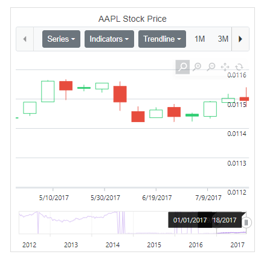
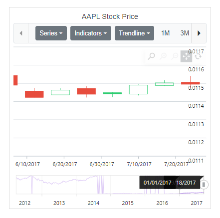
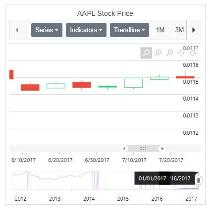
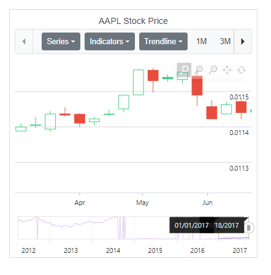

# Zooming in Blazor Stock Chart Component

## Enable zooming

The stock chart supports three zooming interactions:

* Selection – Set [EnableSelectionZooming](https://help.syncfusion.com/cr/blazor/Syncfusion.Blazor.Charts.StockChartZoomSettings.html#Syncfusion_Blazor_Charts_StockChartZoomSettings_EnableSelectionZooming) to **true** in [StockChartZoomSettings](https://help.syncfusion.com/cr/blazor/Syncfusion.Blazor.Charts.StockChartZoomSettings.html) to enable rubber-band selection zooming.
* Mouse wheel – Set [EnableMouseWheelZooming](https://help.syncfusion.com/cr/blazor/Syncfusion.Blazor.Charts.StockChartZoomSettings.html#Syncfusion_Blazor_Charts_StockChartZoomSettings_EnableMouseWheelZooming) to **true** to zoom in and out using the mouse wheel.
* Pinch – Set [EnablePinchZooming](https://help.syncfusion.com/cr/blazor/Syncfusion.Blazor.Charts.StockChartZoomSettings.html#Syncfusion_Blazor_Charts_StockChartZoomSettings_EnablePinchZooming) to **true** to zoom using pinch gestures on touch-enabled devices.

 N> Pinch zooming is supported only in browsers that enable multi-touch gestures.

```cshtml

@using Syncfusion.Blazor.Charts
@using System.IO
@using System.Runtime.Serialization
@inject NavigationManager NavigationManager
@inject HttpClient Http

@if (DataSource != null)
{
    <SfStockChart Title="AAPL Stock Price">
       <StockChartZoomSettings EnableMouseWheelZooming="true" EnablePinchZooming="true" EnableSelectionZooming="true"></StockChartZoomSettings>
            <StockChartPrimaryXAxis>
                <StockChartAxisMajorGridLines Width="0"></StockChartAxisMajorGridLines>
            </StockChartPrimaryXAxis>
            <StockChartPrimaryYAxis>
                <StockChartAxisLineStyle Width="0"></StockChartAxisLineStyle>
                <StockChartAxisMajorTickLines Width="0"></StockChartAxisMajorTickLines>
            </StockChartPrimaryYAxis>
            <StockChartSeriesCollection>
                <StockChartSeries DataSource="@DataSource" Type="ChartSeriesType.Candle"></StockChartSeries>
            </StockChartSeriesCollection>
            <StockChartChartArea>
                <StockChartChartAreaBorder Width="0"></StockChartChartAreaBorder>
            </StockChartChartArea>
    </SfStockChart>
}   

@code {
    public ChartData[] DataSource{ get; set; }

    public class ChartData
    {
        public DateTime date { get; set; }
        public double open { get; set; }
        public double low { get; set; }
        public double close { get; set; }
        public double high { get; set; }
        public double volume { get; set; }
    }

    protected override async Task OnInitializedAsync()
    {
        DataSource = await Http.GetFromJsonAsync<ChartData[]>(NavigationManager.BaseUri +"./chart-data.json");
    }
}

```



After zooming, the toolbar appears with options for **Zoom**, **Zoom In**, **Zoom Out**, **Pan**, and **Reset**. Pan enables panning of the chart, and Reset restores the original view.

## Modes

The [Mode](https://help.syncfusion.com/cr/blazor/Syncfusion.Blazor.Charts.StockChartZoomSettings.html#Syncfusion_Blazor_Charts_StockChartZoomSettings_Mode) property in [StockChartZoomSettings](https://help.syncfusion.com/cr/blazor/Syncfusion.Blazor.Charts.StockChartZoomSettings.html) determines whether scaling occurs along the horizontal axis, vertical axis, or both. The default value is XY (both axes).

There are three modes:

* X – Enables horizontal zooming.
* Y – Enables vertical zooming.
* XY – Enables both horizontal and vertical zooming.

```cshtml

@using Syncfusion.Blazor.Charts
@using System.IO
@using System.Runtime.Serialization
@inject NavigationManager NavigationManager
@inject HttpClient Http

@if (DataSource != null)
{
    <SfStockChart Title="AAPL Stock Price">
       <StockChartZoomSettings EnableSelectionZooming="true" Mode="ZoomMode.X"></StockChartZoomSettings>
            <StockChartPrimaryXAxis>
                <StockChartAxisMajorGridLines Width="0"></StockChartAxisMajorGridLines>
                <StockChartAxisCrosshairTooltip Enable="true"></StockChartAxisCrosshairTooltip>
            </StockChartPrimaryXAxis>
            <StockChartPrimaryYAxis>
                <StockChartAxisLineStyle Width="0"></StockChartAxisLineStyle>
                <StockChartAxisMajorTickLines Width="0"></StockChartAxisMajorTickLines>
            </StockChartPrimaryYAxis>
            <StockChartSeriesCollection>
                <StockChartSeries DataSource="@DataSource" Type="ChartSeriesType.Candle"></StockChartSeries>
            </StockChartSeriesCollection>
            <StockChartChartArea>
                <StockChartChartAreaBorder Width="0"></StockChartChartAreaBorder>
            </StockChartChartArea>
    </SfStockChart>
}    

@code {
    public ChartData[] DataSource{ get; set; }

     public class ChartData
    {
        public DateTime date { get; set; }
        public double open { get; set; }
        public double low { get; set; }
        public double close { get; set; }
        public double high { get; set; }
        public double volume { get; set; }
    }  

    protected override async Task OnInitializedAsync()
    {
        DataSource = await Http.GetFromJsonAsync<ChartData[]>(NavigationManager.BaseUri +"./chart-data.json");
    }
}

```


## Toolbar

By default, Zoom In, Zoom Out, Pan, and Reset buttons appear in the toolbar after zooming. Use the [ToolbarItems](https://help.syncfusion.com/cr/blazor/Syncfusion.Blazor.Charts.StockChartZoomSettings.html#Syncfusion_Blazor_Charts_StockChartZoomSettings_ToolbarItems) property to specify which tools to display.

```cshtml

@using Syncfusion.Blazor.Charts
@using System.IO
@using System.Runtime.Serialization
@inject NavigationManager NavigationManager
@inject HttpClient Http

@if (DataSource != null)
{
    <SfStockChart Title="AAPL Stock Price">
       <StockChartZoomSettings EnableSelectionZooming="true" EnableMouseWheelZooming="true"
                       EnablePinchZooming="true" ToolbarItems="@ToolbarItem"></StockChartZoomSettings>
            <StockChartPrimaryXAxis>
                <StockChartAxisMajorGridLines Width="0"></StockChartAxisMajorGridLines>
                <StockChartAxisCrosshairTooltip Enable="true"></StockChartAxisCrosshairTooltip>
            </StockChartPrimaryXAxis>
            <StockChartPrimaryYAxis>
                <StockChartAxisLineStyle Width="0"></StockChartAxisLineStyle>
                <StockChartAxisMajorTickLines Width="0"></StockChartAxisMajorTickLines>
            </StockChartPrimaryYAxis>
            <StockChartSeriesCollection>
                <StockChartSeries DataSource="@DataSource" Type="ChartSeriesType.Candle"></StockChartSeries>
            </StockChartSeriesCollection>
            <StockChartChartArea>
                <StockChartChartAreaBorder Width="0"></StockChartChartAreaBorder>
            </StockChartChartArea>
    </SfStockChart>
}

@code {
    public List<ToolbarItems> ToolbarItem = new List<ToolbarItems>() { ToolbarItems.Zoom, ToolbarItems.Reset, ToolbarItems.Pan };
    public ChartData[] DataSource{ get; set; }

     public class ChartData
    {
        public DateTime date { get; set; }
        public double open { get; set; }
        public double low { get; set; }
        public double close { get; set; }
        public double high { get; set; }
        public double volume { get; set; }
    }   

    protected override async Task OnInitializedAsync()
    {
        DataSource = await Http.GetFromJsonAsync<ChartData[]>(NavigationManager.BaseUri +"./chart-data.json");
    }
}

```


## Enable pan

Use the [EnablePan](https://help.syncfusion.com/cr/blazor/Syncfusion.Blazor.Charts.StockChartZoomSettings.html#Syncfusion_Blazor_Charts_StockChartZoomSettings_EnablePan) property to allow panning on a zoomed stock chart without relying on toolbar items.

```cshtml

@using Syncfusion.Blazor.Charts
@using System.IO
@using System.Runtime.Serialization
@inject NavigationManager NavigationManager
@inject HttpClient Http

@if (DataSource != null)
{
    <SfStockChart Title="AAPL Stock Price">
       <StockChartZoomSettings EnableSelectionZooming="true" EnablePan="true"></StockChartZoomSettings>
            <StockChartPrimaryXAxis ZoomFactor="0.2" ZoomPosition="0.6">
                <StockChartAxisMajorGridLines Width="0"></StockChartAxisMajorGridLines>
                <StockChartAxisCrosshairTooltip Enable="true"></StockChartAxisCrosshairTooltip>
            </StockChartPrimaryXAxis>
            <StockChartPrimaryYAxis>
                <StockChartAxisLineStyle Width="0"></StockChartAxisLineStyle>
                <StockChartAxisMajorTickLines Width="0"></StockChartAxisMajorTickLines>
            </StockChartPrimaryYAxis>
            <StockChartSeriesCollection>
                <StockChartSeries DataSource="@DataSource" Type="ChartSeriesType.Candle"></StockChartSeries>
            </StockChartSeriesCollection>
            <StockChartChartArea>
                <StockChartChartAreaBorder Width="0"></StockChartChartAreaBorder>
        </StockChartChartArea>
    </SfStockChart>
}    

@code {
    public ChartData[] DataSource{ get; set; }

     public class ChartData
    {
        public DateTime date { get; set; }
        public double open { get; set; }
        public double low { get; set; }
        public double close { get; set; }
        public double high { get; set; }
        public double volume { get; set; }
    }   

    protected override async Task OnInitializedAsync()
    {
        DataSource = await Http.GetFromJsonAsync<ChartData[]>(NavigationManager.BaseUri +"./chart-data.json");
    }
}

```



## Enable scrollbar

Use the [EnableScrollbar](https://help.syncfusion.com/cr/blazor/Syncfusion.Blazor.Charts.StockChartZoomSettings.html#Syncfusion_Blazor_Charts_StockChartZoomSettings_EnableScrollbar) property to add a scrollbar to a zoomed stock chart. The scrollbar allows panning and further zooming.

```cshtml

@using Syncfusion.Blazor.Charts
@using System.IO
@using System.Runtime.Serialization
@inject NavigationManager NavigationManager
@inject HttpClient Http

@if (DataSource != null)
{
    <SfStockChart Title="AAPL Stock Price">
       <StockChartZoomSettings EnableMouseWheelZooming="true" EnableScrollbar="true" EnablePinchZooming="true"
                       EnableSelectionZooming="true"></StockChartZoomSettings>
            <StockChartPrimaryXAxis>
                <StockChartAxisMajorGridLines Width="0"></StockChartAxisMajorGridLines>
                <StockChartAxisCrosshairTooltip Enable="true"></StockChartAxisCrosshairTooltip>
            </StockChartPrimaryXAxis>
            <StockChartPrimaryYAxis>
                <StockChartAxisLineStyle Width="0"></StockChartAxisLineStyle>
                <StockChartAxisMajorTickLines Width="0"></StockChartAxisMajorTickLines>
            </StockChartPrimaryYAxis>
            <StockChartSeriesCollection>
                <StockChartSeries DataSource="@DataSource" Type="ChartSeriesType.Candle"></StockChartSeries>
            </StockChartSeriesCollection>
            <StockChartChartArea>
                <StockChartChartAreaBorder Width="0"></StockChartChartAreaBorder>
        </StockChartChartArea>
    </SfStockChart>
}

@code {
    public ChartData[] DataSource{ get; set; }

     public class ChartData
    {
        public DateTime date { get; set; }
        public double open { get; set; }
        public double low { get; set; }
        public double close { get; set; }
        public double high { get; set; }
        public double volume { get; set; }
    }   

    protected override async Task OnInitializedAsync()
    {
        DataSource = await Http.GetFromJsonAsync<ChartData[]>(NavigationManager.BaseUri +"./chart-data.json");
    }
}

```



## Auto interval on zooming

Set [EnableAutoIntervalOnZooming](https://help.syncfusion.com/cr/blazor/Syncfusion.Blazor.Charts.StockChartCommonAxis.html#Syncfusion_Blazor_Charts_StockChartCommonAxis_EnableAutoIntervalOnZooming) to **true** to calculate axis intervals automatically based on the zoomed range.

```cshtml

@using Syncfusion.Blazor.Charts
@using System.IO
@using System.Runtime.Serialization
@inject NavigationManager NavigationManager
@inject HttpClient Http

@if (DataSource != null)
{
    <SfStockChart Title="AAPL Stock Price">
       <StockChartZoomSettings EnableMouseWheelZooming="true" EnablePinchZooming="true"
                       EnableSelectionZooming="true"></StockChartZoomSettings>
            <StockChartPrimaryXAxis EnableAutoIntervalOnZooming="true">
                <StockChartAxisMajorGridLines Width="0"></StockChartAxisMajorGridLines>
                <StockChartAxisCrosshairTooltip Enable="true"></StockChartAxisCrosshairTooltip>
            </StockChartPrimaryXAxis>
            <StockChartPrimaryYAxis>
                <StockChartAxisLineStyle Width="0"></StockChartAxisLineStyle>
                <StockChartAxisMajorTickLines Width="0"></StockChartAxisMajorTickLines>
            </StockChartPrimaryYAxis>
            <StockChartSeriesCollection>
                <StockChartSeries DataSource="@DataSource" Type="ChartSeriesType.Candle"></StockChartSeries>
            </StockChartSeriesCollection>
            <StockChartChartArea>
                <StockChartChartAreaBorder Width="0"></StockChartChartAreaBorder>
            </StockChartChartArea>
    </SfStockChart>
}

@code {
    public ChartData[] DataSource{ get; set; }

     public class ChartData
    {
        public DateTime date { get; set; }
        public double open { get; set; }
        public double low { get; set; }
        public double close { get; set; }
        public double high { get; set; }
        public double volume { get; set; }
    }   

    protected override async Task OnInitializedAsync()
    {
        DataSource = await Http.GetFromJsonAsync<ChartData[]>(NavigationManager.BaseUri +"./chart-data.json");
    }
}

```



N> Refer to the [Blazor Stock Chart](https://www.syncfusion.com/blazor-components/blazor-stock-chart) feature tour page for feature overviews and the [Blazor Stock Chart example](https://blazor.syncfusion.com/demos/stock-chart/stock-chart?theme=bootstrap5) to explore chart types and time based data representation.
